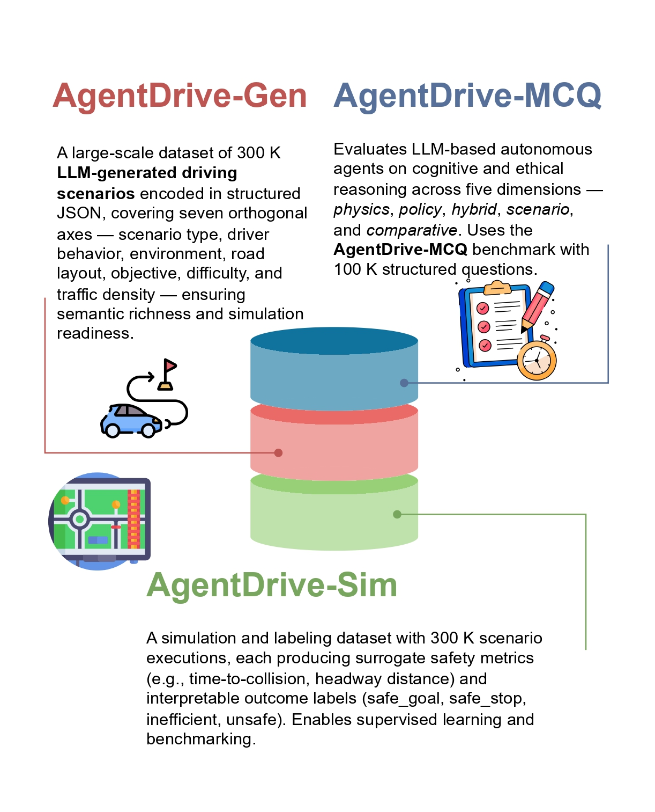
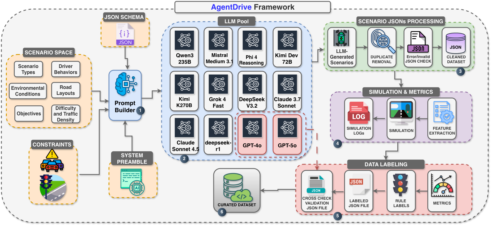
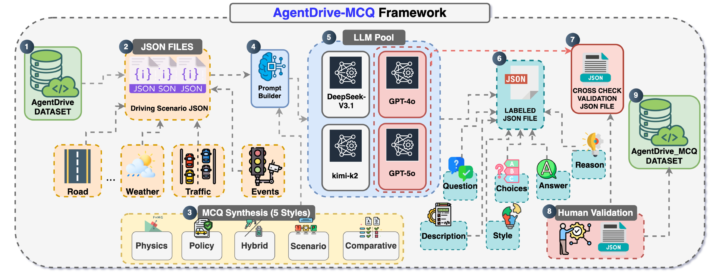
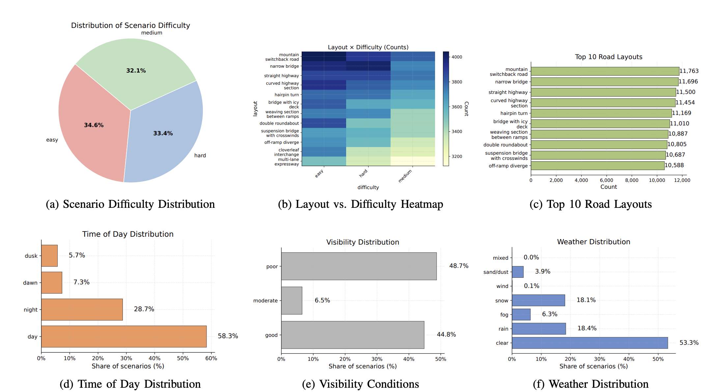
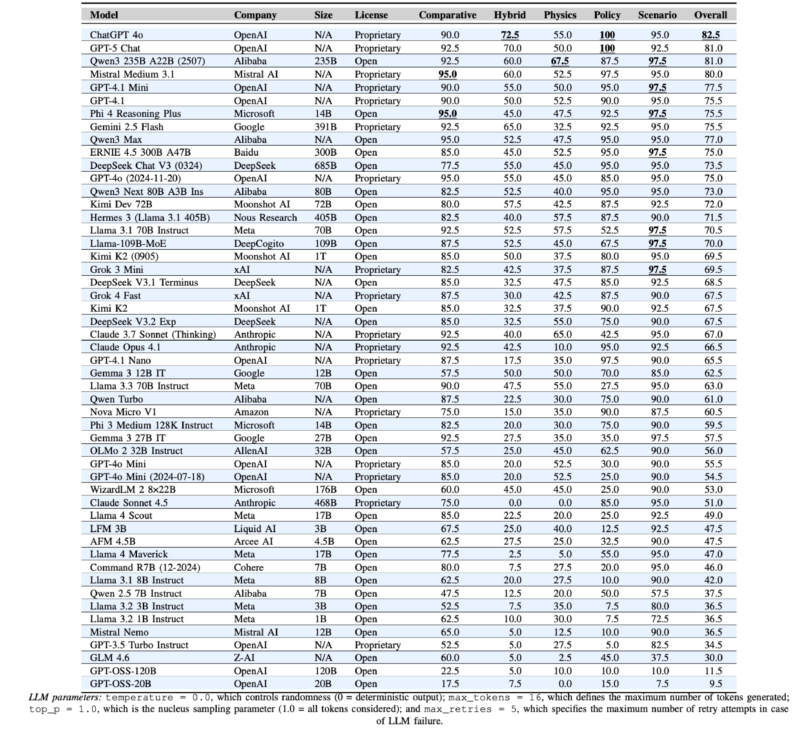
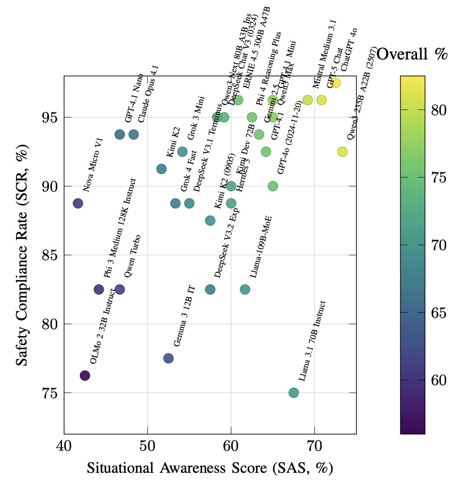

# AgentDrive 



[](LICENSE)
[]([https://USER.github.io/AgentDrive](https://github.com/maferrag/AgentDrive/))
[](link-to-paper)

**AgentDrive** is an open benchmark dataset containing **300,000 LLM-generated driving scenarios** designed for the training, fine-tuning, and evaluation of autonomous agents under diverse conditions. AgentDrive formalizes a factorized scenario space across seven orthogonal axes—scenario type, driver behavior, environment, road layout, objective, difficulty, and traffic density—and employs an LLM-driven prompt-to-JSON pipeline to produce semantically rich, simulation-ready specifications validated under physical and schema constraints. Each scenario undergoes simulation rollouts, surrogate safety metric computation, and rule-based outcome labeling. 

To complement simulation-based evaluation, we introduce **AgentDrive_MCQ**, a 100,000-question reasoning benchmark spanning five reasoning dimensions—physics, policy, hybrid, scenario, and comparative—to systematically assess the cognitive and ethical reasoning of LLM-based agents. 

We conducted a large-scale evaluation of **fifty leading LLMs** on the AgentDrive_MCQ benchmark to measure their reasoning capabilities across these five dimensions, covering models such as GPT-5, ChatGPT 4o, Gemini 2.5 Flash, DeepSeek V3, Qwen3 235B, ERNIE 4.5 300B, Grok 4, Mistral Medium 3.1, and Phi 4 Reasoning Plus. Results reveal that while proprietary frontier models dominate in contextual and policy reasoning, advanced open models are rapidly closing the gap in structured and physics-grounded reasoning. To support open science and reproducibility, we release the AgentDrive dataset (including labeled data), the AgentDrive-MCQ benchmark, evaluation scripts, and all related materials on GitHub.

## AgentDrive - Architecture Design

The framework for creating the AgentDrive Dataset is illustrated in the figure below.



The figure illustrates the complete workflow of AgentDrive, which transforms abstract scenario specifications into curated, simulation-ready datasets. The process begins with a factorized scenario space that encodes driver behaviors, road layouts, environmental conditions, objectives, difficulty levels, and traffic density. Structured prompts are then built and passed to a diverse pool of large language models (LLMs), which generate candidate scenario JSONs. These outputs undergo schema validation, error checks, duplicate removal, and cross-model consistency verification before entering the cleaned dataset. Validated scenarios are executed in simulation, during which logs and surrogate safety metrics are collected. This is followed by rule-based labeling to assign interpretable outcome categories such as safe stop, safe goal, unsafe, or inefficient. The final curated dataset provides a diverse and safety-critical benchmark that supports training and evaluation of agentic AI systems in autonomous driving.


## AgentDrive-MCQ - Architecture Design

The framework for creating the AgentDrive-MCQ Dataset is illustrated in the figure below.



The process begins with the AgentDrive dataset, which encodes scenario attributes such as road layout, weather conditions, traffic density, and event triggers. These features are formalized into JSON files that serve as the structured representation of driving scenarios. A dedicated prompt builder then reformulates the structured data into prompts for a pool of LLMs, including DeepSeek-V3.1, GPT-4o, kimi-k2, and GPT-5o. The LLM pool generates narrative scenario descriptions and subsequently produces five reasoning-intensive MCQs per scenario, corresponding to the physics, policy, hybrid, scenario, and comparative styles. The intermediate outputs are stored as labeled JSON files and passed through a cross-check validation stage to ensure consistency and correctness. Finally, the validated items are aggregated into the AgentDrive-MCQ dataset, providing a robust benchmark for evaluating context-sensitive reasoning under multi-factor constraints.


## Available Datasets
There are currently three types of datasets available: **AgentDrive-Gen**, **AgentDrive-Sim**, and **AgentDrive-MCQ**.

**1. AgentDrive-Gen**: 300K structured, simulation-ready JSON scenarios across seven axes (scenario type, driver behavior, environment, road layout, objective, difficulty, traffic density).

<details>
<summary>Click to expand JSON example</summary>

```json
{
  "name": "ObstacleOnRoad_WetHighway_v1",
  "seed": 42,
  "duration_steps": 600,
  "policy_frequency": 10,
  "road": {
    "lanes": 2,
    "speed_limit_kph": 100
  },
  "traffic_light": {
    "stopline_x": -50.0,
    "red_steps": 0,
    "green_steps": 0
  },
  "environment": {
    "weather": "wet",
    "time_of_day": "day",
    "visibility": "good"
  },
  "layout": "straight highway",
  "objective": "respond safely to road obstacle",
  "difficulty": "easy",
  "traffic_density": "high",
  "ego": {
    "spawn": {
      "x": -100.0,
      "y": 0.0,
      "v_mps": 27.78
    },
    "goal": "safe stopping"
  },
  "traffic": [
    {
      "type": "car",
      "behavior": "convoy_follower",
      "lane": 0,
      "spawn_x": -90.0,
      "v_mps": 27.78
    },
    {
      "type": "car",
      "behavior": "convoy_follower",
      "lane": 0,
      "spawn_x": -80.0,
      "v_mps": 27.78
    },
    {
      "type": "car",
      "behavior": "convoy_follower",
      "lane": 0,
      "spawn_x": -70.0,
      "v_mps": 27.78
    },
    {
      "type": "car",
      "behavior": "convoy_follower",
      "lane": 0,
      "spawn_x": -60.0,
      "v_mps": 27.78
    },
    {
      "type": "car",
      "behavior": "convoy_follower",
      "lane": 0,
      "spawn_x": -50.0,
      "v_mps": 27.78
    },
    {
      "type": "car",
      "behavior": "convoy_follower",
      "lane": 0,
      "spawn_x": -40.0,
      "v_mps": 27.78
    },
    {
      "type": "car",
      "behavior": "convoy_follower",
      "lane": 0,
      "spawn_x": -30.0,
      "v_mps": 27.78
    },
    {
      "type": "car",
      "behavior": "convoy_follower",
      "lane": 0,
      "spawn_x": -20.0,
      "v_mps": 27.78
    },
    {
      "type": "car",
      "behavior": "convoy_follower",
      "lane": 0,
      "spawn_x": -10.0,
      "v_mps": 27.78
    }
  ],
  "events": [
    {
      "t_s": 50.0,
      "type": "sudden_brake",
      "actor": 0,
      "params": {
        "decel_mps2": 4.0,
        "duration_s": 2.0
      }
    }
  ],
  "metrics": [
    "ttc_front",
    "red_light_violation",
    "min_headway",
    "collisions"
  ],
  "axes_echo": {
    "scenario_type": "obstacle on road",
    "behavior": "convoy follower",
    "environment": "wet road after rain",
    "road_layout": "straight highway",
    "objective": "respond safely to road obstacle",
    "difficulty": "easy",
    "traffic_density": "high"
  }
}

```
</details>


<a href="https://github.com/maferrag/AgentDrive/tree/main/data/AgentDrive-Gen">
📂 <b>Download AgentDrive-Gen Dataset (ZIP)</b>
</a>

<br>

##

**2. AgentDrive-Sim**: Executed rollouts with surrogate safety metrics (e.g., min-TTC) and categorical outcomes: `safe_goal`, `safe_stop`, `inefficient`, `unsafe`.

<details>
<summary>Click to expand JSON example from AgentDrive-Sim -  Simulation Rollout </summary>

```json

```
</details>

<details>
<summary>Click to expand JSON example from AgentDrive-Sim - Labeled by Episode </summary>

```json

```
</details>

<details>
<summary>Click to expand JSON example from AgentDrive-Sim - Labeled by Segment </summary>

```json

```
</details>


<a href="https://github.com/maferrag/AgentDrive/tree/main/data/AgentDrive-Sim">
📂 <b>Download AgentDrive-Sim Dataset (ZIP)</b>
</a>

##

**3. AgentDrive-MCQ**: 100K multiple-choice questions spanning five styles: `physics`, `policy`, `hybrid`, `scenario`, `comparative`.

<details>
<summary>Click to expand JSON example from AgentDrive-MCQ - physics </summary>

```json

```
</details>

<details>
<summary>Click to expand JSON example from AgentDrive-MCQ - policy </summary>

```json

```
</details>

<details>
<summary>Click to expand JSON example from AgentDrive-MCQ - hybrid </summary>

```json

```
</details>

<details>
<summary>Click to expand JSON example from AgentDrive-MCQ - scenario </summary>

```json

```
</details>

<details>
<summary>Click to expand JSON example from AgentDrive-MCQ - comparative </summary>

```json

```
</details>


<a href="https://github.com/maferrag/AgentDrive/tree/main/data/AgentDrive-MCQ">
📂 <b>Download AgentDrive-MCQ Dataset (ZIP)</b>
</a>

## Distributions and layout statistics across the AgentDrive scenario dataset

Distributions and layout statistics across the AgentDrive scenario dataset, showing difficulty levels, layout correlations, temporal, and environmental characteristics.




## Performance Evaluation

Accuracy (%) results of 50 examined LLM reasoning models evaluated across multiple reasoning styles using 2k samples from AgentDrive-MCQ.



The comparative and categorical analysis of 50 evaluated LLMs on the AgentDrive-MCQ benchmark reveals significant diversity in reasoning performance across five distinct dimensions: comparative, hybrid, physics, policy, and scenario. As summarized in the Table, proprietary frontier models such as ChatGPT 4o (82.5%) and GPT-5 Chat (81.0%) from OpenAI dominated the benchmark, achieving perfect or near-perfect accuracy in policy (100%) and scenario (97.5%) reasoning tasks. These results underscore their superior contextual reasoning, ethical prioritization, and adaptability to complex decision-making scenarios. Among open-source systems, Qwen3 235B A22B reached a competitive 81.0% overall accuracy, leading in physics-driven reasoning (67.5%), while ERNIE 4.5 300B A47B achieved 75.0\%, reflecting the growing maturity of Chinese foundation models. Other strong performers, including Mistral Medium 3.1 (80.0%) and GPT-4.1 Mini (77.5%), demonstrated balanced reasoning proficiency across multiple domains, highlighting the value of large-scale fine-tuning and domain adaptation.

## Top models by highest Overall: SAS vs. SCR




The figure visualizes the relationship between the Situational Awareness Score (SAS) and the Safety Compliance Rate (SCR) for the top models ranked by Overall Accuracy from the previous Table. The upper-right region of the scatter plot denotes the ideal operational zone, where models achieve both high situational awareness and strong safety compliance.


---
