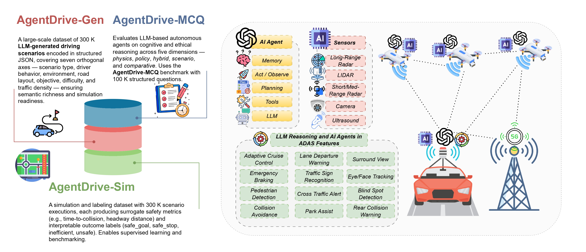

# AgentDrive : An open benchmark suite for agentic AI reasoning in autonomous systems



[](LICENSE)
[]([https://USER.github.io/AgentDrive](https://github.com/maferrag/AgentDrive/))
[](link-to-paper)

**AgentDrive** is an open benchmark dataset containing **300,000 LLM-generated driving scenarios** designed for the training, fine-tuning, and evaluation of autonomous agents under diverse conditions. AgentDrive formalizes a factorized scenario space across seven orthogonal axes—scenario type, driver behavior, environment, road layout, objective, difficulty, and traffic density—and employs an LLM-driven prompt-to-JSON pipeline to produce semantically rich, simulation-ready specifications validated under physical and schema constraints. Each scenario undergoes simulation rollouts, surrogate safety metric computation, and rule-based outcome labeling. 

To complement simulation-based evaluation, we introduce **AgentDrive_MCQ**, a 100,000-question reasoning benchmark spanning five reasoning dimensions—physics, policy, hybrid, scenario, and comparative—to systematically assess the cognitive and ethical reasoning of LLM-based agents. 

We conducted a large-scale evaluation of **fifty leading LLMs** on the AgentDrive_MCQ benchmark to measure their reasoning capabilities across these five dimensions, covering models such as GPT-5, ChatGPT 4o, Gemini 2.5 Flash, DeepSeek V3, Qwen3 235B, ERNIE 4.5 300B, Grok 4, Mistral Medium 3.1, and Phi 4 Reasoning Plus. Results reveal that while proprietary frontier models dominate in contextual and policy reasoning, advanced open models are rapidly closing the gap in structured and physics-grounded reasoning. To support open science and reproducibility, we release the AgentDrive dataset (including labeled data), the AgentDrive-MCQ benchmark, evaluation scripts, and all related materials on GitHub.

## AgentDrive - Architecture Design

The framework for creating the AgentDrive Dataset is illustrated in the figure below.


The figure illustrates the complete workflow of AgentDrive, which transforms abstract scenario specifications into curated, simulation-ready datasets. The process begins with a factorized scenario space that encodes driver behaviors, road layouts, environmental conditions, objectives, difficulty levels, and traffic density. Structured prompts are then built and passed to a diverse pool of large language models (LLMs), which generate candidate scenario JSONs. These outputs undergo schema validation, error checks, duplicate removal, and cross-model consistency verification before entering the cleaned dataset. Validated scenarios are executed in simulation, during which logs and surrogate safety metrics are collected. This is followed by rule-based labeling to assign interpretable outcome categories such as safe stop, safe goal, unsafe, or inefficient. The final curated dataset provides a diverse and safety-critical benchmark that supports training and evaluation of agentic AI systems in autonomous driving.


## AgentDrive-MCQ - Architecture Design

The framework for creating the AgentDrive-MCQ Dataset is illustrated in the figure below.


The process begins with the AgentDrive dataset, which encodes scenario attributes such as road layout, weather conditions, traffic density, and event triggers. These features are formalized into JSON files that serve as the structured representation of driving scenarios. A dedicated prompt builder then reformulates the structured data into prompts for a pool of LLMs, including DeepSeek-V3.1, GPT-4o, kimi-k2, and GPT-5o. The LLM pool generates narrative scenario descriptions and subsequently produces five reasoning-intensive MCQs per scenario, corresponding to the physics, policy, hybrid, scenario, and comparative styles. The intermediate outputs are stored as labeled JSON files and passed through a cross-check validation stage to ensure consistency and correctness. Finally, the validated items are aggregated into the AgentDrive-MCQ dataset, providing a robust benchmark for evaluating context-sensitive reasoning under multi-factor constraints.


## Available Datasets
There are currently three types of datasets available: **AgentDrive-Gen**, **AgentDrive-Sim**, and **AgentDrive-MCQ**.

**1. AgentDrive-Gen**: 300K structured, simulation-ready JSON scenarios across seven axes (scenario type, driver behavior, environment, road layout, objective, difficulty, traffic density).

<details>
<summary>Click to expand JSON example</summary>

```json
{
  "name": "ObstacleOnRoad_WetHighway_v1",
  "seed": 42,
  "duration_steps": 600,
  "policy_frequency": 10,
  "road": {
    "lanes": 2,
    "speed_limit_kph": 100
  },
  "traffic_light": {
    "stopline_x": -50.0,
    "red_steps": 0,
    "green_steps": 0
  },
  "environment": {
    "weather": "wet",
    "time_of_day": "day",
    "visibility": "good"
  },
  "layout": "straight highway",
  "objective": "respond safely to road obstacle",
  "difficulty": "easy",
  "traffic_density": "high",
  "ego": {
    "spawn": {
      "x": -100.0,
      "y": 0.0,
      "v_mps": 27.78
    },
    "goal": "safe stopping"
  },
  "traffic": [
    {
      "type": "car",
      "behavior": "convoy_follower",
      "lane": 0,
      "spawn_x": -90.0,
      "v_mps": 27.78
    },
    {
      "type": "car",
      "behavior": "convoy_follower",
      "lane": 0,
      "spawn_x": -80.0,
      "v_mps": 27.78
    },
    {
      "type": "car",
      "behavior": "convoy_follower",
      "lane": 0,
      "spawn_x": -70.0,
      "v_mps": 27.78
    },
    {
      "type": "car",
      "behavior": "convoy_follower",
      "lane": 0,
      "spawn_x": -60.0,
      "v_mps": 27.78
    },
    {
      "type": "car",
      "behavior": "convoy_follower",
      "lane": 0,
      "spawn_x": -50.0,
      "v_mps": 27.78
    },
    {
      "type": "car",
      "behavior": "convoy_follower",
      "lane": 0,
      "spawn_x": -40.0,
      "v_mps": 27.78
    },
    {
      "type": "car",
      "behavior": "convoy_follower",
      "lane": 0,
      "spawn_x": -30.0,
      "v_mps": 27.78
    },
    {
      "type": "car",
      "behavior": "convoy_follower",
      "lane": 0,
      "spawn_x": -20.0,
      "v_mps": 27.78
    },
    {
      "type": "car",
      "behavior": "convoy_follower",
      "lane": 0,
      "spawn_x": -10.0,
      "v_mps": 27.78
    }
  ],
  "events": [
    {
      "t_s": 50.0,
      "type": "sudden_brake",
      "actor": 0,
      "params": {
        "decel_mps2": 4.0,
        "duration_s": 2.0
      }
    }
  ],
  "metrics": [
    "ttc_front",
    "red_light_violation",
    "min_headway",
    "collisions"
  ],
  "axes_echo": {
    "scenario_type": "obstacle on road",
    "behavior": "convoy follower",
    "environment": "wet road after rain",
    "road_layout": "straight highway",
    "objective": "respond safely to road obstacle",
    "difficulty": "easy",
    "traffic_density": "high"
  }
}

```
</details>


<a href="https://github.com/maferrag/AgentDrive/tree/main/data/AgentDrive-Gen">
📂 <b>Download AgentDrive-Gen Dataset (ZIP)</b>
</a>

<br>

##

**2. AgentDrive-Sim**: Executed rollouts with surrogate safety metrics (e.g., min-TTC) and categorical outcomes: `safe_goal`, `safe_stop`, `inefficient`, `unsafe`.

<details>
<summary>Click to expand JSON example from AgentDrive-Sim -  Simulation Rollout </summary>

```json
[
  {
    "t": 0.0,
    "ego": {
      "x": 178.98440819109368,
      "y": 0.0,
      "v": 25.0,
      "brake": 0.0
    },
    "traffic_light": "Red",
    "crossed_stopline": true,
    "events": {
      "collision": false
    },
    "metrics": {
      "ttc_front_s": null
    }
  },
  {
    "t": 0.1,
    "ego": {
      "x": 180.65107485776034,
      "y": 0.0,
      "v": 24.444444444444443,
      "brake": 0.0
    },
    "traffic_light": "Red",
    "crossed_stopline": true,
    "events": {
      "collision": false
    },
    "metrics": {
      "ttc_front_s": null
    }
  },
  {
    "t": 0.2,
    "ego": {
      "x": 182.28070448738995,
      "y": 0.0,
      "v": 23.950617283950617,
      "brake": 0.0
    },
    "traffic_light": "Red",
    "crossed_stopline": true,
    "events": {
      "collision": false
    },
    "metrics": {
      "ttc_front_s": null
    }
  },
  {
    "t": 0.3,
    "ego": {
      "x": 183.87741230632,
      "y": 0.0,
      "v": 23.511659807956104,
      "brake": 0.0
    },
    "traffic_light": "Red",
    "crossed_stopline": true,
    "events": {
      "collision": false
    },
    "metrics": {
      "ttc_front_s": null
    }
  },
  {
    "t": 0.4,
    "ego": {
      "x": 185.44485629351706,
      "y": 0.0,
      "v": 23.12147538484987,
      "brake": 0.0
    },
    "traffic_light": "Red",
    "crossed_stopline": true,
    "events": {
      "collision": false
    },
    "metrics": {
      "ttc_front_s": null
    }
  },
  {
    "t": 0.5,
    "ego": {
      "x": 186.9862879858404,
      "y": 0.0,
      "v": 22.774644786533216,
      "brake": 0.0
    },
    "traffic_light": "Red",
    "crossed_stopline": true,
    "events": {
      "collision": false
    },
    "metrics": {
      "ttc_front_s": null
    }
  },
  {
    "t": 0.6,
    "ego": {
      "x": 188.50459763827592,
      "y": 0.0,
      "v": 22.46635092136286,
      "brake": 0.0
    },
    "traffic_light": "Red",
    "crossed_stopline": true,
    "events": {
      "collision": false
    },
    "metrics": {
      "ttc_front_s": null
    }
  },
  {
    "t": 0.7,
    "ego": {
      "x": 190.00235436636677,
      "y": 0.0,
      "v": 22.19231193010032,
      "brake": 0.0
    },
    "traffic_light": "Red",
    "crossed_stopline": true,
    "events": {
      "collision": false
    },
    "metrics": {
      "ttc_front_s": null
    }
  },
  {
    "t": 0.8,
    "ego": {
      "x": 191.48184182837346,
      "y": 0.0,
      "v": 21.94872171564473,
      "brake": 0.0
    },
    "traffic_light": "Red",
    "crossed_stopline": true,
    "events": {
      "collision": false
    },
    "metrics": {
      "ttc_front_s": null
    }
  },
  {
    "t": 0.9,
    "ego": {
      "x": 192.94508994274977,
      "y": 0.0,
      "v": 21.732197080573094,
      "brake": 0.0
    },
    "traffic_light": "Red",
    "crossed_stopline": true,
    "events": {
      "collision": false
    },
    "metrics": {
      "ttc_front_s": null
    }
  },
  {
    "t": 1.0,
    "ego": {
      "x": 194.39390308145465,
      "y": 0.0,
      "v": 21.539730738287194,
      "brake": 0.0
    },
    "traffic_light": "Red",
    "crossed_stopline": true,
    "events": {
      "collision": false
    },
    "metrics": {
      "ttc_front_s": null
    }
  },
  {
    "t": 1.1,
    "ego": {
      "x": 195.8298851306738,
      "y": 0.0,
      "v": 21.368649545144173,
      "brake": 0.0
    },
    "traffic_light": "Red",
    "crossed_stopline": true,
    "events": {
      "collision": false
    },
    "metrics": {
      "ttc_front_s": null
    }
  },
  {
    "t": 1.2,
    "ego": {
      "x": 197.25446176701675,
      "y": 0.0,
      "v": 21.216577373461487,
      "brake": 0.0
    },
    "traffic_light": "Red",
    "crossed_stopline": true,
    "events": {
      "collision": false
    },
    "metrics": {
      "ttc_front_s": null
    }
  },
  {
    "t": 1.3,
    "ego": {
      "x": 198.66890025858086,
      "y": 0.0,
      "v": 21.081402109743543,
      "brake": 0.0
    },
    "traffic_light": "Red",
    "crossed_stopline": true,
    "events": {
      "collision": false
    },
    "metrics": {
      "ttc_front_s": null
    }
  },
  {
    "t": 1.4,
    "ego": {
      "x": 200.0743270658971,
      "y": 0.0,
      "v": 20.961246319772037,
      "brake": 0.0
    },
    "traffic_light": "Red",
    "crossed_stopline": true,
    "events": {
      "collision": false
    },
    "metrics": {
      "ttc_front_s": null
    }
  },
  {
    "t": 1.5,
    "ego": {
      "x": 201.47174348721524,
      "y": 0.0,
      "v": 20.8544411731307,
      "brake": 0.0
    },
    "traffic_light": "Red",
    "crossed_stopline": true,
    "events": {
      "collision": false
    },
    "metrics": {
      "ttc_front_s": null
    }
  },
  {
    "t": 1.6,
    "ego": {
      "x": 202.86203956542394,
      "y": 0.0,
      "v": 20.759503265005065,
      "brake": 0.0
    },
    "traffic_light": "Red",
    "crossed_stopline": true,
    "events": {
      "collision": false
    },
    "metrics": {
      "ttc_front_s": null
    }
  },
  {
    "t": 1.7,
    "ego": {
      "x": 204.2460064497576,
      "y": 0.0,
      "v": 20.675114013337836,
      "brake": 0.0
    },
    "traffic_light": "Red",
    "crossed_stopline": true,
    "events": {
      "collision": false
    },
    "metrics": {
      "ttc_front_s": null
    }
  },
  {
    "t": 1.8,
    "ego": {
      "x": 205.62434738398014,
      "y": 0.0,
      "v": 20.600101345189188,
      "brake": 0.0
    },
    "traffic_light": "Red",
    "crossed_stopline": true,
    "events": {
      "collision": false
    },
    "metrics": {
      "ttc_front_s": null
    }
  },
  {
    "t": 1.9,
    "ego": {
      "x": 206.99768747365943,
      "y": 0.0,
      "v": 20.533423417945944,
      "brake": 0.0
    },
    "traffic_light": "Red",
    "crossed_stopline": true,
    "events": {
      "collision": false
    },
    "metrics": {
      "ttc_front_s": null
    }
  },
  {
    "t": 2.0,
    "ego": {
      "x": 208.36658236818914,
      "y": 0.0,
      "v": 20.474154149285283,
      "brake": 0.0
    },
    "traffic_light": "Red",
    "crossed_stopline": true,
    "events": {
      "collision": false
    },
    "metrics": {
      "ttc_front_s": null
    }
  },
  {
    "t": 2.1,
    "ego": {
      "x": 209.7315259781415,
      "y": 0.0,
      "v": 20.421470354920253,
      "brake": 0.0
    },
    "traffic_light": "Red",
    "crossed_stopline": true,
    "events": {
      "collision": false
    },
    "metrics": {
      "ttc_front_s": null
    }
  },
  {
    "t": 2.2,
    "ego": {
      "x": 211.09295733513616,
      "y": 0.0,
      "v": 20.37464031548467,
      "brake": 0.0
    },
    "traffic_light": "Red",
    "crossed_stopline": true,
    "events": {
      "collision": false
    },
    "metrics": {
      "ttc_front_s": null
    }
  },
  {
    "t": 2.3,
    "ego": {
      "x": 212.4512666895018,
      "y": 0.0,
      "v": 20.33301361376415,
      "brake": 0.0
    },
    "traffic_light": "Red",
    "crossed_stopline": true,
    "events": {
      "collision": false
    },
    "metrics": {
      "ttc_front_s": null
    }
  },
  {
    "t": 2.4,
    "ego": {
      "x": 213.80680093041943,
      "y": 0.0,
      "v": 20.29601210112369,
      "brake": 0.0
    },
    "traffic_light": "Red",
    "crossed_stopline": true,
    "events": {
      "collision": false
    },
    "metrics": {
      "ttc_front_s": null
    }
  },
  {
    "t": 2.5,
    "ego": {
      "x": 215.1598684038277,
      "y": 0.0,
      "v": 20.263121867665504,
      "brake": 0.0
    },
    "traffic_light": "Red",
    "crossed_stopline": true,
    "events": {
      "collision": false
    },
    "metrics": {
      "ttc_front_s": null
    }
  },
  {
    "t": 2.6,
    "ego": {
      "x": 216.51074319500538,
      "y": 0.0,
      "v": 20.23388610459156,
      "brake": 0.0
    },
    "traffic_light": "Red",
    "crossed_stopline": true,
    "events": {
      "collision": false
    },
    "metrics": {
      "ttc_front_s": null
    }
  },
  {
    "t": 2.7,
    "ego": {
      "x": 217.85966893531148,
      "y": 0.0,
      "v": 20.20789875963694,
      "brake": 0.0
    },
    "traffic_light": "Red",
    "crossed_stopline": true,
    "events": {
      "collision": false
    },
    "metrics": {
      "ttc_front_s": null
    }
  },
  {
    "t": 2.8,
    "ego": {
      "x": 219.20686218595395,
      "y": 0.0,
      "v": 20.184798897455057,
      "brake": 0.0
    },
    "traffic_light": "Red",
    "crossed_stopline": true,
    "events": {
      "collision": false
    },
    "metrics": {
      "ttc_front_s": null
    }
  },
  {
    "t": 2.9,
    "ego": {
      "x": 220.55251544578428,
      "y": 0.0,
      "v": 20.164265686626717,
      "brake": 0.0
    },
    "traffic_light": "Red",
    "crossed_stopline": true,
    "events": {
      "collision": false
    },
    "metrics": {
      "ttc_front_s": null
    }
  },
  {
    "t": 3.0,
    "ego": {
      "x": 221.89679982489272,
      "y": 0.0,
      "v": 20.146013943668194,
      "brake": 0.0
    },
    "traffic_light": "Red",
    "crossed_stopline": true,
    "events": {
      "collision": false
    },
    "metrics": {
      "ttc_front_s": null
    }
  },
  {
    "t": 3.1,
    "ego": {
      "x": 223.23986742113726,
      "y": 0.0,
      "v": 20.129790172149505,
      "brake": 0.0
    },
    "traffic_light": "Red",
    "crossed_stopline": true,
    "events": {
      "collision": false
    },
    "metrics": {
      "ttc_front_s": null
    }
  },
  {
    "t": 3.2,
    "ego": {
      "x": 224.58185343261388,
      "y": 0.0,
      "v": 20.11536904191067,
      "brake": 0.0
    },
    "traffic_light": "Red",
    "crossed_stopline": true,
    "events": {
      "collision": false
    },
    "metrics": {
      "ttc_front_s": null
    }
  },
  {
    "t": 3.3,
    "ego": {
      "x": 225.92287803540793,
      "y": 0.0,
      "v": 20.102550259476153,
      "brake": 0.0
    },
    "traffic_light": "Red",
    "crossed_stopline": true,
    "events": {
      "collision": false
    },
    "metrics": {
      "ttc_front_s": null
    }
  },
  {
    "t": 3.4,
    "ego": {
      "x": 227.26304805270635,
      "y": 0.0,
      "v": 20.091155786201025,
      "brake": 0.0
    },
    "traffic_light": "Red",
    "crossed_stopline": true,
    "events": {
      "collision": false
    },
    "metrics": {
      "ttc_front_s": null
    }
  },
  {
    "t": 3.5,
    "ego": {
      "x": 228.60245843845308,
      "y": 0.0,
      "v": 20.08102736551202,
      "brake": 0.0
    },
    "traffic_light": "Red",
    "crossed_stopline": true,
    "events": {
      "collision": false
    },
    "metrics": {
      "ttc_front_s": null
    }
  },
  {
    "t": 3.6,
    "ego": {
      "x": 229.94119359615388,
      "y": 0.0,
      "v": 20.072024324899573,
      "brake": 0.0
    },
    "traffic_light": "Red",
    "crossed_stopline": true,
    "events": {
      "collision": false
    },
    "metrics": {
      "ttc_front_s": null
    }
  },
  {
    "t": 3.7,
    "ego": {
      "x": 231.2793285511472,
      "y": 0.0,
      "v": 20.064021622132955,
      "brake": 0.0
    },
    "traffic_light": "Red",
    "crossed_stopline": true,
    "events": {
      "collision": false
    },
    "metrics": {
      "ttc_front_s": null
    }
  },
  {
    "t": 3.8,
    "ego": {
      "x": 232.61692999262272,
      "y": 0.0,
      "v": 20.056908108562627,
      "brake": 0.0
    },
    "traffic_light": "Red",
    "crossed_stopline": true,
    "events": {
      "collision": false
    },
    "metrics": {
      "ttc_front_s": null
    }
  },
  {
    "t": 3.9,
    "ego": {
      "x": 233.95405719986022,
      "y": 0.0,
      "v": 20.050584985389,
      "brake": 0.0
    },
    "traffic_light": "Red",
    "crossed_stopline": true,
    "events": {
      "collision": false
    },
    "metrics": {
      "ttc_front_s": null
    }
  },
  {
    "t": 4.0,
    "ego": {
      "x": 235.2907628655528,
      "y": 0.0,
      "v": 20.04496443145689,
      "brake": 0.0
    },
    "traffic_light": "Red",
    "crossed_stopline": true,
    "events": {
      "collision": false
    },
    "metrics": {
      "ttc_front_s": null
    }
  },
  {
    "t": 4.1,
    "ego": {
      "x": 236.62709382764993,
      "y": 0.0,
      "v": 20.039968383517234,
      "brake": 0.0
    },
    "traffic_light": "Red",
    "crossed_stopline": true,
    "events": {
      "collision": false
    },
    "metrics": {
      "ttc_front_s": null
    }
  },
  {
    "t": 4.2,
    "ego": {
      "x": 237.9630917198844,
      "y": 0.0,
      "v": 20.03552745201532,
      "brake": 0.0
    },
    "traffic_light": "Red",
    "crossed_stopline": true,
    "events": {
      "collision": false
    },
    "metrics": {
      "ttc_front_s": null
    }
  },
  {
    "t": 4.3,
    "ego": {
      "x": 239.29879355001876,
      "y": 0.0,
      "v": 20.03157995734695,
      "brake": 0.0
    },
    "traffic_light": "Red",
    "crossed_stopline": true,
    "events": {
      "collision": false
    },
    "metrics": {
      "ttc_front_s": null
    }
  },
  {
    "t": 4.4,
    "ego": {
      "x": 240.6342322138419,
      "y": 0.0,
      "v": 20.02807107319729,
      "brake": 0.0
    },
    "traffic_light": "Red",
    "crossed_stopline": true,
    "events": {
      "collision": false
    },
    "metrics": {
      "ttc_front_s": null
    }
  },
  {
    "t": 4.5,
    "ego": {
      "x": 241.96943695205505,
      "y": 0.0,
      "v": 20.024952065064255,
      "brake": 0.0
    },
    "traffic_light": "Red",
    "crossed_stopline": true,
    "events": {
      "collision": false
    },
    "metrics": {
      "ttc_front_s": null
    }
  },
  {
    "t": 4.6,
    "ego": {
      "x": 243.30443375639265,
      "y": 0.0,
      "v": 20.02217961339045,
      "brake": 0.0
    },
    "traffic_light": "Red",
    "crossed_stopline": true,
    "events": {
      "collision": false
    },
    "metrics": {
      "ttc_front_s": null
    }
  },
  {
    "t": 4.7,
    "ego": {
      "x": 244.63924573061868,
      "y": 0.0,
      "v": 20.01971521190262,
      "brake": 0.0
    },
    "traffic_light": "Red",
    "crossed_stopline": true,
    "events": {
      "collision": false
    },
    "metrics": {
      "ttc_front_s": null
    }
  },
  {
    "t": 4.8,
    "ego": {
      "x": 245.97389341141218,
      "y": 0.0,
      "v": 20.01752463280233,
      "brake": 0.0
    },
    "traffic_light": "Red",
    "crossed_stopline": true,
    "events": {
      "collision": false
    },
    "metrics": {
      "ttc_front_s": null
    }
  },
  {
    "t": 4.9,
    "ego": {
      "x": 247.30839505359899,
      "y": 0.0,
      "v": 20.01557745137985,
      "brake": 0.0
    },
    "traffic_light": "Red",
    "crossed_stopline": true,
    "events": {
      "collision": false
    },
    "metrics": {
      "ttc_front_s": null
    }
  },
  {
    "t": 5.0,
    "ego": {
      "x": 248.64276688369097,
      "y": 0.0,
      "v": 20.013846623448757,
      "brake": 0.0
    },
    "traffic_light": "Red",
    "crossed_stopline": true,
    "events": {
      "collision": false
    },
    "metrics": {
      "ttc_front_s": null
    }
  },
  {
    "t": 5.1,
    "ego": {
      "x": 249.9770233252542,
      "y": 0.0,
      "v": 20.012308109732228,
      "brake": 0.0
    },
    "traffic_light": "Red",
    "crossed_stopline": true,
    "events": {
      "collision": false
    },
    "metrics": {
      "ttc_front_s": null
    }
  },
  {
    "t": 5.2,
    "ego": {
      "x": 251.31117719923637,
      "y": 0.0,
      "v": 20.0109405419842,
      "brake": 0.0
    },
    "traffic_light": "Red",
    "crossed_stopline": true,
    "events": {
      "collision": false
    },
    "metrics": {
      "ttc_front_s": null
    }
  },
  {
    "t": 5.3,
    "ego": {
      "x": 252.6452399020353,
      "y": 0.0,
      "v": 20.00972492620818,
      "brake": 0.0
    },
    "traffic_light": "Red",
    "crossed_stopline": true,
    "events": {
      "collision": false
    },
    "metrics": {
      "ttc_front_s": null
    }
  },
  {
    "t": 5.4,
    "ego": {
      "x": 253.97922156378252,
      "y": 0.0,
      "v": 20.008644378851713,
      "brake": 0.0
    },
    "traffic_light": "Red",
    "crossed_stopline": true,
    "events": {
      "collision": false
    },
    "metrics": {
      "ttc_front_s": null
    }
  },
  {
    "t": 5.5,
    "ego": {
      "x": 255.3131311890393,
      "y": 0.0,
      "v": 20.007683892312635,
      "brake": 0.0
    },
    "traffic_light": "Red",
    "crossed_stopline": true,
    "events": {
      "collision": false
    },
    "metrics": {
      "ttc_front_s": null
    }
  },
  {
    "t": 5.6,
    "ego": {
      "x": 256.64697678186013,
      "y": 0.0,
      "v": 20.00683012650012,
      "brake": 0.0
    },
    "traffic_light": "Red",
    "crossed_stopline": true,
    "events": {
      "collision": false
    },
    "metrics": {
      "ttc_front_s": null
    }
  },
  {
    "t": 5.7,
    "ego": {
      "x": 257.9807654569601,
      "y": 0.0,
      "v": 20.00607122355566,
      "brake": 0.0
    },
    "traffic_light": "Red",
    "crossed_stopline": true,
    "events": {
      "collision": false
    },
    "metrics": {
      "ttc_front_s": null
    }
  },
  {
    "t": 5.8,
    "ego": {
      "x": 259.3145035385305,
      "y": 0.0,
      "v": 20.005396643160587,
      "brake": 0.0
    },
    "traffic_light": "Red",
    "crossed_stopline": true,
    "events": {
      "collision": false
    },
    "metrics": {
      "ttc_front_s": null
    }
  },
  {
    "t": 5.9,
    "ego": {
      "x": 260.64819664807453,
      "y": 0.0,
      "v": 20.004797016142746,
      "brake": 0.0
    },
    "traffic_light": "Red",
    "crossed_stopline": true,
    "events": {
      "collision": false
    },
    "metrics": {
      "ttc_front_s": null
    }
  },
  {
    "t": 6.0,
    "ego": {
      "x": 261.98184978248406,
      "y": 0.0,
      "v": 20.004264014349108,
      "brake": 0.0
    },
    "traffic_light": "Red",
    "crossed_stopline": true,
    "events": {
      "collision": false
    },
    "metrics": {
      "ttc_front_s": null
    }
  },
  {
    "t": 6.1,
    "ego": {
      "x": 263.31546738344065,
      "y": 0.0,
      "v": 20.003790234976986,
      "brake": 0.0
    },
    "traffic_light": "Red",
    "crossed_stopline": true,
    "events": {
      "collision": false
    },
    "metrics": {
      "ttc_front_s": null
    }
  },
  {
    "t": 6.2,
    "ego": {
      "x": 264.64905339910575,
      "y": 0.0,
      "v": 20.00336909775732,
      "brake": 0.0
    },
    "traffic_light": "Red",
    "crossed_stopline": true,
    "events": {
      "collision": false
    },
    "metrics": {
      "ttc_front_s": null
    }
  },
  {
    "t": 6.3,
    "ego": {
      "x": 265.98261133895625,
      "y": 0.0,
      "v": 20.002994753562064,
      "brake": 0.0
    },
    "traffic_light": "Red",
    "crossed_stopline": true,
    "events": {
      "collision": false
    },
    "metrics": {
      "ttc_front_s": null
    }
  },
  {
    "t": 6.4,
    "ego": {
      "x": 267.31614432252707,
      "y": 0.0,
      "v": 20.00266200316628,
      "brake": 0.0
    },
    "traffic_light": "Red",
    "crossed_stopline": true,
    "events": {
      "collision": false
    },
    "metrics": {
      "ttc_front_s": null
    }
  },
  {
    "t": 6.5,
    "ego": {
      "x": 268.6496551227381,
      "y": 0.0,
      "v": 20.002366225036692,
      "brake": 0.0
    },
    "traffic_light": "Red",
    "crossed_stopline": true,
    "events": {
      "collision": false
    },
    "metrics": {
      "ttc_front_s": null
    }
  },
  {
    "t": 6.6,
    "ego": {
      "x": 269.98314620440726,
      "y": 0.0,
      "v": 20.002103311143728,
      "brake": 0.0
    },
    "traffic_light": "Red",
    "crossed_stopline": true,
    "events": {
      "collision": false
    },
    "metrics": {
      "ttc_front_s": null
    }
  },
  {
    "t": 6.7,
    "ego": {
      "x": 271.3166197584835,
      "y": 0.0,
      "v": 20.001869609905537,
      "brake": 0.0
    },
    "traffic_light": "Red",
    "crossed_stopline": true,
    "events": {
      "collision": false
    },
    "metrics": {
      "ttc_front_s": null
    }
  },
  {
    "t": 6.8,
    "ego": {
      "x": 272.6500777324772,
      "y": 0.0,
      "v": 20.001661875471587,
      "brake": 0.0
    },
    "traffic_light": "Red",
    "crossed_stopline": true,
    "events": {
      "collision": false
    },
    "metrics": {
      "ttc_front_s": null
    }
  },
  {
    "t": 6.9,
    "ego": {
      "x": 273.98352185750866,
      "y": 0.0,
      "v": 20.001477222641412,
      "brake": 0.0
    },
    "traffic_light": "Red",
    "crossed_stopline": true,
    "events": {
      "collision": false
    },
    "metrics": {
      "ttc_front_s": null
    }
  },
  {
    "t": 7.0,
    "ego": {
      "x": 275.3169536723514,
      "y": 0.0,
      "v": 20.001313086792365,
      "brake": 0.0
    },
    "traffic_light": "Red",
    "crossed_stopline": true,
    "events": {
      "collision": false
    },
    "metrics": {
      "ttc_front_s": null
    }
  },
  {
    "t": 7.1,
    "ego": {
      "x": 276.65037454480427,
      "y": 0.0,
      "v": 20.00116718825988,
      "brake": 0.0
    },
    "traffic_light": "Red",
    "crossed_stopline": true,
    "events": {
      "collision": false
    },
    "metrics": {
      "ttc_front_s": null
    }
  },
  {
    "t": 7.2,
    "ego": {
      "x": 277.98378569068825,
      "y": 0.0,
      "v": 20.00103750067545,
      "brake": 0.0
    },
    "traffic_light": "Red",
    "crossed_stopline": true,
    "events": {
      "collision": false
    },
    "metrics": {
      "ttc_front_s": null
    }
  },
  {
    "t": 7.3,
    "ego": {
      "x": 279.3171881907333,
      "y": 0.0,
      "v": 20.000922222822624,
      "brake": 0.0
    },
    "traffic_light": "Red",
    "crossed_stopline": true,
    "events": {
      "collision": false
    },
    "metrics": {
      "ttc_front_s": null
    }
  },
  {
    "t": 7.4,
    "ego": {
      "x": 280.65058300558815,
      "y": 0.0,
      "v": 20.00081975362011,
      "brake": 0.0
    },
    "traffic_light": "Red",
    "crossed_stopline": true,
    "events": {
      "collision": false
    },
    "metrics": {
      "ttc_front_s": null
    }
  },
  {
    "t": 7.5,
    "ego": {
      "x": 281.9839709891628,
      "y": 0.0,
      "v": 20.00072866988454,
      "brake": 0.0
    },
    "traffic_light": "Red",
    "crossed_stopline": true,
    "events": {
      "collision": false
    },
    "metrics": {
      "ttc_front_s": null
    }
  },
  {
    "t": 7.6,
    "ego": {
      "x": 283.31735290048846,
      "y": 0.0,
      "v": 20.00064770656404,
      "brake": 0.0
    },
    "traffic_light": "Red",
    "crossed_stopline": true,
    "events": {
      "collision": false
    },
    "metrics": {
      "ttc_front_s": null
    }
  },
  {
    "t": 7.7,
    "ego": {
      "x": 284.6507294142594,
      "y": 0.0,
      "v": 20.000575739168035,
      "brake": 0.0
    },
    "traffic_light": "Red",
    "crossed_stopline": true,
    "events": {
      "collision": false
    },
    "metrics": {
      "ttc_front_s": null
    }
  },
  {
    "t": 7.8,
    "ego": {
      "x": 285.9841011302039,
      "y": 0.0,
      "v": 20.000511768149366,
      "brake": 0.0
    },
    "traffic_light": "Red",
    "crossed_stopline": true,
    "events": {
      "collision": false
    },
    "metrics": {
      "ttc_front_s": null
    }
  },
  {
    "t": 7.9,
    "ego": {
      "x": 287.31746858141383,
      "y": 0.0,
      "v": 20.00045490502166,
      "brake": 0.0
    },
    "traffic_light": "Red",
    "crossed_stopline": true,
    "events": {
      "collision": false
    },
    "metrics": {
      "ttc_front_s": null
    }
  },
  {
    "t": 8.0,
    "ego": {
      "x": 288.6508322417486,
      "y": 0.0,
      "v": 20.000404360019253,
      "brake": 0.0
    },
    "traffic_light": "Red",
    "crossed_stopline": true,
    "events": {
      "collision": false
    },
    "metrics": {
      "ttc_front_s": null
    }
  },
  {
    "t": 8.1,
    "ego": {
      "x": 289.98419253241656,
      "y": 0.0,
      "v": 20.000359431128224,
      "brake": 0.0
    },
    "traffic_light": "Red",
    "crossed_stopline": true,
    "events": {
      "collision": false
    },
    "metrics": {
      "ttc_front_s": null
    }
  },
  {
    "t": 8.2,
    "ego": {
      "x": 291.31754982782513,
      "y": 0.0,
      "v": 20.0003194943362,
      "brake": 0.0
    },
    "traffic_light": "Red",
    "crossed_stopline": true,
    "events": {
      "collision": false
    },
    "metrics": {
      "ttc_front_s": null
    }
  },
  {
    "t": 8.3,
    "ego": {
      "x": 292.6509044607809,
      "y": 0.0,
      "v": 20.00028399496551,
      "brake": 0.0
    },
    "traffic_light": "Red",
    "crossed_stopline": true,
    "events": {
      "collision": false
    },
    "metrics": {
      "ttc_front_s": null
    }
  },
  {
    "t": 8.4,
    "ego": {
      "x": 293.9842567271119,
      "y": 0.0,
      "v": 20.000252439969344,
      "brake": 0.0
    },
    "traffic_light": "Red",
    "crossed_stopline": true,
    "events": {
      "collision": false
    },
    "metrics": {
      "ttc_front_s": null
    }
  },
  {
    "t": 8.5,
    "ego": {
      "x": 295.3176068897765,
      "y": 0.0,
      "v": 20.00022439108386,
      "brake": 0.0
    },
    "traffic_light": "Red",
    "crossed_stopline": true,
    "events": {
      "collision": false
    },
    "metrics": {
      "ttc_front_s": null
    }
  },
  {
    "t": 8.6,
    "ego": {
      "x": 296.6509551825155,
      "y": 0.0,
      "v": 20.00019945874121,
      "brake": 0.0
    },
    "traffic_light": "Red",
    "crossed_stopline": true,
    "events": {
      "collision": false
    },
    "metrics": {
      "ttc_front_s": null
    }
  },
  {
    "t": 8.7,
    "ego": {
      "x": 297.9843018130982,
      "y": 0.0,
      "v": 20.000177296658855,
      "brake": 0.0
    },
    "traffic_light": "Red",
    "crossed_stopline": true,
    "events": {
      "collision": false
    },
    "metrics": {
      "ttc_front_s": null
    }
  },
  {
    "t": 8.8,
    "ego": {
      "x": 299.3176469662088,
      "y": 0.0,
      "v": 20.000157597030093,
      "brake": 0.0
    },
    "traffic_light": "Red",
    "crossed_stopline": true,
    "events": {
      "collision": false
    },
    "metrics": {
      "ttc_front_s": null
    }
  },
  {
    "t": 8.9,
    "ego": {
      "x": 300.65099080601084,
      "y": 0.0,
      "v": 20.000140086248972,
      "brake": 0.0
    },
    "traffic_light": "Red",
    "crossed_stopline": true,
    "events": {
      "collision": false
    },
    "metrics": {
      "ttc_front_s": null
    }
  },
  {
    "t": 9.0,
    "ego": {
      "x": 301.98433347842746,
      "y": 0.0,
      "v": 20.000124521110198,
      "brake": 0.0
    },
    "traffic_light": "Red",
    "crossed_stopline": true,
    "events": {
      "collision": false
    },
    "metrics": {
      "ttc_front_s": null
    }
  },
  {
    "t": 9.1,
    "ego": {
      "x": 303.31767511316815,
      "y": 0.0,
      "v": 20.000110685431288,
      "brake": 0.0
    },
    "traffic_light": "Red",
    "crossed_stopline": true,
    "events": {
      "collision": false
    },
    "metrics": {
      "ttc_front_s": null
    }
  },
  {
    "t": 9.2,
    "ego": {
      "x": 304.65101582553024,
      "y": 0.0,
      "v": 20.000098387050034,
      "brake": 0.0
    },
    "traffic_light": "Red",
    "crossed_stopline": true,
    "events": {
      "collision": false
    },
    "metrics": {
      "ttc_front_s": null
    }
  },
  {
    "t": 9.3,
    "ego": {
      "x": 305.98435571800024,
      "y": 0.0,
      "v": 20.000087455155587,
      "brake": 0.0
    },
    "traffic_light": "Red",
    "crossed_stopline": true,
    "events": {
      "collision": false
    },
    "metrics": {
      "ttc_front_s": null
    }
  },
  {
    "t": 9.4,
    "ego": {
      "x": 307.3176948816773,
      "y": 0.0,
      "v": 20.000077737916076,
      "brake": 0.0
    },
    "traffic_light": "Red",
    "crossed_stopline": true,
    "events": {
      "collision": false
    },
    "metrics": {
      "ttc_front_s": null
    }
  },
  {
    "t": 9.5,
    "ego": {
      "x": 308.65103339753836,
      "y": 0.0,
      "v": 20.000069100369846,
      "brake": 0.0
    },
    "traffic_light": "Red",
    "crossed_stopline": true,
    "events": {
      "collision": false
    },
    "metrics": {
      "ttc_front_s": null
    }
  },
  {
    "t": 9.6,
    "ego": {
      "x": 309.984371337563,
      "y": 0.0,
      "v": 20.000061422550974,
      "brake": 0.0
    },
    "traffic_light": "Red",
    "crossed_stopline": true,
    "events": {
      "collision": false
    },
    "metrics": {
      "ttc_front_s": null
    }
  },
  {
    "t": 9.7,
    "ego": {
      "x": 311.3177087657331,
      "y": 0.0,
      "v": 20.000054597823087,
      "brake": 0.0
    },
    "traffic_light": "Red",
    "crossed_stopline": true,
    "events": {
      "collision": false
    },
    "metrics": {
      "ttc_front_s": null
    }
  },
  {
    "t": 9.8,
    "ego": {
      "x": 312.65104573892125,
      "y": 0.0,
      "v": 20.0000485313983,
      "brake": 0.0
    },
    "traffic_light": "Red",
    "crossed_stopline": true,
    "events": {
      "collision": false
    },
    "metrics": {
      "ttc_front_s": null
    }
  },
  {
    "t": 9.9,
    "ego": {
      "x": 313.98438230768113,
      "y": 0.0,
      "v": 20.00004313902071,
      "brake": 0.0
    },
    "traffic_light": "Red",
    "crossed_stopline": true,
    "events": {
      "collision": false
    },
    "metrics": {
      "ttc_front_s": null
    }
  },
  {
    "t": 10.0,
    "ego": {
      "x": 315.3177185169492,
      "y": 0.0,
      "v": 20.000038345796188,
      "brake": 0.0
    },
    "traffic_light": "Red",
    "crossed_stopline": true,
    "events": {
      "collision": false
    },
    "metrics": {
      "ttc_front_s": null
    }
  },
  {
    "t": 10.1,
    "ego": {
      "x": 316.65105440666895,
      "y": 0.0,
      "v": 20.000034085152166,
      "brake": 0.0
    },
    "traffic_light": "Red",
    "crossed_stopline": true,
    "events": {
      "collision": false
    },
    "metrics": {
      "ttc_front_s": null
    }
  },
  {
    "t": 10.2,
    "ego": {
      "x": 317.9843900123458,
      "y": 0.0,
      "v": 20.000030297913035,
      "brake": 0.0
    },
    "traffic_light": "Red",
    "crossed_stopline": true,
    "events": {
      "collision": false
    },
    "metrics": {
      "ttc_front_s": null
    }
  },
  {
    "t": 10.3,
    "ego": {
      "x": 319.31772536554,
      "y": 0.0,
      "v": 20.000026931478253,
      "brake": 0.0
    },
    "traffic_light": "Red",
    "crossed_stopline": true,
    "events": {
      "collision": false
    },
    "metrics": {
      "ttc_front_s": null
    }
  },
  {
    "t": 10.4,
    "ego": {
      "x": 320.6510604943052,
      "y": 0.0,
      "v": 20.00002393909178,
      "brake": 0.0
    },
    "traffic_light": "Red",
    "crossed_stopline": true,
    "events": {
      "collision": false
    },
    "metrics": {
      "ttc_front_s": null
    }
  },
  {
    "t": 10.5,
    "ego": {
      "x": 321.984395423578,
      "y": 0.0,
      "v": 20.000021279192694,
      "brake": 0.0
    },
    "traffic_light": "Red",
    "crossed_stopline": true,
    "events": {
      "collision": false
    },
    "metrics": {
      "ttc_front_s": null
    }
  },
  {
    "t": 10.6,
    "ego": {
      "x": 323.31773017552416,
      "y": 0.0,
      "v": 20.000018914837952,
      "brake": 0.0
    },
    "traffic_light": "Red",
    "crossed_stopline": true,
    "events": {
      "collision": false
    },
    "metrics": {
      "ttc_front_s": null
    }
  },
  {
    "t": 10.7,
    "ego": {
      "x": 324.6510647698467,
      "y": 0.0,
      "v": 20.00001681318929,
      "brake": 0.0
    },
    "traffic_light": "Red",
    "crossed_stopline": true,
    "events": {
      "collision": false
    },
    "metrics": {
      "ttc_front_s": null
    }
  },
  {
    "t": 10.8,
    "ego": {
      "x": 325.9843992240593,
      "y": 0.0,
      "v": 20.000014945057146,
      "brake": 0.0
    },
    "traffic_light": "Red",
    "crossed_stopline": true,
    "events": {
      "collision": false
    },
    "metrics": {
      "ttc_front_s": null
    }
  },
  {
    "t": 10.9,
    "ego": {
      "x": 327.3177335537298,
      "y": 0.0,
      "v": 20.00001328449524,
      "brake": 0.0
    },
    "traffic_light": "Red",
    "crossed_stopline": true,
    "events": {
      "collision": false
    },
    "metrics": {
      "ttc_front_s": null
    }
  },
  {
    "t": 11.0,
    "ego": {
      "x": 328.65106777269614,
      "y": 0.0,
      "v": 20.000011808440213,
      "brake": 0.0
    },
    "traffic_light": "Red",
    "crossed_stopline": true,
    "events": {
      "collision": false
    },
    "metrics": {
      "ttc_front_s": null
    }
  },
  {
    "t": 11.1,
    "ego": {
      "x": 329.9844018932588,
      "y": 0.0,
      "v": 20.0000104963913,
      "brake": 0.0
    },
    "traffic_light": "Red",
    "crossed_stopline": true,
    "events": {
      "collision": false
    },
    "metrics": {
      "ttc_front_s": null
    }
  },
  {
    "t": 11.2,
    "ego": {
      "x": 331.31773592635153,
      "y": 0.0,
      "v": 20.0000093301256,
      "brake": 0.0
    },
    "traffic_light": "Red",
    "crossed_stopline": true,
    "events": {
      "collision": false
    },
    "metrics": {
      "ttc_front_s": null
    }
  },
  {
    "t": 11.3,
    "ego": {
      "x": 332.6510698816932,
      "y": 0.0,
      "v": 20.000008293444978,
      "brake": 0.0
    },
    "traffic_light": "Red",
    "crossed_stopline": true,
    "events": {
      "collision": false
    },
    "metrics": {
      "ttc_front_s": null
    }
  },
  {
    "t": 11.4,
    "ego": {
      "x": 333.98440376792286,
      "y": 0.0,
      "v": 20.000007371951092,
      "brake": 0.0
    },
    "traffic_light": "Red",
    "crossed_stopline": true,
    "events": {
      "collision": false
    },
    "metrics": {
      "ttc_front_s": null
    }
  },
  {
    "t": 11.5,
    "ego": {
      "x": 335.3177375927196,
      "y": 0.0,
      "v": 20.000006552845417,
      "brake": 0.0
    },
    "traffic_light": "Red",
    "crossed_stopline": true,
    "events": {
      "collision": false
    },
    "metrics": {
      "ttc_front_s": null
    }
  },
  {
    "t": 11.6,
    "ego": {
      "x": 336.6510713629093,
      "y": 0.0,
      "v": 20.000005824751483,
      "brake": 0.0
    },
    "traffic_light": "Red",
    "crossed_stopline": true,
    "events": {
      "collision": false
    },
    "metrics": {
      "ttc_front_s": null
    }
  },
  {
    "t": 11.7,
    "ego": {
      "x": 337.9844050845594,
      "y": 0.0,
      "v": 20.000005177556872,
      "brake": 0.0
    },
    "traffic_light": "Red",
    "crossed_stopline": true,
    "events": {
      "collision": false
    },
    "metrics": {
      "ttc_front_s": null
    }
  },
  {
    "t": 11.8,
    "ego": {
      "x": 339.3177387630632,
      "y": 0.0,
      "v": 20.000004602272774,
      "brake": 0.0
    },
    "traffic_light": "Red",
    "crossed_stopline": true,
    "events": {
      "collision": false
    },
    "metrics": {
      "ttc_front_s": null
    }
  },
  {
    "t": 11.9,
    "ego": {
      "x": 340.6510724032147,
      "y": 0.0,
      "v": 20.000004090909133,
      "brake": 0.0
    },
    "traffic_light": "Red",
    "crossed_stopline": true,
    "events": {
      "collision": false
    },
    "metrics": {
      "ttc_front_s": null
    }
  },
  {
    "t": 12.0,
    "ego": {
      "x": 341.9844060092753,
      "y": 0.0,
      "v": 20.000003636363672,
      "brake": 0.0
    },
    "traffic_light": "Red",
    "crossed_stopline": true,
    "events": {
      "collision": false
    },
    "metrics": {
      "ttc_front_s": null
    }
  },
  {
    "t": 12.1,
    "ego": {
      "x": 343.3177395850329,
      "y": 0.0,
      "v": 20.000003232323266,
      "brake": 0.0
    },
    "traffic_light": "Red",
    "crossed_stopline": true,
    "events": {
      "collision": false
    },
    "metrics": {
      "ttc_front_s": null
    }
  },
  {
    "t": 12.2,
    "ego": {
      "x": 344.6510731338544,
      "y": 0.0,
      "v": 20.000002873176236,
      "brake": 0.0
    },
    "traffic_light": "Red",
    "crossed_stopline": true,
    "events": {
      "collision": false
    },
    "metrics": {
      "ttc_front_s": null
    }
  },
  {
    "t": 12.3,
    "ego": {
      "x": 345.98440665873284,
      "y": 0.0,
      "v": 20.000002553934433,
      "brake": 0.0
    },
    "traffic_light": "Red",
    "crossed_stopline": true,
    "events": {
      "collision": false
    },
    "metrics": {
      "ttc_front_s": null
    }
  },
  {
    "t": 12.4,
    "ego": {
      "x": 347.31774016232845,
      "y": 0.0,
      "v": 20.00000227016394,
      "brake": 0.0
    },
    "traffic_light": "Red",
    "crossed_stopline": true,
    "events": {
      "collision": false
    },
    "metrics": {
      "ttc_front_s": null
    }
  },
  {
    "t": 12.5,
    "ego": {
      "x": 348.65107364700606,
      "y": 0.0,
      "v": 20.000002017923503,
      "brake": 0.0
    },
    "traffic_light": "Red",
    "crossed_stopline": true,
    "events": {
      "collision": false
    },
    "metrics": {
      "ttc_front_s": null
    }
  },
  {
    "t": 12.6,
    "ego": {
      "x": 349.9844071148676,
      "y": 0.0,
      "v": 20.00000179370978,
      "brake": 0.0
    },
    "traffic_light": "Red",
    "crossed_stopline": true,
    "events": {
      "collision": false
    },
    "metrics": {
      "ttc_front_s": null
    }
  },
  {
    "t": 12.7,
    "ego": {
      "x": 351.3177405677816,
      "y": 0.0,
      "v": 20.000001594408694,
      "brake": 0.0
    },
    "traffic_light": "Red",
    "crossed_stopline": true,
    "events": {
      "collision": false
    },
    "metrics": {
      "ttc_front_s": null
    }
  },
  {
    "t": 12.8,
    "ego": {
      "x": 352.65107400740885,
      "y": 0.0,
      "v": 20.00000141725217,
      "brake": 0.0
    },
    "traffic_light": "Red",
    "crossed_stopline": true,
    "events": {
      "collision": false
    },
    "metrics": {
      "ttc_front_s": null
    }
  },
  {
    "t": 12.9,
    "ego": {
      "x": 353.98440743522565,
      "y": 0.0,
      "v": 20.000001259779708,
      "brake": 0.0
    },
    "traffic_light": "Red",
    "crossed_stopline": true,
    "events": {
      "collision": false
    },
    "metrics": {
      "ttc_front_s": null
    }
  },
  {
    "t": 13.0,
    "ego": {
      "x": 355.3177408525443,
      "y": 0.0,
      "v": 20.000001119804185,
      "brake": 0.0
    },
    "traffic_light": "Red",
    "crossed_stopline": true,
    "events": {
      "collision": false
    },
    "metrics": {
      "ttc_front_s": null
    }
  },
  {
    "t": 13.1,
    "ego": {
      "x": 356.6510742605313,
      "y": 0.0,
      "v": 20.000000995381498,
      "brake": 0.0
    },
    "traffic_light": "Red",
    "crossed_stopline": true,
    "events": {
      "collision": false
    },
    "metrics": {
      "ttc_front_s": null
    }
  },
  {
    "t": 13.2,
    "ego": {
      "x": 357.9844076602234,
      "y": 0.0,
      "v": 20.000000884783553,
      "brake": 0.0
    },
    "traffic_light": "Red",
    "crossed_stopline": true,
    "events": {
      "collision": false
    },
    "metrics": {
      "ttc_front_s": null
    }
  },
  {
    "t": 13.3,
    "ego": {
      "x": 359.31774105254226,
      "y": 0.0,
      "v": 20.00000078647427,
      "brake": 0.0
    },
    "traffic_light": "Red",
    "crossed_stopline": true,
    "events": {
      "collision": false
    },
    "metrics": {
      "ttc_front_s": null
    }
  },
  {
    "t": 13.4,
    "ego": {
      "x": 360.6510744383072,
      "y": 0.0,
      "v": 20.00000069908824,
      "brake": 0.0
    },
    "traffic_light": "Red",
    "crossed_stopline": true,
    "events": {
      "collision": false
    },
    "metrics": {
      "ttc_front_s": null
    }
  },
  {
    "t": 13.5,
    "ego": {
      "x": 361.98440781824644,
      "y": 0.0,
      "v": 20.00000062141177,
      "brake": 0.0
    },
    "traffic_light": "Red",
    "crossed_stopline": true,
    "events": {
      "collision": false
    },
    "metrics": {
      "ttc_front_s": null
    }
  },
  {
    "t": 13.6,
    "ego": {
      "x": 363.31774119300724,
      "y": 0.0,
      "v": 20.000000552366018,
      "brake": 0.0
    },
    "traffic_light": "Red",
    "crossed_stopline": true,
    "events": {
      "collision": false
    },
    "metrics": {
      "ttc_front_s": null
    }
  },
  {
    "t": 13.7,
    "ego": {
      "x": 364.65107456316497,
      "y": 0.0,
      "v": 20.000000490992015,
      "brake": 0.0
    },
    "traffic_light": "Red",
    "crossed_stopline": true,
    "events": {
      "collision": false
    },
    "metrics": {
      "ttc_front_s": null
    }
  },
  {
    "t": 13.8,
    "ego": {
      "x": 365.9844079292311,
      "y": 0.0,
      "v": 20.000000436437347,
      "brake": 0.0
    },
    "traffic_light": "Red",
    "crossed_stopline": true,
    "events": {
      "collision": false
    },
    "metrics": {
      "ttc_front_s": null
    }
  },
  {
    "t": 13.9,
    "ego": {
      "x": 367.31774129166024,
      "y": 0.0,
      "v": 20.000000387944308,
      "brake": 0.0
    },
    "traffic_light": "Red",
    "crossed_stopline": true,
    "events": {
      "collision": false
    },
    "metrics": {
      "ttc_front_s": null
    }
  },
  {
    "t": 14.0,
    "ego": {
      "x": 368.6510746508565,
      "y": 0.0,
      "v": 20.000000344839385,
      "brake": 0.0
    },
    "traffic_light": "Red",
    "crossed_stopline": true,
    "events": {
      "collision": false
    },
    "metrics": {
      "ttc_front_s": null
    }
  },
  {
    "t": 14.1,
    "ego": {
      "x": 369.9844080071791,
      "y": 0.0,
      "v": 20.000000306523898,
      "brake": 0.0
    },
    "traffic_light": "Red",
    "crossed_stopline": true,
    "events": {
      "collision": false
    },
    "metrics": {
      "ttc_front_s": null
    }
  },
  {
    "t": 14.2,
    "ego": {
      "x": 371.31774136094737,
      "y": 0.0,
      "v": 20.000000272465687,
      "brake": 0.0
    },
    "traffic_light": "Red",
    "crossed_stopline": true,
    "events": {
      "collision": false
    },
    "metrics": {
      "ttc_front_s": null
    }
  },
  {
    "t": 14.3,
    "ego": {
      "x": 372.65107471244505,
      "y": 0.0,
      "v": 20.00000024219172,
      "brake": 0.0
    },
    "traffic_light": "Red",
    "crossed_stopline": true,
    "events": {
      "collision": false
    },
    "metrics": {
      "ttc_front_s": null
    }
  },
  {
    "t": 14.4,
    "ego": {
      "x": 373.9844080619245,
      "y": 0.0,
      "v": 20.00000021528153,
      "brake": 0.0
    },
    "traffic_light": "Red",
    "crossed_stopline": true,
    "events": {
      "collision": false
    },
    "metrics": {
      "ttc_front_s": null
    }
  },
  {
    "t": 14.5,
    "ego": {
      "x": 375.31774140960994,
      "y": 0.0,
      "v": 20.000000191361362,
      "brake": 0.0
    },
    "traffic_light": "Red",
    "crossed_stopline": true,
    "events": {
      "collision": false
    },
    "metrics": {
      "ttc_front_s": null
    }
  },
  {
    "t": 14.6,
    "ego": {
      "x": 376.6510747557007,
      "y": 0.0,
      "v": 20.00000017009899,
      "brake": 0.0
    },
    "traffic_light": "Red",
    "crossed_stopline": true,
    "events": {
      "collision": false
    },
    "metrics": {
      "ttc_front_s": null
    }
  },
  {
    "t": 14.7,
    "ego": {
      "x": 377.98440810037397,
      "y": 0.0,
      "v": 20.000000151199103,
      "brake": 0.0
    },
    "traffic_light": "Red",
    "crossed_stopline": true,
    "events": {
      "collision": false
    },
    "metrics": {
      "ttc_front_s": null
    }
  },
  {
    "t": 14.8,
    "ego": {
      "x": 379.31774144378727,
      "y": 0.0,
      "v": 20.0000001343992,
      "brake": 0.0
    },
    "traffic_light": "Red",
    "crossed_stopline": true,
    "events": {
      "collision": false
    },
    "metrics": {
      "ttc_front_s": null
    }
  },
  {
    "t": 14.9,
    "ego": {
      "x": 380.6510747860805,
      "y": 0.0,
      "v": 20.000000119465955,
      "brake": 0.0
    },
    "traffic_light": "Red",
    "crossed_stopline": true,
    "events": {
      "collision": false
    },
    "metrics": {
      "ttc_front_s": null
    }
  },
  {
    "t": 15.0,
    "ego": {
      "x": 381.98440812737823,
      "y": 0.0,
      "v": 20.000000106191962,
      "brake": 0.0
    },
    "traffic_light": "Red",
    "crossed_stopline": true,
    "events": {
      "collision": false
    },
    "metrics": {
      "ttc_front_s": null
    }
  },
  {
    "t": 15.1,
    "ego": {
      "x": 383.31774146779105,
      "y": 0.0,
      "v": 20.000000094392856,
      "brake": 0.0
    },
    "traffic_light": "Red",
    "crossed_stopline": true,
    "events": {
      "collision": false
    },
    "metrics": {
      "ttc_front_s": null
    }
  },
  {
    "t": 15.2,
    "ego": {
      "x": 384.6510748074172,
      "y": 0.0,
      "v": 20.000000083904762,
      "brake": 0.0
    },
    "traffic_light": "Red",
    "crossed_stopline": true,
    "events": {
      "collision": false
    },
    "metrics": {
      "ttc_front_s": null
    }
  },
  {
    "t": 15.3,
    "ego": {
      "x": 385.9844081463442,
      "y": 0.0,
      "v": 20.00000007458201,
      "brake": 0.0
    },
    "traffic_light": "Red",
    "crossed_stopline": true,
    "events": {
      "collision": false
    },
    "metrics": {
      "ttc_front_s": null
    }
  },
  {
    "t": 15.4,
    "ego": {
      "x": 387.3177414846497,
      "y": 0.0,
      "v": 20.000000066295122,
      "brake": 0.0
    },
    "traffic_light": "Red",
    "crossed_stopline": true,
    "events": {
      "collision": false
    },
    "metrics": {
      "ttc_front_s": null
    }
  },
  {
    "t": 15.5,
    "ego": {
      "x": 388.6510748224027,
      "y": 0.0,
      "v": 20.000000058928997,
      "brake": 0.0
    },
    "traffic_light": "Red",
    "crossed_stopline": true,
    "events": {
      "collision": false
    },
    "metrics": {
      "ttc_front_s": null
    }
  },
  {
    "t": 15.6,
    "ego": {
      "x": 389.9844081596646,
      "y": 0.0,
      "v": 20.00000005238133,
      "brake": 0.0
    },
    "traffic_light": "Red",
    "crossed_stopline": true,
    "events": {
      "collision": false
    },
    "metrics": {
      "ttc_front_s": null
    }
  },
  {
    "t": 15.7,
    "ego": {
      "x": 391.31774149649004,
      "y": 0.0,
      "v": 20.000000046561183,
      "brake": 0.0
    },
    "traffic_light": "Red",
    "crossed_stopline": true,
    "events": {
      "collision": false
    },
    "metrics": {
      "ttc_front_s": null
    }
  },
  {
    "t": 15.8,
    "ego": {
      "x": 392.65107483292746,
      "y": 0.0,
      "v": 20.000000041387718,
      "brake": 0.0
    },
    "traffic_light": "Red",
    "crossed_stopline": true,
    "events": {
      "collision": false
    },
    "metrics": {
      "ttc_front_s": null
    }
  },
  {
    "t": 15.9,
    "ego": {
      "x": 393.98440816901996,
      "y": 0.0,
      "v": 20.000000036789082,
      "brake": 0.0
    },
    "traffic_light": "Red",
    "crossed_stopline": true,
    "events": {
      "collision": false
    },
    "metrics": {
      "ttc_front_s": null
    }
  },
  {
    "t": 16.0,
    "ego": {
      "x": 395.3177415048059,
      "y": 0.0,
      "v": 20.000000032701408,
      "brake": 0.0
    },
    "traffic_light": "Red",
    "crossed_stopline": true,
    "events": {
      "collision": false
    },
    "metrics": {
      "ttc_front_s": null
    }
  },
  {
    "t": 16.1,
    "ego": {
      "x": 396.6510748403193,
      "y": 0.0,
      "v": 20.00000002906792,
      "brake": 0.0
    },
    "traffic_light": "Red",
    "crossed_stopline": true,
    "events": {
      "collision": false
    },
    "metrics": {
      "ttc_front_s": null
    }
  },
  {
    "t": 16.2,
    "ego": {
      "x": 397.98440817559054,
      "y": 0.0,
      "v": 20.00000002583815,
      "brake": 0.0
    },
    "traffic_light": "Red",
    "crossed_stopline": true,
    "events": {
      "collision": false
    },
    "metrics": {
      "ttc_front_s": null
    }
  },
  {
    "t": 16.3,
    "ego": {
      "x": 399.31774151064644,
      "y": 0.0,
      "v": 20.000000022967246,
      "brake": 0.0
    },
    "traffic_light": "Red",
    "crossed_stopline": true,
    "events": {
      "collision": false
    },
    "metrics": {
      "ttc_front_s": null
    }
  },
  {
    "t": 16.4,
    "ego": {
      "x": 400.65107484551095,
      "y": 0.0,
      "v": 20.000000020415328,
      "brake": 0.0
    },
    "traffic_light": "Red",
    "crossed_stopline": true,
    "events": {
      "collision": false
    },
    "metrics": {
      "ttc_front_s": null
    }
  },
  {
    "t": 16.5,
    "ego": {
      "x": 401.9844081802053,
      "y": 0.0,
      "v": 20.00000001814696,
      "brake": 0.0
    },
    "traffic_light": "Red",
    "crossed_stopline": true,
    "events": {
      "collision": false
    },
    "metrics": {
      "ttc_front_s": null
    }
  },
  {
    "t": 16.6,
    "ego": {
      "x": 403.31774151474843,
      "y": 0.0,
      "v": 20.00000001613063,
      "brake": 0.0
    },
    "traffic_light": "Red",
    "crossed_stopline": true,
    "events": {
      "collision": false
    },
    "metrics": {
      "ttc_front_s": null
    }
  },
  {
    "t": 16.7,
    "ego": {
      "x": 404.65107484915717,
      "y": 0.0,
      "v": 20.00000001433834,
      "brake": 0.0
    },
    "traffic_light": "Red",
    "crossed_stopline": true,
    "events": {
      "collision": false
    },
    "metrics": {
      "ttc_front_s": null
    }
  },
  {
    "t": 16.8,
    "ego": {
      "x": 405.9844081834464,
      "y": 0.0,
      "v": 20.00000001274519,
      "brake": 0.0
    },
    "traffic_light": "Red",
    "crossed_stopline": true,
    "events": {
      "collision": false
    },
    "metrics": {
      "ttc_front_s": null
    }
  },
  {
    "t": 16.9,
    "ego": {
      "x": 407.31774151762943,
      "y": 0.0,
      "v": 20.000000011329057,
      "brake": 0.0
    },
    "traffic_light": "Red",
    "crossed_stopline": true,
    "events": {
      "collision": false
    },
    "metrics": {
      "ttc_front_s": null
    }
  },
  {
    "t": 17.0,
    "ego": {
      "x": 408.651074851718,
      "y": 0.0,
      "v": 20.000000010070274,
      "brake": 0.0
    },
    "traffic_light": "Red",
    "crossed_stopline": true,
    "events": {
      "collision": false
    },
    "metrics": {
      "ttc_front_s": null
    }
  },
  {
    "t": 17.1,
    "ego": {
      "x": 409.9844081857227,
      "y": 0.0,
      "v": 20.000000008951353,
      "brake": 0.0
    },
    "traffic_light": "Red",
    "crossed_stopline": true,
    "events": {
      "collision": false
    },
    "metrics": {
      "ttc_front_s": null
    }
  },
  {
    "t": 17.2,
    "ego": {
      "x": 411.3177415196528,
      "y": 0.0,
      "v": 20.000000007956757,
      "brake": 0.0
    },
    "traffic_light": "Red",
    "crossed_stopline": true,
    "events": {
      "collision": false
    },
    "metrics": {
      "ttc_front_s": null
    }
  },
  {
    "t": 17.3,
    "ego": {
      "x": 412.6510748535166,
      "y": 0.0,
      "v": 20.00000000707267,
      "brake": 0.0
    },
    "traffic_light": "Red",
    "crossed_stopline": true,
    "events": {
      "collision": false
    },
    "metrics": {
      "ttc_front_s": null
    }
  },
  {
    "t": 17.4,
    "ego": {
      "x": 413.98440818732143,
      "y": 0.0,
      "v": 20.000000006286818,
      "brake": 0.0
    },
    "traffic_light": "Red",
    "crossed_stopline": true,
    "events": {
      "collision": false
    },
    "metrics": {
      "ttc_front_s": null
    }
  },
  {
    "t": 17.5,
    "ego": {
      "x": 415.3177415210739,
      "y": 0.0,
      "v": 20.000000005588284,
      "brake": 0.0
    },
    "traffic_light": "Red",
    "crossed_stopline": true,
    "events": {
      "collision": false
    },
    "metrics": {
      "ttc_front_s": null
    }
  },
  {
    "t": 17.6,
    "ego": {
      "x": 416.6510748547798,
      "y": 0.0,
      "v": 20.00000000496736,
      "brake": 0.0
    },
    "traffic_light": "Red",
    "crossed_stopline": true,
    "events": {
      "collision": false
    },
    "metrics": {
      "ttc_front_s": null
    }
  },
  {
    "t": 17.7,
    "ego": {
      "x": 417.98440818844426,
      "y": 0.0,
      "v": 20.000000004415433,
      "brake": 0.0
    },
    "traffic_light": "Red",
    "crossed_stopline": true,
    "events": {
      "collision": false
    },
    "metrics": {
      "ttc_front_s": null
    }
  },
  {
    "t": 17.8,
    "ego": {
      "x": 419.31774152207197,
      "y": 0.0,
      "v": 20.00000000392483,
      "brake": 0.0
    },
    "traffic_light": "Red",
    "crossed_stopline": true,
    "events": {
      "collision": false
    },
    "metrics": {
      "ttc_front_s": null
    }
  },
  {
    "t": 17.9,
    "ego": {
      "x": 420.65107485566693,
      "y": 0.0,
      "v": 20.000000003488736,
      "brake": 0.0
    },
    "traffic_light": "Red",
    "crossed_stopline": true,
    "events": {
      "collision": false
    },
    "metrics": {
      "ttc_front_s": null
    }
  },
  {
    "t": 18.0,
    "ego": {
      "x": 421.98440818923285,
      "y": 0.0,
      "v": 20.0000000031011,
      "brake": 0.0
    },
    "traffic_light": "Red",
    "crossed_stopline": true,
    "events": {
      "collision": false
    },
    "metrics": {
      "ttc_front_s": null
    }
  },
  {
    "t": 18.1,
    "ego": {
      "x": 423.3177415227729,
      "y": 0.0,
      "v": 20.000000002756533,
      "brake": 0.0
    },
    "traffic_light": "Red",
    "crossed_stopline": true,
    "events": {
      "collision": false
    },
    "metrics": {
      "ttc_front_s": null
    }
  },
  {
    "t": 18.2,
    "ego": {
      "x": 424.65107485629,
      "y": 0.0,
      "v": 20.00000000245025,
      "brake": 0.0
    },
    "traffic_light": "Red",
    "crossed_stopline": true,
    "events": {
      "collision": false
    },
    "metrics": {
      "ttc_front_s": null
    }
  },
  {
    "t": 18.3,
    "ego": {
      "x": 425.9844081897867,
      "y": 0.0,
      "v": 20.000000002178,
      "brake": 0.0
    },
    "traffic_light": "Red",
    "crossed_stopline": true,
    "events": {
      "collision": false
    },
    "metrics": {
      "ttc_front_s": null
    }
  },
  {
    "t": 18.4,
    "ego": {
      "x": 427.3177415232652,
      "y": 0.0,
      "v": 20.000000001935998,
      "brake": 0.0
    },
    "traffic_light": "Red",
    "crossed_stopline": true,
    "events": {
      "collision": false
    },
    "metrics": {
      "ttc_front_s": null
    }
  },
  {
    "t": 18.5,
    "ego": {
      "x": 428.65107485672763,
      "y": 0.0,
      "v": 20.00000000172089,
      "brake": 0.0
    },
    "traffic_light": "Red",
    "crossed_stopline": true,
    "events": {
      "collision": false
    },
    "metrics": {
      "ttc_front_s": null
    }
  },
  {
    "t": 18.6,
    "ego": {
      "x": 429.9844081901757,
      "y": 0.0,
      "v": 20.000000001529678,
      "brake": 0.0
    },
    "traffic_light": "Red",
    "crossed_stopline": true,
    "events": {
      "collision": false
    },
    "metrics": {
      "ttc_front_s": null
    }
  },
  {
    "t": 18.7,
    "ego": {
      "x": 431.317741523611,
      "y": 0.0,
      "v": 20.000000001359712,
      "brake": 0.0
    },
    "traffic_light": "Red",
    "crossed_stopline": true,
    "events": {
      "collision": false
    },
    "metrics": {
      "ttc_front_s": null
    }
  },
  {
    "t": 18.8,
    "ego": {
      "x": 432.651074857035,
      "y": 0.0,
      "v": 20.000000001208633,
      "brake": 0.0
    },
    "traffic_light": "Red",
    "crossed_stopline": true,
    "events": {
      "collision": false
    },
    "metrics": {
      "ttc_front_s": null
    }
  },
  {
    "t": 18.9,
    "ego": {
      "x": 433.9844081904489,
      "y": 0.0,
      "v": 20.00000000107434,
      "brake": 0.0
    },
    "traffic_light": "Red",
    "crossed_stopline": true,
    "events": {
      "collision": false
    },
    "metrics": {
      "ttc_front_s": null
    }
  },
  {
    "t": 19.0,
    "ego": {
      "x": 435.31774152385384,
      "y": 0.0,
      "v": 20.00000000095497,
      "brake": 0.0
    },
    "traffic_light": "Red",
    "crossed_stopline": true,
    "events": {
      "collision": false
    },
    "metrics": {
      "ttc_front_s": null
    }
  },
  {
    "t": 19.1,
    "ego": {
      "x": 436.6510748572508,
      "y": 0.0,
      "v": 20.00000000084886,
      "brake": 0.0
    },
    "traffic_light": "Red",
    "crossed_stopline": true,
    "events": {
      "collision": false
    },
    "metrics": {
      "ttc_front_s": null
    }
  },
  {
    "t": 19.2,
    "ego": {
      "x": 437.98440819064075,
      "y": 0.0,
      "v": 20.000000000754543,
      "brake": 0.0
    },
    "traffic_light": "Red",
    "crossed_stopline": true,
    "events": {
      "collision": false
    },
    "metrics": {
      "ttc_front_s": null
    }
  },
  {
    "t": 19.3,
    "ego": {
      "x": 439.31774152402437,
      "y": 0.0,
      "v": 20.000000000670706,
      "brake": 0.0
    },
    "traffic_light": "Red",
    "crossed_stopline": true,
    "events": {
      "collision": false
    },
    "metrics": {
      "ttc_front_s": null
    }
  },
  {
    "t": 19.4,
    "ego": {
      "x": 440.6510748574024,
      "y": 0.0,
      "v": 20.000000000596184,
      "brake": 0.0
    },
    "traffic_light": "Red",
    "crossed_stopline": true,
    "events": {
      "collision": false
    },
    "metrics": {
      "ttc_front_s": null
    }
  },
  {
    "t": 19.5,
    "ego": {
      "x": 441.9844081907755,
      "y": 0.0,
      "v": 20.00000000052994,
      "brake": 0.0
    },
    "traffic_light": "Red",
    "crossed_stopline": true,
    "events": {
      "collision": false
    },
    "metrics": {
      "ttc_front_s": null
    }
  },
  {
    "t": 19.6,
    "ego": {
      "x": 443.3177415241442,
      "y": 0.0,
      "v": 20.000000000471058,
      "brake": 0.0
    },
    "traffic_light": "Red",
    "crossed_stopline": true,
    "events": {
      "collision": false
    },
    "metrics": {
      "ttc_front_s": null
    }
  },
  {
    "t": 19.7,
    "ego": {
      "x": 444.65107485750895,
      "y": 0.0,
      "v": 20.00000000041872,
      "brake": 0.0
    },
    "traffic_light": "Red",
    "crossed_stopline": true,
    "events": {
      "collision": false
    },
    "metrics": {
      "ttc_front_s": null
    }
  },
  {
    "t": 19.8,
    "ego": {
      "x": 445.98440819087017,
      "y": 0.0,
      "v": 20.000000000372196,
      "brake": 0.0
    },
    "traffic_light": "Red",
    "crossed_stopline": true,
    "events": {
      "collision": false
    },
    "metrics": {
      "ttc_front_s": null
    }
  },
  {
    "t": 19.9,
    "ego": {
      "x": 447.3177415242283,
      "y": 0.0,
      "v": 20.000000000330843,
      "brake": 0.0
    },
    "traffic_light": "Red",
    "crossed_stopline": true,
    "events": {
      "collision": false
    },
    "metrics": {
      "ttc_front_s": null
    }
  },
  {
    "t": 20.0,
    "ego": {
      "x": 448.6510748575837,
      "y": 0.0,
      "v": 20.000000000294083,
      "brake": 0.0
    },
    "traffic_light": "Red",
    "crossed_stopline": true,
    "events": {
      "collision": false
    },
    "metrics": {
      "ttc_front_s": null
    }
  },
  {
    "t": 20.1,
    "ego": {
      "x": 449.9844081909366,
      "y": 0.0,
      "v": 20.00000000026141,
      "brake": 0.0
    },
    "traffic_light": "Red",
    "crossed_stopline": true,
    "events": {
      "collision": false
    },
    "metrics": {
      "ttc_front_s": null
    }
  },
  {
    "t": 20.2,
    "ego": {
      "x": 451.3177415242874,
      "y": 0.0,
      "v": 20.00000000023236,
      "brake": 0.0
    },
    "traffic_light": "Red",
    "crossed_stopline": true,
    "events": {
      "collision": false
    },
    "metrics": {
      "ttc_front_s": null
    }
  },
  {
    "t": 20.3,
    "ego": {
      "x": 452.6510748576362,
      "y": 0.0,
      "v": 20.000000000206544,
      "brake": 0.0
    },
    "traffic_light": "Red",
    "crossed_stopline": true,
    "events": {
      "collision": false
    },
    "metrics": {
      "ttc_front_s": null
    }
  },
  {
    "t": 20.4,
    "ego": {
      "x": 453.98440819098334,
      "y": 0.0,
      "v": 20.000000000183594,
      "brake": 0.0
    },
    "traffic_light": "Red",
    "crossed_stopline": true,
    "events": {
      "collision": false
    },
    "metrics": {
      "ttc_front_s": null
    }
  },
  {
    "t": 20.5,
    "ego": {
      "x": 455.31774152432894,
      "y": 0.0,
      "v": 20.000000000163194,
      "brake": 0.0
    },
    "traffic_light": "Red",
    "crossed_stopline": true,
    "events": {
      "collision": false
    },
    "metrics": {
      "ttc_front_s": null
    }
  },
  {
    "t": 20.6,
    "ego": {
      "x": 456.65107485767317,
      "y": 0.0,
      "v": 20.00000000014506,
      "brake": 0.0
    },
    "traffic_light": "Red",
    "crossed_stopline": true,
    "events": {
      "collision": false
    },
    "metrics": {
      "ttc_front_s": null
    }
  },
  {
    "t": 20.7,
    "ego": {
      "x": 457.98440819101614,
      "y": 0.0,
      "v": 20.000000000128942,
      "brake": 0.0
    },
    "traffic_light": "Red",
    "crossed_stopline": true,
    "events": {
      "collision": false
    },
    "metrics": {
      "ttc_front_s": null
    }
  },
  {
    "t": 20.8,
    "ego": {
      "x": 459.3177415243581,
      "y": 0.0,
      "v": 20.000000000114614,
      "brake": 0.0
    },
    "traffic_light": "Red",
    "crossed_stopline": true,
    "events": {
      "collision": false
    },
    "metrics": {
      "ttc_front_s": null
    }
  },
  {
    "t": 20.9,
    "ego": {
      "x": 460.6510748576991,
      "y": 0.0,
      "v": 20.000000000101878,
      "brake": 0.0
    },
    "traffic_light": "Red",
    "crossed_stopline": true,
    "events": {
      "collision": false
    },
    "metrics": {
      "ttc_front_s": null
    }
  },
  {
    "t": 21.0,
    "ego": {
      "x": 461.9844081910392,
      "y": 0.0,
      "v": 20.00000000009056,
      "brake": 0.0
    },
    "traffic_light": "Red",
    "crossed_stopline": true,
    "events": {
      "collision": false
    },
    "metrics": {
      "ttc_front_s": null
    }
  },
  {
    "t": 21.1,
    "ego": {
      "x": 463.3177415243786,
      "y": 0.0,
      "v": 20.000000000080497,
      "brake": 0.0
    },
    "traffic_light": "Red",
    "crossed_stopline": true,
    "events": {
      "collision": false
    },
    "metrics": {
      "ttc_front_s": null
    }
  },
  {
    "t": 21.2,
    "ego": {
      "x": 464.65107485771733,
      "y": 0.0,
      "v": 20.00000000007155,
      "brake": 0.0
    },
    "traffic_light": "Red",
    "crossed_stopline": true,
    "events": {
      "collision": false
    },
    "metrics": {
      "ttc_front_s": null
    }
  },
  {
    "t": 21.3,
    "ego": {
      "x": 465.9844081910554,
      "y": 0.0,
      "v": 20.0000000000636,
      "brake": 0.0
    },
    "traffic_light": "Red",
    "crossed_stopline": true,
    "events": {
      "collision": false
    },
    "metrics": {
      "ttc_front_s": null
    }
  },
  {
    "t": 21.4,
    "ego": {
      "x": 467.317741524393,
      "y": 0.0,
      "v": 20.000000000056534,
      "brake": 0.0
    },
    "traffic_light": "Red",
    "crossed_stopline": true,
    "events": {
      "collision": false
    },
    "metrics": {
      "ttc_front_s": null
    }
  },
  {
    "t": 21.5,
    "ego": {
      "x": 468.6510748577301,
      "y": 0.0,
      "v": 20.000000000050253,
      "brake": 0.0
    },
    "traffic_light": "Red",
    "crossed_stopline": true,
    "events": {
      "collision": false
    },
    "metrics": {
      "ttc_front_s": null
    }
  },
  {
    "t": 21.6,
    "ego": {
      "x": 469.9844081910668,
      "y": 0.0,
      "v": 20.00000000004467,
      "brake": 0.0
    },
    "traffic_light": "Red",
    "crossed_stopline": true,
    "events": {
      "collision": false
    },
    "metrics": {
      "ttc_front_s": null
    }
  },
  {
    "t": 21.7,
    "ego": {
      "x": 471.3177415244031,
      "y": 0.0,
      "v": 20.000000000039705,
      "brake": 0.0
    },
    "traffic_light": "Red",
    "crossed_stopline": true,
    "events": {
      "collision": false
    },
    "metrics": {
      "ttc_front_s": null
    }
  },
  {
    "t": 21.8,
    "ego": {
      "x": 472.6510748577391,
      "y": 0.0,
      "v": 20.000000000035293,
      "brake": 0.0
    },
    "traffic_light": "Red",
    "crossed_stopline": true,
    "events": {
      "collision": false
    },
    "metrics": {
      "ttc_front_s": null
    }
  },
  {
    "t": 21.9,
    "ego": {
      "x": 473.9844081910748,
      "y": 0.0,
      "v": 20.00000000003137,
      "brake": 0.0
    },
    "traffic_light": "Red",
    "crossed_stopline": true,
    "events": {
      "collision": false
    },
    "metrics": {
      "ttc_front_s": null
    }
  },
  {
    "t": 22.0,
    "ego": {
      "x": 475.3177415244102,
      "y": 0.0,
      "v": 20.000000000027885,
      "brake": 0.0
    },
    "traffic_light": "Red",
    "crossed_stopline": true,
    "events": {
      "collision": false
    },
    "metrics": {
      "ttc_front_s": null
    }
  },
  {
    "t": 22.1,
    "ego": {
      "x": 476.6510748577454,
      "y": 0.0,
      "v": 20.000000000024787,
      "brake": 0.0
    },
    "traffic_light": "Red",
    "crossed_stopline": true,
    "events": {
      "collision": false
    },
    "metrics": {
      "ttc_front_s": null
    }
  },
  {
    "t": 22.2,
    "ego": {
      "x": 477.9844081910804,
      "y": 0.0,
      "v": 20.000000000022034,
      "brake": 0.0
    },
    "traffic_light": "Red",
    "crossed_stopline": true,
    "events": {
      "collision": false
    },
    "metrics": {
      "ttc_front_s": null
    }
  },
  {
    "t": 22.3,
    "ego": {
      "x": 479.31774152441517,
      "y": 0.0,
      "v": 20.000000000019586,
      "brake": 0.0
    },
    "traffic_light": "Red",
    "crossed_stopline": true,
    "events": {
      "collision": false
    },
    "metrics": {
      "ttc_front_s": null
    }
  },
  {
    "t": 22.4,
    "ego": {
      "x": 480.6510748577498,
      "y": 0.0,
      "v": 20.00000000001741,
      "brake": 0.0
    },
    "traffic_light": "Red",
    "crossed_stopline": true,
    "events": {
      "collision": false
    },
    "metrics": {
      "ttc_front_s": null
    }
  },
  {
    "t": 22.5,
    "ego": {
      "x": 481.9844081910843,
      "y": 0.0,
      "v": 20.000000000015476,
      "brake": 0.0
    },
    "traffic_light": "Red",
    "crossed_stopline": true,
    "events": {
      "collision": false
    },
    "metrics": {
      "ttc_front_s": null
    }
  },
  {
    "t": 22.6,
    "ego": {
      "x": 483.31774152441864,
      "y": 0.0,
      "v": 20.000000000013756,
      "brake": 0.0
    },
    "traffic_light": "Red",
    "crossed_stopline": true,
    "events": {
      "collision": false
    },
    "metrics": {
      "ttc_front_s": null
    }
  },
  {
    "t": 22.7,
    "ego": {
      "x": 484.65107485775286,
      "y": 0.0,
      "v": 20.00000000001223,
      "brake": 0.0
    },
    "traffic_light": "Red",
    "crossed_stopline": true,
    "events": {
      "collision": false
    },
    "metrics": {
      "ttc_front_s": null
    }
  },
  {
    "t": 22.8,
    "ego": {
      "x": 485.984408191087,
      "y": 0.0,
      "v": 20.00000000001087,
      "brake": 0.0
    },
    "traffic_light": "Red",
    "crossed_stopline": true,
    "events": {
      "collision": false
    },
    "metrics": {
      "ttc_front_s": null
    }
  },
  {
    "t": 22.9,
    "ego": {
      "x": 487.3177415244211,
      "y": 0.0,
      "v": 20.000000000009663,
      "brake": 0.0
    },
    "traffic_light": "Red",
    "crossed_stopline": true,
    "events": {
      "collision": false
    },
    "metrics": {
      "ttc_front_s": null
    }
  },
  {
    "t": 23.0,
    "ego": {
      "x": 488.6510748577551,
      "y": 0.0,
      "v": 20.00000000000859,
      "brake": 0.0
    },
    "traffic_light": "Red",
    "crossed_stopline": true,
    "events": {
      "collision": false
    },
    "metrics": {
      "ttc_front_s": null
    }
  },
  {
    "t": 23.1,
    "ego": {
      "x": 489.98440819108896,
      "y": 0.0,
      "v": 20.000000000007635,
      "brake": 0.0
    },
    "traffic_light": "Red",
    "crossed_stopline": true,
    "events": {
      "collision": false
    },
    "metrics": {
      "ttc_front_s": null
    }
  },
  {
    "t": 23.2,
    "ego": {
      "x": 491.3177415244228,
      "y": 0.0,
      "v": 20.000000000006786,
      "brake": 0.0
    },
    "traffic_light": "Red",
    "crossed_stopline": true,
    "events": {
      "collision": false
    },
    "metrics": {
      "ttc_front_s": null
    }
  },
  {
    "t": 23.3,
    "ego": {
      "x": 492.65107485775656,
      "y": 0.0,
      "v": 20.000000000006033,
      "brake": 0.0
    },
    "traffic_light": "Red",
    "crossed_stopline": true,
    "events": {
      "collision": false
    },
    "metrics": {
      "ttc_front_s": null
    }
  },
  {
    "t": 23.4,
    "ego": {
      "x": 493.98440819109027,
      "y": 0.0,
      "v": 20.00000000000536,
      "brake": 0.0
    },
    "traffic_light": "Red",
    "crossed_stopline": true,
    "events": {
      "collision": false
    },
    "metrics": {
      "ttc_front_s": null
    }
  },
  {
    "t": 23.5,
    "ego": {
      "x": 495.317741524424,
      "y": 0.0,
      "v": 20.000000000004764,
      "brake": 0.0
    },
    "traffic_light": "Red",
    "crossed_stopline": true,
    "events": {
      "collision": false
    },
    "metrics": {
      "ttc_front_s": null
    }
  },
  {
    "t": 23.6,
    "ego": {
      "x": 496.65107485775764,
      "y": 0.0,
      "v": 20.000000000004235,
      "brake": 0.0
    },
    "traffic_light": "Red",
    "crossed_stopline": true,
    "events": {
      "collision": false
    },
    "metrics": {
      "ttc_front_s": null
    }
  },
  {
    "t": 23.7,
    "ego": {
      "x": 497.98440819109123,
      "y": 0.0,
      "v": 20.000000000003766,
      "brake": 0.0
    },
    "traffic_light": "Red",
    "crossed_stopline": true,
    "events": {
      "collision": false
    },
    "metrics": {
      "ttc_front_s": null
    }
  },
  {
    "t": 23.8,
    "ego": {
      "x": 499.31774152442483,
      "y": 0.0,
      "v": 20.000000000003347,
      "brake": 0.0
    },
    "traffic_light": "Red",
    "crossed_stopline": true,
    "events": {
      "collision": false
    },
    "metrics": {
      "ttc_front_s": null
    }
  },
  {
    "t": 23.9,
    "ego": {
      "x": 500.6510748577584,
      "y": 0.0,
      "v": 20.000000000002974,
      "brake": 0.0
    },
    "traffic_light": "Red",
    "crossed_stopline": true,
    "events": {
      "collision": false
    },
    "metrics": {
      "ttc_front_s": null
    }
  },
  {
    "t": 24.0,
    "ego": {
      "x": 501.9844081910919,
      "y": 0.0,
      "v": 20.000000000002643,
      "brake": 0.0
    },
    "traffic_light": "Red",
    "crossed_stopline": true,
    "events": {
      "collision": false
    },
    "metrics": {
      "ttc_front_s": null
    }
  },
  {
    "t": 24.1,
    "ego": {
      "x": 503.3177415244254,
      "y": 0.0,
      "v": 20.00000000000235,
      "brake": 0.0
    },
    "traffic_light": "Red",
    "crossed_stopline": true,
    "events": {
      "collision": false
    },
    "metrics": {
      "ttc_front_s": null
    }
  },
  {
    "t": 24.2,
    "ego": {
      "x": 504.6510748577589,
      "y": 0.0,
      "v": 20.00000000000209,
      "brake": 0.0
    },
    "traffic_light": "Red",
    "crossed_stopline": true,
    "events": {
      "collision": false
    },
    "metrics": {
      "ttc_front_s": null
    }
  },
  {
    "t": 24.3,
    "ego": {
      "x": 505.98440819109237,
      "y": 0.0,
      "v": 20.000000000001858,
      "brake": 0.0
    },
    "traffic_light": "Red",
    "crossed_stopline": true,
    "events": {
      "collision": false
    },
    "metrics": {
      "ttc_front_s": null
    }
  },
  {
    "t": 24.4,
    "ego": {
      "x": 507.31774152442586,
      "y": 0.0,
      "v": 20.000000000001652,
      "brake": 0.0
    },
    "traffic_light": "Red",
    "crossed_stopline": true,
    "events": {
      "collision": false
    },
    "metrics": {
      "ttc_front_s": null
    }
  },
  {
    "t": 24.5,
    "ego": {
      "x": 508.6510748577593,
      "y": 0.0,
      "v": 20.000000000001467,
      "brake": 0.0
    },
    "traffic_light": "Red",
    "crossed_stopline": true,
    "events": {
      "collision": false
    },
    "metrics": {
      "ttc_front_s": null
    }
  },
  {
    "t": 24.6,
    "ego": {
      "x": 509.9844081910927,
      "y": 0.0,
      "v": 20.000000000001304,
      "brake": 0.0
    },
    "traffic_light": "Red",
    "crossed_stopline": true,
    "events": {
      "collision": false
    },
    "metrics": {
      "ttc_front_s": null
    }
  },
  {
    "t": 24.7,
    "ego": {
      "x": 511.31774152442614,
      "y": 0.0,
      "v": 20.000000000001158,
      "brake": 0.0
    },
    "traffic_light": "Red",
    "crossed_stopline": true,
    "events": {
      "collision": false
    },
    "metrics": {
      "ttc_front_s": null
    }
  },
  {
    "t": 24.8,
    "ego": {
      "x": 512.6510748577596,
      "y": 0.0,
      "v": 20.00000000000103,
      "brake": 0.0
    },
    "traffic_light": "Red",
    "crossed_stopline": true,
    "events": {
      "collision": false
    },
    "metrics": {
      "ttc_front_s": null
    }
  },
  {
    "t": 24.9,
    "ego": {
      "x": 513.9844081910929,
      "y": 0.0,
      "v": 20.000000000000917,
      "brake": 0.0
    },
    "traffic_light": "Red",
    "crossed_stopline": true,
    "events": {
      "collision": false
    },
    "metrics": {
      "ttc_front_s": null
    }
  },
  {
    "t": 25.0,
    "ego": {
      "x": 515.3177415244263,
      "y": 0.0,
      "v": 20.000000000000814,
      "brake": 0.0
    },
    "traffic_light": "Red",
    "crossed_stopline": true,
    "events": {
      "collision": false
    },
    "metrics": {
      "ttc_front_s": null
    }
  },
  {
    "t": 25.1,
    "ego": {
      "x": 516.6510748577597,
      "y": 0.0,
      "v": 20.000000000000725,
      "brake": 0.0
    },
    "traffic_light": "Red",
    "crossed_stopline": true,
    "events": {
      "collision": false
    },
    "metrics": {
      "ttc_front_s": null
    }
  },
  {
    "t": 25.2,
    "ego": {
      "x": 517.984408191093,
      "y": 0.0,
      "v": 20.000000000000643,
      "brake": 0.0
    },
    "traffic_light": "Red",
    "crossed_stopline": true,
    "events": {
      "collision": false
    },
    "metrics": {
      "ttc_front_s": null
    }
  },
  {
    "t": 25.3,
    "ego": {
      "x": 519.3177415244264,
      "y": 0.0,
      "v": 20.000000000000572,
      "brake": 0.0
    },
    "traffic_light": "Red",
    "crossed_stopline": true,
    "events": {
      "collision": false
    },
    "metrics": {
      "ttc_front_s": null
    }
  },
  {
    "t": 25.4,
    "ego": {
      "x": 520.6510748577598,
      "y": 0.0,
      "v": 20.000000000000508,
      "brake": 0.0
    },
    "traffic_light": "Red",
    "crossed_stopline": true,
    "events": {
      "collision": false
    },
    "metrics": {
      "ttc_front_s": null
    }
  },
  {
    "t": 25.5,
    "ego": {
      "x": 521.9844081910932,
      "y": 0.0,
      "v": 20.00000000000045,
      "brake": 0.0
    },
    "traffic_light": "Red",
    "crossed_stopline": true,
    "events": {
      "collision": false
    },
    "metrics": {
      "ttc_front_s": null
    }
  },
  {
    "t": 25.6,
    "ego": {
      "x": 523.3177415244265,
      "y": 0.0,
      "v": 20.0000000000004,
      "brake": 0.0
    },
    "traffic_light": "Red",
    "crossed_stopline": true,
    "events": {
      "collision": false
    },
    "metrics": {
      "ttc_front_s": null
    }
  },
  {
    "t": 25.7,
    "ego": {
      "x": 524.6510748577599,
      "y": 0.0,
      "v": 20.000000000000355,
      "brake": 0.0
    },
    "traffic_light": "Red",
    "crossed_stopline": true,
    "events": {
      "collision": false
    },
    "metrics": {
      "ttc_front_s": null
    }
  },
  {
    "t": 25.8,
    "ego": {
      "x": 525.9844081910933,
      "y": 0.0,
      "v": 20.000000000000316,
      "brake": 0.0
    },
    "traffic_light": "Red",
    "crossed_stopline": true,
    "events": {
      "collision": false
    },
    "metrics": {
      "ttc_front_s": null
    }
  },
  {
    "t": 25.9,
    "ego": {
      "x": 527.3177415244267,
      "y": 0.0,
      "v": 20.00000000000028,
      "brake": 0.0
    },
    "traffic_light": "Red",
    "crossed_stopline": true,
    "events": {
      "collision": false
    },
    "metrics": {
      "ttc_front_s": null
    }
  },
  {
    "t": 26.0,
    "ego": {
      "x": 528.65107485776,
      "y": 0.0,
      "v": 20.00000000000025,
      "brake": 0.0
    },
    "traffic_light": "Red",
    "crossed_stopline": true,
    "events": {
      "collision": false
    },
    "metrics": {
      "ttc_front_s": null
    }
  },
  {
    "t": 26.1,
    "ego": {
      "x": 529.9844081910934,
      "y": 0.0,
      "v": 20.00000000000022,
      "brake": 0.0
    },
    "traffic_light": "Red",
    "crossed_stopline": true,
    "events": {
      "collision": false
    },
    "metrics": {
      "ttc_front_s": null
    }
  },
  {
    "t": 26.2,
    "ego": {
      "x": 531.3177415244268,
      "y": 0.0,
      "v": 20.000000000000195,
      "brake": 0.0
    },
    "traffic_light": "Red",
    "crossed_stopline": true,
    "events": {
      "collision": false
    },
    "metrics": {
      "ttc_front_s": null
    }
  },
  {
    "t": 26.3,
    "ego": {
      "x": 532.6510748577601,
      "y": 0.0,
      "v": 20.000000000000174,
      "brake": 0.0
    },
    "traffic_light": "Red",
    "crossed_stopline": true,
    "events": {
      "collision": false
    },
    "metrics": {
      "ttc_front_s": null
    }
  },
  {
    "t": 26.4,
    "ego": {
      "x": 533.9844081910935,
      "y": 0.0,
      "v": 20.000000000000156,
      "brake": 0.0
    },
    "traffic_light": "Red",
    "crossed_stopline": true,
    "events": {
      "collision": false
    },
    "metrics": {
      "ttc_front_s": null
    }
  },
  {
    "t": 26.5,
    "ego": {
      "x": 535.3177415244269,
      "y": 0.0,
      "v": 20.00000000000014,
      "brake": 0.0
    },
    "traffic_light": "Red",
    "crossed_stopline": true,
    "events": {
      "collision": false
    },
    "metrics": {
      "ttc_front_s": null
    }
  },
  {
    "t": 26.6,
    "ego": {
      "x": 536.6510748577602,
      "y": 0.0,
      "v": 20.000000000000124,
      "brake": 0.0
    },
    "traffic_light": "Red",
    "crossed_stopline": true,
    "events": {
      "collision": false
    },
    "metrics": {
      "ttc_front_s": null
    }
  },
  {
    "t": 26.7,
    "ego": {
      "x": 537.9844081910936,
      "y": 0.0,
      "v": 20.00000000000011,
      "brake": 0.0
    },
    "traffic_light": "Red",
    "crossed_stopline": true,
    "events": {
      "collision": false
    },
    "metrics": {
      "ttc_front_s": null
    }
  },
  {
    "t": 26.8,
    "ego": {
      "x": 539.317741524427,
      "y": 0.0,
      "v": 20.0000000000001,
      "brake": 0.0
    },
    "traffic_light": "Red",
    "crossed_stopline": true,
    "events": {
      "collision": false
    },
    "metrics": {
      "ttc_front_s": null
    }
  },
  {
    "t": 26.9,
    "ego": {
      "x": 540.6510748577604,
      "y": 0.0,
      "v": 20.00000000000009,
      "brake": 0.0
    },
    "traffic_light": "Red",
    "crossed_stopline": true,
    "events": {
      "collision": false
    },
    "metrics": {
      "ttc_front_s": null
    }
  },
  {
    "t": 27.0,
    "ego": {
      "x": 541.9844081910937,
      "y": 0.0,
      "v": 20.000000000000078,
      "brake": 0.0
    },
    "traffic_light": "Red",
    "crossed_stopline": true,
    "events": {
      "collision": false
    },
    "metrics": {
      "ttc_front_s": null
    }
  },
  {
    "t": 27.1,
    "ego": {
      "x": 543.3177415244271,
      "y": 0.0,
      "v": 20.00000000000007,
      "brake": 0.0
    },
    "traffic_light": "Red",
    "crossed_stopline": true,
    "events": {
      "collision": false
    },
    "metrics": {
      "ttc_front_s": null
    }
  },
  {
    "t": 27.2,
    "ego": {
      "x": 544.6510748577605,
      "y": 0.0,
      "v": 20.000000000000064,
      "brake": 0.0
    },
    "traffic_light": "Red",
    "crossed_stopline": true,
    "events": {
      "collision": false
    },
    "metrics": {
      "ttc_front_s": null
    }
  },
  {
    "t": 27.3,
    "ego": {
      "x": 545.9844081910938,
      "y": 0.0,
      "v": 20.000000000000057,
      "brake": 0.0
    },
    "traffic_light": "Red",
    "crossed_stopline": true,
    "events": {
      "collision": false
    },
    "metrics": {
      "ttc_front_s": null
    }
  },
  {
    "t": 27.4,
    "ego": {
      "x": 547.3177415244272,
      "y": 0.0,
      "v": 20.00000000000005,
      "brake": 0.0
    },
    "traffic_light": "Red",
    "crossed_stopline": true,
    "events": {
      "collision": false
    },
    "metrics": {
      "ttc_front_s": null
    }
  },
  {
    "t": 27.5,
    "ego": {
      "x": 548.6510748577606,
      "y": 0.0,
      "v": 20.000000000000043,
      "brake": 0.0
    },
    "traffic_light": "Red",
    "crossed_stopline": true,
    "events": {
      "collision": false
    },
    "metrics": {
      "ttc_front_s": null
    }
  },
  {
    "t": 27.6,
    "ego": {
      "x": 549.984408191094,
      "y": 0.0,
      "v": 20.00000000000004,
      "brake": 0.0
    },
    "traffic_light": "Red",
    "crossed_stopline": true,
    "events": {
      "collision": false
    },
    "metrics": {
      "ttc_front_s": null
    }
  },
  {
    "t": 27.7,
    "ego": {
      "x": 551.3177415244273,
      "y": 0.0,
      "v": 20.000000000000036,
      "brake": 0.0
    },
    "traffic_light": "Red",
    "crossed_stopline": true,
    "events": {
      "collision": false
    },
    "metrics": {
      "ttc_front_s": null
    }
  },
  {
    "t": 27.8,
    "ego": {
      "x": 552.6510748577607,
      "y": 0.0,
      "v": 20.000000000000032,
      "brake": 0.0
    },
    "traffic_light": "Red",
    "crossed_stopline": true,
    "events": {
      "collision": false
    },
    "metrics": {
      "ttc_front_s": null
    }
  },
  {
    "t": 27.9,
    "ego": {
      "x": 553.9844081910941,
      "y": 0.0,
      "v": 20.00000000000003,
      "brake": 0.0
    },
    "traffic_light": "Red",
    "crossed_stopline": true,
    "events": {
      "collision": false
    },
    "metrics": {
      "ttc_front_s": null
    }
  },
  {
    "t": 28.0,
    "ego": {
      "x": 555.3177415244274,
      "y": 0.0,
      "v": 20.000000000000025,
      "brake": 0.0
    },
    "traffic_light": "Red",
    "crossed_stopline": true,
    "events": {
      "collision": false
    },
    "metrics": {
      "ttc_front_s": null
    }
  },
  {
    "t": 28.1,
    "ego": {
      "x": 556.6510748577608,
      "y": 0.0,
      "v": 20.00000000000002,
      "brake": 0.0
    },
    "traffic_light": "Red",
    "crossed_stopline": true,
    "events": {
      "collision": false
    },
    "metrics": {
      "ttc_front_s": null
    }
  },
  {
    "t": 28.2,
    "ego": {
      "x": 557.9844081910942,
      "y": 0.0,
      "v": 20.000000000000018,
      "brake": 0.0
    },
    "traffic_light": "Red",
    "crossed_stopline": true,
    "events": {
      "collision": false
    },
    "metrics": {
      "ttc_front_s": null
    }
  },
  {
    "t": 28.3,
    "ego": {
      "x": 559.3177415244276,
      "y": 0.0,
      "v": 20.000000000000014,
      "brake": 0.0
    },
    "traffic_light": "Red",
    "crossed_stopline": true,
    "events": {
      "collision": false
    },
    "metrics": {
      "ttc_front_s": null
    }
  },
  {
    "t": 28.4,
    "ego": {
      "x": 560.6510748577609,
      "y": 0.0,
      "v": 20.000000000000014,
      "brake": 0.0
    },
    "traffic_light": "Red",
    "crossed_stopline": true,
    "events": {
      "collision": false
    },
    "metrics": {
      "ttc_front_s": null
    }
  },
  {
    "t": 28.5,
    "ego": {
      "x": 561.9844081910943,
      "y": 0.0,
      "v": 20.000000000000014,
      "brake": 0.0
    },
    "traffic_light": "Red",
    "crossed_stopline": true,
    "events": {
      "collision": false
    },
    "metrics": {
      "ttc_front_s": null
    }
  },
  {
    "t": 28.6,
    "ego": {
      "x": 563.3177415244277,
      "y": 0.0,
      "v": 20.000000000000014,
      "brake": 0.0
    },
    "traffic_light": "Red",
    "crossed_stopline": true,
    "events": {
      "collision": false
    },
    "metrics": {
      "ttc_front_s": null
    }
  },
  {
    "t": 28.7,
    "ego": {
      "x": 564.651074857761,
      "y": 0.0,
      "v": 20.000000000000014,
      "brake": 0.0
    },
    "traffic_light": "Red",
    "crossed_stopline": true,
    "events": {
      "collision": false
    },
    "metrics": {
      "ttc_front_s": null
    }
  },
  {
    "t": 28.8,
    "ego": {
      "x": 565.9844081910944,
      "y": 0.0,
      "v": 20.000000000000014,
      "brake": 0.0
    },
    "traffic_light": "Red",
    "crossed_stopline": true,
    "events": {
      "collision": false
    },
    "metrics": {
      "ttc_front_s": null
    }
  },
  {
    "t": 28.9,
    "ego": {
      "x": 567.3177415244278,
      "y": 0.0,
      "v": 20.000000000000014,
      "brake": 0.0
    },
    "traffic_light": "Red",
    "crossed_stopline": true,
    "events": {
      "collision": false
    },
    "metrics": {
      "ttc_front_s": null
    }
  },
  {
    "t": 29.0,
    "ego": {
      "x": 568.6510748577612,
      "y": 0.0,
      "v": 20.000000000000014,
      "brake": 0.0
    },
    "traffic_light": "Red",
    "crossed_stopline": true,
    "events": {
      "collision": false
    },
    "metrics": {
      "ttc_front_s": null
    }
  },
  {
    "t": 29.1,
    "ego": {
      "x": 569.9844081910945,
      "y": 0.0,
      "v": 20.000000000000014,
      "brake": 0.0
    },
    "traffic_light": "Red",
    "crossed_stopline": true,
    "events": {
      "collision": false
    },
    "metrics": {
      "ttc_front_s": null
    }
  },
  {
    "t": 29.2,
    "ego": {
      "x": 571.3177415244279,
      "y": 0.0,
      "v": 20.000000000000014,
      "brake": 0.0
    },
    "traffic_light": "Red",
    "crossed_stopline": true,
    "events": {
      "collision": false
    },
    "metrics": {
      "ttc_front_s": null
    }
  },
  {
    "t": 29.3,
    "ego": {
      "x": 572.6510748577613,
      "y": 0.0,
      "v": 20.000000000000014,
      "brake": 0.0
    },
    "traffic_light": "Red",
    "crossed_stopline": true,
    "events": {
      "collision": false
    },
    "metrics": {
      "ttc_front_s": null
    }
  },
  {
    "t": 29.4,
    "ego": {
      "x": 573.9844081910946,
      "y": 0.0,
      "v": 20.000000000000014,
      "brake": 0.0
    },
    "traffic_light": "Red",
    "crossed_stopline": true,
    "events": {
      "collision": false
    },
    "metrics": {
      "ttc_front_s": null
    }
  },
  {
    "t": 29.5,
    "ego": {
      "x": 575.317741524428,
      "y": 0.0,
      "v": 20.000000000000014,
      "brake": 0.0
    },
    "traffic_light": "Red",
    "crossed_stopline": true,
    "events": {
      "collision": false
    },
    "metrics": {
      "ttc_front_s": null
    }
  },
  {
    "t": 29.6,
    "ego": {
      "x": 576.6510748577614,
      "y": 0.0,
      "v": 20.000000000000014,
      "brake": 0.0
    },
    "traffic_light": "Red",
    "crossed_stopline": true,
    "events": {
      "collision": false
    },
    "metrics": {
      "ttc_front_s": null
    }
  },
  {
    "t": 29.7,
    "ego": {
      "x": 577.9844081910948,
      "y": 0.0,
      "v": 20.000000000000014,
      "brake": 0.0
    },
    "traffic_light": "Red",
    "crossed_stopline": true,
    "events": {
      "collision": false
    },
    "metrics": {
      "ttc_front_s": null
    }
  },
  {
    "t": 29.8,
    "ego": {
      "x": 579.3177415244281,
      "y": 0.0,
      "v": 20.000000000000014,
      "brake": 0.0
    },
    "traffic_light": "Red",
    "crossed_stopline": true,
    "events": {
      "collision": false
    },
    "metrics": {
      "ttc_front_s": null
    }
  },
  {
    "t": 29.9,
    "ego": {
      "x": 580.6510748577615,
      "y": 0.0,
      "v": 20.000000000000014,
      "brake": 0.0
    },
    "traffic_light": "Red",
    "crossed_stopline": true,
    "events": {
      "collision": false
    },
    "metrics": {
      "ttc_front_s": null
    }
  },
  {
    "t": 30.0,
    "ego": {
      "x": 581.9844081910949,
      "y": 0.0,
      "v": 20.000000000000014,
      "brake": 0.0
    },
    "traffic_light": "Green",
    "crossed_stopline": true,
    "events": {
      "collision": false
    },
    "metrics": {
      "ttc_front_s": null
    }
  },
  {
    "t": 30.1,
    "ego": {
      "x": 583.3177415244282,
      "y": 0.0,
      "v": 20.555555555555568,
      "brake": 0.0
    },
    "traffic_light": "Green",
    "crossed_stopline": true,
    "events": {
      "collision": false
    },
    "metrics": {
      "ttc_front_s": null
    }
  },
  {
    "t": 30.2,
    "ego": {
      "x": 584.6881118947986,
      "y": 0.0,
      "v": 21.049382716049394,
      "brake": 0.0
    },
    "traffic_light": "Green",
    "crossed_stopline": true,
    "events": {
      "collision": false
    },
    "metrics": {
      "ttc_front_s": null
    }
  },
  {
    "t": 30.3,
    "ego": {
      "x": 586.0914040758686,
      "y": 0.0,
      "v": 21.488340192043907,
      "brake": 0.0
    },
    "traffic_light": "Green",
    "crossed_stopline": true,
    "events": {
      "collision": false
    },
    "metrics": {
      "ttc_front_s": null
    }
  },
  {
    "t": 30.4,
    "ego": {
      "x": 587.5239600886715,
      "y": 0.0,
      "v": 21.87852461515014,
      "brake": 0.0
    },
    "traffic_light": "Green",
    "crossed_stopline": true,
    "events": {
      "collision": false
    },
    "metrics": {
      "ttc_front_s": null
    }
  },
  {
    "t": 30.5,
    "ego": {
      "x": 588.9825283963482,
      "y": 0.0,
      "v": 22.22535521346679,
      "brake": 0.0
    },
    "traffic_light": "Green",
    "crossed_stopline": true,
    "events": {
      "collision": false
    },
    "metrics": {
      "ttc_front_s": null
    }
  },
  {
    "t": 30.6,
    "ego": {
      "x": 590.4642187439127,
      "y": 0.0,
      "v": 22.533649078637147,
      "brake": 0.0
    },
    "traffic_light": "Green",
    "crossed_stopline": true,
    "events": {
      "collision": false
    },
    "metrics": {
      "ttc_front_s": null
    }
  },
  {
    "t": 30.7,
    "ego": {
      "x": 591.9664620158219,
      "y": 0.0,
      "v": 23.36324362545524,
      "brake": 0.0
    },
    "traffic_light": "Green",
    "crossed_stopline": true,
    "events": {
      "collision": false
    },
    "metrics": {
      "ttc_front_s": null
    }
  },
  {
    "t": 30.8,
    "ego": {
      "x": 593.5240115908522,
      "y": 0.0,
      "v": 24.100661000404656,
      "brake": 0.0
    },
    "traffic_light": "Green",
    "crossed_stopline": true,
    "events": {
      "collision": false
    },
    "metrics": {
      "ttc_front_s": null
    }
  },
  {
    "t": 30.9,
    "ego": {
      "x": 595.1307223242125,
      "y": 0.0,
      "v": 24.756143111470806,
      "brake": 0.0
    },
    "traffic_light": "Green",
    "crossed_stopline": true,
    "events": {
      "collision": false
    },
    "metrics": {
      "ttc_front_s": null
    }
  },
  {
    "t": 31.0,
    "ego": {
      "x": 596.7811318649772,
      "y": 0.0,
      "v": 25.338793876862937,
      "brake": 0.0
    },
    "traffic_light": "Green",
    "crossed_stopline": true,
    "events": {
      "collision": false
    },
    "metrics": {
      "ttc_front_s": null
    }
  },
  {
    "t": 31.1,
    "ego": {
      "x": 598.4703847901013,
      "y": 0.0,
      "v": 25.85670566832261,
      "brake": 0.0
    },
    "traffic_light": "Green",
    "crossed_stopline": true,
    "events": {
      "collision": false
    },
    "metrics": {
      "ttc_front_s": null
    }
  },
  {
    "t": 31.2,
    "ego": {
      "x": 600.1941651679895,
      "y": 0.0,
      "v": 26.317071705175653,
      "brake": 0.0
    },
    "traffic_light": "Green",
    "crossed_stopline": true,
    "events": {
      "collision": false
    },
    "metrics": {
      "ttc_front_s": null
    }
  },
  {
    "t": 31.3,
    "ego": {
      "x": 601.9486366150012,
      "y": 0.0,
      "v": 26.726285960156137,
      "brake": 0.0
    },
    "traffic_light": "Green",
    "crossed_stopline": true,
    "events": {
      "collision": false
    },
    "metrics": {
      "ttc_front_s": null
    }
  },
  {
    "t": 31.4,
    "ego": {
      "x": 603.730389012345,
      "y": 0.0,
      "v": 27.090031964583233,
      "brake": 0.0
    },
    "traffic_light": "Green",
    "crossed_stopline": true,
    "events": {
      "collision": false
    },
    "metrics": {
      "ttc_front_s": null
    }
  },
  {
    "t": 31.5,
    "ego": {
      "x": 605.5363911433171,
      "y": 0.0,
      "v": 27.413361746296207,
      "brake": 0.0
    },
    "traffic_light": "Green",
    "crossed_stopline": true,
    "events": {
      "collision": false
    },
    "metrics": {
      "ttc_front_s": null
    }
  },
  {
    "t": 31.6,
    "ego": {
      "x": 607.3639485930702,
      "y": 0.0,
      "v": 27.70076599670774,
      "brake": 0.0
    },
    "traffic_light": "Green",
    "crossed_stopline": true,
    "events": {
      "collision": false
    },
    "metrics": {
      "ttc_front_s": null
    }
  },
  {
    "t": 31.7,
    "ego": {
      "x": 609.2106663261841,
      "y": 0.0,
      "v": 27.95623644151799,
      "brake": 0.0
    },
    "traffic_light": "Green",
    "crossed_stopline": true,
    "events": {
      "collision": false
    },
    "metrics": {
      "ttc_front_s": null
    }
  },
  {
    "t": 31.8,
    "ego": {
      "x": 611.0744154222853,
      "y": 0.0,
      "v": 28.183321281349325,
      "brake": 0.0
    },
    "traffic_light": "Green",
    "crossed_stopline": true,
    "events": {
      "collision": false
    },
    "metrics": {
      "ttc_front_s": null
    }
  },
  {
    "t": 31.9,
    "ego": {
      "x": 612.9533035077086,
      "y": 0.0,
      "v": 28.38517447231051,
      "brake": 0.0
    },
    "traffic_light": "Green",
    "crossed_stopline": true,
    "events": {
      "collision": false
    },
    "metrics": {
      "ttc_front_s": null
    }
  },
  {
    "t": 32.0,
    "ego": {
      "x": 614.8456484725293,
      "y": 0.0,
      "v": 28.564599530942676,
      "brake": 0.0
    },
    "traffic_light": "Green",
    "crossed_stopline": true,
    "events": {
      "collision": false
    },
    "metrics": {
      "ttc_front_s": null
    }
  },
  {
    "t": 32.1,
    "ego": {
      "x": 616.7499551079255,
      "y": 0.0,
      "v": 28.724088471949045,
      "brake": 0.0
    },
    "traffic_light": "Green",
    "crossed_stopline": true,
    "events": {
      "collision": false
    },
    "metrics": {
      "ttc_front_s": null
    }
  },
  {
    "t": 32.2,
    "ego": {
      "x": 618.6648943393888,
      "y": 0.0,
      "v": 28.865856419510262,
      "brake": 0.0
    },
    "traffic_light": "Green",
    "crossed_stopline": true,
    "events": {
      "collision": false
    },
    "metrics": {
      "ttc_front_s": null
    }
  },
  {
    "t": 32.3,
    "ego": {
      "x": 620.589284767356,
      "y": 0.0,
      "v": 28.991872372898012,
      "brake": 0.0
    },
    "traffic_light": "Green",
    "crossed_stopline": true,
    "events": {
      "collision": false
    },
    "metrics": {
      "ttc_front_s": null
    }
  },
  {
    "t": 32.4,
    "ego": {
      "x": 622.5220762588826,
      "y": 0.0,
      "v": 29.103886553687122,
      "brake": 0.0
    },
    "traffic_light": "Green",
    "crossed_stopline": true,
    "events": {
      "collision": false
    },
    "metrics": {
      "ttc_front_s": null
    }
  },
  {
    "t": 32.5,
    "ego": {
      "x": 624.4623353624618,
      "y": 0.0,
      "v": 29.203454714388553,
      "brake": 0.0
    },
    "traffic_light": "Green",
    "crossed_stopline": true,
    "events": {
      "collision": false
    },
    "metrics": {
      "ttc_front_s": null
    }
  },
  {
    "t": 32.6,
    "ego": {
      "x": 626.409232343421,
      "y": 0.0,
      "v": 29.29195974612316,
      "brake": 0.0
    },
    "traffic_light": "Green",
    "crossed_stopline": true,
    "events": {
      "collision": false
    },
    "metrics": {
      "ttc_front_s": null
    }
  },
  {
    "t": 32.7,
    "ego": {
      "x": 628.3620296598292,
      "y": 0.0,
      "v": 29.370630885442807,
      "brake": 0.0
    },
    "traffic_light": "Green",
    "crossed_stopline": true,
    "events": {
      "collision": false
    },
    "metrics": {
      "ttc_front_s": null
    }
  },
  {
    "t": 32.8,
    "ego": {
      "x": 630.3200717188587,
      "y": 0.0,
      "v": 29.440560787060274,
      "brake": 0.0
    },
    "traffic_light": "Green",
    "crossed_stopline": true,
    "events": {
      "collision": false
    },
    "metrics": {
      "ttc_front_s": null
    }
  },
  {
    "t": 32.9,
    "ego": {
      "x": 632.2827757713294,
      "y": 0.0,
      "v": 29.50272069960913,
      "brake": 0.0
    },
    "traffic_light": "Green",
    "crossed_stopline": true,
    "events": {
      "collision": false
    },
    "metrics": {
      "ttc_front_s": null
    }
  },
  {
    "t": 33.0,
    "ego": {
      "x": 634.24962381797,
      "y": 0.0,
      "v": 29.557973955208116,
      "brake": 0.0
    },
    "traffic_light": "Green",
    "crossed_stopline": true,
    "events": {
      "collision": false
    },
    "metrics": {
      "ttc_front_s": null
    }
  },
  {
    "t": 33.1,
    "ego": {
      "x": 636.2201554149839,
      "y": 0.0,
      "v": 29.60708796018499,
      "brake": 0.0
    },
    "traffic_light": "Green",
    "crossed_stopline": true,
    "events": {
      "collision": false
    },
    "metrics": {
      "ttc_front_s": null
    }
  },
  {
    "t": 33.2,
    "ego": {
      "x": 638.1939612789962,
      "y": 0.0,
      "v": 29.65074485349777,
      "brake": 0.0
    },
    "traffic_light": "Green",
    "crossed_stopline": true,
    "events": {
      "collision": false
    },
    "metrics": {
      "ttc_front_s": null
    }
  },
  {
    "t": 33.3,
    "ego": {
      "x": 640.1706776025627,
      "y": 0.0,
      "v": 29.689550980886906,
      "brake": 0.0
    },
    "traffic_light": "Green",
    "crossed_stopline": true,
    "events": {
      "collision": false
    },
    "metrics": {
      "ttc_front_s": null
    }
  },
  {
    "t": 33.4,
    "ego": {
      "x": 642.1499810012886,
      "y": 0.0,
      "v": 29.72404531634392,
      "brake": 0.0
    },
    "traffic_light": "Green",
    "crossed_stopline": true,
    "events": {
      "collision": false
    },
    "metrics": {
      "ttc_front_s": null
    }
  },
  {
    "t": 33.5,
    "ego": {
      "x": 644.1315840223781,
      "y": 0.0,
      "v": 29.754706947861262,
      "brake": 0.0
    },
    "traffic_light": "Green",
    "crossed_stopline": true,
    "events": {
      "collision": false
    },
    "metrics": {
      "ttc_front_s": null
    }
  },
  {
    "t": 33.6,
    "ego": {
      "x": 646.1152311522355,
      "y": 0.0,
      "v": 29.781961731432233,
      "brake": 0.0
    },
    "traffic_light": "Green",
    "crossed_stopline": true,
    "events": {
      "collision": false
    },
    "metrics": {
      "ttc_front_s": null
    }
  },
  {
    "t": 33.7,
    "ego": {
      "x": 648.1006952676644,
      "y": 0.0,
      "v": 29.80618820571754,
      "brake": 0.0
    },
    "traffic_light": "Green",
    "crossed_stopline": true,
    "events": {
      "collision": false
    },
    "metrics": {
      "ttc_front_s": null
    }
  },
  {
    "t": 33.8,
    "ego": {
      "x": 650.0877744813789,
      "y": 0.0,
      "v": 29.8277228495267,
      "brake": 0.0
    },
    "traffic_light": "Green",
    "crossed_stopline": true,
    "events": {
      "collision": false
    },
    "metrics": {
      "ttc_front_s": null
    }
  },
  {
    "t": 33.9,
    "ego": {
      "x": 652.076289338014,
      "y": 0.0,
      "v": 29.846864755134845,
      "brake": 0.0
    },
    "traffic_light": "Green",
    "crossed_stopline": true,
    "events": {
      "collision": false
    },
    "metrics": {
      "ttc_front_s": null
    }
  },
  {
    "t": 34.0,
    "ego": {
      "x": 654.0660803216897,
      "y": 0.0,
      "v": 29.863879782342085,
      "brake": 0.0
    },
    "traffic_light": "Green",
    "crossed_stopline": true,
    "events": {
      "collision": false
    },
    "metrics": {
      "ttc_front_s": null
    }
  },
  {
    "t": 34.1,
    "ego": {
      "x": 656.0570056405126,
      "y": 0.0,
      "v": 29.87900425097074,
      "brake": 0.0
    },
    "traffic_light": "Green",
    "crossed_stopline": true,
    "events": {
      "collision": false
    },
    "metrics": {
      "ttc_front_s": null
    }
  },
  {
    "t": 34.2,
    "ego": {
      "x": 658.0489392572439,
      "y": 0.0,
      "v": 29.892448223085104,
      "brake": 0.0
    },
    "traffic_light": "Green",
    "crossed_stopline": true,
    "events": {
      "collision": false
    },
    "metrics": {
      "ttc_front_s": null
    }
  },
  {
    "t": 34.3,
    "ego": {
      "x": 660.0417691387829,
      "y": 0.0,
      "v": 29.904398420520092,
      "brake": 0.0
    },
    "traffic_light": "Green",
    "crossed_stopline": true,
    "events": {
      "collision": false
    },
    "metrics": {
      "ttc_front_s": null
    }
  },
  {
    "t": 34.4,
    "ego": {
      "x": 662.035395700151,
      "y": 0.0,
      "v": 29.91502081824008,
      "brake": 0.0
    },
    "traffic_light": "Green",
    "crossed_stopline": true,
    "events": {
      "collision": false
    },
    "metrics": {
      "ttc_front_s": null
    }
  },
  {
    "t": 34.5,
    "ego": {
      "x": 664.0297304213669,
      "y": 0.0,
      "v": 29.924462949546736,
      "brake": 0.0
    },
    "traffic_light": "Green",
    "crossed_stopline": true,
    "events": {
      "collision": false
    },
    "metrics": {
      "ttc_front_s": null
    }
  },
  {
    "t": 34.6,
    "ego": {
      "x": 666.0246946180034,
      "y": 0.0,
      "v": 29.932855955152654,
      "brake": 0.0
    },
    "traffic_light": "Green",
    "crossed_stopline": true,
    "events": {
      "collision": false
    },
    "metrics": {
      "ttc_front_s": null
    }
  },
  {
    "t": 34.7,
    "ego": {
      "x": 668.0202183483469,
      "y": 0.0,
      "v": 29.940316404580138,
      "brake": 0.0
    },
    "traffic_light": "Green",
    "crossed_stopline": true,
    "events": {
      "collision": false
    },
    "metrics": {
      "ttc_front_s": null
    }
  },
  {
    "t": 34.8,
    "ego": {
      "x": 670.0162394419856,
      "y": 0.0,
      "v": 29.946947915182346,
      "brake": 0.0
    },
    "traffic_light": "Green",
    "crossed_stopline": true,
    "events": {
      "collision": false
    },
    "metrics": {
      "ttc_front_s": null
    }
  },
  {
    "t": 34.9,
    "ego": {
      "x": 672.012702636331,
      "y": 0.0,
      "v": 29.952842591273196,
      "brake": 0.0
    },
    "traffic_light": "Green",
    "crossed_stopline": true,
    "events": {
      "collision": false
    },
    "metrics": {
      "ttc_front_s": null
    }
  },
  {
    "t": 35.0,
    "ego": {
      "x": 674.0095588090826,
      "y": 0.0,
      "v": 29.95808230335395,
      "brake": 0.0
    },
    "traffic_light": "Green",
    "crossed_stopline": true,
    "events": {
      "collision": false
    },
    "metrics": {
      "ttc_front_s": null
    }
  },
  {
    "t": 35.1,
    "ego": {
      "x": 676.0067642959729,
      "y": 0.0,
      "v": 29.962739825203514,
      "brake": 0.0
    },
    "traffic_light": "Green",
    "crossed_stopline": true,
    "events": {
      "collision": false
    },
    "metrics": {
      "ttc_front_s": null
    }
  },
  {
    "t": 35.2,
    "ego": {
      "x": 678.0042802843197,
      "y": 0.0,
      "v": 29.966879844625346,
      "brake": 0.0
    },
    "traffic_light": "Green",
    "crossed_stopline": true,
    "events": {
      "collision": false
    },
    "metrics": {
      "ttc_front_s": null
    }
  },
  {
    "t": 35.3,
    "ego": {
      "x": 680.0020722739614,
      "y": 0.0,
      "v": 29.970559861889196,
      "brake": 0.0
    },
    "traffic_light": "Green",
    "crossed_stopline": true,
    "events": {
      "collision": false
    },
    "metrics": {
      "ttc_front_s": null
    }
  },
  {
    "t": 35.4,
    "ego": {
      "x": 682.0001095980873,
      "y": 0.0,
      "v": 29.973830988345952,
      "brake": 0.0
    },
    "traffic_light": "Green",
    "crossed_stopline": true,
    "events": {
      "collision": false
    },
    "metrics": {
      "ttc_front_s": null
    }
  },
  {
    "t": 35.5,
    "ego": {
      "x": 683.9983649973103,
      "y": 0.0,
      "v": 29.976738656307514,
      "brake": 0.0
    },
    "traffic_light": "Green",
    "crossed_stopline": true,
    "events": {
      "collision": false
    },
    "metrics": {
      "ttc_front_s": null
    }
  },
  {
    "t": 35.6,
    "ego": {
      "x": 685.9968142410642,
      "y": 0.0,
      "v": 29.979323250051124,
      "brake": 0.0
    },
    "traffic_light": "Green",
    "crossed_stopline": true,
    "events": {
      "collision": false
    },
    "metrics": {
      "ttc_front_s": null
    }
  },
  {
    "t": 35.7,
    "ego": {
      "x": 687.9954357910676,
      "y": 0.0,
      "v": 29.98162066671211,
      "brake": 0.0
    },
    "traffic_light": "Green",
    "crossed_stopline": true,
    "events": {
      "collision": false
    },
    "metrics": {
      "ttc_front_s": null
    }
  },
  {
    "t": 35.8,
    "ego": {
      "x": 689.9942105021818,
      "y": 0.0,
      "v": 29.983662814855208,
      "brake": 0.0
    },
    "traffic_light": "Green",
    "crossed_stopline": true,
    "events": {
      "collision": false
    },
    "metrics": {
      "ttc_front_s": null
    }
  },
  {
    "t": 35.9,
    "ego": {
      "x": 691.9931213565054,
      "y": 0.0,
      "v": 29.985478057649075,
      "brake": 0.0
    },
    "traffic_light": "Green",
    "crossed_stopline": true,
    "events": {
      "collision": false
    },
    "metrics": {
      "ttc_front_s": null
    }
  },
  {
    "t": 36.0,
    "ego": {
      "x": 693.9921532270154,
      "y": 0.0,
      "v": 29.98709160679918,
      "brake": 0.0
    },
    "traffic_light": "Green",
    "crossed_stopline": true,
    "events": {
      "collision": false
    },
    "metrics": {
      "ttc_front_s": null
    }
  },
  {
    "t": 36.1,
    "ego": {
      "x": 695.9912926674687,
      "y": 0.0,
      "v": 29.988525872710383,
      "brake": 0.0
    },
    "traffic_light": "Green",
    "crossed_stopline": true,
    "events": {
      "collision": false
    },
    "metrics": {
      "ttc_front_s": null
    }
  },
  {
    "t": 36.2,
    "ego": {
      "x": 697.9905277256494,
      "y": 0.0,
      "v": 29.989800775742562,
      "brake": 0.0
    },
    "traffic_light": "Green",
    "crossed_stopline": true,
    "events": {
      "collision": false
    },
    "metrics": {
      "ttc_front_s": null
    }
  },
  {
    "t": 36.3,
    "ego": {
      "x": 699.9898477773655,
      "y": 0.0,
      "v": 29.99093402288228,
      "brake": 0.0
    },
    "traffic_light": "Green",
    "crossed_stopline": true,
    "events": {
      "collision": false
    },
    "metrics": {
      "ttc_front_s": null
    }
  },
  {
    "t": 36.4,
    "ego": {
      "x": 701.989243378891,
      "y": 0.0,
      "v": 29.991941353673138,
      "brake": 0.0
    },
    "traffic_light": "Green",
    "crossed_stopline": true,
    "events": {
      "collision": false
    },
    "metrics": {
      "ttc_front_s": null
    }
  },
  {
    "t": 36.5,
    "ego": {
      "x": 703.9887061358025,
      "y": 0.0,
      "v": 29.992836758820566,
      "brake": 0.0
    },
    "traffic_light": "Green",
    "crossed_stopline": true,
    "events": {
      "collision": false
    },
    "metrics": {
      "ttc_front_s": null
    }
  },
  {
    "t": 36.6,
    "ego": {
      "x": 705.9882285863906,
      "y": 0.0,
      "v": 29.993632674507168,
      "brake": 0.0
    },
    "traffic_light": "Green",
    "crossed_stopline": true,
    "events": {
      "collision": false
    },
    "metrics": {
      "ttc_front_s": null
    }
  },
  {
    "t": 36.7,
    "ego": {
      "x": 707.9878040980244,
      "y": 0.0,
      "v": 29.994340155117484,
      "brake": 0.0
    },
    "traffic_light": "Green",
    "crossed_stopline": true,
    "events": {
      "collision": false
    },
    "metrics": {
      "ttc_front_s": null
    }
  },
  {
    "t": 36.8,
    "ego": {
      "x": 709.9874267750322,
      "y": 0.0,
      "v": 29.9949690267711,
      "brake": 0.0
    },
    "traffic_light": "Green",
    "crossed_stopline": true,
    "events": {
      "collision": false
    },
    "metrics": {
      "ttc_front_s": null
    }
  },
  {
    "t": 36.9,
    "ego": {
      "x": 711.9870913768169,
      "y": 0.0,
      "v": 29.99552802379653,
      "brake": 0.0
    },
    "traffic_light": "Green",
    "crossed_stopline": true,
    "events": {
      "collision": false
    },
    "metrics": {
      "ttc_front_s": null
    }
  },
  {
    "t": 37.0,
    "ego": {
      "x": 713.98679324507,
      "y": 0.0,
      "v": 29.99602491004136,
      "brake": 0.0
    },
    "traffic_light": "Green",
    "crossed_stopline": true,
    "events": {
      "collision": false
    },
    "metrics": {
      "ttc_front_s": null
    }
  },
  {
    "t": 37.1,
    "ego": {
      "x": 715.9865282390728,
      "y": 0.0,
      "v": 29.99646658670343,
      "brake": 0.0
    },
    "traffic_light": "Green",
    "crossed_stopline": true,
    "events": {
      "collision": false
    },
    "metrics": {
      "ttc_front_s": null
    }
  },
  {
    "t": 37.2,
    "ego": {
      "x": 717.9862926781863,
      "y": 0.0,
      "v": 29.996859188180828,
      "brake": 0.0
    },
    "traffic_light": "Green",
    "crossed_stopline": true,
    "events": {
      "collision": false
    },
    "metrics": {
      "ttc_front_s": null
    }
  },
  {
    "t": 37.3,
    "ego": {
      "x": 719.9860832907317,
      "y": 0.0,
      "v": 29.997208167271847,
      "brake": 0.0
    },
    "traffic_light": "Green",
    "crossed_stopline": true,
    "events": {
      "collision": false
    },
    "metrics": {
      "ttc_front_s": null
    }
  },
  {
    "t": 37.4,
    "ego": {
      "x": 721.9858971685499,
      "y": 0.0,
      "v": 29.99751837090831,
      "brake": 0.0
    },
    "traffic_light": "Green",
    "crossed_stopline": true,
    "events": {
      "collision": false
    },
    "metrics": {
      "ttc_front_s": null
    }
  },
  {
    "t": 37.5,
    "ego": {
      "x": 723.9857317266104,
      "y": 0.0,
      "v": 29.997794107474054,
      "brake": 0.0
    },
    "traffic_light": "Green",
    "crossed_stopline": true,
    "events": {
      "collision": false
    },
    "metrics": {
      "ttc_front_s": null
    }
  },
  {
    "t": 37.6,
    "ego": {
      "x": 725.9855846671087,
      "y": 0.0,
      "v": 29.998039206643604,
      "brake": 0.0
    },
    "traffic_light": "Green",
    "crossed_stopline": true,
    "events": {
      "collision": false
    },
    "metrics": {
      "ttc_front_s": null
    }
  },
  {
    "t": 37.7,
    "ego": {
      "x": 727.9854539475516,
      "y": 0.0,
      "v": 29.99825707257209,
      "brake": 0.0
    },
    "traffic_light": "Green",
    "crossed_stopline": true,
    "events": {
      "collision": false
    },
    "metrics": {
      "ttc_front_s": null
    }
  },
  {
    "t": 37.8,
    "ego": {
      "x": 729.9853377523898,
      "y": 0.0,
      "v": 29.998450731175193,
      "brake": 0.0
    },
    "traffic_light": "Green",
    "crossed_stopline": true,
    "events": {
      "collision": false
    },
    "metrics": {
      "ttc_front_s": null
    }
  },
  {
    "t": 37.9,
    "ego": {
      "x": 731.9852344678014,
      "y": 0.0,
      "v": 29.998622872155728,
      "brake": 0.0
    },
    "traffic_light": "Green",
    "crossed_stopline": true,
    "events": {
      "collision": false
    },
    "metrics": {
      "ttc_front_s": null
    }
  },
  {
    "t": 38.0,
    "ego": {
      "x": 733.9851426592785,
      "y": 0.0,
      "v": 29.998775886360647,
      "brake": 0.0
    },
    "traffic_light": "Green",
    "crossed_stopline": true,
    "events": {
      "collision": false
    },
    "metrics": {
      "ttc_front_s": null
    }
  },
  {
    "t": 38.1,
    "ego": {
      "x": 735.9850610517026,
      "y": 0.0,
      "v": 29.99891189898724,
      "brake": 0.0
    },
    "traffic_light": "Green",
    "crossed_stopline": true,
    "events": {
      "collision": false
    },
    "metrics": {
      "ttc_front_s": null
    }
  },
  {
    "t": 38.2,
    "ego": {
      "x": 737.984988511635,
      "y": 0.0,
      "v": 29.99903279909977,
      "brake": 0.0
    },
    "traffic_light": "Green",
    "crossed_stopline": true,
    "events": {
      "collision": false
    },
    "metrics": {
      "ttc_front_s": null
    }
  },
  {
    "t": 38.3,
    "ego": {
      "x": 739.984924031575,
      "y": 0.0,
      "v": 29.999140265866462,
      "brake": 0.0
    },
    "traffic_light": "Green",
    "crossed_stopline": true,
    "events": {
      "collision": false
    },
    "metrics": {
      "ttc_front_s": null
    }
  },
  {
    "t": 38.4,
    "ego": {
      "x": 741.9848667159661,
      "y": 0.0,
      "v": 29.9992357918813,
      "brake": 0.0
    },
    "traffic_light": "Green",
    "crossed_stopline": true,
    "events": {
      "collision": false
    },
    "metrics": {
      "ttc_front_s": null
    }
  },
  {
    "t": 38.5,
    "ego": {
      "x": 743.9848157687582,
      "y": 0.0,
      "v": 29.99932070389449,
      "brake": 0.0
    },
    "traffic_light": "Green",
    "crossed_stopline": true,
    "events": {
      "collision": false
    },
    "metrics": {
      "ttc_front_s": null
    }
  },
  {
    "t": 38.6,
    "ego": {
      "x": 745.9847704823511,
      "y": 0.0,
      "v": 29.999396181239547,
      "brake": 0.0
    },
    "traffic_light": "Green",
    "crossed_stopline": true,
    "events": {
      "collision": false
    },
    "metrics": {
      "ttc_front_s": null
    }
  },
  {
    "t": 38.7,
    "ego": {
      "x": 747.984730227767,
      "y": 0.0,
      "v": 29.99946327221293,
      "brake": 0.0
    },
    "traffic_light": "Green",
    "crossed_stopline": true,
    "events": {
      "collision": false
    },
    "metrics": {
      "ttc_front_s": null
    }
  },
  {
    "t": 38.8,
    "ego": {
      "x": 749.9846944459146,
      "y": 0.0,
      "v": 29.99952290863372,
      "brake": 0.0
    },
    "traffic_light": "Green",
    "crossed_stopline": true,
    "events": {
      "collision": false
    },
    "metrics": {
      "ttc_front_s": null
    }
  },
  {
    "t": 38.9,
    "ego": {
      "x": 751.9846626398235,
      "y": 0.0,
      "v": 29.999575918785528,
      "brake": 0.0
    },
    "traffic_light": "Green",
    "crossed_stopline": true,
    "events": {
      "collision": false
    },
    "metrics": {
      "ttc_front_s": null
    }
  },
  {
    "t": 39.0,
    "ego": {
      "x": 753.9846343677425,
      "y": 0.0,
      "v": 29.99962303892047,
      "brake": 0.0
    },
    "traffic_light": "Green",
    "crossed_stopline": true,
    "events": {
      "collision": false
    },
    "metrics": {
      "ttc_front_s": null
    }
  },
  {
    "t": 39.1,
    "ego": {
      "x": 755.9846092370038,
      "y": 0.0,
      "v": 29.99966492348486,
      "brake": 0.0
    },
    "traffic_light": "Green",
    "crossed_stopline": true,
    "events": {
      "collision": false
    },
    "metrics": {
      "ttc_front_s": null
    }
  },
  {
    "t": 39.2,
    "ego": {
      "x": 757.9845868985695,
      "y": 0.0,
      "v": 29.999702154208766,
      "brake": 0.0
    },
    "traffic_light": "Green",
    "crossed_stopline": true,
    "events": {
      "collision": false
    },
    "metrics": {
      "ttc_front_s": null
    }
  },
  {
    "t": 39.3,
    "ego": {
      "x": 759.9845670421835,
      "y": 0.0,
      "v": 29.99973524818557,
      "brake": 0.0
    },
    "traffic_light": "Green",
    "crossed_stopline": true,
    "events": {
      "collision": false
    },
    "metrics": {
      "ttc_front_s": null
    }
  },
  {
    "t": 39.4,
    "ego": {
      "x": 761.9845493920625,
      "y": 0.0,
      "v": 29.99976466505384,
      "brake": 0.0
    },
    "traffic_light": "Green",
    "crossed_stopline": true,
    "events": {
      "collision": false
    },
    "metrics": {
      "ttc_front_s": null
    }
  },
  {
    "t": 39.5,
    "ego": {
      "x": 763.9845337030661,
      "y": 0.0,
      "v": 29.99979081338119,
      "brake": 0.0
    },
    "traffic_light": "Green",
    "crossed_stopline": true,
    "events": {
      "collision": false
    },
    "metrics": {
      "ttc_front_s": null
    }
  },
  {
    "t": 39.6,
    "ego": {
      "x": 765.9845197572914,
      "y": 0.0,
      "v": 29.999814056338835,
      "brake": 0.0
    },
    "traffic_light": "Green",
    "crossed_stopline": true,
    "events": {
      "collision": false
    },
    "metrics": {
      "ttc_front_s": null
    }
  },
  {
    "t": 39.7,
    "ego": {
      "x": 767.9845073610473,
      "y": 0.0,
      "v": 29.99983471674563,
      "brake": 0.0
    },
    "traffic_light": "Green",
    "crossed_stopline": true,
    "events": {
      "collision": false
    },
    "metrics": {
      "ttc_front_s": null
    }
  },
  {
    "t": 39.8,
    "ego": {
      "x": 769.9844963421638,
      "y": 0.0,
      "v": 29.999853081551674,
      "brake": 0.0
    },
    "traffic_light": "Green",
    "crossed_stopline": true,
    "events": {
      "collision": false
    },
    "metrics": {
      "ttc_front_s": null
    }
  },
  {
    "t": 39.9,
    "ego": {
      "x": 771.9844865476006,
      "y": 0.0,
      "v": 29.99986940582371,
      "brake": 0.0
    },
    "traffic_light": "Green",
    "crossed_stopline": true,
    "events": {
      "collision": false
    },
    "metrics": {
      "ttc_front_s": null
    }
  },
  {
    "t": 40.0,
    "ego": {
      "x": 773.9844778413221,
      "y": 0.0,
      "v": 29.999883916287743,
      "brake": 0.0
    },
    "traffic_light": "Green",
    "crossed_stopline": true,
    "events": {
      "collision": false
    },
    "metrics": {
      "ttc_front_s": null
    }
  },
  {
    "t": 40.1,
    "ego": {
      "x": 775.984470102408,
      "y": 0.0,
      "v": 29.999896814477992,
      "brake": 0.0
    },
    "traffic_light": "Green",
    "crossed_stopline": true,
    "events": {
      "collision": false
    },
    "metrics": {
      "ttc_front_s": null
    }
  },
  {
    "t": 40.2,
    "ego": {
      "x": 777.9844632233732,
      "y": 0.0,
      "v": 29.999908279535994,
      "brake": 0.0
    },
    "traffic_light": "Green",
    "crossed_stopline": true,
    "events": {
      "collision": false
    },
    "metrics": {
      "ttc_front_s": null
    }
  },
  {
    "t": 40.3,
    "ego": {
      "x": 779.9844571086755,
      "y": 0.0,
      "v": 29.99991847069866,
      "brake": 0.0
    },
    "traffic_light": "Green",
    "crossed_stopline": true,
    "events": {
      "collision": false
    },
    "metrics": {
      "ttc_front_s": null
    }
  },
  {
    "t": 40.4,
    "ego": {
      "x": 781.9844516733888,
      "y": 0.0,
      "v": 29.999927529509918,
      "brake": 0.0
    },
    "traffic_light": "Green",
    "crossed_stopline": true,
    "events": {
      "collision": false
    },
    "metrics": {
      "ttc_front_s": null
    }
  },
  {
    "t": 40.5,
    "ego": {
      "x": 783.9844468420227,
      "y": 0.0,
      "v": 29.999935581786595,
      "brake": 0.0
    },
    "traffic_light": "Green",
    "crossed_stopline": true,
    "events": {
      "collision": false
    },
    "metrics": {
      "ttc_front_s": null
    }
  },
  {
    "t": 40.6,
    "ego": {
      "x": 785.9844425474752,
      "y": 0.0,
      "v": 29.999942739365864,
      "brake": 0.0
    },
    "traffic_light": "Green",
    "crossed_stopline": true,
    "events": {
      "collision": false
    },
    "metrics": {
      "ttc_front_s": null
    }
  },
  {
    "t": 40.7,
    "ego": {
      "x": 787.9844387300996,
      "y": 0.0,
      "v": 29.999949101658544,
      "brake": 0.0
    },
    "traffic_light": "Green",
    "crossed_stopline": true,
    "events": {
      "collision": false
    },
    "metrics": {
      "ttc_front_s": null
    }
  },
  {
    "t": 40.8,
    "ego": {
      "x": 789.9844353368768,
      "y": 0.0,
      "v": 29.999954757029816,
      "brake": 0.0
    },
    "traffic_light": "Green",
    "crossed_stopline": true,
    "events": {
      "collision": false
    },
    "metrics": {
      "ttc_front_s": null
    }
  },
  {
    "t": 40.9,
    "ego": {
      "x": 791.9844323206788,
      "y": 0.0,
      "v": 29.9999597840265,
      "brake": 0.0
    },
    "traffic_light": "Green",
    "crossed_stopline": true,
    "events": {
      "collision": false
    },
    "metrics": {
      "ttc_front_s": null
    }
  },
  {
    "t": 41.0,
    "ego": {
      "x": 793.984429639614,
      "y": 0.0,
      "v": 29.999964252468,
      "brake": 0.0
    },
    "traffic_light": "Green",
    "crossed_stopline": true,
    "events": {
      "collision": false
    },
    "metrics": {
      "ttc_front_s": null
    }
  },
  {
    "t": 41.1,
    "ego": {
      "x": 795.9844272564452,
      "y": 0.0,
      "v": 29.999968224416,
      "brake": 0.0
    },
    "traffic_light": "Green",
    "crossed_stopline": true,
    "events": {
      "collision": false
    },
    "metrics": {
      "ttc_front_s": null
    }
  },
  {
    "t": 41.2,
    "ego": {
      "x": 797.9844251380729,
      "y": 0.0,
      "v": 29.999971755036444,
      "brake": 0.0
    },
    "traffic_light": "Green",
    "crossed_stopline": true,
    "events": {
      "collision": false
    },
    "metrics": {
      "ttc_front_s": null
    }
  },
  {
    "t": 41.3,
    "ego": {
      "x": 799.9844232550753,
      "y": 0.0,
      "v": 29.999974893365728,
      "brake": 0.0
    },
    "traffic_light": "Green",
    "crossed_stopline": true,
    "events": {
      "collision": false
    },
    "metrics": {
      "ttc_front_s": null
    }
  },
  {
    "t": 41.4,
    "ego": {
      "x": 801.9844215812997,
      "y": 0.0,
      "v": 29.99997768299176,
      "brake": 0.0
    },
    "traffic_light": "Green",
    "crossed_stopline": true,
    "events": {
      "collision": false
    },
    "metrics": {
      "ttc_front_s": null
    }
  },
  {
    "t": 41.5,
    "ego": {
      "x": 803.9844200934991,
      "y": 0.0,
      "v": 29.99998016265934,
      "brake": 0.0
    },
    "traffic_light": "Green",
    "crossed_stopline": true,
    "events": {
      "collision": false
    },
    "metrics": {
      "ttc_front_s": null
    }
  },
  {
    "t": 41.6,
    "ego": {
      "x": 805.9844187710097,
      "y": 0.0,
      "v": 29.999982366808304,
      "brake": 0.0
    },
    "traffic_light": "Green",
    "crossed_stopline": true,
    "events": {
      "collision": false
    },
    "metrics": {
      "ttc_front_s": null
    }
  },
  {
    "t": 41.7,
    "ego": {
      "x": 807.9844175954636,
      "y": 0.0,
      "v": 29.999984326051827,
      "brake": 0.0
    },
    "traffic_light": "Green",
    "crossed_stopline": true,
    "events": {
      "collision": false
    },
    "metrics": {
      "ttc_front_s": null
    }
  },
  {
    "t": 41.8,
    "ego": {
      "x": 809.9844165505338,
      "y": 0.0,
      "v": 29.999986067601625,
      "brake": 0.0
    },
    "traffic_light": "Green",
    "crossed_stopline": true,
    "events": {
      "collision": false
    },
    "metrics": {
      "ttc_front_s": null
    }
  },
  {
    "t": 41.9,
    "ego": {
      "x": 811.9844156217072,
      "y": 0.0,
      "v": 29.99998761564589,
      "brake": 0.0
    },
    "traffic_light": "Green",
    "crossed_stopline": true,
    "events": {
      "collision": false
    },
    "metrics": {
      "ttc_front_s": null
    }
  },
  {
    "t": 42.0,
    "ego": {
      "x": 813.9844147960836,
      "y": 0.0,
      "v": 29.999988991685235,
      "brake": 0.0
    },
    "traffic_light": "Green",
    "crossed_stopline": true,
    "events": {
      "collision": false
    },
    "metrics": {
      "ttc_front_s": null
    }
  },
  {
    "t": 42.1,
    "ego": {
      "x": 815.9844140621959,
      "y": 0.0,
      "v": 29.99999021483132,
      "brake": 0.0
    },
    "traffic_light": "Green",
    "crossed_stopline": true,
    "events": {
      "collision": false
    },
    "metrics": {
      "ttc_front_s": null
    }
  },
  {
    "t": 42.2,
    "ego": {
      "x": 817.9844134098513,
      "y": 0.0,
      "v": 29.999991302072285,
      "brake": 0.0
    },
    "traffic_light": "Green",
    "crossed_stopline": true,
    "events": {
      "collision": false
    },
    "metrics": {
      "ttc_front_s": null
    }
  },
  {
    "t": 42.3,
    "ego": {
      "x": 819.9844128299894,
      "y": 0.0,
      "v": 29.9999922685087,
      "brake": 0.0
    },
    "traffic_light": "Green",
    "crossed_stopline": true,
    "events": {
      "collision": false
    },
    "metrics": {
      "ttc_front_s": null
    }
  },
  {
    "t": 42.4,
    "ego": {
      "x": 821.9844123145567,
      "y": 0.0,
      "v": 29.999993127563286,
      "brake": 0.0
    },
    "traffic_light": "Green",
    "crossed_stopline": true,
    "events": {
      "collision": false
    },
    "metrics": {
      "ttc_front_s": null
    }
  },
  {
    "t": 42.5,
    "ego": {
      "x": 823.9844118563942,
      "y": 0.0,
      "v": 29.999993891167364,
      "brake": 0.0
    },
    "traffic_light": "Green",
    "crossed_stopline": true,
    "events": {
      "collision": false
    },
    "metrics": {
      "ttc_front_s": null
    }
  },
  {
    "t": 42.6,
    "ego": {
      "x": 825.9844114491387,
      "y": 0.0,
      "v": 29.999994569926546,
      "brake": 0.0
    },
    "traffic_light": "Green",
    "crossed_stopline": true,
    "events": {
      "collision": false
    },
    "metrics": {
      "ttc_front_s": null
    }
  },
  {
    "t": 42.7,
    "ego": {
      "x": 827.9844110871338,
      "y": 0.0,
      "v": 29.99999517326804,
      "brake": 0.0
    },
    "traffic_light": "Green",
    "crossed_stopline": true,
    "events": {
      "collision": false
    },
    "metrics": {
      "ttc_front_s": null
    }
  },
  {
    "t": 42.8,
    "ego": {
      "x": 829.9844107653516,
      "y": 0.0,
      "v": 29.999995709571593,
      "brake": 0.0
    },
    "traffic_light": "Green",
    "crossed_stopline": true,
    "events": {
      "collision": false
    },
    "metrics": {
      "ttc_front_s": null
    }
  },
  {
    "t": 42.9,
    "ego": {
      "x": 831.9844104793231,
      "y": 0.0,
      "v": 29.99999618628586,
      "brake": 0.0
    },
    "traffic_light": "Green",
    "crossed_stopline": true,
    "events": {
      "collision": false
    },
    "metrics": {
      "ttc_front_s": null
    }
  },
  {
    "t": 43.0,
    "ego": {
      "x": 833.9844102250754,
      "y": 0.0,
      "v": 29.999996610031875,
      "brake": 0.0
    },
    "traffic_light": "Green",
    "crossed_stopline": true,
    "events": {
      "collision": false
    },
    "metrics": {
      "ttc_front_s": null
    }
  },
  {
    "t": 43.1,
    "ego": {
      "x": 835.9844099990776,
      "y": 0.0,
      "v": 29.999996986695,
      "brake": 0.0
    },
    "traffic_light": "Green",
    "crossed_stopline": true,
    "events": {
      "collision": false
    },
    "metrics": {
      "ttc_front_s": null
    }
  },
  {
    "t": 43.2,
    "ego": {
      "x": 837.9844097981905,
      "y": 0.0,
      "v": 29.999997321506665,
      "brake": 0.0
    },
    "traffic_light": "Green",
    "crossed_stopline": true,
    "events": {
      "collision": false
    },
    "metrics": {
      "ttc_front_s": null
    }
  },
  {
    "t": 43.3,
    "ego": {
      "x": 839.9844096196243,
      "y": 0.0,
      "v": 29.999997619117035,
      "brake": 0.0
    },
    "traffic_light": "Green",
    "crossed_stopline": true,
    "events": {
      "collision": false
    },
    "metrics": {
      "ttc_front_s": null
    }
  },
  {
    "t": 43.4,
    "ego": {
      "x": 841.9844094608987,
      "y": 0.0,
      "v": 29.99999788365959,
      "brake": 0.0
    },
    "traffic_light": "Green",
    "crossed_stopline": true,
    "events": {
      "collision": false
    },
    "metrics": {
      "ttc_front_s": null
    }
  },
  {
    "t": 43.5,
    "ego": {
      "x": 843.9844093198094,
      "y": 0.0,
      "v": 29.999998118808524,
      "brake": 0.0
    },
    "traffic_light": "Green",
    "crossed_stopline": true,
    "events": {
      "collision": false
    },
    "metrics": {
      "ttc_front_s": null
    }
  },
  {
    "t": 43.6,
    "ego": {
      "x": 845.9844091943967,
      "y": 0.0,
      "v": 29.9999983278298,
      "brake": 0.0
    },
    "traffic_light": "Green",
    "crossed_stopline": true,
    "events": {
      "collision": false
    },
    "metrics": {
      "ttc_front_s": null
    }
  },
  {
    "t": 43.7,
    "ego": {
      "x": 847.9844090829187,
      "y": 0.0,
      "v": 29.99999851362649,
      "brake": 0.0
    },
    "traffic_light": "Green",
    "crossed_stopline": true,
    "events": {
      "collision": false
    },
    "metrics": {
      "ttc_front_s": null
    }
  },
  {
    "t": 43.8,
    "ego": {
      "x": 849.984408983827,
      "y": 0.0,
      "v": 29.999998678779104,
      "brake": 0.0
    },
    "traffic_light": "Green",
    "crossed_stopline": true,
    "events": {
      "collision": false
    },
    "metrics": {
      "ttc_front_s": null
    }
  },
  {
    "t": 43.9,
    "ego": {
      "x": 851.9844088957457,
      "y": 0.0,
      "v": 29.999998825581425,
      "brake": 0.0
    },
    "traffic_light": "Green",
    "crossed_stopline": true,
    "events": {
      "collision": false
    },
    "metrics": {
      "ttc_front_s": null
    }
  },
  {
    "t": 44.0,
    "ego": {
      "x": 853.9844088174511,
      "y": 0.0,
      "v": 29.99999895607238,
      "brake": 0.0
    },
    "traffic_light": "Green",
    "crossed_stopline": true,
    "events": {
      "collision": false
    },
    "metrics": {
      "ttc_front_s": null
    }
  },
  {
    "t": 44.1,
    "ego": {
      "x": 855.9844087478559,
      "y": 0.0,
      "v": 29.999999072064337,
      "brake": 0.0
    },
    "traffic_light": "Green",
    "crossed_stopline": true,
    "events": {
      "collision": false
    },
    "metrics": {
      "ttc_front_s": null
    }
  },
  {
    "t": 44.2,
    "ego": {
      "x": 857.9844086859936,
      "y": 0.0,
      "v": 29.9999991751683,
      "brake": 0.0
    },
    "traffic_light": "Green",
    "crossed_stopline": true,
    "events": {
      "collision": false
    },
    "metrics": {
      "ttc_front_s": null
    }
  },
  {
    "t": 44.3,
    "ego": {
      "x": 859.9844086310048,
      "y": 0.0,
      "v": 29.999999266816264,
      "brake": 0.0
    },
    "traffic_light": "Green",
    "crossed_stopline": true,
    "events": {
      "collision": false
    },
    "metrics": {
      "ttc_front_s": null
    }
  },
  {
    "t": 44.4,
    "ego": {
      "x": 861.984408582126,
      "y": 0.0,
      "v": 29.999999348281122,
      "brake": 0.0
    },
    "traffic_light": "Green",
    "crossed_stopline": true,
    "events": {
      "collision": false
    },
    "metrics": {
      "ttc_front_s": null
    }
  },
  {
    "t": 44.5,
    "ego": {
      "x": 863.984408538678,
      "y": 0.0,
      "v": 29.99999942069433,
      "brake": 0.0
    },
    "traffic_light": "Green",
    "crossed_stopline": true,
    "events": {
      "collision": false
    },
    "metrics": {
      "ttc_front_s": null
    }
  },
  {
    "t": 44.6,
    "ego": {
      "x": 865.9844085000577,
      "y": 0.0,
      "v": 29.999999485061625,
      "brake": 0.0
    },
    "traffic_light": "Green",
    "crossed_stopline": true,
    "events": {
      "collision": false
    },
    "metrics": {
      "ttc_front_s": null
    }
  },
  {
    "t": 44.7,
    "ego": {
      "x": 867.9844084657285,
      "y": 0.0,
      "v": 29.999999542277,
      "brake": 0.0
    },
    "traffic_light": "Green",
    "crossed_stopline": true,
    "events": {
      "collision": false
    },
    "metrics": {
      "ttc_front_s": null
    }
  },
  {
    "t": 44.8,
    "ego": {
      "x": 869.9844084352136,
      "y": 0.0,
      "v": 29.99999959313511,
      "brake": 0.0
    },
    "traffic_light": "Green",
    "crossed_stopline": true,
    "events": {
      "collision": false
    },
    "metrics": {
      "ttc_front_s": null
    }
  },
  {
    "t": 44.9,
    "ego": {
      "x": 871.9844084080893,
      "y": 0.0,
      "v": 29.99999963834232,
      "brake": 0.0
    },
    "traffic_light": "Green",
    "crossed_stopline": true,
    "events": {
      "collision": false
    },
    "metrics": {
      "ttc_front_s": null
    }
  },
  {
    "t": 45.0,
    "ego": {
      "x": 873.9844083839788,
      "y": 0.0,
      "v": 29.999999678526507,
      "brake": 0.0
    },
    "traffic_light": "Green",
    "crossed_stopline": true,
    "events": {
      "collision": false
    },
    "metrics": {
      "ttc_front_s": null
    }
  },
  {
    "t": 45.1,
    "ego": {
      "x": 875.9844083625472,
      "y": 0.0,
      "v": 29.999999714245785,
      "brake": 0.0
    },
    "traffic_light": "Green",
    "crossed_stopline": true,
    "events": {
      "collision": false
    },
    "metrics": {
      "ttc_front_s": null
    }
  },
  {
    "t": 45.2,
    "ego": {
      "x": 877.984408343497,
      "y": 0.0,
      "v": 29.999999745996252,
      "brake": 0.0
    },
    "traffic_light": "Green",
    "crossed_stopline": true,
    "events": {
      "collision": false
    },
    "metrics": {
      "ttc_front_s": null
    }
  },
  {
    "t": 45.3,
    "ego": {
      "x": 879.9844083265634,
      "y": 0.0,
      "v": 29.999999774218892,
      "brake": 0.0
    },
    "traffic_light": "Green",
    "crossed_stopline": true,
    "events": {
      "collision": false
    },
    "metrics": {
      "ttc_front_s": null
    }
  },
  {
    "t": 45.4,
    "ego": {
      "x": 881.9844083115114,
      "y": 0.0,
      "v": 29.999999799305684,
      "brake": 0.0
    },
    "traffic_light": "Green",
    "crossed_stopline": true,
    "events": {
      "collision": false
    },
    "metrics": {
      "ttc_front_s": null
    }
  },
  {
    "t": 45.5,
    "ego": {
      "x": 883.9844082981318,
      "y": 0.0,
      "v": 29.99999982160505,
      "brake": 0.0
    },
    "traffic_light": "Green",
    "crossed_stopline": true,
    "events": {
      "collision": false
    },
    "metrics": {
      "ttc_front_s": null
    }
  },
  {
    "t": 45.6,
    "ego": {
      "x": 885.9844082862388,
      "y": 0.0,
      "v": 29.999999841426714,
      "brake": 0.0
    },
    "traffic_light": "Green",
    "crossed_stopline": true,
    "events": {
      "collision": false
    },
    "metrics": {
      "ttc_front_s": null
    }
  },
  {
    "t": 45.7,
    "ego": {
      "x": 887.9844082756673,
      "y": 0.0,
      "v": 29.999999859045968,
      "brake": 0.0
    },
    "traffic_light": "Green",
    "crossed_stopline": true,
    "events": {
      "collision": false
    },
    "metrics": {
      "ttc_front_s": null
    }
  },
  {
    "t": 45.8,
    "ego": {
      "x": 889.9844082662704,
      "y": 0.0,
      "v": 29.999999874707527,
      "brake": 0.0
    },
    "traffic_light": "Green",
    "crossed_stopline": true,
    "events": {
      "collision": false
    },
    "metrics": {
      "ttc_front_s": null
    }
  },
  {
    "t": 45.9,
    "ego": {
      "x": 891.9844082579176,
      "y": 0.0,
      "v": 29.999999888628913,
      "brake": 0.0
    },
    "traffic_light": "Green",
    "crossed_stopline": true,
    "events": {
      "collision": false
    },
    "metrics": {
      "ttc_front_s": null
    }
  },
  {
    "t": 46.0,
    "ego": {
      "x": 893.9844082504928,
      "y": 0.0,
      "v": 29.999999901003477,
      "brake": 0.0
    },
    "traffic_light": "Green",
    "crossed_stopline": true,
    "events": {
      "collision": false
    },
    "metrics": {
      "ttc_front_s": null
    }
  },
  {
    "t": 46.1,
    "ego": {
      "x": 895.9844082438931,
      "y": 0.0,
      "v": 29.99999991200309,
      "brake": 0.0
    },
    "traffic_light": "Green",
    "crossed_stopline": true,
    "events": {
      "collision": false
    },
    "metrics": {
      "ttc_front_s": null
    }
  },
  {
    "t": 46.2,
    "ego": {
      "x": 897.9844082380266,
      "y": 0.0,
      "v": 29.999999921780525,
      "brake": 0.0
    },
    "traffic_light": "Green",
    "crossed_stopline": true,
    "events": {
      "collision": false
    },
    "metrics": {
      "ttc_front_s": null
    }
  },
  {
    "t": 46.3,
    "ego": {
      "x": 899.984408232812,
      "y": 0.0,
      "v": 29.999999930471578,
      "brake": 0.0
    },
    "traffic_light": "Green",
    "crossed_stopline": true,
    "events": {
      "collision": false
    },
    "metrics": {
      "ttc_front_s": null
    }
  },
  {
    "t": 46.4,
    "ego": {
      "x": 901.9844082281768,
      "y": 0.0,
      "v": 29.999999938196957,
      "brake": 0.0
    },
    "traffic_light": "Green",
    "crossed_stopline": true,
    "events": {
      "collision": false
    },
    "metrics": {
      "ttc_front_s": null
    }
  },
  {
    "t": 46.5,
    "ego": {
      "x": 903.9844082240566,
      "y": 0.0,
      "v": 29.999999945063962,
      "brake": 0.0
    },
    "traffic_light": "Green",
    "crossed_stopline": true,
    "events": {
      "collision": false
    },
    "metrics": {
      "ttc_front_s": null
    }
  },
  {
    "t": 46.6,
    "ego": {
      "x": 905.9844082203941,
      "y": 0.0,
      "v": 29.999999951167965,
      "brake": 0.0
    },
    "traffic_light": "Green",
    "crossed_stopline": true,
    "events": {
      "collision": false
    },
    "metrics": {
      "ttc_front_s": null
    }
  },
  {
    "t": 46.7,
    "ego": {
      "x": 907.9844082171387,
      "y": 0.0,
      "v": 29.999999956593747,
      "brake": 0.0
    },
    "traffic_light": "Green",
    "crossed_stopline": true,
    "events": {
      "collision": false
    },
    "metrics": {
      "ttc_front_s": null
    }
  },
  {
    "t": 46.8,
    "ego": {
      "x": 909.9844082142449,
      "y": 0.0,
      "v": 29.999999961416663,
      "brake": 0.0
    },
    "traffic_light": "Green",
    "crossed_stopline": true,
    "events": {
      "collision": false
    },
    "metrics": {
      "ttc_front_s": null
    }
  },
  {
    "t": 46.9,
    "ego": {
      "x": 911.9844082116726,
      "y": 0.0,
      "v": 29.9999999657037,
      "brake": 0.0
    },
    "traffic_light": "Green",
    "crossed_stopline": true,
    "events": {
      "collision": false
    },
    "metrics": {
      "ttc_front_s": null
    }
  },
  {
    "t": 47.0,
    "ego": {
      "x": 913.9844082093862,
      "y": 0.0,
      "v": 29.999999969514402,
      "brake": 0.0
    },
    "traffic_light": "Green",
    "crossed_stopline": true,
    "events": {
      "collision": false
    },
    "metrics": {
      "ttc_front_s": null
    }
  },
  {
    "t": 47.1,
    "ego": {
      "x": 915.9844082073538,
      "y": 0.0,
      "v": 29.99999997290169,
      "brake": 0.0
    },
    "traffic_light": "Green",
    "crossed_stopline": true,
    "events": {
      "collision": false
    },
    "metrics": {
      "ttc_front_s": null
    }
  },
  {
    "t": 47.2,
    "ego": {
      "x": 917.9844082055472,
      "y": 0.0,
      "v": 29.999999975912615,
      "brake": 0.0
    },
    "traffic_light": "Green",
    "crossed_stopline": true,
    "events": {
      "collision": false
    },
    "metrics": {
      "ttc_front_s": null
    }
  },
  {
    "t": 47.3,
    "ego": {
      "x": 919.9844082039414,
      "y": 0.0,
      "v": 29.999999978588992,
      "brake": 0.0
    },
    "traffic_light": "Green",
    "crossed_stopline": true,
    "events": {
      "collision": false
    },
    "metrics": {
      "ttc_front_s": null
    }
  },
  {
    "t": 47.4,
    "ego": {
      "x": 921.9844082025139,
      "y": 0.0,
      "v": 29.999999980967992,
      "brake": 0.0
    },
    "traffic_light": "Green",
    "crossed_stopline": true,
    "events": {
      "collision": false
    },
    "metrics": {
      "ttc_front_s": null
    }
  },
  {
    "t": 47.5,
    "ego": {
      "x": 923.9844082012452,
      "y": 0.0,
      "v": 29.99999998308266,
      "brake": 0.0
    },
    "traffic_light": "Green",
    "crossed_stopline": true,
    "events": {
      "collision": false
    },
    "metrics": {
      "ttc_front_s": null
    }
  },
  {
    "t": 47.6,
    "ego": {
      "x": 925.9844082001174,
      "y": 0.0,
      "v": 29.999999984962365,
      "brake": 0.0
    },
    "traffic_light": "Green",
    "crossed_stopline": true,
    "events": {
      "collision": false
    },
    "metrics": {
      "ttc_front_s": null
    }
  },
  {
    "t": 47.7,
    "ego": {
      "x": 927.9844081991149,
      "y": 0.0,
      "v": 29.999999986633213,
      "brake": 0.0
    },
    "traffic_light": "Green",
    "crossed_stopline": true,
    "events": {
      "collision": false
    },
    "metrics": {
      "ttc_front_s": null
    }
  },
  {
    "t": 47.8,
    "ego": {
      "x": 929.9844081982238,
      "y": 0.0,
      "v": 29.99999998811841,
      "brake": 0.0
    },
    "traffic_light": "Green",
    "crossed_stopline": true,
    "events": {
      "collision": false
    },
    "metrics": {
      "ttc_front_s": null
    }
  },
  {
    "t": 47.9,
    "ego": {
      "x": 931.9844081974318,
      "y": 0.0,
      "v": 29.99999998943859,
      "brake": 0.0
    },
    "traffic_light": "Green",
    "crossed_stopline": true,
    "events": {
      "collision": false
    },
    "metrics": {
      "ttc_front_s": null
    }
  },
  {
    "t": 48.0,
    "ego": {
      "x": 933.9844081967277,
      "y": 0.0,
      "v": 29.99999999061208,
      "brake": 0.0
    },
    "traffic_light": "Green",
    "crossed_stopline": true,
    "events": {
      "collision": false
    },
    "metrics": {
      "ttc_front_s": null
    }
  },
  {
    "t": 48.1,
    "ego": {
      "x": 935.9844081961019,
      "y": 0.0,
      "v": 29.99999999165518,
      "brake": 0.0
    },
    "traffic_light": "Green",
    "crossed_stopline": true,
    "events": {
      "collision": false
    },
    "metrics": {
      "ttc_front_s": null
    }
  },
  {
    "t": 48.2,
    "ego": {
      "x": 937.9844081955456,
      "y": 0.0,
      "v": 29.99999999258238,
      "brake": 0.0
    },
    "traffic_light": "Green",
    "crossed_stopline": true,
    "events": {
      "collision": false
    },
    "metrics": {
      "ttc_front_s": null
    }
  },
  {
    "t": 48.3,
    "ego": {
      "x": 939.9844081950511,
      "y": 0.0,
      "v": 29.99999999340656,
      "brake": 0.0
    },
    "traffic_light": "Green",
    "crossed_stopline": true,
    "events": {
      "collision": false
    },
    "metrics": {
      "ttc_front_s": null
    }
  },
  {
    "t": 48.4,
    "ego": {
      "x": 941.9844081946115,
      "y": 0.0,
      "v": 29.999999994139166,
      "brake": 0.0
    },
    "traffic_light": "Green",
    "crossed_stopline": true,
    "events": {
      "collision": false
    },
    "metrics": {
      "ttc_front_s": null
    }
  },
  {
    "t": 48.5,
    "ego": {
      "x": 943.9844081942208,
      "y": 0.0,
      "v": 29.99999999479037,
      "brake": 0.0
    },
    "traffic_light": "Green",
    "crossed_stopline": true,
    "events": {
      "collision": false
    },
    "metrics": {
      "ttc_front_s": null
    }
  },
  {
    "t": 48.6,
    "ego": {
      "x": 945.9844081938735,
      "y": 0.0,
      "v": 29.99999999536922,
      "brake": 0.0
    },
    "traffic_light": "Green",
    "crossed_stopline": true,
    "events": {
      "collision": false
    },
    "metrics": {
      "ttc_front_s": null
    }
  },
  {
    "t": 48.7,
    "ego": {
      "x": 947.9844081935647,
      "y": 0.0,
      "v": 29.99999999588375,
      "brake": 0.0
    },
    "traffic_light": "Green",
    "crossed_stopline": true,
    "events": {
      "collision": false
    },
    "metrics": {
      "ttc_front_s": null
    }
  },
  {
    "t": 48.8,
    "ego": {
      "x": 949.9844081932903,
      "y": 0.0,
      "v": 29.999999996341113,
      "brake": 0.0
    },
    "traffic_light": "Green",
    "crossed_stopline": true,
    "events": {
      "collision": false
    },
    "metrics": {
      "ttc_front_s": null
    }
  },
  {
    "t": 48.9,
    "ego": {
      "x": 951.9844081930463,
      "y": 0.0,
      "v": 29.999999996747658,
      "brake": 0.0
    },
    "traffic_light": "Green",
    "crossed_stopline": true,
    "events": {
      "collision": false
    },
    "metrics": {
      "ttc_front_s": null
    }
  },
  {
    "t": 49.0,
    "ego": {
      "x": 953.9844081928295,
      "y": 0.0,
      "v": 29.99999999710903,
      "brake": 0.0
    },
    "traffic_light": "Green",
    "crossed_stopline": true,
    "events": {
      "collision": false
    },
    "metrics": {
      "ttc_front_s": null
    }
  },
  {
    "t": 49.1,
    "ego": {
      "x": 955.9844081926368,
      "y": 0.0,
      "v": 29.999999997430248,
      "brake": 0.0
    },
    "traffic_light": "Green",
    "crossed_stopline": true,
    "events": {
      "collision": false
    },
    "metrics": {
      "ttc_front_s": null
    }
  },
  {
    "t": 49.2,
    "ego": {
      "x": 957.9844081924655,
      "y": 0.0,
      "v": 29.999999997715776,
      "brake": 0.0
    },
    "traffic_light": "Green",
    "crossed_stopline": true,
    "events": {
      "collision": false
    },
    "metrics": {
      "ttc_front_s": null
    }
  },
  {
    "t": 49.3,
    "ego": {
      "x": 959.9844081923133,
      "y": 0.0,
      "v": 29.999999997969578,
      "brake": 0.0
    },
    "traffic_light": "Green",
    "crossed_stopline": true,
    "events": {
      "collision": false
    },
    "metrics": {
      "ttc_front_s": null
    }
  },
  {
    "t": 49.4,
    "ego": {
      "x": 961.9844081921779,
      "y": 0.0,
      "v": 29.99999999819518,
      "brake": 0.0
    },
    "traffic_light": "Green",
    "crossed_stopline": true,
    "events": {
      "collision": false
    },
    "metrics": {
      "ttc_front_s": null
    }
  },
  {
    "t": 49.5,
    "ego": {
      "x": 963.9844081920576,
      "y": 0.0,
      "v": 29.999999998395715,
      "brake": 0.0
    },
    "traffic_light": "Green",
    "crossed_stopline": true,
    "events": {
      "collision": false
    },
    "metrics": {
      "ttc_front_s": null
    }
  },
  {
    "t": 49.6,
    "ego": {
      "x": 965.9844081919506,
      "y": 0.0,
      "v": 29.99999999857397,
      "brake": 0.0
    },
    "traffic_light": "Green",
    "crossed_stopline": true,
    "events": {
      "collision": false
    },
    "metrics": {
      "ttc_front_s": null
    }
  },
  {
    "t": 49.7,
    "ego": {
      "x": 967.9844081918556,
      "y": 0.0,
      "v": 29.999999998732417,
      "brake": 0.0
    },
    "traffic_light": "Green",
    "crossed_stopline": true,
    "events": {
      "collision": false
    },
    "metrics": {
      "ttc_front_s": null
    }
  },
  {
    "t": 49.8,
    "ego": {
      "x": 969.9844081917711,
      "y": 0.0,
      "v": 29.99999999887326,
      "brake": 0.0
    },
    "traffic_light": "Green",
    "crossed_stopline": true,
    "events": {
      "collision": false
    },
    "metrics": {
      "ttc_front_s": null
    }
  },
  {
    "t": 49.9,
    "ego": {
      "x": 971.9844081916959,
      "y": 0.0,
      "v": 29.999999998998454,
      "brake": 0.0
    },
    "traffic_light": "Green",
    "crossed_stopline": true,
    "events": {
      "collision": false
    },
    "metrics": {
      "ttc_front_s": null
    }
  },
  {
    "t": 50.0,
    "ego": {
      "x": 973.9844081916292,
      "y": 0.0,
      "v": 29.999999999109736,
      "brake": 0.0
    },
    "traffic_light": "Green",
    "crossed_stopline": true,
    "events": {
      "collision": false
    },
    "metrics": {
      "ttc_front_s": null
    }
  },
  {
    "t": 50.1,
    "ego": {
      "x": 975.9844081915699,
      "y": 0.0,
      "v": 29.999999999208654,
      "brake": 0.0
    },
    "traffic_light": "Green",
    "crossed_stopline": true,
    "events": {
      "collision": false
    },
    "metrics": {
      "ttc_front_s": null
    }
  },
  {
    "t": 50.2,
    "ego": {
      "x": 977.9844081915171,
      "y": 0.0,
      "v": 29.99999999929658,
      "brake": 0.0
    },
    "traffic_light": "Green",
    "crossed_stopline": true,
    "events": {
      "collision": false
    },
    "metrics": {
      "ttc_front_s": null
    }
  },
  {
    "t": 50.3,
    "ego": {
      "x": 979.9844081914703,
      "y": 0.0,
      "v": 29.999999999374737,
      "brake": 0.0
    },
    "traffic_light": "Green",
    "crossed_stopline": true,
    "events": {
      "collision": false
    },
    "metrics": {
      "ttc_front_s": null
    }
  },
  {
    "t": 50.4,
    "ego": {
      "x": 981.9844081914285,
      "y": 0.0,
      "v": 29.99999999944421,
      "brake": 0.0
    },
    "traffic_light": "Green",
    "crossed_stopline": true,
    "events": {
      "collision": false
    },
    "metrics": {
      "ttc_front_s": null
    }
  },
  {
    "t": 50.5,
    "ego": {
      "x": 983.9844081913915,
      "y": 0.0,
      "v": 29.999999999505963,
      "brake": 0.0
    },
    "traffic_light": "Green",
    "crossed_stopline": true,
    "events": {
      "collision": false
    },
    "metrics": {
      "ttc_front_s": null
    }
  },
  {
    "t": 50.6,
    "ego": {
      "x": 985.9844081913585,
      "y": 0.0,
      "v": 29.999999999560856,
      "brake": 0.0
    },
    "traffic_light": "Green",
    "crossed_stopline": true,
    "events": {
      "collision": false
    },
    "metrics": {
      "ttc_front_s": null
    }
  },
  {
    "t": 50.7,
    "ego": {
      "x": 987.9844081913292,
      "y": 0.0,
      "v": 29.99999999960965,
      "brake": 0.0
    },
    "traffic_light": "Green",
    "crossed_stopline": true,
    "events": {
      "collision": false
    },
    "metrics": {
      "ttc_front_s": null
    }
  },
  {
    "t": 50.8,
    "ego": {
      "x": 989.9844081913031,
      "y": 0.0,
      "v": 29.99999999965302,
      "brake": 0.0
    },
    "traffic_light": "Green",
    "crossed_stopline": true,
    "events": {
      "collision": false
    },
    "metrics": {
      "ttc_front_s": null
    }
  },
  {
    "t": 50.9,
    "ego": {
      "x": 991.9844081912801,
      "y": 0.0,
      "v": 29.999999999691575,
      "brake": 0.0
    },
    "traffic_light": "Green",
    "crossed_stopline": true,
    "events": {
      "collision": false
    },
    "metrics": {
      "ttc_front_s": null
    }
  },
  {
    "t": 51.0,
    "ego": {
      "x": 993.9844081912595,
      "y": 0.0,
      "v": 29.999999999725844,
      "brake": 0.0
    },
    "traffic_light": "Green",
    "crossed_stopline": true,
    "events": {
      "collision": false
    },
    "metrics": {
      "ttc_front_s": null
    }
  },
  {
    "t": 51.1,
    "ego": {
      "x": 995.9844081912412,
      "y": 0.0,
      "v": 29.999999999756305,
      "brake": 0.0
    },
    "traffic_light": "Green",
    "crossed_stopline": true,
    "events": {
      "collision": false
    },
    "metrics": {
      "ttc_front_s": null
    }
  },
  {
    "t": 51.2,
    "ego": {
      "x": 997.9844081912249,
      "y": 0.0,
      "v": 29.999999999783384,
      "brake": 0.0
    },
    "traffic_light": "Green",
    "crossed_stopline": true,
    "events": {
      "collision": false
    },
    "metrics": {
      "ttc_front_s": null
    }
  },
  {
    "t": 51.3,
    "ego": {
      "x": 999.9844081912105,
      "y": 0.0,
      "v": 29.999999999807454,
      "brake": 0.0
    },
    "traffic_light": "Green",
    "crossed_stopline": true,
    "events": {
      "collision": false
    },
    "metrics": {
      "ttc_front_s": null
    }
  },
  {
    "t": 51.4,
    "ego": {
      "x": 1001.9844081911976,
      "y": 0.0,
      "v": 29.999999999828848,
      "brake": 0.0
    },
    "traffic_light": "Green",
    "crossed_stopline": true,
    "events": {
      "collision": false
    },
    "metrics": {
      "ttc_front_s": null
    }
  },
  {
    "t": 51.5,
    "ego": {
      "x": 1003.9844081911863,
      "y": 0.0,
      "v": 29.999999999847866,
      "brake": 0.0
    },
    "traffic_light": "Green",
    "crossed_stopline": true,
    "events": {
      "collision": false
    },
    "metrics": {
      "ttc_front_s": null
    }
  },
  {
    "t": 51.6,
    "ego": {
      "x": 1005.9844081911762,
      "y": 0.0,
      "v": 29.99999999986477,
      "brake": 0.0
    },
    "traffic_light": "Green",
    "crossed_stopline": true,
    "events": {
      "collision": false
    },
    "metrics": {
      "ttc_front_s": null
    }
  },
  {
    "t": 51.7,
    "ego": {
      "x": 1007.9844081911672,
      "y": 0.0,
      "v": 29.999999999879794,
      "brake": 0.0
    },
    "traffic_light": "Green",
    "crossed_stopline": true,
    "events": {
      "collision": false
    },
    "metrics": {
      "ttc_front_s": null
    }
  },
  {
    "t": 51.8,
    "ego": {
      "x": 1009.9844081911592,
      "y": 0.0,
      "v": 29.99999999989315,
      "brake": 0.0
    },
    "traffic_light": "Green",
    "crossed_stopline": true,
    "events": {
      "collision": false
    },
    "metrics": {
      "ttc_front_s": null
    }
  },
  {
    "t": 51.9,
    "ego": {
      "x": 1011.984408191152,
      "y": 0.0,
      "v": 29.99999999990502,
      "brake": 0.0
    },
    "traffic_light": "Green",
    "crossed_stopline": true,
    "events": {
      "collision": false
    },
    "metrics": {
      "ttc_front_s": null
    }
  },
  {
    "t": 52.0,
    "ego": {
      "x": 1013.9844081911457,
      "y": 0.0,
      "v": 29.999999999915573,
      "brake": 0.0
    },
    "traffic_light": "Green",
    "crossed_stopline": true,
    "events": {
      "collision": false
    },
    "metrics": {
      "ttc_front_s": null
    }
  },
  {
    "t": 52.1,
    "ego": {
      "x": 1015.98440819114,
      "y": 0.0,
      "v": 29.999999999924952,
      "brake": 0.0
    },
    "traffic_light": "Green",
    "crossed_stopline": true,
    "events": {
      "collision": false
    },
    "metrics": {
      "ttc_front_s": null
    }
  },
  {
    "t": 52.2,
    "ego": {
      "x": 1017.984408191135,
      "y": 0.0,
      "v": 29.99999999993329,
      "brake": 0.0
    },
    "traffic_light": "Green",
    "crossed_stopline": true,
    "events": {
      "collision": false
    },
    "metrics": {
      "ttc_front_s": null
    }
  },
  {
    "t": 52.3,
    "ego": {
      "x": 1019.9844081911306,
      "y": 0.0,
      "v": 29.9999999999407,
      "brake": 0.0
    },
    "traffic_light": "Green",
    "crossed_stopline": true,
    "events": {
      "collision": false
    },
    "metrics": {
      "ttc_front_s": null
    }
  },
  {
    "t": 52.4,
    "ego": {
      "x": 1021.9844081911266,
      "y": 0.0,
      "v": 29.999999999947292,
      "brake": 0.0
    },
    "traffic_light": "Green",
    "crossed_stopline": true,
    "events": {
      "collision": false
    },
    "metrics": {
      "ttc_front_s": null
    }
  },
  {
    "t": 52.5,
    "ego": {
      "x": 1023.9844081911231,
      "y": 0.0,
      "v": 29.999999999953147,
      "brake": 0.0
    },
    "traffic_light": "Green",
    "crossed_stopline": true,
    "events": {
      "collision": false
    },
    "metrics": {
      "ttc_front_s": null
    }
  },
  {
    "t": 52.6,
    "ego": {
      "x": 1025.9844081911199,
      "y": 0.0,
      "v": 29.99999999995835,
      "brake": 0.0
    },
    "traffic_light": "Green",
    "crossed_stopline": true,
    "events": {
      "collision": false
    },
    "metrics": {
      "ttc_front_s": null
    }
  },
  {
    "t": 52.7,
    "ego": {
      "x": 1027.9844081911172,
      "y": 0.0,
      "v": 29.99999999996298,
      "brake": 0.0
    },
    "traffic_light": "Green",
    "crossed_stopline": true,
    "events": {
      "collision": false
    },
    "metrics": {
      "ttc_front_s": null
    }
  },
  {
    "t": 52.8,
    "ego": {
      "x": 1029.9844081911147,
      "y": 0.0,
      "v": 29.999999999967095,
      "brake": 0.0
    },
    "traffic_light": "Green",
    "crossed_stopline": true,
    "events": {
      "collision": false
    },
    "metrics": {
      "ttc_front_s": null
    }
  },
  {
    "t": 52.9,
    "ego": {
      "x": 1031.9844081911124,
      "y": 0.0,
      "v": 29.99999999997075,
      "brake": 0.0
    },
    "traffic_light": "Green",
    "crossed_stopline": true,
    "events": {
      "collision": false
    },
    "metrics": {
      "ttc_front_s": null
    }
  },
  {
    "t": 53.0,
    "ego": {
      "x": 1033.9844081911103,
      "y": 0.0,
      "v": 29.999999999974,
      "brake": 0.0
    },
    "traffic_light": "Green",
    "crossed_stopline": true,
    "events": {
      "collision": false
    },
    "metrics": {
      "ttc_front_s": null
    }
  },
  {
    "t": 53.1,
    "ego": {
      "x": 1035.9844081911085,
      "y": 0.0,
      "v": 29.99999999997689,
      "brake": 0.0
    },
    "traffic_light": "Green",
    "crossed_stopline": true,
    "events": {
      "collision": false
    },
    "metrics": {
      "ttc_front_s": null
    }
  },
  {
    "t": 53.2,
    "ego": {
      "x": 1037.984408191107,
      "y": 0.0,
      "v": 29.999999999979458,
      "brake": 0.0
    },
    "traffic_light": "Green",
    "crossed_stopline": true,
    "events": {
      "collision": false
    },
    "metrics": {
      "ttc_front_s": null
    }
  },
  {
    "t": 53.3,
    "ego": {
      "x": 1039.9844081911056,
      "y": 0.0,
      "v": 29.99999999998174,
      "brake": 0.0
    },
    "traffic_light": "Green",
    "crossed_stopline": true,
    "events": {
      "collision": false
    },
    "metrics": {
      "ttc_front_s": null
    }
  },
  {
    "t": 53.4,
    "ego": {
      "x": 1041.9844081911044,
      "y": 0.0,
      "v": 29.999999999983768,
      "brake": 0.0
    },
    "traffic_light": "Green",
    "crossed_stopline": true,
    "events": {
      "collision": false
    },
    "metrics": {
      "ttc_front_s": null
    }
  },
  {
    "t": 53.5,
    "ego": {
      "x": 1043.9844081911033,
      "y": 0.0,
      "v": 29.999999999985572,
      "brake": 0.0
    },
    "traffic_light": "Green",
    "crossed_stopline": true,
    "events": {
      "collision": false
    },
    "metrics": {
      "ttc_front_s": null
    }
  },
  {
    "t": 53.6,
    "ego": {
      "x": 1045.9844081911024,
      "y": 0.0,
      "v": 29.999999999987175,
      "brake": 0.0
    },
    "traffic_light": "Green",
    "crossed_stopline": true,
    "events": {
      "collision": false
    },
    "metrics": {
      "ttc_front_s": null
    }
  },
  {
    "t": 53.7,
    "ego": {
      "x": 1047.9844081911015,
      "y": 0.0,
      "v": 29.9999999999886,
      "brake": 0.0
    },
    "traffic_light": "Green",
    "crossed_stopline": true,
    "events": {
      "collision": false
    },
    "metrics": {
      "ttc_front_s": null
    }
  },
  {
    "t": 53.8,
    "ego": {
      "x": 1049.9844081911008,
      "y": 0.0,
      "v": 29.999999999989868,
      "brake": 0.0
    },
    "traffic_light": "Green",
    "crossed_stopline": true,
    "events": {
      "collision": false
    },
    "metrics": {
      "ttc_front_s": null
    }
  },
  {
    "t": 53.9,
    "ego": {
      "x": 1051.9844081911,
      "y": 0.0,
      "v": 29.999999999990994,
      "brake": 0.0
    },
    "traffic_light": "Green",
    "crossed_stopline": true,
    "events": {
      "collision": false
    },
    "metrics": {
      "ttc_front_s": null
    }
  },
  {
    "t": 54.0,
    "ego": {
      "x": 1053.9844081910994,
      "y": 0.0,
      "v": 29.999999999991996,
      "brake": 0.0
    },
    "traffic_light": "Green",
    "crossed_stopline": true,
    "events": {
      "collision": false
    },
    "metrics": {
      "ttc_front_s": null
    }
  },
  {
    "t": 54.1,
    "ego": {
      "x": 1055.984408191099,
      "y": 0.0,
      "v": 29.999999999992884,
      "brake": 0.0
    },
    "traffic_light": "Green",
    "crossed_stopline": true,
    "events": {
      "collision": false
    },
    "metrics": {
      "ttc_front_s": null
    }
  },
  {
    "t": 54.2,
    "ego": {
      "x": 1057.9844081910985,
      "y": 0.0,
      "v": 29.999999999993676,
      "brake": 0.0
    },
    "traffic_light": "Green",
    "crossed_stopline": true,
    "events": {
      "collision": false
    },
    "metrics": {
      "ttc_front_s": null
    }
  },
  {
    "t": 54.3,
    "ego": {
      "x": 1059.984408191098,
      "y": 0.0,
      "v": 29.99999999999438,
      "brake": 0.0
    },
    "traffic_light": "Green",
    "crossed_stopline": true,
    "events": {
      "collision": false
    },
    "metrics": {
      "ttc_front_s": null
    }
  },
  {
    "t": 54.4,
    "ego": {
      "x": 1061.9844081910976,
      "y": 0.0,
      "v": 29.999999999995005,
      "brake": 0.0
    },
    "traffic_light": "Green",
    "crossed_stopline": true,
    "events": {
      "collision": false
    },
    "metrics": {
      "ttc_front_s": null
    }
  },
  {
    "t": 54.5,
    "ego": {
      "x": 1063.9844081910974,
      "y": 0.0,
      "v": 29.99999999999556,
      "brake": 0.0
    },
    "traffic_light": "Green",
    "crossed_stopline": true,
    "events": {
      "collision": false
    },
    "metrics": {
      "ttc_front_s": null
    }
  },
  {
    "t": 54.6,
    "ego": {
      "x": 1065.9844081910971,
      "y": 0.0,
      "v": 29.999999999996053,
      "brake": 0.0
    },
    "traffic_light": "Green",
    "crossed_stopline": true,
    "events": {
      "collision": false
    },
    "metrics": {
      "ttc_front_s": null
    }
  },
  {
    "t": 54.7,
    "ego": {
      "x": 1067.984408191097,
      "y": 0.0,
      "v": 29.99999999999649,
      "brake": 0.0
    },
    "traffic_light": "Green",
    "crossed_stopline": true,
    "events": {
      "collision": false
    },
    "metrics": {
      "ttc_front_s": null
    }
  },
  {
    "t": 54.8,
    "ego": {
      "x": 1069.9844081910967,
      "y": 0.0,
      "v": 29.99999999999688,
      "brake": 0.0
    },
    "traffic_light": "Green",
    "crossed_stopline": true,
    "events": {
      "collision": false
    },
    "metrics": {
      "ttc_front_s": null
    }
  },
  {
    "t": 54.9,
    "ego": {
      "x": 1071.9844081910965,
      "y": 0.0,
      "v": 29.99999999999723,
      "brake": 0.0
    },
    "traffic_light": "Green",
    "crossed_stopline": true,
    "events": {
      "collision": false
    },
    "metrics": {
      "ttc_front_s": null
    }
  },
  {
    "t": 55.0,
    "ego": {
      "x": 1073.9844081910962,
      "y": 0.0,
      "v": 29.999999999997538,
      "brake": 0.0
    },
    "traffic_light": "Green",
    "crossed_stopline": true,
    "events": {
      "collision": false
    },
    "metrics": {
      "ttc_front_s": null
    }
  },
  {
    "t": 55.1,
    "ego": {
      "x": 1075.984408191096,
      "y": 0.0,
      "v": 29.99999999999781,
      "brake": 0.0
    },
    "traffic_light": "Green",
    "crossed_stopline": true,
    "events": {
      "collision": false
    },
    "metrics": {
      "ttc_front_s": null
    }
  },
  {
    "t": 55.2,
    "ego": {
      "x": 1077.9844081910958,
      "y": 0.0,
      "v": 29.999999999998053,
      "brake": 0.0
    },
    "traffic_light": "Green",
    "crossed_stopline": true,
    "events": {
      "collision": false
    },
    "metrics": {
      "ttc_front_s": null
    }
  },
  {
    "t": 55.3,
    "ego": {
      "x": 1079.9844081910956,
      "y": 0.0,
      "v": 29.99999999999827,
      "brake": 0.0
    },
    "traffic_light": "Green",
    "crossed_stopline": true,
    "events": {
      "collision": false
    },
    "metrics": {
      "ttc_front_s": null
    }
  },
  {
    "t": 55.4,
    "ego": {
      "x": 1081.9844081910953,
      "y": 0.0,
      "v": 29.99999999999846,
      "brake": 0.0
    },
    "traffic_light": "Green",
    "crossed_stopline": true,
    "events": {
      "collision": false
    },
    "metrics": {
      "ttc_front_s": null
    }
  },
  {
    "t": 55.5,
    "ego": {
      "x": 1083.9844081910953,
      "y": 0.0,
      "v": 29.999999999998632,
      "brake": 0.0
    },
    "traffic_light": "Green",
    "crossed_stopline": true,
    "events": {
      "collision": false
    },
    "metrics": {
      "ttc_front_s": null
    }
  },
  {
    "t": 55.6,
    "ego": {
      "x": 1085.9844081910953,
      "y": 0.0,
      "v": 29.999999999998785,
      "brake": 0.0
    },
    "traffic_light": "Green",
    "crossed_stopline": true,
    "events": {
      "collision": false
    },
    "metrics": {
      "ttc_front_s": null
    }
  },
  {
    "t": 55.7,
    "ego": {
      "x": 1087.9844081910953,
      "y": 0.0,
      "v": 29.99999999999892,
      "brake": 0.0
    },
    "traffic_light": "Green",
    "crossed_stopline": true,
    "events": {
      "collision": false
    },
    "metrics": {
      "ttc_front_s": null
    }
  },
  {
    "t": 55.8,
    "ego": {
      "x": 1089.9844081910953,
      "y": 0.0,
      "v": 29.99999999999904,
      "brake": 0.0
    },
    "traffic_light": "Green",
    "crossed_stopline": true,
    "events": {
      "collision": false
    },
    "metrics": {
      "ttc_front_s": null
    }
  },
  {
    "t": 55.9,
    "ego": {
      "x": 1091.9844081910953,
      "y": 0.0,
      "v": 29.999999999999147,
      "brake": 0.0
    },
    "traffic_light": "Green",
    "crossed_stopline": true,
    "events": {
      "collision": false
    },
    "metrics": {
      "ttc_front_s": null
    }
  },
  {
    "t": 56.0,
    "ego": {
      "x": 1093.9844081910953,
      "y": 0.0,
      "v": 29.999999999999243,
      "brake": 0.0
    },
    "traffic_light": "Green",
    "crossed_stopline": true,
    "events": {
      "collision": false
    },
    "metrics": {
      "ttc_front_s": null
    }
  },
  {
    "t": 56.1,
    "ego": {
      "x": 1095.9844081910953,
      "y": 0.0,
      "v": 29.99999999999933,
      "brake": 0.0
    },
    "traffic_light": "Green",
    "crossed_stopline": true,
    "events": {
      "collision": false
    },
    "metrics": {
      "ttc_front_s": 9.950814052158307
    }
  },
  {
    "t": 56.2,
    "ego": {
      "x": 1097.9844081910953,
      "y": 0.0,
      "v": 29.999999999999403,
      "brake": 0.0
    },
    "traffic_light": "Green",
    "crossed_stopline": true,
    "events": {
      "collision": false
    },
    "metrics": {
      "ttc_front_s": 9.88414739566004
    }
  },
  {
    "t": 56.3,
    "ego": {
      "x": 1099.9844081910953,
      "y": 0.0,
      "v": 29.99999999999947,
      "brake": 0.0
    },
    "traffic_light": "Green",
    "crossed_stopline": true,
    "events": {
      "collision": false
    },
    "metrics": {
      "ttc_front_s": 9.81748073915027
    }
  },
  {
    "t": 56.4,
    "ego": {
      "x": 1101.9844081910953,
      "y": 0.0,
      "v": 29.99999999999953,
      "brake": 0.0
    },
    "traffic_light": "Green",
    "crossed_stopline": true,
    "events": {
      "collision": false
    },
    "metrics": {
      "ttc_front_s": 9.7508140826295
    }
  },
  {
    "t": 56.5,
    "ego": {
      "x": 1103.9844081910953,
      "y": 0.0,
      "v": 29.999999999999584,
      "brake": 0.0
    },
    "traffic_light": "Green",
    "crossed_stopline": true,
    "events": {
      "collision": false
    },
    "metrics": {
      "ttc_front_s": 9.684147426098244
    }
  },
  {
    "t": 56.6,
    "ego": {
      "x": 1105.9844081910953,
      "y": 0.0,
      "v": 29.99999999999963,
      "brake": 0.0
    },
    "traffic_light": "Green",
    "crossed_stopline": true,
    "events": {
      "collision": false
    },
    "metrics": {
      "ttc_front_s": 9.617480769556922
    }
  },
  {
    "t": 56.7,
    "ego": {
      "x": 1107.9844081910953,
      "y": 0.0,
      "v": 29.999999999999673,
      "brake": 0.0
    },
    "traffic_light": "Green",
    "crossed_stopline": true,
    "events": {
      "collision": false
    },
    "metrics": {
      "ttc_front_s": 9.550814113006005
    }
  },
  {
    "t": 56.8,
    "ego": {
      "x": 1109.9844081910953,
      "y": 0.0,
      "v": 29.99999999999971,
      "brake": 0.0
    },
    "traffic_light": "Green",
    "crossed_stopline": true,
    "events": {
      "collision": false
    },
    "metrics": {
      "ttc_front_s": 9.484147456445905
    }
  },
  {
    "t": 56.9,
    "ego": {
      "x": 1111.9844081910953,
      "y": 0.0,
      "v": 29.99999999999974,
      "brake": 0.0
    },
    "traffic_light": "Green",
    "crossed_stopline": true,
    "events": {
      "collision": false
    },
    "metrics": {
      "ttc_front_s": 9.417480799877014
    }
  },
  {
    "t": 57.0,
    "ego": {
      "x": 1113.9844081910953,
      "y": 0.0,
      "v": 29.99999999999977,
      "brake": 0.0
    },
    "traffic_light": "Green",
    "crossed_stopline": true,
    "events": {
      "collision": false
    },
    "metrics": {
      "ttc_front_s": 9.350814143299733
    }
  },
  {
    "t": 57.1,
    "ego": {
      "x": 1115.9844081910953,
      "y": 0.0,
      "v": 29.999999999999794,
      "brake": 0.0
    },
    "traffic_light": "Green",
    "crossed_stopline": true,
    "events": {
      "collision": false
    },
    "metrics": {
      "ttc_front_s": 9.284147486714453
    }
  },
  {
    "t": 57.2,
    "ego": {
      "x": 1117.9844081910953,
      "y": 0.0,
      "v": 29.999999999999815,
      "brake": 0.0
    },
    "traffic_light": "Green",
    "crossed_stopline": true,
    "events": {
      "collision": false
    },
    "metrics": {
      "ttc_front_s": 9.217480830121508
    }
  },
  {
    "t": 57.3,
    "ego": {
      "x": 1119.9844081910953,
      "y": 0.0,
      "v": 29.999999999999837,
      "brake": 0.0
    },
    "traffic_light": "Green",
    "crossed_stopline": true,
    "events": {
      "collision": false
    },
    "metrics": {
      "ttc_front_s": 9.15081417352122
    }
  },
  {
    "t": 57.4,
    "ego": {
      "x": 1121.9844081910953,
      "y": 0.0,
      "v": 29.999999999999854,
      "brake": 0.0
    },
    "traffic_light": "Green",
    "crossed_stopline": true,
    "events": {
      "collision": false
    },
    "metrics": {
      "ttc_front_s": 9.084147516913914
    }
  },
  {
    "t": 57.5,
    "ego": {
      "x": 1123.9844081910953,
      "y": 0.0,
      "v": 29.999999999999872,
      "brake": 0.0
    },
    "traffic_light": "Green",
    "crossed_stopline": true,
    "events": {
      "collision": false
    },
    "metrics": {
      "ttc_front_s": 9.017480860299921
    }
  },
  {
    "t": 57.6,
    "ego": {
      "x": 1125.9844081910953,
      "y": 0.0,
      "v": 29.999999999999886,
      "brake": 0.0
    },
    "traffic_light": "Green",
    "crossed_stopline": true,
    "events": {
      "collision": false
    },
    "metrics": {
      "ttc_front_s": 8.95081420367954
    }
  },
  {
    "t": 57.7,
    "ego": {
      "x": 1127.9844081910953,
      "y": 0.0,
      "v": 29.9999999999999,
      "brake": 0.0
    },
    "traffic_light": "Green",
    "crossed_stopline": true,
    "events": {
      "collision": false
    },
    "metrics": {
      "ttc_front_s": 8.884147547053065
    }
  },
  {
    "t": 57.8,
    "ego": {
      "x": 1129.9844081910953,
      "y": 0.0,
      "v": 29.99999999999991,
      "brake": 0.0
    },
    "traffic_light": "Green",
    "crossed_stopline": true,
    "events": {
      "collision": false
    },
    "metrics": {
      "ttc_front_s": 8.817480890420734
    }
  },
  {
    "t": 57.9,
    "ego": {
      "x": 1131.9844081910953,
      "y": 0.0,
      "v": 29.999999999999922,
      "brake": 0.0
    },
    "traffic_light": "Green",
    "crossed_stopline": true,
    "events": {
      "collision": false
    },
    "metrics": {
      "ttc_front_s": 8.750814233782815
    }
  },
  {
    "t": 58.0,
    "ego": {
      "x": 1133.9844081910953,
      "y": 0.0,
      "v": 29.99999999999993,
      "brake": 0.0
    },
    "traffic_light": "Green",
    "crossed_stopline": true,
    "events": {
      "collision": false
    },
    "metrics": {
      "ttc_front_s": 8.684147577139587
    }
  },
  {
    "t": 58.1,
    "ego": {
      "x": 1135.9844081910953,
      "y": 0.0,
      "v": 29.999999999999936,
      "brake": 0.0
    },
    "traffic_light": "Green",
    "crossed_stopline": true,
    "events": {
      "collision": false
    },
    "metrics": {
      "ttc_front_s": 8.617480920491253
    }
  },
  {
    "t": 58.2,
    "ego": {
      "x": 1137.9844081910953,
      "y": 0.0,
      "v": 29.999999999999943,
      "brake": 0.0
    },
    "traffic_light": "Green",
    "crossed_stopline": true,
    "events": {
      "collision": false
    },
    "metrics": {
      "ttc_front_s": 8.550814263838042
    }
  },
  {
    "t": 58.3,
    "ego": {
      "x": 1139.9844081910953,
      "y": 0.0,
      "v": 29.99999999999995,
      "brake": 0.0
    },
    "traffic_light": "Green",
    "crossed_stopline": true,
    "events": {
      "collision": false
    },
    "metrics": {
      "ttc_front_s": 8.484147607180203
    }
  },
  {
    "t": 58.4,
    "ego": {
      "x": 1141.9844081910953,
      "y": 0.0,
      "v": 29.999999999999957,
      "brake": 0.0
    },
    "traffic_light": "Green",
    "crossed_stopline": true,
    "events": {
      "collision": false
    },
    "metrics": {
      "ttc_front_s": 8.417480950517907
    }
  },
  {
    "t": 58.5,
    "ego": {
      "x": 1143.9844081910953,
      "y": 0.0,
      "v": 29.99999999999996,
      "brake": 0.0
    },
    "traffic_light": "Green",
    "crossed_stopline": true,
    "events": {
      "collision": false
    },
    "metrics": {
      "ttc_front_s": 8.35081429385138
    }
  },
  {
    "t": 58.6,
    "ego": {
      "x": 1145.9844081910953,
      "y": 0.0,
      "v": 29.999999999999964,
      "brake": 0.0
    },
    "traffic_light": "Green",
    "crossed_stopline": true,
    "events": {
      "collision": false
    },
    "metrics": {
      "ttc_front_s": 8.284147637180773
    }
  },
  {
    "t": 58.7,
    "ego": {
      "x": 1147.9844081910953,
      "y": 0.0,
      "v": 29.999999999999968,
      "brake": 0.0
    },
    "traffic_light": "Green",
    "crossed_stopline": true,
    "events": {
      "collision": false
    },
    "metrics": {
      "ttc_front_s": 8.217480980506295
    }
  },
  {
    "t": 58.8,
    "ego": {
      "x": 1149.9844081910953,
      "y": 0.0,
      "v": 29.99999999999997,
      "brake": 0.0
    },
    "traffic_light": "Green",
    "crossed_stopline": true,
    "events": {
      "collision": false
    },
    "metrics": {
      "ttc_front_s": 8.150814323828143
    }
  },
  {
    "t": 58.9,
    "ego": {
      "x": 1151.9844081910953,
      "y": 0.0,
      "v": 29.999999999999975,
      "brake": 0.0
    },
    "traffic_light": "Green",
    "crossed_stopline": true,
    "events": {
      "collision": false
    },
    "metrics": {
      "ttc_front_s": 8.084147667146445
    }
  },
  {
    "t": 59.0,
    "ego": {
      "x": 1153.9844081910953,
      "y": 0.0,
      "v": 29.99999999999998,
      "brake": 0.0
    },
    "traffic_light": "Green",
    "crossed_stopline": true,
    "events": {
      "collision": false
    },
    "metrics": {
      "ttc_front_s": 8.01748101046138
    }
  },
  {
    "t": 59.1,
    "ego": {
      "x": 1155.9844081910953,
      "y": 0.0,
      "v": 29.999999999999982,
      "brake": 0.0
    },
    "traffic_light": "Green",
    "crossed_stopline": true,
    "events": {
      "collision": false
    },
    "metrics": {
      "ttc_front_s": 7.950814353773091
    }
  },
  {
    "t": 59.2,
    "ego": {
      "x": 1157.9844081910953,
      "y": 0.0,
      "v": 29.999999999999986,
      "brake": 0.0
    },
    "traffic_light": "Green",
    "crossed_stopline": true,
    "events": {
      "collision": false
    },
    "metrics": {
      "ttc_front_s": 7.8841476970817155
    }
  },
  {
    "t": 59.3,
    "ego": {
      "x": 1159.9844081910953,
      "y": 0.0,
      "v": 29.999999999999986,
      "brake": 0.0
    },
    "traffic_light": "Green",
    "crossed_stopline": true,
    "events": {
      "collision": false
    },
    "metrics": {
      "ttc_front_s": 7.817481040387409
    }
  },
  {
    "t": 59.4,
    "ego": {
      "x": 1161.9844081910953,
      "y": 0.0,
      "v": 29.999999999999986,
      "brake": 0.0
    },
    "traffic_light": "Green",
    "crossed_stopline": true,
    "events": {
      "collision": false
    },
    "metrics": {
      "ttc_front_s": 7.750814383690291
    }
  },
  {
    "t": 59.5,
    "ego": {
      "x": 1163.9844081910953,
      "y": 0.0,
      "v": 29.999999999999986,
      "brake": 0.0
    },
    "traffic_light": "Green",
    "crossed_stopline": true,
    "events": {
      "collision": false
    },
    "metrics": {
      "ttc_front_s": 7.6841477269905045
    }
  },
  {
    "t": 59.6,
    "ego": {
      "x": 1165.9844081910953,
      "y": 0.0,
      "v": 29.999999999999986,
      "brake": 0.0
    },
    "traffic_light": "Green",
    "crossed_stopline": true,
    "events": {
      "collision": false
    },
    "metrics": {
      "ttc_front_s": 7.617481070288158
    }
  },
  {
    "t": 59.7,
    "ego": {
      "x": 1167.9844081910953,
      "y": 0.0,
      "v": 29.999999999999986,
      "brake": 0.0
    },
    "traffic_light": "Green",
    "crossed_stopline": true,
    "events": {
      "collision": false
    },
    "metrics": {
      "ttc_front_s": 7.550814413583357
    }
  },
  {
    "t": 59.8,
    "ego": {
      "x": 1169.9844081910953,
      "y": 0.0,
      "v": 29.999999999999986,
      "brake": 0.0
    },
    "traffic_light": "Green",
    "crossed_stopline": true,
    "events": {
      "collision": false
    },
    "metrics": {
      "ttc_front_s": 7.484147756876222
    }
  },
  {
    "t": 59.9,
    "ego": {
      "x": 1171.9844081910953,
      "y": 0.0,
      "v": 29.999999999999986,
      "brake": 0.0
    },
    "traffic_light": "Green",
    "crossed_stopline": true,
    "events": {
      "collision": false
    },
    "metrics": {
      "ttc_front_s": 7.417481100166878
    }
  }
]
```
</details>

<details>
<summary>Click to expand JSON example from AgentDrive-Sim - Labeled by Episode </summary>

```json
{
  "run_id": "run_005660",
  "template_id": "highway-env",
  "violations": {
    "collision": {
      "present": true,
      "severity": 0
    },
    "red_light": false,
    "lane_invasion": false,
    "ped_yield": false,
    "near_miss": {
      "present": false,
      "ttc_min_s": 0.41830866536777317
    }
  },
  "signals": {
    "stopped_on_red": false,
    "crossed_after_green": true
  },
  "Label": "unsafe"
}
```
</details>

<details>
<summary>Click to expand JSON example from AgentDrive-Sim - Labeled by Segment </summary>

```json
{
  "segments": [
    {
      "segment_id": 0,
      "t_start_s": 0.0,
      "t_end_s": 0.0,
      "indices": [
        0
      ],
      "label": "unsafe",
      "metrics": {
        "ttc_min_s": null,
        "v_mean_mps": 25.0,
        "max_neg_accel_mps2": 0.0
      },
      "signals": {
        "any_red": true,
        "any_green": false,
        "stopped_on_red": false,
        "crossed_after_green": false,
        "any_crossed": true,
        "red_cross": true,
        "collision": false
      }
    },
    {
      "segment_id": 1,
      "t_start_s": 0.1,
      "t_end_s": 0.1,
      "indices": [
        1
      ],
      "label": "unsafe",
      "metrics": {
        "ttc_min_s": null,
        "v_mean_mps": 24.444444444444443,
        "max_neg_accel_mps2": 0.0
      },
      "signals": {
        "any_red": true,
        "any_green": false,
        "stopped_on_red": false,
        "crossed_after_green": false,
        "any_crossed": true,
        "red_cross": true,
        "collision": false
      }
    },
    {
      "segment_id": 2,
      "t_start_s": 0.2,
      "t_end_s": 0.2,
      "indices": [
        2
      ],
      "label": "unsafe",
      "metrics": {
        "ttc_min_s": null,
        "v_mean_mps": 23.950617283950617,
        "max_neg_accel_mps2": 0.0
      },
      "signals": {
        "any_red": true,
        "any_green": false,
        "stopped_on_red": false,
        "crossed_after_green": false,
        "any_crossed": true,
        "red_cross": true,
        "collision": false
      }
    },
    {
      "segment_id": 3,
      "t_start_s": 0.3,
      "t_end_s": 0.3,
      "indices": [
        3
      ],
      "label": "unsafe",
      "metrics": {
        "ttc_min_s": null,
        "v_mean_mps": 23.511659807956104,
        "max_neg_accel_mps2": 0.0
      },
      "signals": {
        "any_red": true,
        "any_green": false,
        "stopped_on_red": false,
        "crossed_after_green": false,
        "any_crossed": true,
        "red_cross": true,
        "collision": false
      }
    },
    {
      "segment_id": 4,
      "t_start_s": 0.4,
      "t_end_s": 0.4,
      "indices": [
        4
      ],
      "label": "unsafe",
      "metrics": {
        "ttc_min_s": null,
        "v_mean_mps": 23.12147538484987,
        "max_neg_accel_mps2": 0.0
      },
      "signals": {
        "any_red": true,
        "any_green": false,
        "stopped_on_red": false,
        "crossed_after_green": false,
        "any_crossed": true,
        "red_cross": true,
        "collision": false
      }
    },
    {
      "segment_id": 5,
      "t_start_s": 0.5,
      "t_end_s": 0.5,
      "indices": [
        5
      ],
      "label": "unsafe",
      "metrics": {
        "ttc_min_s": null,
        "v_mean_mps": 22.774644786533216,
        "max_neg_accel_mps2": 0.0
      },
      "signals": {
        "any_red": true,
        "any_green": false,
        "stopped_on_red": false,
        "crossed_after_green": false,
        "any_crossed": true,
        "red_cross": true,
        "collision": false
      }
    },
    {
      "segment_id": 6,
      "t_start_s": 0.6,
      "t_end_s": 0.6,
      "indices": [
        6
      ],
      "label": "unsafe",
      "metrics": {
        "ttc_min_s": null,
        "v_mean_mps": 22.46635092136286,
        "max_neg_accel_mps2": 0.0
      },
      "signals": {
        "any_red": true,
        "any_green": false,
        "stopped_on_red": false,
        "crossed_after_green": false,
        "any_crossed": true,
        "red_cross": true,
        "collision": false
      }
    },
    {
      "segment_id": 7,
      "t_start_s": 0.7,
      "t_end_s": 0.7,
      "indices": [
        7
      ],
      "label": "unsafe",
      "metrics": {
        "ttc_min_s": null,
        "v_mean_mps": 22.19231193010032,
        "max_neg_accel_mps2": 0.0
      },
      "signals": {
        "any_red": true,
        "any_green": false,
        "stopped_on_red": false,
        "crossed_after_green": false,
        "any_crossed": true,
        "red_cross": true,
        "collision": false
      }
    },
    {
      "segment_id": 8,
      "t_start_s": 0.8,
      "t_end_s": 0.8,
      "indices": [
        8
      ],
      "label": "unsafe",
      "metrics": {
        "ttc_min_s": null,
        "v_mean_mps": 21.94872171564473,
        "max_neg_accel_mps2": 0.0
      },
      "signals": {
        "any_red": true,
        "any_green": false,
        "stopped_on_red": false,
        "crossed_after_green": false,
        "any_crossed": true,
        "red_cross": true,
        "collision": false
      }
    },
    {
      "segment_id": 9,
      "t_start_s": 0.9,
      "t_end_s": 0.9,
      "indices": [
        9
      ],
      "label": "unsafe",
      "metrics": {
        "ttc_min_s": null,
        "v_mean_mps": 21.732197080573094,
        "max_neg_accel_mps2": 0.0
      },
      "signals": {
        "any_red": true,
        "any_green": false,
        "stopped_on_red": false,
        "crossed_after_green": false,
        "any_crossed": true,
        "red_cross": true,
        "collision": false
      }
    },
    {
      "segment_id": 10,
      "t_start_s": 1.0,
      "t_end_s": 1.0,
      "indices": [
        10
      ],
      "label": "unsafe",
      "metrics": {
        "ttc_min_s": null,
        "v_mean_mps": 21.539730738287194,
        "max_neg_accel_mps2": 0.0
      },
      "signals": {
        "any_red": true,
        "any_green": false,
        "stopped_on_red": false,
        "crossed_after_green": false,
        "any_crossed": true,
        "red_cross": true,
        "collision": false
      }
    },
    {
      "segment_id": 11,
      "t_start_s": 1.1,
      "t_end_s": 1.1,
      "indices": [
        11
      ],
      "label": "unsafe",
      "metrics": {
        "ttc_min_s": null,
        "v_mean_mps": 21.368649545144173,
        "max_neg_accel_mps2": 0.0
      },
      "signals": {
        "any_red": true,
        "any_green": false,
        "stopped_on_red": false,
        "crossed_after_green": false,
        "any_crossed": true,
        "red_cross": true,
        "collision": false
      }
    },
    {
      "segment_id": 12,
      "t_start_s": 1.2,
      "t_end_s": 1.2,
      "indices": [
        12
      ],
      "label": "unsafe",
      "metrics": {
        "ttc_min_s": null,
        "v_mean_mps": 21.216577373461487,
        "max_neg_accel_mps2": 0.0
      },
      "signals": {
        "any_red": true,
        "any_green": false,
        "stopped_on_red": false,
        "crossed_after_green": false,
        "any_crossed": true,
        "red_cross": true,
        "collision": false
      }
    },
    {
      "segment_id": 13,
      "t_start_s": 1.3,
      "t_end_s": 1.3,
      "indices": [
        13
      ],
      "label": "unsafe",
      "metrics": {
        "ttc_min_s": null,
        "v_mean_mps": 21.081402109743543,
        "max_neg_accel_mps2": 0.0
      },
      "signals": {
        "any_red": true,
        "any_green": false,
        "stopped_on_red": false,
        "crossed_after_green": false,
        "any_crossed": true,
        "red_cross": true,
        "collision": false
      }
    },
    {
      "segment_id": 14,
      "t_start_s": 1.4,
      "t_end_s": 1.4,
      "indices": [
        14
      ],
      "label": "unsafe",
      "metrics": {
        "ttc_min_s": null,
        "v_mean_mps": 20.961246319772037,
        "max_neg_accel_mps2": 0.0
      },
      "signals": {
        "any_red": true,
        "any_green": false,
        "stopped_on_red": false,
        "crossed_after_green": false,
        "any_crossed": true,
        "red_cross": true,
        "collision": false
      }
    },
    {
      "segment_id": 15,
      "t_start_s": 1.5,
      "t_end_s": 1.5,
      "indices": [
        15
      ],
      "label": "unsafe",
      "metrics": {
        "ttc_min_s": null,
        "v_mean_mps": 20.8544411731307,
        "max_neg_accel_mps2": 0.0
      },
      "signals": {
        "any_red": true,
        "any_green": false,
        "stopped_on_red": false,
        "crossed_after_green": false,
        "any_crossed": true,
        "red_cross": true,
        "collision": false
      }
    },
    {
      "segment_id": 16,
      "t_start_s": 1.6,
      "t_end_s": 1.6,
      "indices": [
        16
      ],
      "label": "unsafe",
      "metrics": {
        "ttc_min_s": null,
        "v_mean_mps": 20.759503265005065,
        "max_neg_accel_mps2": 0.0
      },
      "signals": {
        "any_red": true,
        "any_green": false,
        "stopped_on_red": false,
        "crossed_after_green": false,
        "any_crossed": true,
        "red_cross": true,
        "collision": false
      }
    },
    {
      "segment_id": 17,
      "t_start_s": 1.7,
      "t_end_s": 1.7,
      "indices": [
        17
      ],
      "label": "unsafe",
      "metrics": {
        "ttc_min_s": null,
        "v_mean_mps": 20.675114013337836,
        "max_neg_accel_mps2": 0.0
      },
      "signals": {
        "any_red": true,
        "any_green": false,
        "stopped_on_red": false,
        "crossed_after_green": false,
        "any_crossed": true,
        "red_cross": true,
        "collision": false
      }
    },
    {
      "segment_id": 18,
      "t_start_s": 1.8,
      "t_end_s": 1.8,
      "indices": [
        18
      ],
      "label": "unsafe",
      "metrics": {
        "ttc_min_s": null,
        "v_mean_mps": 20.600101345189188,
        "max_neg_accel_mps2": 0.0
      },
      "signals": {
        "any_red": true,
        "any_green": false,
        "stopped_on_red": false,
        "crossed_after_green": false,
        "any_crossed": true,
        "red_cross": true,
        "collision": false
      }
    },
    {
      "segment_id": 19,
      "t_start_s": 1.9,
      "t_end_s": 1.9,
      "indices": [
        19
      ],
      "label": "unsafe",
      "metrics": {
        "ttc_min_s": null,
        "v_mean_mps": 20.533423417945944,
        "max_neg_accel_mps2": 0.0
      },
      "signals": {
        "any_red": true,
        "any_green": false,
        "stopped_on_red": false,
        "crossed_after_green": false,
        "any_crossed": true,
        "red_cross": true,
        "collision": false
      }
    },
    {
      "segment_id": 20,
      "t_start_s": 2.0,
      "t_end_s": 2.0,
      "indices": [
        20
      ],
      "label": "unsafe",
      "metrics": {
        "ttc_min_s": null,
        "v_mean_mps": 20.474154149285283,
        "max_neg_accel_mps2": 0.0
      },
      "signals": {
        "any_red": true,
        "any_green": false,
        "stopped_on_red": false,
        "crossed_after_green": false,
        "any_crossed": true,
        "red_cross": true,
        "collision": false
      }
    },
    {
      "segment_id": 21,
      "t_start_s": 2.1,
      "t_end_s": 2.1,
      "indices": [
        21
      ],
      "label": "unsafe",
      "metrics": {
        "ttc_min_s": null,
        "v_mean_mps": 20.421470354920253,
        "max_neg_accel_mps2": 0.0
      },
      "signals": {
        "any_red": true,
        "any_green": false,
        "stopped_on_red": false,
        "crossed_after_green": false,
        "any_crossed": true,
        "red_cross": true,
        "collision": false
      }
    },
    {
      "segment_id": 22,
      "t_start_s": 2.2,
      "t_end_s": 2.2,
      "indices": [
        22
      ],
      "label": "unsafe",
      "metrics": {
        "ttc_min_s": null,
        "v_mean_mps": 20.37464031548467,
        "max_neg_accel_mps2": 0.0
      },
      "signals": {
        "any_red": true,
        "any_green": false,
        "stopped_on_red": false,
        "crossed_after_green": false,
        "any_crossed": true,
        "red_cross": true,
        "collision": false
      }
    },
    {
      "segment_id": 23,
      "t_start_s": 2.3,
      "t_end_s": 2.3,
      "indices": [
        23
      ],
      "label": "unsafe",
      "metrics": {
        "ttc_min_s": null,
        "v_mean_mps": 20.33301361376415,
        "max_neg_accel_mps2": 0.0
      },
      "signals": {
        "any_red": true,
        "any_green": false,
        "stopped_on_red": false,
        "crossed_after_green": false,
        "any_crossed": true,
        "red_cross": true,
        "collision": false
      }
    },
    {
      "segment_id": 24,
      "t_start_s": 2.4,
      "t_end_s": 2.4,
      "indices": [
        24
      ],
      "label": "unsafe",
      "metrics": {
        "ttc_min_s": null,
        "v_mean_mps": 20.29601210112369,
        "max_neg_accel_mps2": 0.0
      },
      "signals": {
        "any_red": true,
        "any_green": false,
        "stopped_on_red": false,
        "crossed_after_green": false,
        "any_crossed": true,
        "red_cross": true,
        "collision": false
      }
    },
    {
      "segment_id": 25,
      "t_start_s": 2.5,
      "t_end_s": 2.5,
      "indices": [
        25
      ],
      "label": "unsafe",
      "metrics": {
        "ttc_min_s": null,
        "v_mean_mps": 20.263121867665504,
        "max_neg_accel_mps2": 0.0
      },
      "signals": {
        "any_red": true,
        "any_green": false,
        "stopped_on_red": false,
        "crossed_after_green": false,
        "any_crossed": true,
        "red_cross": true,
        "collision": false
      }
    },
    {
      "segment_id": 26,
      "t_start_s": 2.6,
      "t_end_s": 2.6,
      "indices": [
        26
      ],
      "label": "unsafe",
      "metrics": {
        "ttc_min_s": null,
        "v_mean_mps": 20.23388610459156,
        "max_neg_accel_mps2": 0.0
      },
      "signals": {
        "any_red": true,
        "any_green": false,
        "stopped_on_red": false,
        "crossed_after_green": false,
        "any_crossed": true,
        "red_cross": true,
        "collision": false
      }
    },
    {
      "segment_id": 27,
      "t_start_s": 2.7,
      "t_end_s": 2.7,
      "indices": [
        27
      ],
      "label": "unsafe",
      "metrics": {
        "ttc_min_s": null,
        "v_mean_mps": 20.20789875963694,
        "max_neg_accel_mps2": 0.0
      },
      "signals": {
        "any_red": true,
        "any_green": false,
        "stopped_on_red": false,
        "crossed_after_green": false,
        "any_crossed": true,
        "red_cross": true,
        "collision": false
      }
    },
    {
      "segment_id": 28,
      "t_start_s": 2.8,
      "t_end_s": 2.8,
      "indices": [
        28
      ],
      "label": "unsafe",
      "metrics": {
        "ttc_min_s": null,
        "v_mean_mps": 20.184798897455057,
        "max_neg_accel_mps2": 0.0
      },
      "signals": {
        "any_red": true,
        "any_green": false,
        "stopped_on_red": false,
        "crossed_after_green": false,
        "any_crossed": true,
        "red_cross": true,
        "collision": false
      }
    },
    {
      "segment_id": 29,
      "t_start_s": 2.9,
      "t_end_s": 2.9,
      "indices": [
        29
      ],
      "label": "unsafe",
      "metrics": {
        "ttc_min_s": null,
        "v_mean_mps": 20.164265686626717,
        "max_neg_accel_mps2": 0.0
      },
      "signals": {
        "any_red": true,
        "any_green": false,
        "stopped_on_red": false,
        "crossed_after_green": false,
        "any_crossed": true,
        "red_cross": true,
        "collision": false
      }
    },
    {
      "segment_id": 30,
      "t_start_s": 3.0,
      "t_end_s": 3.0,
      "indices": [
        30
      ],
      "label": "unsafe",
      "metrics": {
        "ttc_min_s": null,
        "v_mean_mps": 20.146013943668194,
        "max_neg_accel_mps2": 0.0
      },
      "signals": {
        "any_red": true,
        "any_green": false,
        "stopped_on_red": false,
        "crossed_after_green": false,
        "any_crossed": true,
        "red_cross": true,
        "collision": false
      }
    },
    {
      "segment_id": 31,
      "t_start_s": 3.1,
      "t_end_s": 3.1,
      "indices": [
        31
      ],
      "label": "unsafe",
      "metrics": {
        "ttc_min_s": null,
        "v_mean_mps": 20.129790172149505,
        "max_neg_accel_mps2": 0.0
      },
      "signals": {
        "any_red": true,
        "any_green": false,
        "stopped_on_red": false,
        "crossed_after_green": false,
        "any_crossed": true,
        "red_cross": true,
        "collision": false
      }
    },
    {
      "segment_id": 32,
      "t_start_s": 3.2,
      "t_end_s": 3.2,
      "indices": [
        32
      ],
      "label": "unsafe",
      "metrics": {
        "ttc_min_s": null,
        "v_mean_mps": 20.11536904191067,
        "max_neg_accel_mps2": 0.0
      },
      "signals": {
        "any_red": true,
        "any_green": false,
        "stopped_on_red": false,
        "crossed_after_green": false,
        "any_crossed": true,
        "red_cross": true,
        "collision": false
      }
    },
    {
      "segment_id": 33,
      "t_start_s": 3.3,
      "t_end_s": 3.3,
      "indices": [
        33
      ],
      "label": "unsafe",
      "metrics": {
        "ttc_min_s": null,
        "v_mean_mps": 20.102550259476153,
        "max_neg_accel_mps2": 0.0
      },
      "signals": {
        "any_red": true,
        "any_green": false,
        "stopped_on_red": false,
        "crossed_after_green": false,
        "any_crossed": true,
        "red_cross": true,
        "collision": false
      }
    },
    {
      "segment_id": 34,
      "t_start_s": 3.4,
      "t_end_s": 3.4,
      "indices": [
        34
      ],
      "label": "unsafe",
      "metrics": {
        "ttc_min_s": null,
        "v_mean_mps": 20.091155786201025,
        "max_neg_accel_mps2": 0.0
      },
      "signals": {
        "any_red": true,
        "any_green": false,
        "stopped_on_red": false,
        "crossed_after_green": false,
        "any_crossed": true,
        "red_cross": true,
        "collision": false
      }
    },
    {
      "segment_id": 35,
      "t_start_s": 3.5,
      "t_end_s": 3.5,
      "indices": [
        35
      ],
      "label": "unsafe",
      "metrics": {
        "ttc_min_s": null,
        "v_mean_mps": 20.08102736551202,
        "max_neg_accel_mps2": 0.0
      },
      "signals": {
        "any_red": true,
        "any_green": false,
        "stopped_on_red": false,
        "crossed_after_green": false,
        "any_crossed": true,
        "red_cross": true,
        "collision": false
      }
    },
    {
      "segment_id": 36,
      "t_start_s": 3.6,
      "t_end_s": 3.6,
      "indices": [
        36
      ],
      "label": "unsafe",
      "metrics": {
        "ttc_min_s": null,
        "v_mean_mps": 20.072024324899573,
        "max_neg_accel_mps2": 0.0
      },
      "signals": {
        "any_red": true,
        "any_green": false,
        "stopped_on_red": false,
        "crossed_after_green": false,
        "any_crossed": true,
        "red_cross": true,
        "collision": false
      }
    },
    {
      "segment_id": 37,
      "t_start_s": 3.7,
      "t_end_s": 3.7,
      "indices": [
        37
      ],
      "label": "unsafe",
      "metrics": {
        "ttc_min_s": null,
        "v_mean_mps": 20.064021622132955,
        "max_neg_accel_mps2": 0.0
      },
      "signals": {
        "any_red": true,
        "any_green": false,
        "stopped_on_red": false,
        "crossed_after_green": false,
        "any_crossed": true,
        "red_cross": true,
        "collision": false
      }
    },
    {
      "segment_id": 38,
      "t_start_s": 3.8,
      "t_end_s": 3.8,
      "indices": [
        38
      ],
      "label": "unsafe",
      "metrics": {
        "ttc_min_s": null,
        "v_mean_mps": 20.056908108562627,
        "max_neg_accel_mps2": 0.0
      },
      "signals": {
        "any_red": true,
        "any_green": false,
        "stopped_on_red": false,
        "crossed_after_green": false,
        "any_crossed": true,
        "red_cross": true,
        "collision": false
      }
    },
    {
      "segment_id": 39,
      "t_start_s": 3.9,
      "t_end_s": 3.9,
      "indices": [
        39
      ],
      "label": "unsafe",
      "metrics": {
        "ttc_min_s": null,
        "v_mean_mps": 20.050584985389,
        "max_neg_accel_mps2": 0.0
      },
      "signals": {
        "any_red": true,
        "any_green": false,
        "stopped_on_red": false,
        "crossed_after_green": false,
        "any_crossed": true,
        "red_cross": true,
        "collision": false
      }
    },
    {
      "segment_id": 40,
      "t_start_s": 4.0,
      "t_end_s": 4.0,
      "indices": [
        40
      ],
      "label": "unsafe",
      "metrics": {
        "ttc_min_s": null,
        "v_mean_mps": 20.04496443145689,
        "max_neg_accel_mps2": 0.0
      },
      "signals": {
        "any_red": true,
        "any_green": false,
        "stopped_on_red": false,
        "crossed_after_green": false,
        "any_crossed": true,
        "red_cross": true,
        "collision": false
      }
    },
    {
      "segment_id": 41,
      "t_start_s": 4.1,
      "t_end_s": 4.1,
      "indices": [
        41
      ],
      "label": "unsafe",
      "metrics": {
        "ttc_min_s": null,
        "v_mean_mps": 20.039968383517234,
        "max_neg_accel_mps2": 0.0
      },
      "signals": {
        "any_red": true,
        "any_green": false,
        "stopped_on_red": false,
        "crossed_after_green": false,
        "any_crossed": true,
        "red_cross": true,
        "collision": false
      }
    },
    {
      "segment_id": 42,
      "t_start_s": 4.2,
      "t_end_s": 4.2,
      "indices": [
        42
      ],
      "label": "unsafe",
      "metrics": {
        "ttc_min_s": null,
        "v_mean_mps": 20.03552745201532,
        "max_neg_accel_mps2": 0.0
      },
      "signals": {
        "any_red": true,
        "any_green": false,
        "stopped_on_red": false,
        "crossed_after_green": false,
        "any_crossed": true,
        "red_cross": true,
        "collision": false
      }
    },
    {
      "segment_id": 43,
      "t_start_s": 4.3,
      "t_end_s": 4.3,
      "indices": [
        43
      ],
      "label": "unsafe",
      "metrics": {
        "ttc_min_s": null,
        "v_mean_mps": 20.03157995734695,
        "max_neg_accel_mps2": 0.0
      },
      "signals": {
        "any_red": true,
        "any_green": false,
        "stopped_on_red": false,
        "crossed_after_green": false,
        "any_crossed": true,
        "red_cross": true,
        "collision": false
      }
    },
    {
      "segment_id": 44,
      "t_start_s": 4.4,
      "t_end_s": 4.4,
      "indices": [
        44
      ],
      "label": "unsafe",
      "metrics": {
        "ttc_min_s": null,
        "v_mean_mps": 20.02807107319729,
        "max_neg_accel_mps2": 0.0
      },
      "signals": {
        "any_red": true,
        "any_green": false,
        "stopped_on_red": false,
        "crossed_after_green": false,
        "any_crossed": true,
        "red_cross": true,
        "collision": false
      }
    },
    {
      "segment_id": 45,
      "t_start_s": 4.5,
      "t_end_s": 4.5,
      "indices": [
        45
      ],
      "label": "unsafe",
      "metrics": {
        "ttc_min_s": null,
        "v_mean_mps": 20.024952065064255,
        "max_neg_accel_mps2": 0.0
      },
      "signals": {
        "any_red": true,
        "any_green": false,
        "stopped_on_red": false,
        "crossed_after_green": false,
        "any_crossed": true,
        "red_cross": true,
        "collision": false
      }
    },
    {
      "segment_id": 46,
      "t_start_s": 4.6,
      "t_end_s": 4.6,
      "indices": [
        46
      ],
      "label": "unsafe",
      "metrics": {
        "ttc_min_s": null,
        "v_mean_mps": 20.02217961339045,
        "max_neg_accel_mps2": 0.0
      },
      "signals": {
        "any_red": true,
        "any_green": false,
        "stopped_on_red": false,
        "crossed_after_green": false,
        "any_crossed": true,
        "red_cross": true,
        "collision": false
      }
    },
    {
      "segment_id": 47,
      "t_start_s": 4.7,
      "t_end_s": 4.7,
      "indices": [
        47
      ],
      "label": "unsafe",
      "metrics": {
        "ttc_min_s": null,
        "v_mean_mps": 20.01971521190262,
        "max_neg_accel_mps2": 0.0
      },
      "signals": {
        "any_red": true,
        "any_green": false,
        "stopped_on_red": false,
        "crossed_after_green": false,
        "any_crossed": true,
        "red_cross": true,
        "collision": false
      }
    },
    {
      "segment_id": 48,
      "t_start_s": 4.8,
      "t_end_s": 4.8,
      "indices": [
        48
      ],
      "label": "unsafe",
      "metrics": {
        "ttc_min_s": null,
        "v_mean_mps": 20.01752463280233,
        "max_neg_accel_mps2": 0.0
      },
      "signals": {
        "any_red": true,
        "any_green": false,
        "stopped_on_red": false,
        "crossed_after_green": false,
        "any_crossed": true,
        "red_cross": true,
        "collision": false
      }
    },
    {
      "segment_id": 49,
      "t_start_s": 4.9,
      "t_end_s": 4.9,
      "indices": [
        49
      ],
      "label": "unsafe",
      "metrics": {
        "ttc_min_s": null,
        "v_mean_mps": 20.01557745137985,
        "max_neg_accel_mps2": 0.0
      },
      "signals": {
        "any_red": true,
        "any_green": false,
        "stopped_on_red": false,
        "crossed_after_green": false,
        "any_crossed": true,
        "red_cross": true,
        "collision": false
      }
    },
    {
      "segment_id": 50,
      "t_start_s": 5.0,
      "t_end_s": 5.0,
      "indices": [
        50
      ],
      "label": "unsafe",
      "metrics": {
        "ttc_min_s": null,
        "v_mean_mps": 20.013846623448757,
        "max_neg_accel_mps2": 0.0
      },
      "signals": {
        "any_red": true,
        "any_green": false,
        "stopped_on_red": false,
        "crossed_after_green": false,
        "any_crossed": true,
        "red_cross": true,
        "collision": false
      }
    },
    {
      "segment_id": 51,
      "t_start_s": 5.1,
      "t_end_s": 5.1,
      "indices": [
        51
      ],
      "label": "unsafe",
      "metrics": {
        "ttc_min_s": null,
        "v_mean_mps": 20.012308109732228,
        "max_neg_accel_mps2": 0.0
      },
      "signals": {
        "any_red": true,
        "any_green": false,
        "stopped_on_red": false,
        "crossed_after_green": false,
        "any_crossed": true,
        "red_cross": true,
        "collision": false
      }
    },
    {
      "segment_id": 52,
      "t_start_s": 5.2,
      "t_end_s": 5.2,
      "indices": [
        52
      ],
      "label": "unsafe",
      "metrics": {
        "ttc_min_s": null,
        "v_mean_mps": 20.0109405419842,
        "max_neg_accel_mps2": 0.0
      },
      "signals": {
        "any_red": true,
        "any_green": false,
        "stopped_on_red": false,
        "crossed_after_green": false,
        "any_crossed": true,
        "red_cross": true,
        "collision": false
      }
    },
    {
      "segment_id": 53,
      "t_start_s": 5.3,
      "t_end_s": 5.3,
      "indices": [
        53
      ],
      "label": "unsafe",
      "metrics": {
        "ttc_min_s": null,
        "v_mean_mps": 20.00972492620818,
        "max_neg_accel_mps2": 0.0
      },
      "signals": {
        "any_red": true,
        "any_green": false,
        "stopped_on_red": false,
        "crossed_after_green": false,
        "any_crossed": true,
        "red_cross": true,
        "collision": false
      }
    },
    {
      "segment_id": 54,
      "t_start_s": 5.4,
      "t_end_s": 5.4,
      "indices": [
        54
      ],
      "label": "unsafe",
      "metrics": {
        "ttc_min_s": null,
        "v_mean_mps": 20.008644378851713,
        "max_neg_accel_mps2": 0.0
      },
      "signals": {
        "any_red": true,
        "any_green": false,
        "stopped_on_red": false,
        "crossed_after_green": false,
        "any_crossed": true,
        "red_cross": true,
        "collision": false
      }
    },
    {
      "segment_id": 55,
      "t_start_s": 5.5,
      "t_end_s": 5.5,
      "indices": [
        55
      ],
      "label": "unsafe",
      "metrics": {
        "ttc_min_s": null,
        "v_mean_mps": 20.007683892312635,
        "max_neg_accel_mps2": 0.0
      },
      "signals": {
        "any_red": true,
        "any_green": false,
        "stopped_on_red": false,
        "crossed_after_green": false,
        "any_crossed": true,
        "red_cross": true,
        "collision": false
      }
    },
    {
      "segment_id": 56,
      "t_start_s": 5.6,
      "t_end_s": 5.6,
      "indices": [
        56
      ],
      "label": "unsafe",
      "metrics": {
        "ttc_min_s": null,
        "v_mean_mps": 20.00683012650012,
        "max_neg_accel_mps2": 0.0
      },
      "signals": {
        "any_red": true,
        "any_green": false,
        "stopped_on_red": false,
        "crossed_after_green": false,
        "any_crossed": true,
        "red_cross": true,
        "collision": false
      }
    },
    {
      "segment_id": 57,
      "t_start_s": 5.7,
      "t_end_s": 5.7,
      "indices": [
        57
      ],
      "label": "unsafe",
      "metrics": {
        "ttc_min_s": null,
        "v_mean_mps": 20.00607122355566,
        "max_neg_accel_mps2": 0.0
      },
      "signals": {
        "any_red": true,
        "any_green": false,
        "stopped_on_red": false,
        "crossed_after_green": false,
        "any_crossed": true,
        "red_cross": true,
        "collision": false
      }
    },
    {
      "segment_id": 58,
      "t_start_s": 5.8,
      "t_end_s": 5.8,
      "indices": [
        58
      ],
      "label": "unsafe",
      "metrics": {
        "ttc_min_s": null,
        "v_mean_mps": 20.005396643160587,
        "max_neg_accel_mps2": 0.0
      },
      "signals": {
        "any_red": true,
        "any_green": false,
        "stopped_on_red": false,
        "crossed_after_green": false,
        "any_crossed": true,
        "red_cross": true,
        "collision": false
      }
    },
    {
      "segment_id": 59,
      "t_start_s": 5.9,
      "t_end_s": 5.9,
      "indices": [
        59
      ],
      "label": "unsafe",
      "metrics": {
        "ttc_min_s": null,
        "v_mean_mps": 20.004797016142746,
        "max_neg_accel_mps2": 0.0
      },
      "signals": {
        "any_red": true,
        "any_green": false,
        "stopped_on_red": false,
        "crossed_after_green": false,
        "any_crossed": true,
        "red_cross": true,
        "collision": false
      }
    },
    {
      "segment_id": 60,
      "t_start_s": 6.0,
      "t_end_s": 6.0,
      "indices": [
        60
      ],
      "label": "unsafe",
      "metrics": {
        "ttc_min_s": null,
        "v_mean_mps": 20.004264014349108,
        "max_neg_accel_mps2": 0.0
      },
      "signals": {
        "any_red": true,
        "any_green": false,
        "stopped_on_red": false,
        "crossed_after_green": false,
        "any_crossed": true,
        "red_cross": true,
        "collision": false
      }
    },
    {
      "segment_id": 61,
      "t_start_s": 6.1,
      "t_end_s": 6.1,
      "indices": [
        61
      ],
      "label": "unsafe",
      "metrics": {
        "ttc_min_s": null,
        "v_mean_mps": 20.003790234976986,
        "max_neg_accel_mps2": 0.0
      },
      "signals": {
        "any_red": true,
        "any_green": false,
        "stopped_on_red": false,
        "crossed_after_green": false,
        "any_crossed": true,
        "red_cross": true,
        "collision": false
      }
    },
    {
      "segment_id": 62,
      "t_start_s": 6.2,
      "t_end_s": 6.2,
      "indices": [
        62
      ],
      "label": "unsafe",
      "metrics": {
        "ttc_min_s": null,
        "v_mean_mps": 20.00336909775732,
        "max_neg_accel_mps2": 0.0
      },
      "signals": {
        "any_red": true,
        "any_green": false,
        "stopped_on_red": false,
        "crossed_after_green": false,
        "any_crossed": true,
        "red_cross": true,
        "collision": false
      }
    },
    {
      "segment_id": 63,
      "t_start_s": 6.3,
      "t_end_s": 6.3,
      "indices": [
        63
      ],
      "label": "unsafe",
      "metrics": {
        "ttc_min_s": null,
        "v_mean_mps": 20.002994753562064,
        "max_neg_accel_mps2": 0.0
      },
      "signals": {
        "any_red": true,
        "any_green": false,
        "stopped_on_red": false,
        "crossed_after_green": false,
        "any_crossed": true,
        "red_cross": true,
        "collision": false
      }
    },
    {
      "segment_id": 64,
      "t_start_s": 6.4,
      "t_end_s": 6.4,
      "indices": [
        64
      ],
      "label": "unsafe",
      "metrics": {
        "ttc_min_s": null,
        "v_mean_mps": 20.00266200316628,
        "max_neg_accel_mps2": 0.0
      },
      "signals": {
        "any_red": true,
        "any_green": false,
        "stopped_on_red": false,
        "crossed_after_green": false,
        "any_crossed": true,
        "red_cross": true,
        "collision": false
      }
    },
    {
      "segment_id": 65,
      "t_start_s": 6.5,
      "t_end_s": 6.5,
      "indices": [
        65
      ],
      "label": "unsafe",
      "metrics": {
        "ttc_min_s": null,
        "v_mean_mps": 20.002366225036692,
        "max_neg_accel_mps2": 0.0
      },
      "signals": {
        "any_red": true,
        "any_green": false,
        "stopped_on_red": false,
        "crossed_after_green": false,
        "any_crossed": true,
        "red_cross": true,
        "collision": false
      }
    },
    {
      "segment_id": 66,
      "t_start_s": 6.6,
      "t_end_s": 6.6,
      "indices": [
        66
      ],
      "label": "unsafe",
      "metrics": {
        "ttc_min_s": null,
        "v_mean_mps": 20.002103311143728,
        "max_neg_accel_mps2": 0.0
      },
      "signals": {
        "any_red": true,
        "any_green": false,
        "stopped_on_red": false,
        "crossed_after_green": false,
        "any_crossed": true,
        "red_cross": true,
        "collision": false
      }
    },
    {
      "segment_id": 67,
      "t_start_s": 6.7,
      "t_end_s": 6.7,
      "indices": [
        67
      ],
      "label": "unsafe",
      "metrics": {
        "ttc_min_s": null,
        "v_mean_mps": 20.001869609905537,
        "max_neg_accel_mps2": 0.0
      },
      "signals": {
        "any_red": true,
        "any_green": false,
        "stopped_on_red": false,
        "crossed_after_green": false,
        "any_crossed": true,
        "red_cross": true,
        "collision": false
      }
    },
    {
      "segment_id": 68,
      "t_start_s": 6.8,
      "t_end_s": 6.8,
      "indices": [
        68
      ],
      "label": "unsafe",
      "metrics": {
        "ttc_min_s": null,
        "v_mean_mps": 20.001661875471587,
        "max_neg_accel_mps2": 0.0
      },
      "signals": {
        "any_red": true,
        "any_green": false,
        "stopped_on_red": false,
        "crossed_after_green": false,
        "any_crossed": true,
        "red_cross": true,
        "collision": false
      }
    },
    {
      "segment_id": 69,
      "t_start_s": 6.9,
      "t_end_s": 6.9,
      "indices": [
        69
      ],
      "label": "unsafe",
      "metrics": {
        "ttc_min_s": null,
        "v_mean_mps": 20.001477222641412,
        "max_neg_accel_mps2": 0.0
      },
      "signals": {
        "any_red": true,
        "any_green": false,
        "stopped_on_red": false,
        "crossed_after_green": false,
        "any_crossed": true,
        "red_cross": true,
        "collision": false
      }
    },
    {
      "segment_id": 70,
      "t_start_s": 7.0,
      "t_end_s": 7.0,
      "indices": [
        70
      ],
      "label": "unsafe",
      "metrics": {
        "ttc_min_s": null,
        "v_mean_mps": 20.001313086792365,
        "max_neg_accel_mps2": 0.0
      },
      "signals": {
        "any_red": true,
        "any_green": false,
        "stopped_on_red": false,
        "crossed_after_green": false,
        "any_crossed": true,
        "red_cross": true,
        "collision": false
      }
    },
    {
      "segment_id": 71,
      "t_start_s": 7.1,
      "t_end_s": 7.1,
      "indices": [
        71
      ],
      "label": "unsafe",
      "metrics": {
        "ttc_min_s": null,
        "v_mean_mps": 20.00116718825988,
        "max_neg_accel_mps2": 0.0
      },
      "signals": {
        "any_red": true,
        "any_green": false,
        "stopped_on_red": false,
        "crossed_after_green": false,
        "any_crossed": true,
        "red_cross": true,
        "collision": false
      }
    },
    {
      "segment_id": 72,
      "t_start_s": 7.2,
      "t_end_s": 7.2,
      "indices": [
        72
      ],
      "label": "unsafe",
      "metrics": {
        "ttc_min_s": null,
        "v_mean_mps": 20.00103750067545,
        "max_neg_accel_mps2": 0.0
      },
      "signals": {
        "any_red": true,
        "any_green": false,
        "stopped_on_red": false,
        "crossed_after_green": false,
        "any_crossed": true,
        "red_cross": true,
        "collision": false
      }
    },
    {
      "segment_id": 73,
      "t_start_s": 7.3,
      "t_end_s": 7.3,
      "indices": [
        73
      ],
      "label": "unsafe",
      "metrics": {
        "ttc_min_s": null,
        "v_mean_mps": 20.000922222822624,
        "max_neg_accel_mps2": 0.0
      },
      "signals": {
        "any_red": true,
        "any_green": false,
        "stopped_on_red": false,
        "crossed_after_green": false,
        "any_crossed": true,
        "red_cross": true,
        "collision": false
      }
    },
    {
      "segment_id": 74,
      "t_start_s": 7.4,
      "t_end_s": 7.4,
      "indices": [
        74
      ],
      "label": "unsafe",
      "metrics": {
        "ttc_min_s": null,
        "v_mean_mps": 20.00081975362011,
        "max_neg_accel_mps2": 0.0
      },
      "signals": {
        "any_red": true,
        "any_green": false,
        "stopped_on_red": false,
        "crossed_after_green": false,
        "any_crossed": true,
        "red_cross": true,
        "collision": false
      }
    },
    {
      "segment_id": 75,
      "t_start_s": 7.5,
      "t_end_s": 7.5,
      "indices": [
        75
      ],
      "label": "unsafe",
      "metrics": {
        "ttc_min_s": null,
        "v_mean_mps": 20.00072866988454,
        "max_neg_accel_mps2": 0.0
      },
      "signals": {
        "any_red": true,
        "any_green": false,
        "stopped_on_red": false,
        "crossed_after_green": false,
        "any_crossed": true,
        "red_cross": true,
        "collision": false
      }
    },
    {
      "segment_id": 76,
      "t_start_s": 7.6,
      "t_end_s": 7.6,
      "indices": [
        76
      ],
      "label": "unsafe",
      "metrics": {
        "ttc_min_s": null,
        "v_mean_mps": 20.00064770656404,
        "max_neg_accel_mps2": 0.0
      },
      "signals": {
        "any_red": true,
        "any_green": false,
        "stopped_on_red": false,
        "crossed_after_green": false,
        "any_crossed": true,
        "red_cross": true,
        "collision": false
      }
    },
    {
      "segment_id": 77,
      "t_start_s": 7.7,
      "t_end_s": 7.7,
      "indices": [
        77
      ],
      "label": "unsafe",
      "metrics": {
        "ttc_min_s": null,
        "v_mean_mps": 20.000575739168035,
        "max_neg_accel_mps2": 0.0
      },
      "signals": {
        "any_red": true,
        "any_green": false,
        "stopped_on_red": false,
        "crossed_after_green": false,
        "any_crossed": true,
        "red_cross": true,
        "collision": false
      }
    },
    {
      "segment_id": 78,
      "t_start_s": 7.8,
      "t_end_s": 7.8,
      "indices": [
        78
      ],
      "label": "unsafe",
      "metrics": {
        "ttc_min_s": null,
        "v_mean_mps": 20.000511768149366,
        "max_neg_accel_mps2": 0.0
      },
      "signals": {
        "any_red": true,
        "any_green": false,
        "stopped_on_red": false,
        "crossed_after_green": false,
        "any_crossed": true,
        "red_cross": true,
        "collision": false
      }
    },
    {
      "segment_id": 79,
      "t_start_s": 7.9,
      "t_end_s": 7.9,
      "indices": [
        79
      ],
      "label": "unsafe",
      "metrics": {
        "ttc_min_s": null,
        "v_mean_mps": 20.00045490502166,
        "max_neg_accel_mps2": 0.0
      },
      "signals": {
        "any_red": true,
        "any_green": false,
        "stopped_on_red": false,
        "crossed_after_green": false,
        "any_crossed": true,
        "red_cross": true,
        "collision": false
      }
    },
    {
      "segment_id": 80,
      "t_start_s": 8.0,
      "t_end_s": 8.0,
      "indices": [
        80
      ],
      "label": "unsafe",
      "metrics": {
        "ttc_min_s": null,
        "v_mean_mps": 20.000404360019253,
        "max_neg_accel_mps2": 0.0
      },
      "signals": {
        "any_red": true,
        "any_green": false,
        "stopped_on_red": false,
        "crossed_after_green": false,
        "any_crossed": true,
        "red_cross": true,
        "collision": false
      }
    },
    {
      "segment_id": 81,
      "t_start_s": 8.1,
      "t_end_s": 8.1,
      "indices": [
        81
      ],
      "label": "unsafe",
      "metrics": {
        "ttc_min_s": null,
        "v_mean_mps": 20.000359431128224,
        "max_neg_accel_mps2": 0.0
      },
      "signals": {
        "any_red": true,
        "any_green": false,
        "stopped_on_red": false,
        "crossed_after_green": false,
        "any_crossed": true,
        "red_cross": true,
        "collision": false
      }
    },
    {
      "segment_id": 82,
      "t_start_s": 8.2,
      "t_end_s": 8.2,
      "indices": [
        82
      ],
      "label": "unsafe",
      "metrics": {
        "ttc_min_s": null,
        "v_mean_mps": 20.0003194943362,
        "max_neg_accel_mps2": 0.0
      },
      "signals": {
        "any_red": true,
        "any_green": false,
        "stopped_on_red": false,
        "crossed_after_green": false,
        "any_crossed": true,
        "red_cross": true,
        "collision": false
      }
    },
    {
      "segment_id": 83,
      "t_start_s": 8.3,
      "t_end_s": 8.3,
      "indices": [
        83
      ],
      "label": "unsafe",
      "metrics": {
        "ttc_min_s": null,
        "v_mean_mps": 20.00028399496551,
        "max_neg_accel_mps2": 0.0
      },
      "signals": {
        "any_red": true,
        "any_green": false,
        "stopped_on_red": false,
        "crossed_after_green": false,
        "any_crossed": true,
        "red_cross": true,
        "collision": false
      }
    },
    {
      "segment_id": 84,
      "t_start_s": 8.4,
      "t_end_s": 8.4,
      "indices": [
        84
      ],
      "label": "unsafe",
      "metrics": {
        "ttc_min_s": null,
        "v_mean_mps": 20.000252439969344,
        "max_neg_accel_mps2": 0.0
      },
      "signals": {
        "any_red": true,
        "any_green": false,
        "stopped_on_red": false,
        "crossed_after_green": false,
        "any_crossed": true,
        "red_cross": true,
        "collision": false
      }
    },
    {
      "segment_id": 85,
      "t_start_s": 8.5,
      "t_end_s": 8.5,
      "indices": [
        85
      ],
      "label": "unsafe",
      "metrics": {
        "ttc_min_s": null,
        "v_mean_mps": 20.00022439108386,
        "max_neg_accel_mps2": 0.0
      },
      "signals": {
        "any_red": true,
        "any_green": false,
        "stopped_on_red": false,
        "crossed_after_green": false,
        "any_crossed": true,
        "red_cross": true,
        "collision": false
      }
    },
    {
      "segment_id": 86,
      "t_start_s": 8.6,
      "t_end_s": 8.6,
      "indices": [
        86
      ],
      "label": "unsafe",
      "metrics": {
        "ttc_min_s": null,
        "v_mean_mps": 20.00019945874121,
        "max_neg_accel_mps2": 0.0
      },
      "signals": {
        "any_red": true,
        "any_green": false,
        "stopped_on_red": false,
        "crossed_after_green": false,
        "any_crossed": true,
        "red_cross": true,
        "collision": false
      }
    },
    {
      "segment_id": 87,
      "t_start_s": 8.7,
      "t_end_s": 8.7,
      "indices": [
        87
      ],
      "label": "unsafe",
      "metrics": {
        "ttc_min_s": null,
        "v_mean_mps": 20.000177296658855,
        "max_neg_accel_mps2": 0.0
      },
      "signals": {
        "any_red": true,
        "any_green": false,
        "stopped_on_red": false,
        "crossed_after_green": false,
        "any_crossed": true,
        "red_cross": true,
        "collision": false
      }
    },
    {
      "segment_id": 88,
      "t_start_s": 8.8,
      "t_end_s": 8.8,
      "indices": [
        88
      ],
      "label": "unsafe",
      "metrics": {
        "ttc_min_s": null,
        "v_mean_mps": 20.000157597030093,
        "max_neg_accel_mps2": 0.0
      },
      "signals": {
        "any_red": true,
        "any_green": false,
        "stopped_on_red": false,
        "crossed_after_green": false,
        "any_crossed": true,
        "red_cross": true,
        "collision": false
      }
    },
    {
      "segment_id": 89,
      "t_start_s": 8.9,
      "t_end_s": 8.9,
      "indices": [
        89
      ],
      "label": "unsafe",
      "metrics": {
        "ttc_min_s": null,
        "v_mean_mps": 20.000140086248972,
        "max_neg_accel_mps2": 0.0
      },
      "signals": {
        "any_red": true,
        "any_green": false,
        "stopped_on_red": false,
        "crossed_after_green": false,
        "any_crossed": true,
        "red_cross": true,
        "collision": false
      }
    },
    {
      "segment_id": 90,
      "t_start_s": 9.0,
      "t_end_s": 9.0,
      "indices": [
        90
      ],
      "label": "unsafe",
      "metrics": {
        "ttc_min_s": null,
        "v_mean_mps": 20.000124521110198,
        "max_neg_accel_mps2": 0.0
      },
      "signals": {
        "any_red": true,
        "any_green": false,
        "stopped_on_red": false,
        "crossed_after_green": false,
        "any_crossed": true,
        "red_cross": true,
        "collision": false
      }
    },
    {
      "segment_id": 91,
      "t_start_s": 9.1,
      "t_end_s": 9.1,
      "indices": [
        91
      ],
      "label": "unsafe",
      "metrics": {
        "ttc_min_s": null,
        "v_mean_mps": 20.000110685431288,
        "max_neg_accel_mps2": 0.0
      },
      "signals": {
        "any_red": true,
        "any_green": false,
        "stopped_on_red": false,
        "crossed_after_green": false,
        "any_crossed": true,
        "red_cross": true,
        "collision": false
      }
    },
    {
      "segment_id": 92,
      "t_start_s": 9.2,
      "t_end_s": 9.2,
      "indices": [
        92
      ],
      "label": "unsafe",
      "metrics": {
        "ttc_min_s": null,
        "v_mean_mps": 20.000098387050034,
        "max_neg_accel_mps2": 0.0
      },
      "signals": {
        "any_red": true,
        "any_green": false,
        "stopped_on_red": false,
        "crossed_after_green": false,
        "any_crossed": true,
        "red_cross": true,
        "collision": false
      }
    },
    {
      "segment_id": 93,
      "t_start_s": 9.3,
      "t_end_s": 9.3,
      "indices": [
        93
      ],
      "label": "unsafe",
      "metrics": {
        "ttc_min_s": null,
        "v_mean_mps": 20.000087455155587,
        "max_neg_accel_mps2": 0.0
      },
      "signals": {
        "any_red": true,
        "any_green": false,
        "stopped_on_red": false,
        "crossed_after_green": false,
        "any_crossed": true,
        "red_cross": true,
        "collision": false
      }
    },
    {
      "segment_id": 94,
      "t_start_s": 9.4,
      "t_end_s": 9.4,
      "indices": [
        94
      ],
      "label": "unsafe",
      "metrics": {
        "ttc_min_s": null,
        "v_mean_mps": 20.000077737916076,
        "max_neg_accel_mps2": 0.0
      },
      "signals": {
        "any_red": true,
        "any_green": false,
        "stopped_on_red": false,
        "crossed_after_green": false,
        "any_crossed": true,
        "red_cross": true,
        "collision": false
      }
    },
    {
      "segment_id": 95,
      "t_start_s": 9.5,
      "t_end_s": 9.5,
      "indices": [
        95
      ],
      "label": "unsafe",
      "metrics": {
        "ttc_min_s": null,
        "v_mean_mps": 20.000069100369846,
        "max_neg_accel_mps2": 0.0
      },
      "signals": {
        "any_red": true,
        "any_green": false,
        "stopped_on_red": false,
        "crossed_after_green": false,
        "any_crossed": true,
        "red_cross": true,
        "collision": false
      }
    },
    {
      "segment_id": 96,
      "t_start_s": 9.6,
      "t_end_s": 9.6,
      "indices": [
        96
      ],
      "label": "unsafe",
      "metrics": {
        "ttc_min_s": null,
        "v_mean_mps": 20.000061422550974,
        "max_neg_accel_mps2": 0.0
      },
      "signals": {
        "any_red": true,
        "any_green": false,
        "stopped_on_red": false,
        "crossed_after_green": false,
        "any_crossed": true,
        "red_cross": true,
        "collision": false
      }
    },
    {
      "segment_id": 97,
      "t_start_s": 9.7,
      "t_end_s": 9.7,
      "indices": [
        97
      ],
      "label": "unsafe",
      "metrics": {
        "ttc_min_s": null,
        "v_mean_mps": 20.000054597823087,
        "max_neg_accel_mps2": 0.0
      },
      "signals": {
        "any_red": true,
        "any_green": false,
        "stopped_on_red": false,
        "crossed_after_green": false,
        "any_crossed": true,
        "red_cross": true,
        "collision": false
      }
    },
    {
      "segment_id": 98,
      "t_start_s": 9.8,
      "t_end_s": 9.8,
      "indices": [
        98
      ],
      "label": "unsafe",
      "metrics": {
        "ttc_min_s": null,
        "v_mean_mps": 20.0000485313983,
        "max_neg_accel_mps2": 0.0
      },
      "signals": {
        "any_red": true,
        "any_green": false,
        "stopped_on_red": false,
        "crossed_after_green": false,
        "any_crossed": true,
        "red_cross": true,
        "collision": false
      }
    },
    {
      "segment_id": 99,
      "t_start_s": 9.9,
      "t_end_s": 9.9,
      "indices": [
        99
      ],
      "label": "unsafe",
      "metrics": {
        "ttc_min_s": null,
        "v_mean_mps": 20.00004313902071,
        "max_neg_accel_mps2": 0.0
      },
      "signals": {
        "any_red": true,
        "any_green": false,
        "stopped_on_red": false,
        "crossed_after_green": false,
        "any_crossed": true,
        "red_cross": true,
        "collision": false
      }
    },
    {
      "segment_id": 100,
      "t_start_s": 10.0,
      "t_end_s": 10.0,
      "indices": [
        100
      ],
      "label": "unsafe",
      "metrics": {
        "ttc_min_s": null,
        "v_mean_mps": 20.000038345796188,
        "max_neg_accel_mps2": 0.0
      },
      "signals": {
        "any_red": true,
        "any_green": false,
        "stopped_on_red": false,
        "crossed_after_green": false,
        "any_crossed": true,
        "red_cross": true,
        "collision": false
      }
    },
    {
      "segment_id": 101,
      "t_start_s": 10.1,
      "t_end_s": 10.1,
      "indices": [
        101
      ],
      "label": "unsafe",
      "metrics": {
        "ttc_min_s": null,
        "v_mean_mps": 20.000034085152166,
        "max_neg_accel_mps2": 0.0
      },
      "signals": {
        "any_red": true,
        "any_green": false,
        "stopped_on_red": false,
        "crossed_after_green": false,
        "any_crossed": true,
        "red_cross": true,
        "collision": false
      }
    },
    {
      "segment_id": 102,
      "t_start_s": 10.2,
      "t_end_s": 10.2,
      "indices": [
        102
      ],
      "label": "unsafe",
      "metrics": {
        "ttc_min_s": null,
        "v_mean_mps": 20.000030297913035,
        "max_neg_accel_mps2": 0.0
      },
      "signals": {
        "any_red": true,
        "any_green": false,
        "stopped_on_red": false,
        "crossed_after_green": false,
        "any_crossed": true,
        "red_cross": true,
        "collision": false
      }
    },
    {
      "segment_id": 103,
      "t_start_s": 10.3,
      "t_end_s": 10.3,
      "indices": [
        103
      ],
      "label": "unsafe",
      "metrics": {
        "ttc_min_s": null,
        "v_mean_mps": 20.000026931478253,
        "max_neg_accel_mps2": 0.0
      },
      "signals": {
        "any_red": true,
        "any_green": false,
        "stopped_on_red": false,
        "crossed_after_green": false,
        "any_crossed": true,
        "red_cross": true,
        "collision": false
      }
    },
    {
      "segment_id": 104,
      "t_start_s": 10.4,
      "t_end_s": 10.4,
      "indices": [
        104
      ],
      "label": "unsafe",
      "metrics": {
        "ttc_min_s": null,
        "v_mean_mps": 20.00002393909178,
        "max_neg_accel_mps2": 0.0
      },
      "signals": {
        "any_red": true,
        "any_green": false,
        "stopped_on_red": false,
        "crossed_after_green": false,
        "any_crossed": true,
        "red_cross": true,
        "collision": false
      }
    },
    {
      "segment_id": 105,
      "t_start_s": 10.5,
      "t_end_s": 10.5,
      "indices": [
        105
      ],
      "label": "unsafe",
      "metrics": {
        "ttc_min_s": null,
        "v_mean_mps": 20.000021279192694,
        "max_neg_accel_mps2": 0.0
      },
      "signals": {
        "any_red": true,
        "any_green": false,
        "stopped_on_red": false,
        "crossed_after_green": false,
        "any_crossed": true,
        "red_cross": true,
        "collision": false
      }
    },
    {
      "segment_id": 106,
      "t_start_s": 10.6,
      "t_end_s": 10.6,
      "indices": [
        106
      ],
      "label": "unsafe",
      "metrics": {
        "ttc_min_s": null,
        "v_mean_mps": 20.000018914837952,
        "max_neg_accel_mps2": 0.0
      },
      "signals": {
        "any_red": true,
        "any_green": false,
        "stopped_on_red": false,
        "crossed_after_green": false,
        "any_crossed": true,
        "red_cross": true,
        "collision": false
      }
    },
    {
      "segment_id": 107,
      "t_start_s": 10.7,
      "t_end_s": 10.7,
      "indices": [
        107
      ],
      "label": "unsafe",
      "metrics": {
        "ttc_min_s": null,
        "v_mean_mps": 20.00001681318929,
        "max_neg_accel_mps2": 0.0
      },
      "signals": {
        "any_red": true,
        "any_green": false,
        "stopped_on_red": false,
        "crossed_after_green": false,
        "any_crossed": true,
        "red_cross": true,
        "collision": false
      }
    },
    {
      "segment_id": 108,
      "t_start_s": 10.8,
      "t_end_s": 10.8,
      "indices": [
        108
      ],
      "label": "unsafe",
      "metrics": {
        "ttc_min_s": null,
        "v_mean_mps": 20.000014945057146,
        "max_neg_accel_mps2": 0.0
      },
      "signals": {
        "any_red": true,
        "any_green": false,
        "stopped_on_red": false,
        "crossed_after_green": false,
        "any_crossed": true,
        "red_cross": true,
        "collision": false
      }
    },
    {
      "segment_id": 109,
      "t_start_s": 10.9,
      "t_end_s": 10.9,
      "indices": [
        109
      ],
      "label": "unsafe",
      "metrics": {
        "ttc_min_s": null,
        "v_mean_mps": 20.00001328449524,
        "max_neg_accel_mps2": 0.0
      },
      "signals": {
        "any_red": true,
        "any_green": false,
        "stopped_on_red": false,
        "crossed_after_green": false,
        "any_crossed": true,
        "red_cross": true,
        "collision": false
      }
    },
    {
      "segment_id": 110,
      "t_start_s": 11.0,
      "t_end_s": 11.0,
      "indices": [
        110
      ],
      "label": "unsafe",
      "metrics": {
        "ttc_min_s": null,
        "v_mean_mps": 20.000011808440213,
        "max_neg_accel_mps2": 0.0
      },
      "signals": {
        "any_red": true,
        "any_green": false,
        "stopped_on_red": false,
        "crossed_after_green": false,
        "any_crossed": true,
        "red_cross": true,
        "collision": false
      }
    },
    {
      "segment_id": 111,
      "t_start_s": 11.1,
      "t_end_s": 11.1,
      "indices": [
        111
      ],
      "label": "unsafe",
      "metrics": {
        "ttc_min_s": null,
        "v_mean_mps": 20.0000104963913,
        "max_neg_accel_mps2": 0.0
      },
      "signals": {
        "any_red": true,
        "any_green": false,
        "stopped_on_red": false,
        "crossed_after_green": false,
        "any_crossed": true,
        "red_cross": true,
        "collision": false
      }
    },
    {
      "segment_id": 112,
      "t_start_s": 11.2,
      "t_end_s": 11.2,
      "indices": [
        112
      ],
      "label": "unsafe",
      "metrics": {
        "ttc_min_s": null,
        "v_mean_mps": 20.0000093301256,
        "max_neg_accel_mps2": 0.0
      },
      "signals": {
        "any_red": true,
        "any_green": false,
        "stopped_on_red": false,
        "crossed_after_green": false,
        "any_crossed": true,
        "red_cross": true,
        "collision": false
      }
    },
    {
      "segment_id": 113,
      "t_start_s": 11.3,
      "t_end_s": 11.3,
      "indices": [
        113
      ],
      "label": "unsafe",
      "metrics": {
        "ttc_min_s": null,
        "v_mean_mps": 20.000008293444978,
        "max_neg_accel_mps2": 0.0
      },
      "signals": {
        "any_red": true,
        "any_green": false,
        "stopped_on_red": false,
        "crossed_after_green": false,
        "any_crossed": true,
        "red_cross": true,
        "collision": false
      }
    },
    {
      "segment_id": 114,
      "t_start_s": 11.4,
      "t_end_s": 11.4,
      "indices": [
        114
      ],
      "label": "unsafe",
      "metrics": {
        "ttc_min_s": null,
        "v_mean_mps": 20.000007371951092,
        "max_neg_accel_mps2": 0.0
      },
      "signals": {
        "any_red": true,
        "any_green": false,
        "stopped_on_red": false,
        "crossed_after_green": false,
        "any_crossed": true,
        "red_cross": true,
        "collision": false
      }
    },
    {
      "segment_id": 115,
      "t_start_s": 11.5,
      "t_end_s": 11.5,
      "indices": [
        115
      ],
      "label": "unsafe",
      "metrics": {
        "ttc_min_s": null,
        "v_mean_mps": 20.000006552845417,
        "max_neg_accel_mps2": 0.0
      },
      "signals": {
        "any_red": true,
        "any_green": false,
        "stopped_on_red": false,
        "crossed_after_green": false,
        "any_crossed": true,
        "red_cross": true,
        "collision": false
      }
    },
    {
      "segment_id": 116,
      "t_start_s": 11.6,
      "t_end_s": 11.6,
      "indices": [
        116
      ],
      "label": "unsafe",
      "metrics": {
        "ttc_min_s": null,
        "v_mean_mps": 20.000005824751483,
        "max_neg_accel_mps2": 0.0
      },
      "signals": {
        "any_red": true,
        "any_green": false,
        "stopped_on_red": false,
        "crossed_after_green": false,
        "any_crossed": true,
        "red_cross": true,
        "collision": false
      }
    },
    {
      "segment_id": 117,
      "t_start_s": 11.7,
      "t_end_s": 11.7,
      "indices": [
        117
      ],
      "label": "unsafe",
      "metrics": {
        "ttc_min_s": null,
        "v_mean_mps": 20.000005177556872,
        "max_neg_accel_mps2": 0.0
      },
      "signals": {
        "any_red": true,
        "any_green": false,
        "stopped_on_red": false,
        "crossed_after_green": false,
        "any_crossed": true,
        "red_cross": true,
        "collision": false
      }
    },
    {
      "segment_id": 118,
      "t_start_s": 11.8,
      "t_end_s": 11.8,
      "indices": [
        118
      ],
      "label": "unsafe",
      "metrics": {
        "ttc_min_s": null,
        "v_mean_mps": 20.000004602272774,
        "max_neg_accel_mps2": 0.0
      },
      "signals": {
        "any_red": true,
        "any_green": false,
        "stopped_on_red": false,
        "crossed_after_green": false,
        "any_crossed": true,
        "red_cross": true,
        "collision": false
      }
    },
    {
      "segment_id": 119,
      "t_start_s": 11.9,
      "t_end_s": 11.9,
      "indices": [
        119
      ],
      "label": "unsafe",
      "metrics": {
        "ttc_min_s": null,
        "v_mean_mps": 20.000004090909133,
        "max_neg_accel_mps2": 0.0
      },
      "signals": {
        "any_red": true,
        "any_green": false,
        "stopped_on_red": false,
        "crossed_after_green": false,
        "any_crossed": true,
        "red_cross": true,
        "collision": false
      }
    },
    {
      "segment_id": 120,
      "t_start_s": 12.0,
      "t_end_s": 12.0,
      "indices": [
        120
      ],
      "label": "safe_goal",
      "metrics": {
        "ttc_min_s": null,
        "v_mean_mps": 20.000003636363672,
        "max_neg_accel_mps2": 0.0
      },
      "signals": {
        "any_red": false,
        "any_green": true,
        "stopped_on_red": false,
        "crossed_after_green": true,
        "any_crossed": true,
        "red_cross": false,
        "collision": false
      }
    },
    {
      "segment_id": 121,
      "t_start_s": 12.1,
      "t_end_s": 12.1,
      "indices": [
        121
      ],
      "label": "safe_goal",
      "metrics": {
        "ttc_min_s": null,
        "v_mean_mps": 20.55555878787882,
        "max_neg_accel_mps2": 0.0
      },
      "signals": {
        "any_red": false,
        "any_green": true,
        "stopped_on_red": false,
        "crossed_after_green": true,
        "any_crossed": true,
        "red_cross": false,
        "collision": false
      }
    },
    {
      "segment_id": 122,
      "t_start_s": 12.2,
      "t_end_s": 12.2,
      "indices": [
        122
      ],
      "label": "safe_goal",
      "metrics": {
        "ttc_min_s": null,
        "v_mean_mps": 21.04938558922562,
        "max_neg_accel_mps2": 0.0
      },
      "signals": {
        "any_red": false,
        "any_green": true,
        "stopped_on_red": false,
        "crossed_after_green": true,
        "any_crossed": true,
        "red_cross": false,
        "collision": false
      }
    },
    {
      "segment_id": 123,
      "t_start_s": 12.3,
      "t_end_s": 12.3,
      "indices": [
        123
      ],
      "label": "safe_goal",
      "metrics": {
        "ttc_min_s": null,
        "v_mean_mps": 21.48834274597833,
        "max_neg_accel_mps2": 0.0
      },
      "signals": {
        "any_red": false,
        "any_green": true,
        "stopped_on_red": false,
        "crossed_after_green": true,
        "any_crossed": true,
        "red_cross": false,
        "collision": false
      }
    },
    {
      "segment_id": 124,
      "t_start_s": 12.4,
      "t_end_s": 12.4,
      "indices": [
        124
      ],
      "label": "safe_goal",
      "metrics": {
        "ttc_min_s": null,
        "v_mean_mps": 21.87852688531407,
        "max_neg_accel_mps2": 0.0
      },
      "signals": {
        "any_red": false,
        "any_green": true,
        "stopped_on_red": false,
        "crossed_after_green": true,
        "any_crossed": true,
        "red_cross": false,
        "collision": false
      }
    },
    {
      "segment_id": 125,
      "t_start_s": 12.5,
      "t_end_s": 12.5,
      "indices": [
        125
      ],
      "label": "safe_goal",
      "metrics": {
        "ttc_min_s": null,
        "v_mean_mps": 22.225357231390284,
        "max_neg_accel_mps2": 0.0
      },
      "signals": {
        "any_red": false,
        "any_green": true,
        "stopped_on_red": false,
        "crossed_after_green": true,
        "any_crossed": true,
        "red_cross": false,
        "collision": false
      }
    },
    {
      "segment_id": 126,
      "t_start_s": 12.6,
      "t_end_s": 12.6,
      "indices": [
        126
      ],
      "label": "safe_goal",
      "metrics": {
        "ttc_min_s": null,
        "v_mean_mps": 22.533650872346918,
        "max_neg_accel_mps2": 0.0
      },
      "signals": {
        "any_red": false,
        "any_green": true,
        "stopped_on_red": false,
        "crossed_after_green": true,
        "any_crossed": true,
        "red_cross": false,
        "collision": false
      }
    },
    {
      "segment_id": 127,
      "t_start_s": 12.7,
      "t_end_s": 12.7,
      "indices": [
        127
      ],
      "label": "safe_goal",
      "metrics": {
        "ttc_min_s": null,
        "v_mean_mps": 23.363245219863927,
        "max_neg_accel_mps2": 0.0
      },
      "signals": {
        "any_red": false,
        "any_green": true,
        "stopped_on_red": false,
        "crossed_after_green": true,
        "any_crossed": true,
        "red_cross": false,
        "collision": false
      }
    },
    {
      "segment_id": 128,
      "t_start_s": 12.8,
      "t_end_s": 12.8,
      "indices": [
        128
      ],
      "label": "safe_goal",
      "metrics": {
        "ttc_min_s": null,
        "v_mean_mps": 24.100662417656824,
        "max_neg_accel_mps2": 0.0
      },
      "signals": {
        "any_red": false,
        "any_green": true,
        "stopped_on_red": false,
        "crossed_after_green": true,
        "any_crossed": true,
        "red_cross": false,
        "collision": false
      }
    },
    {
      "segment_id": 129,
      "t_start_s": 12.9,
      "t_end_s": 12.9,
      "indices": [
        129
      ],
      "label": "safe_goal",
      "metrics": {
        "ttc_min_s": null,
        "v_mean_mps": 24.75614437125051,
        "max_neg_accel_mps2": 0.0
      },
      "signals": {
        "any_red": false,
        "any_green": true,
        "stopped_on_red": false,
        "crossed_after_green": true,
        "any_crossed": true,
        "red_cross": false,
        "collision": false
      }
    },
    {
      "segment_id": 130,
      "t_start_s": 13.0,
      "t_end_s": 13.0,
      "indices": [
        130
      ],
      "label": "safe_goal",
      "metrics": {
        "ttc_min_s": null,
        "v_mean_mps": 25.33879499666712,
        "max_neg_accel_mps2": 0.0
      },
      "signals": {
        "any_red": false,
        "any_green": true,
        "stopped_on_red": false,
        "crossed_after_green": true,
        "any_crossed": true,
        "red_cross": false,
        "collision": false
      }
    },
    {
      "segment_id": 131,
      "t_start_s": 13.1,
      "t_end_s": 13.1,
      "indices": [
        131
      ],
      "label": "safe_goal",
      "metrics": {
        "ttc_min_s": null,
        "v_mean_mps": 25.856706663704106,
        "max_neg_accel_mps2": 0.0
      },
      "signals": {
        "any_red": false,
        "any_green": true,
        "stopped_on_red": false,
        "crossed_after_green": true,
        "any_crossed": true,
        "red_cross": false,
        "collision": false
      }
    },
    {
      "segment_id": 132,
      "t_start_s": 13.2,
      "t_end_s": 13.2,
      "indices": [
        132
      ],
      "label": "safe_goal",
      "metrics": {
        "ttc_min_s": null,
        "v_mean_mps": 26.317072589959206,
        "max_neg_accel_mps2": 0.0
      },
      "signals": {
        "any_red": false,
        "any_green": true,
        "stopped_on_red": false,
        "crossed_after_green": true,
        "any_crossed": true,
        "red_cross": false,
        "collision": false
      }
    },
    {
      "segment_id": 133,
      "t_start_s": 13.3,
      "t_end_s": 13.3,
      "indices": [
        133
      ],
      "label": "safe_goal",
      "metrics": {
        "ttc_min_s": null,
        "v_mean_mps": 26.726286746630407,
        "max_neg_accel_mps2": 0.0
      },
      "signals": {
        "any_red": false,
        "any_green": true,
        "stopped_on_red": false,
        "crossed_after_green": true,
        "any_crossed": true,
        "red_cross": false,
        "collision": false
      }
    },
    {
      "segment_id": 134,
      "t_start_s": 13.4,
      "t_end_s": 13.4,
      "indices": [
        134
      ],
      "label": "safe_goal",
      "metrics": {
        "ttc_min_s": null,
        "v_mean_mps": 27.090032663671472,
        "max_neg_accel_mps2": 0.0
      },
      "signals": {
        "any_red": false,
        "any_green": true,
        "stopped_on_red": false,
        "crossed_after_green": true,
        "any_crossed": true,
        "red_cross": false,
        "collision": false
      }
    },
    {
      "segment_id": 135,
      "t_start_s": 13.5,
      "t_end_s": 13.5,
      "indices": [
        135
      ],
      "label": "safe_goal",
      "metrics": {
        "ttc_min_s": null,
        "v_mean_mps": 27.413362367707975,
        "max_neg_accel_mps2": 0.0
      },
      "signals": {
        "any_red": false,
        "any_green": true,
        "stopped_on_red": false,
        "crossed_after_green": true,
        "any_crossed": true,
        "red_cross": false,
        "collision": false
      }
    },
    {
      "segment_id": 136,
      "t_start_s": 13.6,
      "t_end_s": 13.6,
      "indices": [
        136
      ],
      "label": "safe_goal",
      "metrics": {
        "ttc_min_s": null,
        "v_mean_mps": 27.700766549073755,
        "max_neg_accel_mps2": 0.0
      },
      "signals": {
        "any_red": false,
        "any_green": true,
        "stopped_on_red": false,
        "crossed_after_green": true,
        "any_crossed": true,
        "red_cross": false,
        "collision": false
      }
    },
    {
      "segment_id": 137,
      "t_start_s": 13.7,
      "t_end_s": 13.7,
      "indices": [
        137
      ],
      "label": "safe_goal",
      "metrics": {
        "ttc_min_s": null,
        "v_mean_mps": 27.956236932510006,
        "max_neg_accel_mps2": 0.0
      },
      "signals": {
        "any_red": false,
        "any_green": true,
        "stopped_on_red": false,
        "crossed_after_green": true,
        "any_crossed": true,
        "red_cross": false,
        "collision": false
      }
    },
    {
      "segment_id": 138,
      "t_start_s": 13.8,
      "t_end_s": 13.8,
      "indices": [
        138
      ],
      "label": "safe_goal",
      "metrics": {
        "ttc_min_s": null,
        "v_mean_mps": 28.183321717786672,
        "max_neg_accel_mps2": 0.0
      },
      "signals": {
        "any_red": false,
        "any_green": true,
        "stopped_on_red": false,
        "crossed_after_green": true,
        "any_crossed": true,
        "red_cross": false,
        "collision": false
      }
    },
    {
      "segment_id": 139,
      "t_start_s": 13.9,
      "t_end_s": 13.9,
      "indices": [
        139
      ],
      "label": "safe_goal",
      "metrics": {
        "ttc_min_s": null,
        "v_mean_mps": 28.38517486025482,
        "max_neg_accel_mps2": 0.0
      },
      "signals": {
        "any_red": false,
        "any_green": true,
        "stopped_on_red": false,
        "crossed_after_green": true,
        "any_crossed": true,
        "red_cross": false,
        "collision": false
      }
    },
    {
      "segment_id": 140,
      "t_start_s": 14.0,
      "t_end_s": 14.0,
      "indices": [
        140
      ],
      "label": "safe_goal",
      "metrics": {
        "ttc_min_s": null,
        "v_mean_mps": 28.564599875782065,
        "max_neg_accel_mps2": 0.0
      },
      "signals": {
        "any_red": false,
        "any_green": true,
        "stopped_on_red": false,
        "crossed_after_green": true,
        "any_crossed": true,
        "red_cross": false,
        "collision": false
      }
    },
    {
      "segment_id": 141,
      "t_start_s": 14.1,
      "t_end_s": 14.1,
      "indices": [
        141
      ],
      "label": "safe_goal",
      "metrics": {
        "ttc_min_s": null,
        "v_mean_mps": 28.724088778472947,
        "max_neg_accel_mps2": 0.0
      },
      "signals": {
        "any_red": false,
        "any_green": true,
        "stopped_on_red": false,
        "crossed_after_green": true,
        "any_crossed": true,
        "red_cross": false,
        "collision": false
      }
    },
    {
      "segment_id": 142,
      "t_start_s": 14.2,
      "t_end_s": 14.2,
      "indices": [
        142
      ],
      "label": "safe_goal",
      "metrics": {
        "ttc_min_s": null,
        "v_mean_mps": 28.865856691975953,
        "max_neg_accel_mps2": 0.0
      },
      "signals": {
        "any_red": false,
        "any_green": true,
        "stopped_on_red": false,
        "crossed_after_green": true,
        "any_crossed": true,
        "red_cross": false,
        "collision": false
      }
    },
    {
      "segment_id": 143,
      "t_start_s": 14.3,
      "t_end_s": 14.3,
      "indices": [
        143
      ],
      "label": "safe_goal",
      "metrics": {
        "ttc_min_s": null,
        "v_mean_mps": 28.991872615089736,
        "max_neg_accel_mps2": 0.0
      },
      "signals": {
        "any_red": false,
        "any_green": true,
        "stopped_on_red": false,
        "crossed_after_green": true,
        "any_crossed": true,
        "red_cross": false,
        "collision": false
      }
    },
    {
      "segment_id": 144,
      "t_start_s": 14.4,
      "t_end_s": 14.4,
      "indices": [
        144
      ],
      "label": "safe_goal",
      "metrics": {
        "ttc_min_s": null,
        "v_mean_mps": 29.103886768968653,
        "max_neg_accel_mps2": 0.0
      },
      "signals": {
        "any_red": false,
        "any_green": true,
        "stopped_on_red": false,
        "crossed_after_green": true,
        "any_crossed": true,
        "red_cross": false,
        "collision": false
      }
    },
    {
      "segment_id": 145,
      "t_start_s": 14.5,
      "t_end_s": 14.5,
      "indices": [
        145
      ],
      "label": "safe_goal",
      "metrics": {
        "ttc_min_s": null,
        "v_mean_mps": 29.203454905749915,
        "max_neg_accel_mps2": 0.0
      },
      "signals": {
        "any_red": false,
        "any_green": true,
        "stopped_on_red": false,
        "crossed_after_green": true,
        "any_crossed": true,
        "red_cross": false,
        "collision": false
      }
    },
    {
      "segment_id": 146,
      "t_start_s": 14.6,
      "t_end_s": 14.6,
      "indices": [
        146
      ],
      "label": "safe_goal",
      "metrics": {
        "ttc_min_s": null,
        "v_mean_mps": 29.291959916222147,
        "max_neg_accel_mps2": 0.0
      },
      "signals": {
        "any_red": false,
        "any_green": true,
        "stopped_on_red": false,
        "crossed_after_green": true,
        "any_crossed": true,
        "red_cross": false,
        "collision": false
      }
    },
    {
      "segment_id": 147,
      "t_start_s": 14.7,
      "t_end_s": 14.7,
      "indices": [
        147
      ],
      "label": "safe_goal",
      "metrics": {
        "ttc_min_s": null,
        "v_mean_mps": 29.37063103664191,
        "max_neg_accel_mps2": 0.0
      },
      "signals": {
        "any_red": false,
        "any_green": true,
        "stopped_on_red": false,
        "crossed_after_green": true,
        "any_crossed": true,
        "red_cross": false,
        "collision": false
      }
    },
    {
      "segment_id": 148,
      "t_start_s": 14.8,
      "t_end_s": 14.8,
      "indices": [
        148
      ],
      "label": "safe_goal",
      "metrics": {
        "ttc_min_s": null,
        "v_mean_mps": 29.440560921459475,
        "max_neg_accel_mps2": 0.0
      },
      "signals": {
        "any_red": false,
        "any_green": true,
        "stopped_on_red": false,
        "crossed_after_green": true,
        "any_crossed": true,
        "red_cross": false,
        "collision": false
      }
    },
    {
      "segment_id": 149,
      "t_start_s": 14.9,
      "t_end_s": 14.9,
      "indices": [
        149
      ],
      "label": "safe_goal",
      "metrics": {
        "ttc_min_s": null,
        "v_mean_mps": 29.50272081907509,
        "max_neg_accel_mps2": 0.0
      },
      "signals": {
        "any_red": false,
        "any_green": true,
        "stopped_on_red": false,
        "crossed_after_green": true,
        "any_crossed": true,
        "red_cross": false,
        "collision": false
      }
    },
    {
      "segment_id": 150,
      "t_start_s": 15.0,
      "t_end_s": 15.0,
      "indices": [
        150
      ],
      "label": "safe_goal",
      "metrics": {
        "ttc_min_s": null,
        "v_mean_mps": 29.55797406140008,
        "max_neg_accel_mps2": 0.0
      },
      "signals": {
        "any_red": false,
        "any_green": true,
        "stopped_on_red": false,
        "crossed_after_green": true,
        "any_crossed": true,
        "red_cross": false,
        "collision": false
      }
    },
    {
      "segment_id": 151,
      "t_start_s": 15.1,
      "t_end_s": 15.1,
      "indices": [
        151
      ],
      "label": "safe_goal",
      "metrics": {
        "ttc_min_s": null,
        "v_mean_mps": 29.60708805457785,
        "max_neg_accel_mps2": 0.0
      },
      "signals": {
        "any_red": false,
        "any_green": true,
        "stopped_on_red": false,
        "crossed_after_green": true,
        "any_crossed": true,
        "red_cross": false,
        "collision": false
      }
    },
    {
      "segment_id": 152,
      "t_start_s": 15.2,
      "t_end_s": 15.2,
      "indices": [
        152
      ],
      "label": "safe_goal",
      "metrics": {
        "ttc_min_s": null,
        "v_mean_mps": 29.650744937402536,
        "max_neg_accel_mps2": 0.0
      },
      "signals": {
        "any_red": false,
        "any_green": true,
        "stopped_on_red": false,
        "crossed_after_green": true,
        "any_crossed": true,
        "red_cross": false,
        "collision": false
      }
    },
    {
      "segment_id": 153,
      "t_start_s": 15.3,
      "t_end_s": 15.3,
      "indices": [
        153
      ],
      "label": "safe_goal",
      "metrics": {
        "ttc_min_s": null,
        "v_mean_mps": 29.68955105546892,
        "max_neg_accel_mps2": 0.0
      },
      "signals": {
        "any_red": false,
        "any_green": true,
        "stopped_on_red": false,
        "crossed_after_green": true,
        "any_crossed": true,
        "red_cross": false,
        "collision": false
      }
    },
    {
      "segment_id": 154,
      "t_start_s": 15.4,
      "t_end_s": 15.4,
      "indices": [
        154
      ],
      "label": "safe_goal",
      "metrics": {
        "ttc_min_s": null,
        "v_mean_mps": 29.72404538263904,
        "max_neg_accel_mps2": 0.0
      },
      "signals": {
        "any_red": false,
        "any_green": true,
        "stopped_on_red": false,
        "crossed_after_green": true,
        "any_crossed": true,
        "red_cross": false,
        "collision": false
      }
    },
    {
      "segment_id": 155,
      "t_start_s": 15.5,
      "t_end_s": 15.5,
      "indices": [
        155
      ],
      "label": "safe_goal",
      "metrics": {
        "ttc_min_s": null,
        "v_mean_mps": 29.75470700679026,
        "max_neg_accel_mps2": 0.0
      },
      "signals": {
        "any_red": false,
        "any_green": true,
        "stopped_on_red": false,
        "crossed_after_green": true,
        "any_crossed": true,
        "red_cross": false,
        "collision": false
      }
    },
    {
      "segment_id": 156,
      "t_start_s": 15.6,
      "t_end_s": 15.6,
      "indices": [
        156
      ],
      "label": "safe_goal",
      "metrics": {
        "ttc_min_s": null,
        "v_mean_mps": 29.781961783813564,
        "max_neg_accel_mps2": 0.0
      },
      "signals": {
        "any_red": false,
        "any_green": true,
        "stopped_on_red": false,
        "crossed_after_green": true,
        "any_crossed": true,
        "red_cross": false,
        "collision": false
      }
    },
    {
      "segment_id": 157,
      "t_start_s": 15.7,
      "t_end_s": 15.7,
      "indices": [
        157
      ],
      "label": "safe_goal",
      "metrics": {
        "ttc_min_s": null,
        "v_mean_mps": 29.806188252278723,
        "max_neg_accel_mps2": 0.0
      },
      "signals": {
        "any_red": false,
        "any_green": true,
        "stopped_on_red": false,
        "crossed_after_green": true,
        "any_crossed": true,
        "red_cross": false,
        "collision": false
      }
    },
    {
      "segment_id": 158,
      "t_start_s": 15.8,
      "t_end_s": 15.8,
      "indices": [
        158
      ],
      "label": "safe_goal",
      "metrics": {
        "ttc_min_s": null,
        "v_mean_mps": 29.82772289091442,
        "max_neg_accel_mps2": 0.0
      },
      "signals": {
        "any_red": false,
        "any_green": true,
        "stopped_on_red": false,
        "crossed_after_green": true,
        "any_crossed": true,
        "red_cross": false,
        "collision": false
      }
    },
    {
      "segment_id": 159,
      "t_start_s": 15.9,
      "t_end_s": 15.9,
      "indices": [
        159
      ],
      "label": "safe_goal",
      "metrics": {
        "ttc_min_s": null,
        "v_mean_mps": 29.846864791923927,
        "max_neg_accel_mps2": 0.0
      },
      "signals": {
        "any_red": false,
        "any_green": true,
        "stopped_on_red": false,
        "crossed_after_green": true,
        "any_crossed": true,
        "red_cross": false,
        "collision": false
      }
    },
    {
      "segment_id": 160,
      "t_start_s": 16.0,
      "t_end_s": 16.0,
      "indices": [
        160
      ],
      "label": "safe_goal",
      "metrics": {
        "ttc_min_s": null,
        "v_mean_mps": 29.86387981504349,
        "max_neg_accel_mps2": 0.0
      },
      "signals": {
        "any_red": false,
        "any_green": true,
        "stopped_on_red": false,
        "crossed_after_green": true,
        "any_crossed": true,
        "red_cross": false,
        "collision": false
      }
    },
    {
      "segment_id": 161,
      "t_start_s": 16.1,
      "t_end_s": 16.1,
      "indices": [
        161
      ],
      "label": "safe_goal",
      "metrics": {
        "ttc_min_s": null,
        "v_mean_mps": 29.879004280038657,
        "max_neg_accel_mps2": 0.0
      },
      "signals": {
        "any_red": false,
        "any_green": true,
        "stopped_on_red": false,
        "crossed_after_green": true,
        "any_crossed": true,
        "red_cross": false,
        "collision": false
      }
    },
    {
      "segment_id": 162,
      "t_start_s": 16.2,
      "t_end_s": 16.2,
      "indices": [
        162
      ],
      "label": "safe_goal",
      "metrics": {
        "ttc_min_s": null,
        "v_mean_mps": 29.89244824892325,
        "max_neg_accel_mps2": 0.0
      },
      "signals": {
        "any_red": false,
        "any_green": true,
        "stopped_on_red": false,
        "crossed_after_green": true,
        "any_crossed": true,
        "red_cross": false,
        "collision": false
      }
    },
    {
      "segment_id": 163,
      "t_start_s": 16.3,
      "t_end_s": 16.3,
      "indices": [
        163
      ],
      "label": "safe_goal",
      "metrics": {
        "ttc_min_s": null,
        "v_mean_mps": 29.904398443487334,
        "max_neg_accel_mps2": 0.0
      },
      "signals": {
        "any_red": false,
        "any_green": true,
        "stopped_on_red": false,
        "crossed_after_green": true,
        "any_crossed": true,
        "red_cross": false,
        "collision": false
      }
    },
    {
      "segment_id": 164,
      "t_start_s": 16.4,
      "t_end_s": 16.4,
      "indices": [
        164
      ],
      "label": "safe_goal",
      "metrics": {
        "ttc_min_s": null,
        "v_mean_mps": 29.91502083865541,
        "max_neg_accel_mps2": 0.0
      },
      "signals": {
        "any_red": false,
        "any_green": true,
        "stopped_on_red": false,
        "crossed_after_green": true,
        "any_crossed": true,
        "red_cross": false,
        "collision": false
      }
    },
    {
      "segment_id": 165,
      "t_start_s": 16.5,
      "t_end_s": 16.5,
      "indices": [
        165
      ],
      "label": "safe_goal",
      "metrics": {
        "ttc_min_s": null,
        "v_mean_mps": 29.924462967693696,
        "max_neg_accel_mps2": 0.0
      },
      "signals": {
        "any_red": false,
        "any_green": true,
        "stopped_on_red": false,
        "crossed_after_green": true,
        "any_crossed": true,
        "red_cross": false,
        "collision": false
      }
    },
    {
      "segment_id": 166,
      "t_start_s": 16.6,
      "t_end_s": 16.6,
      "indices": [
        166
      ],
      "label": "safe_goal",
      "metrics": {
        "ttc_min_s": null,
        "v_mean_mps": 29.932855971283285,
        "max_neg_accel_mps2": 0.0
      },
      "signals": {
        "any_red": false,
        "any_green": true,
        "stopped_on_red": false,
        "crossed_after_green": true,
        "any_crossed": true,
        "red_cross": false,
        "collision": false
      }
    },
    {
      "segment_id": 167,
      "t_start_s": 16.7,
      "t_end_s": 16.7,
      "indices": [
        167
      ],
      "label": "safe_goal",
      "metrics": {
        "ttc_min_s": null,
        "v_mean_mps": 29.940316418918474,
        "max_neg_accel_mps2": 0.0
      },
      "signals": {
        "any_red": false,
        "any_green": true,
        "stopped_on_red": false,
        "crossed_after_green": true,
        "any_crossed": true,
        "red_cross": false,
        "collision": false
      }
    },
    {
      "segment_id": 168,
      "t_start_s": 16.8,
      "t_end_s": 16.8,
      "indices": [
        168
      ],
      "label": "safe_goal",
      "metrics": {
        "ttc_min_s": null,
        "v_mean_mps": 29.946947927927532,
        "max_neg_accel_mps2": 0.0
      },
      "signals": {
        "any_red": false,
        "any_green": true,
        "stopped_on_red": false,
        "crossed_after_green": true,
        "any_crossed": true,
        "red_cross": false,
        "collision": false
      }
    },
    {
      "segment_id": 169,
      "t_start_s": 16.9,
      "t_end_s": 16.9,
      "indices": [
        169
      ],
      "label": "safe_goal",
      "metrics": {
        "ttc_min_s": null,
        "v_mean_mps": 29.95284260260225,
        "max_neg_accel_mps2": 0.0
      },
      "signals": {
        "any_red": false,
        "any_green": true,
        "stopped_on_red": false,
        "crossed_after_green": true,
        "any_crossed": true,
        "red_cross": false,
        "collision": false
      }
    },
    {
      "segment_id": 170,
      "t_start_s": 17.0,
      "t_end_s": 17.0,
      "indices": [
        170
      ],
      "label": "safe_goal",
      "metrics": {
        "ttc_min_s": null,
        "v_mean_mps": 29.95808231342422,
        "max_neg_accel_mps2": 0.0
      },
      "signals": {
        "any_red": false,
        "any_green": true,
        "stopped_on_red": false,
        "crossed_after_green": true,
        "any_crossed": true,
        "red_cross": false,
        "collision": false
      }
    },
    {
      "segment_id": 171,
      "t_start_s": 17.1,
      "t_end_s": 17.1,
      "indices": [
        171
      ],
      "label": "safe_goal",
      "metrics": {
        "ttc_min_s": null,
        "v_mean_mps": 29.962739834154863,
        "max_neg_accel_mps2": 0.0
      },
      "signals": {
        "any_red": false,
        "any_green": true,
        "stopped_on_red": false,
        "crossed_after_green": true,
        "any_crossed": true,
        "red_cross": false,
        "collision": false
      }
    },
    {
      "segment_id": 172,
      "t_start_s": 17.2,
      "t_end_s": 17.2,
      "indices": [
        172
      ],
      "label": "safe_goal",
      "metrics": {
        "ttc_min_s": null,
        "v_mean_mps": 29.9668798525821,
        "max_neg_accel_mps2": 0.0
      },
      "signals": {
        "any_red": false,
        "any_green": true,
        "stopped_on_red": false,
        "crossed_after_green": true,
        "any_crossed": true,
        "red_cross": false,
        "collision": false
      }
    },
    {
      "segment_id": 173,
      "t_start_s": 17.3,
      "t_end_s": 17.3,
      "indices": [
        173
      ],
      "label": "safe_goal",
      "metrics": {
        "ttc_min_s": null,
        "v_mean_mps": 29.970559868961868,
        "max_neg_accel_mps2": 0.0
      },
      "signals": {
        "any_red": false,
        "any_green": true,
        "stopped_on_red": false,
        "crossed_after_green": true,
        "any_crossed": true,
        "red_cross": false,
        "collision": false
      }
    },
    {
      "segment_id": 174,
      "t_start_s": 17.4,
      "t_end_s": 17.4,
      "indices": [
        174
      ],
      "label": "safe_goal",
      "metrics": {
        "ttc_min_s": null,
        "v_mean_mps": 29.97383099463277,
        "max_neg_accel_mps2": 0.0
      },
      "signals": {
        "any_red": false,
        "any_green": true,
        "stopped_on_red": false,
        "crossed_after_green": true,
        "any_crossed": true,
        "red_cross": false,
        "collision": false
      }
    },
    {
      "segment_id": 175,
      "t_start_s": 17.5,
      "t_end_s": 17.5,
      "indices": [
        175
      ],
      "label": "safe_goal",
      "metrics": {
        "ttc_min_s": null,
        "v_mean_mps": 29.976738661895794,
        "max_neg_accel_mps2": 0.0
      },
      "signals": {
        "any_red": false,
        "any_green": true,
        "stopped_on_red": false,
        "crossed_after_green": true,
        "any_crossed": true,
        "red_cross": false,
        "collision": false
      }
    },
    {
      "segment_id": 176,
      "t_start_s": 17.6,
      "t_end_s": 17.6,
      "indices": [
        176
      ],
      "label": "safe_goal",
      "metrics": {
        "ttc_min_s": null,
        "v_mean_mps": 29.979323255018485,
        "max_neg_accel_mps2": 0.0
      },
      "signals": {
        "any_red": false,
        "any_green": true,
        "stopped_on_red": false,
        "crossed_after_green": true,
        "any_crossed": true,
        "red_cross": false,
        "collision": false
      }
    },
    {
      "segment_id": 177,
      "t_start_s": 17.7,
      "t_end_s": 17.7,
      "indices": [
        177
      ],
      "label": "safe_goal",
      "metrics": {
        "ttc_min_s": null,
        "v_mean_mps": 29.981620671127544,
        "max_neg_accel_mps2": 0.0
      },
      "signals": {
        "any_red": false,
        "any_green": true,
        "stopped_on_red": false,
        "crossed_after_green": true,
        "any_crossed": true,
        "red_cross": false,
        "collision": false
      }
    },
    {
      "segment_id": 178,
      "t_start_s": 17.8,
      "t_end_s": 17.8,
      "indices": [
        178
      ],
      "label": "safe_goal",
      "metrics": {
        "ttc_min_s": null,
        "v_mean_mps": 29.98366281878004,
        "max_neg_accel_mps2": 0.0
      },
      "signals": {
        "any_red": false,
        "any_green": true,
        "stopped_on_red": false,
        "crossed_after_green": true,
        "any_crossed": true,
        "red_cross": false,
        "collision": false
      }
    },
    {
      "segment_id": 179,
      "t_start_s": 17.9,
      "t_end_s": 17.9,
      "indices": [
        179
      ],
      "label": "safe_goal",
      "metrics": {
        "ttc_min_s": null,
        "v_mean_mps": 29.985478061137812,
        "max_neg_accel_mps2": 0.0
      },
      "signals": {
        "any_red": false,
        "any_green": true,
        "stopped_on_red": false,
        "crossed_after_green": true,
        "any_crossed": true,
        "red_cross": false,
        "collision": false
      }
    },
    {
      "segment_id": 180,
      "t_start_s": 18.0,
      "t_end_s": 18.0,
      "indices": [
        180
      ],
      "label": "safe_goal",
      "metrics": {
        "ttc_min_s": null,
        "v_mean_mps": 29.987091609900276,
        "max_neg_accel_mps2": 0.0
      },
      "signals": {
        "any_red": false,
        "any_green": true,
        "stopped_on_red": false,
        "crossed_after_green": true,
        "any_crossed": true,
        "red_cross": false,
        "collision": false
      }
    },
    {
      "segment_id": 181,
      "t_start_s": 18.1,
      "t_end_s": 18.1,
      "indices": [
        181
      ],
      "label": "safe_goal",
      "metrics": {
        "ttc_min_s": null,
        "v_mean_mps": 29.988525875466912,
        "max_neg_accel_mps2": 0.0
      },
      "signals": {
        "any_red": false,
        "any_green": true,
        "stopped_on_red": false,
        "crossed_after_green": true,
        "any_crossed": true,
        "red_cross": false,
        "collision": false
      }
    },
    {
      "segment_id": 182,
      "t_start_s": 18.2,
      "t_end_s": 18.2,
      "indices": [
        182
      ],
      "label": "safe_goal",
      "metrics": {
        "ttc_min_s": null,
        "v_mean_mps": 29.989800778192812,
        "max_neg_accel_mps2": 0.0
      },
      "signals": {
        "any_red": false,
        "any_green": true,
        "stopped_on_red": false,
        "crossed_after_green": true,
        "any_crossed": true,
        "red_cross": false,
        "collision": false
      }
    },
    {
      "segment_id": 183,
      "t_start_s": 18.3,
      "t_end_s": 18.3,
      "indices": [
        183
      ],
      "label": "safe_goal",
      "metrics": {
        "ttc_min_s": null,
        "v_mean_mps": 29.990934025060277,
        "max_neg_accel_mps2": 0.0
      },
      "signals": {
        "any_red": false,
        "any_green": true,
        "stopped_on_red": false,
        "crossed_after_green": true,
        "any_crossed": true,
        "red_cross": false,
        "collision": false
      }
    },
    {
      "segment_id": 184,
      "t_start_s": 18.4,
      "t_end_s": 18.4,
      "indices": [
        184
      ],
      "label": "safe_goal",
      "metrics": {
        "ttc_min_s": null,
        "v_mean_mps": 29.991941355609136,
        "max_neg_accel_mps2": 0.0
      },
      "signals": {
        "any_red": false,
        "any_green": true,
        "stopped_on_red": false,
        "crossed_after_green": true,
        "any_crossed": true,
        "red_cross": false,
        "collision": false
      }
    },
    {
      "segment_id": 185,
      "t_start_s": 18.5,
      "t_end_s": 18.5,
      "indices": [
        185
      ],
      "label": "safe_goal",
      "metrics": {
        "ttc_min_s": null,
        "v_mean_mps": 29.992836760541454,
        "max_neg_accel_mps2": 0.0
      },
      "signals": {
        "any_red": false,
        "any_green": true,
        "stopped_on_red": false,
        "crossed_after_green": true,
        "any_crossed": true,
        "red_cross": false,
        "collision": false
      }
    },
    {
      "segment_id": 186,
      "t_start_s": 18.6,
      "t_end_s": 18.6,
      "indices": [
        186
      ],
      "label": "safe_goal",
      "metrics": {
        "ttc_min_s": null,
        "v_mean_mps": 29.99363267603685,
        "max_neg_accel_mps2": 0.0
      },
      "signals": {
        "any_red": false,
        "any_green": true,
        "stopped_on_red": false,
        "crossed_after_green": true,
        "any_crossed": true,
        "red_cross": false,
        "collision": false
      }
    },
    {
      "segment_id": 187,
      "t_start_s": 18.7,
      "t_end_s": 18.7,
      "indices": [
        187
      ],
      "label": "safe_goal",
      "metrics": {
        "ttc_min_s": null,
        "v_mean_mps": 29.9943401564772,
        "max_neg_accel_mps2": 0.0
      },
      "signals": {
        "any_red": false,
        "any_green": true,
        "stopped_on_red": false,
        "crossed_after_green": true,
        "any_crossed": true,
        "red_cross": false,
        "collision": false
      }
    },
    {
      "segment_id": 188,
      "t_start_s": 18.8,
      "t_end_s": 18.8,
      "indices": [
        188
      ],
      "label": "safe_goal",
      "metrics": {
        "ttc_min_s": null,
        "v_mean_mps": 29.994969027979735,
        "max_neg_accel_mps2": 0.0
      },
      "signals": {
        "any_red": false,
        "any_green": true,
        "stopped_on_red": false,
        "crossed_after_green": true,
        "any_crossed": true,
        "red_cross": false,
        "collision": false
      }
    },
    {
      "segment_id": 189,
      "t_start_s": 18.9,
      "t_end_s": 18.9,
      "indices": [
        189
      ],
      "label": "safe_goal",
      "metrics": {
        "ttc_min_s": null,
        "v_mean_mps": 29.995528024870875,
        "max_neg_accel_mps2": 0.0
      },
      "signals": {
        "any_red": false,
        "any_green": true,
        "stopped_on_red": false,
        "crossed_after_green": true,
        "any_crossed": true,
        "red_cross": false,
        "collision": false
      }
    },
    {
      "segment_id": 190,
      "t_start_s": 19.0,
      "t_end_s": 19.0,
      "indices": [
        190
      ],
      "label": "safe_goal",
      "metrics": {
        "ttc_min_s": null,
        "v_mean_mps": 29.996024910996333,
        "max_neg_accel_mps2": 0.0
      },
      "signals": {
        "any_red": false,
        "any_green": true,
        "stopped_on_red": false,
        "crossed_after_green": true,
        "any_crossed": true,
        "red_cross": false,
        "collision": false
      }
    },
    {
      "segment_id": 191,
      "t_start_s": 19.1,
      "t_end_s": 19.1,
      "indices": [
        191
      ],
      "label": "safe_goal",
      "metrics": {
        "ttc_min_s": null,
        "v_mean_mps": 29.996466587552295,
        "max_neg_accel_mps2": 0.0
      },
      "signals": {
        "any_red": false,
        "any_green": true,
        "stopped_on_red": false,
        "crossed_after_green": true,
        "any_crossed": true,
        "red_cross": false,
        "collision": false
      }
    },
    {
      "segment_id": 192,
      "t_start_s": 19.2,
      "t_end_s": 19.2,
      "indices": [
        192
      ],
      "label": "safe_goal",
      "metrics": {
        "ttc_min_s": null,
        "v_mean_mps": 29.996859188935375,
        "max_neg_accel_mps2": 0.0
      },
      "signals": {
        "any_red": false,
        "any_green": true,
        "stopped_on_red": false,
        "crossed_after_green": true,
        "any_crossed": true,
        "red_cross": false,
        "collision": false
      }
    },
    {
      "segment_id": 193,
      "t_start_s": 19.3,
      "t_end_s": 19.3,
      "indices": [
        193
      ],
      "label": "safe_goal",
      "metrics": {
        "ttc_min_s": null,
        "v_mean_mps": 29.997208167942556,
        "max_neg_accel_mps2": 0.0
      },
      "signals": {
        "any_red": false,
        "any_green": true,
        "stopped_on_red": false,
        "crossed_after_green": true,
        "any_crossed": true,
        "red_cross": false,
        "collision": false
      }
    },
    {
      "segment_id": 194,
      "t_start_s": 19.4,
      "t_end_s": 19.4,
      "indices": [
        194
      ],
      "label": "safe_goal",
      "metrics": {
        "ttc_min_s": null,
        "v_mean_mps": 29.997518371504494,
        "max_neg_accel_mps2": 0.0
      },
      "signals": {
        "any_red": false,
        "any_green": true,
        "stopped_on_red": false,
        "crossed_after_green": true,
        "any_crossed": true,
        "red_cross": false,
        "collision": false
      }
    },
    {
      "segment_id": 195,
      "t_start_s": 19.5,
      "t_end_s": 19.5,
      "indices": [
        195
      ],
      "label": "safe_goal",
      "metrics": {
        "ttc_min_s": null,
        "v_mean_mps": 29.997794108003994,
        "max_neg_accel_mps2": 0.0
      },
      "signals": {
        "any_red": false,
        "any_green": true,
        "stopped_on_red": false,
        "crossed_after_green": true,
        "any_crossed": true,
        "red_cross": false,
        "collision": false
      }
    },
    {
      "segment_id": 196,
      "t_start_s": 19.6,
      "t_end_s": 19.6,
      "indices": [
        196
      ],
      "label": "safe_goal",
      "metrics": {
        "ttc_min_s": null,
        "v_mean_mps": 29.99803920711466,
        "max_neg_accel_mps2": 0.0
      },
      "signals": {
        "any_red": false,
        "any_green": true,
        "stopped_on_red": false,
        "crossed_after_green": true,
        "any_crossed": true,
        "red_cross": false,
        "collision": false
      }
    },
    {
      "segment_id": 197,
      "t_start_s": 19.7,
      "t_end_s": 19.7,
      "indices": [
        197
      ],
      "label": "safe_goal",
      "metrics": {
        "ttc_min_s": null,
        "v_mean_mps": 29.99825707299081,
        "max_neg_accel_mps2": 0.0
      },
      "signals": {
        "any_red": false,
        "any_green": true,
        "stopped_on_red": false,
        "crossed_after_green": true,
        "any_crossed": true,
        "red_cross": false,
        "collision": false
      }
    },
    {
      "segment_id": 198,
      "t_start_s": 19.8,
      "t_end_s": 19.8,
      "indices": [
        198
      ],
      "label": "safe_goal",
      "metrics": {
        "ttc_min_s": null,
        "v_mean_mps": 29.998450731547386,
        "max_neg_accel_mps2": 0.0
      },
      "signals": {
        "any_red": false,
        "any_green": true,
        "stopped_on_red": false,
        "crossed_after_green": true,
        "any_crossed": true,
        "red_cross": false,
        "collision": false
      }
    },
    {
      "segment_id": 199,
      "t_start_s": 19.9,
      "t_end_s": 19.9,
      "indices": [
        199
      ],
      "label": "safe_goal",
      "metrics": {
        "ttc_min_s": null,
        "v_mean_mps": 29.998622872486564,
        "max_neg_accel_mps2": 0.0
      },
      "signals": {
        "any_red": false,
        "any_green": true,
        "stopped_on_red": false,
        "crossed_after_green": true,
        "any_crossed": true,
        "red_cross": false,
        "collision": false
      }
    },
    {
      "segment_id": 200,
      "t_start_s": 20.0,
      "t_end_s": 20.0,
      "indices": [
        200
      ],
      "label": "safe_goal",
      "metrics": {
        "ttc_min_s": null,
        "v_mean_mps": 29.998775886654723,
        "max_neg_accel_mps2": 0.0
      },
      "signals": {
        "any_red": false,
        "any_green": true,
        "stopped_on_red": false,
        "crossed_after_green": true,
        "any_crossed": true,
        "red_cross": false,
        "collision": false
      }
    },
    {
      "segment_id": 201,
      "t_start_s": 20.1,
      "t_end_s": 20.1,
      "indices": [
        201
      ],
      "label": "safe_goal",
      "metrics": {
        "ttc_min_s": null,
        "v_mean_mps": 29.998911899248643,
        "max_neg_accel_mps2": 0.0
      },
      "signals": {
        "any_red": false,
        "any_green": true,
        "stopped_on_red": false,
        "crossed_after_green": true,
        "any_crossed": true,
        "red_cross": false,
        "collision": false
      }
    },
    {
      "segment_id": 202,
      "t_start_s": 20.2,
      "t_end_s": 20.2,
      "indices": [
        202
      ],
      "label": "safe_goal",
      "metrics": {
        "ttc_min_s": null,
        "v_mean_mps": 29.999032799332127,
        "max_neg_accel_mps2": 0.0
      },
      "signals": {
        "any_red": false,
        "any_green": true,
        "stopped_on_red": false,
        "crossed_after_green": true,
        "any_crossed": true,
        "red_cross": false,
        "collision": false
      }
    },
    {
      "segment_id": 203,
      "t_start_s": 20.3,
      "t_end_s": 20.3,
      "indices": [
        203
      ],
      "label": "safe_goal",
      "metrics": {
        "ttc_min_s": null,
        "v_mean_mps": 29.999140266073002,
        "max_neg_accel_mps2": 0.0
      },
      "signals": {
        "any_red": false,
        "any_green": true,
        "stopped_on_red": false,
        "crossed_after_green": true,
        "any_crossed": true,
        "red_cross": false,
        "collision": false
      }
    },
    {
      "segment_id": 204,
      "t_start_s": 20.4,
      "t_end_s": 20.4,
      "indices": [
        204
      ],
      "label": "safe_goal",
      "metrics": {
        "ttc_min_s": null,
        "v_mean_mps": 29.99923579206489,
        "max_neg_accel_mps2": 0.0
      },
      "signals": {
        "any_red": false,
        "any_green": true,
        "stopped_on_red": false,
        "crossed_after_green": true,
        "any_crossed": true,
        "red_cross": false,
        "collision": false
      }
    },
    {
      "segment_id": 205,
      "t_start_s": 20.5,
      "t_end_s": 20.5,
      "indices": [
        205
      ],
      "label": "safe_goal",
      "metrics": {
        "ttc_min_s": null,
        "v_mean_mps": 29.99932070405768,
        "max_neg_accel_mps2": 0.0
      },
      "signals": {
        "any_red": false,
        "any_green": true,
        "stopped_on_red": false,
        "crossed_after_green": true,
        "any_crossed": true,
        "red_cross": false,
        "collision": false
      }
    },
    {
      "segment_id": 206,
      "t_start_s": 20.6,
      "t_end_s": 20.6,
      "indices": [
        206
      ],
      "label": "safe_goal",
      "metrics": {
        "ttc_min_s": null,
        "v_mean_mps": 29.999396181384604,
        "max_neg_accel_mps2": 0.0
      },
      "signals": {
        "any_red": false,
        "any_green": true,
        "stopped_on_red": false,
        "crossed_after_green": true,
        "any_crossed": true,
        "red_cross": false,
        "collision": false
      }
    },
    {
      "segment_id": 207,
      "t_start_s": 20.7,
      "t_end_s": 20.7,
      "indices": [
        207
      ],
      "label": "safe_goal",
      "metrics": {
        "ttc_min_s": null,
        "v_mean_mps": 29.99946327234187,
        "max_neg_accel_mps2": 0.0
      },
      "signals": {
        "any_red": false,
        "any_green": true,
        "stopped_on_red": false,
        "crossed_after_green": true,
        "any_crossed": true,
        "red_cross": false,
        "collision": false
      }
    },
    {
      "segment_id": 208,
      "t_start_s": 20.8,
      "t_end_s": 20.8,
      "indices": [
        208
      ],
      "label": "safe_goal",
      "metrics": {
        "ttc_min_s": null,
        "v_mean_mps": 29.99952290874833,
        "max_neg_accel_mps2": 0.0
      },
      "signals": {
        "any_red": false,
        "any_green": true,
        "stopped_on_red": false,
        "crossed_after_green": true,
        "any_crossed": true,
        "red_cross": false,
        "collision": false
      }
    },
    {
      "segment_id": 209,
      "t_start_s": 20.9,
      "t_end_s": 20.9,
      "indices": [
        209
      ],
      "label": "safe_goal",
      "metrics": {
        "ttc_min_s": null,
        "v_mean_mps": 29.999575918887402,
        "max_neg_accel_mps2": 0.0
      },
      "signals": {
        "any_red": false,
        "any_green": true,
        "stopped_on_red": false,
        "crossed_after_green": true,
        "any_crossed": true,
        "red_cross": false,
        "collision": false
      }
    },
    {
      "segment_id": 210,
      "t_start_s": 21.0,
      "t_end_s": 21.0,
      "indices": [
        210
      ],
      "label": "safe_goal",
      "metrics": {
        "ttc_min_s": null,
        "v_mean_mps": 29.999623039011023,
        "max_neg_accel_mps2": 0.0
      },
      "signals": {
        "any_red": false,
        "any_green": true,
        "stopped_on_red": false,
        "crossed_after_green": true,
        "any_crossed": true,
        "red_cross": false,
        "collision": false
      }
    },
    {
      "segment_id": 211,
      "t_start_s": 21.1,
      "t_end_s": 21.1,
      "indices": [
        211
      ],
      "label": "safe_goal",
      "metrics": {
        "ttc_min_s": null,
        "v_mean_mps": 29.999664923565355,
        "max_neg_accel_mps2": 0.0
      },
      "signals": {
        "any_red": false,
        "any_green": true,
        "stopped_on_red": false,
        "crossed_after_green": true,
        "any_crossed": true,
        "red_cross": false,
        "collision": false
      }
    },
    {
      "segment_id": 212,
      "t_start_s": 21.2,
      "t_end_s": 21.2,
      "indices": [
        212
      ],
      "label": "safe_goal",
      "metrics": {
        "ttc_min_s": null,
        "v_mean_mps": 29.999702154280314,
        "max_neg_accel_mps2": 0.0
      },
      "signals": {
        "any_red": false,
        "any_green": true,
        "stopped_on_red": false,
        "crossed_after_green": true,
        "any_crossed": true,
        "red_cross": false,
        "collision": false
      }
    },
    {
      "segment_id": 213,
      "t_start_s": 21.3,
      "t_end_s": 21.3,
      "indices": [
        213
      ],
      "label": "safe_goal",
      "metrics": {
        "ttc_min_s": null,
        "v_mean_mps": 29.999735248249166,
        "max_neg_accel_mps2": 0.0
      },
      "signals": {
        "any_red": false,
        "any_green": true,
        "stopped_on_red": false,
        "crossed_after_green": true,
        "any_crossed": true,
        "red_cross": false,
        "collision": false
      }
    },
    {
      "segment_id": 214,
      "t_start_s": 21.4,
      "t_end_s": 21.4,
      "indices": [
        214
      ],
      "label": "safe_goal",
      "metrics": {
        "ttc_min_s": null,
        "v_mean_mps": 29.99976466511037,
        "max_neg_accel_mps2": 0.0
      },
      "signals": {
        "any_red": false,
        "any_green": true,
        "stopped_on_red": false,
        "crossed_after_green": true,
        "any_crossed": true,
        "red_cross": false,
        "collision": false
      }
    },
    {
      "segment_id": 215,
      "t_start_s": 21.5,
      "t_end_s": 21.5,
      "indices": [
        215
      ],
      "label": "safe_goal",
      "metrics": {
        "ttc_min_s": null,
        "v_mean_mps": 29.99979081343144,
        "max_neg_accel_mps2": 0.0
      },
      "signals": {
        "any_red": false,
        "any_green": true,
        "stopped_on_red": false,
        "crossed_after_green": true,
        "any_crossed": true,
        "red_cross": false,
        "collision": false
      }
    },
    {
      "segment_id": 216,
      "t_start_s": 21.6,
      "t_end_s": 21.6,
      "indices": [
        216
      ],
      "label": "safe_goal",
      "metrics": {
        "ttc_min_s": null,
        "v_mean_mps": 29.9998140563835,
        "max_neg_accel_mps2": 0.0
      },
      "signals": {
        "any_red": false,
        "any_green": true,
        "stopped_on_red": false,
        "crossed_after_green": true,
        "any_crossed": true,
        "red_cross": false,
        "collision": false
      }
    },
    {
      "segment_id": 217,
      "t_start_s": 21.7,
      "t_end_s": 21.7,
      "indices": [
        217
      ],
      "label": "safe_goal",
      "metrics": {
        "ttc_min_s": null,
        "v_mean_mps": 29.999834716785333,
        "max_neg_accel_mps2": 0.0
      },
      "signals": {
        "any_red": false,
        "any_green": true,
        "stopped_on_red": false,
        "crossed_after_green": true,
        "any_crossed": true,
        "red_cross": false,
        "collision": false
      }
    },
    {
      "segment_id": 218,
      "t_start_s": 21.8,
      "t_end_s": 21.8,
      "indices": [
        218
      ],
      "label": "safe_goal",
      "metrics": {
        "ttc_min_s": null,
        "v_mean_mps": 29.999853081586963,
        "max_neg_accel_mps2": 0.0
      },
      "signals": {
        "any_red": false,
        "any_green": true,
        "stopped_on_red": false,
        "crossed_after_green": true,
        "any_crossed": true,
        "red_cross": false,
        "collision": false
      }
    },
    {
      "segment_id": 219,
      "t_start_s": 21.9,
      "t_end_s": 21.9,
      "indices": [
        219
      ],
      "label": "safe_goal",
      "metrics": {
        "ttc_min_s": null,
        "v_mean_mps": 29.99986940585508,
        "max_neg_accel_mps2": 0.0
      },
      "signals": {
        "any_red": false,
        "any_green": true,
        "stopped_on_red": false,
        "crossed_after_green": true,
        "any_crossed": true,
        "red_cross": false,
        "collision": false
      }
    },
    {
      "segment_id": 220,
      "t_start_s": 22.0,
      "t_end_s": 22.0,
      "indices": [
        220
      ],
      "label": "safe_goal",
      "metrics": {
        "ttc_min_s": null,
        "v_mean_mps": 29.999883916315625,
        "max_neg_accel_mps2": 0.0
      },
      "signals": {
        "any_red": false,
        "any_green": true,
        "stopped_on_red": false,
        "crossed_after_green": true,
        "any_crossed": true,
        "red_cross": false,
        "collision": false
      }
    },
    {
      "segment_id": 221,
      "t_start_s": 22.1,
      "t_end_s": 22.1,
      "indices": [
        221
      ],
      "label": "safe_goal",
      "metrics": {
        "ttc_min_s": null,
        "v_mean_mps": 29.999896814502776,
        "max_neg_accel_mps2": 0.0
      },
      "signals": {
        "any_red": false,
        "any_green": true,
        "stopped_on_red": false,
        "crossed_after_green": true,
        "any_crossed": true,
        "red_cross": false,
        "collision": false
      }
    },
    {
      "segment_id": 222,
      "t_start_s": 22.2,
      "t_end_s": 22.2,
      "indices": [
        222
      ],
      "label": "safe_goal",
      "metrics": {
        "ttc_min_s": null,
        "v_mean_mps": 29.999908279558024,
        "max_neg_accel_mps2": 0.0
      },
      "signals": {
        "any_red": false,
        "any_green": true,
        "stopped_on_red": false,
        "crossed_after_green": true,
        "any_crossed": true,
        "red_cross": false,
        "collision": false
      }
    },
    {
      "segment_id": 223,
      "t_start_s": 22.3,
      "t_end_s": 22.3,
      "indices": [
        223
      ],
      "label": "safe_goal",
      "metrics": {
        "ttc_min_s": null,
        "v_mean_mps": 29.999918470718242,
        "max_neg_accel_mps2": 0.0
      },
      "signals": {
        "any_red": false,
        "any_green": true,
        "stopped_on_red": false,
        "crossed_after_green": true,
        "any_crossed": true,
        "red_cross": false,
        "collision": false
      }
    },
    {
      "segment_id": 224,
      "t_start_s": 22.4,
      "t_end_s": 22.4,
      "indices": [
        224
      ],
      "label": "safe_goal",
      "metrics": {
        "ttc_min_s": null,
        "v_mean_mps": 29.999927529527326,
        "max_neg_accel_mps2": 0.0
      },
      "signals": {
        "any_red": false,
        "any_green": true,
        "stopped_on_red": false,
        "crossed_after_green": true,
        "any_crossed": true,
        "red_cross": false,
        "collision": false
      }
    },
    {
      "segment_id": 225,
      "t_start_s": 22.5,
      "t_end_s": 22.5,
      "indices": [
        225
      ],
      "label": "safe_goal",
      "metrics": {
        "ttc_min_s": null,
        "v_mean_mps": 29.999935581802067,
        "max_neg_accel_mps2": 0.0
      },
      "signals": {
        "any_red": false,
        "any_green": true,
        "stopped_on_red": false,
        "crossed_after_green": true,
        "any_crossed": true,
        "red_cross": false,
        "collision": false
      }
    },
    {
      "segment_id": 226,
      "t_start_s": 22.6,
      "t_end_s": 22.6,
      "indices": [
        226
      ],
      "label": "safe_goal",
      "metrics": {
        "ttc_min_s": null,
        "v_mean_mps": 29.999942739379616,
        "max_neg_accel_mps2": 0.0
      },
      "signals": {
        "any_red": false,
        "any_green": true,
        "stopped_on_red": false,
        "crossed_after_green": true,
        "any_crossed": true,
        "red_cross": false,
        "collision": false
      }
    },
    {
      "segment_id": 227,
      "t_start_s": 22.7,
      "t_end_s": 22.7,
      "indices": [
        227
      ],
      "label": "safe_goal",
      "metrics": {
        "ttc_min_s": null,
        "v_mean_mps": 29.99994910167077,
        "max_neg_accel_mps2": 0.0
      },
      "signals": {
        "any_red": false,
        "any_green": true,
        "stopped_on_red": false,
        "crossed_after_green": true,
        "any_crossed": true,
        "red_cross": false,
        "collision": false
      }
    },
    {
      "segment_id": 228,
      "t_start_s": 22.8,
      "t_end_s": 22.8,
      "indices": [
        228
      ],
      "label": "safe_goal",
      "metrics": {
        "ttc_min_s": null,
        "v_mean_mps": 29.999954757040683,
        "max_neg_accel_mps2": 0.0
      },
      "signals": {
        "any_red": false,
        "any_green": true,
        "stopped_on_red": false,
        "crossed_after_green": true,
        "any_crossed": true,
        "red_cross": false,
        "collision": false
      }
    },
    {
      "segment_id": 229,
      "t_start_s": 22.9,
      "t_end_s": 22.9,
      "indices": [
        229
      ],
      "label": "safe_goal",
      "metrics": {
        "ttc_min_s": null,
        "v_mean_mps": 29.999959784036164,
        "max_neg_accel_mps2": 0.0
      },
      "signals": {
        "any_red": false,
        "any_green": true,
        "stopped_on_red": false,
        "crossed_after_green": true,
        "any_crossed": true,
        "red_cross": false,
        "collision": false
      }
    },
    {
      "segment_id": 230,
      "t_start_s": 23.0,
      "t_end_s": 23.0,
      "indices": [
        230
      ],
      "label": "safe_goal",
      "metrics": {
        "ttc_min_s": null,
        "v_mean_mps": 29.99996425247659,
        "max_neg_accel_mps2": 0.0
      },
      "signals": {
        "any_red": false,
        "any_green": true,
        "stopped_on_red": false,
        "crossed_after_green": true,
        "any_crossed": true,
        "red_cross": false,
        "collision": false
      }
    },
    {
      "segment_id": 231,
      "t_start_s": 23.1,
      "t_end_s": 23.1,
      "indices": [
        231
      ],
      "label": "safe_goal",
      "metrics": {
        "ttc_min_s": null,
        "v_mean_mps": 29.999968224423636,
        "max_neg_accel_mps2": 0.0
      },
      "signals": {
        "any_red": false,
        "any_green": true,
        "stopped_on_red": false,
        "crossed_after_green": true,
        "any_crossed": true,
        "red_cross": false,
        "collision": false
      }
    },
    {
      "segment_id": 232,
      "t_start_s": 23.2,
      "t_end_s": 23.2,
      "indices": [
        232
      ],
      "label": "safe_goal",
      "metrics": {
        "ttc_min_s": null,
        "v_mean_mps": 29.999971755043234,
        "max_neg_accel_mps2": 0.0
      },
      "signals": {
        "any_red": false,
        "any_green": true,
        "stopped_on_red": false,
        "crossed_after_green": true,
        "any_crossed": true,
        "red_cross": false,
        "collision": false
      }
    },
    {
      "segment_id": 233,
      "t_start_s": 23.3,
      "t_end_s": 23.3,
      "indices": [
        233
      ],
      "label": "safe_goal",
      "metrics": {
        "ttc_min_s": null,
        "v_mean_mps": 29.999974893371764,
        "max_neg_accel_mps2": 0.0
      },
      "signals": {
        "any_red": false,
        "any_green": true,
        "stopped_on_red": false,
        "crossed_after_green": true,
        "any_crossed": true,
        "red_cross": false,
        "collision": false
      }
    },
    {
      "segment_id": 234,
      "t_start_s": 23.4,
      "t_end_s": 23.4,
      "indices": [
        234
      ],
      "label": "safe_goal",
      "metrics": {
        "ttc_min_s": null,
        "v_mean_mps": 29.999977682997123,
        "max_neg_accel_mps2": 0.0
      },
      "signals": {
        "any_red": false,
        "any_green": true,
        "stopped_on_red": false,
        "crossed_after_green": true,
        "any_crossed": true,
        "red_cross": false,
        "collision": false
      }
    },
    {
      "segment_id": 235,
      "t_start_s": 23.5,
      "t_end_s": 23.5,
      "indices": [
        235
      ],
      "label": "safe_goal",
      "metrics": {
        "ttc_min_s": null,
        "v_mean_mps": 29.99998016266411,
        "max_neg_accel_mps2": 0.0
      },
      "signals": {
        "any_red": false,
        "any_green": true,
        "stopped_on_red": false,
        "crossed_after_green": true,
        "any_crossed": true,
        "red_cross": false,
        "collision": false
      }
    },
    {
      "segment_id": 236,
      "t_start_s": 23.6,
      "t_end_s": 23.6,
      "indices": [
        236
      ],
      "label": "safe_goal",
      "metrics": {
        "ttc_min_s": null,
        "v_mean_mps": 29.999982366812542,
        "max_neg_accel_mps2": 0.0
      },
      "signals": {
        "any_red": false,
        "any_green": true,
        "stopped_on_red": false,
        "crossed_after_green": true,
        "any_crossed": true,
        "red_cross": false,
        "collision": false
      }
    },
    {
      "segment_id": 237,
      "t_start_s": 23.7,
      "t_end_s": 23.7,
      "indices": [
        237
      ],
      "label": "safe_goal",
      "metrics": {
        "ttc_min_s": null,
        "v_mean_mps": 29.999984326055593,
        "max_neg_accel_mps2": 0.0
      },
      "signals": {
        "any_red": false,
        "any_green": true,
        "stopped_on_red": false,
        "crossed_after_green": true,
        "any_crossed": true,
        "red_cross": false,
        "collision": false
      }
    },
    {
      "segment_id": 238,
      "t_start_s": 23.8,
      "t_end_s": 23.8,
      "indices": [
        238
      ],
      "label": "safe_goal",
      "metrics": {
        "ttc_min_s": null,
        "v_mean_mps": 29.999986067604972,
        "max_neg_accel_mps2": 0.0
      },
      "signals": {
        "any_red": false,
        "any_green": true,
        "stopped_on_red": false,
        "crossed_after_green": true,
        "any_crossed": true,
        "red_cross": false,
        "collision": false
      }
    },
    {
      "segment_id": 239,
      "t_start_s": 23.9,
      "t_end_s": 23.9,
      "indices": [
        239
      ],
      "label": "safe_goal",
      "metrics": {
        "ttc_min_s": null,
        "v_mean_mps": 29.999987615648863,
        "max_neg_accel_mps2": 0.0
      },
      "signals": {
        "any_red": false,
        "any_green": true,
        "stopped_on_red": false,
        "crossed_after_green": true,
        "any_crossed": true,
        "red_cross": false,
        "collision": false
      }
    },
    {
      "segment_id": 240,
      "t_start_s": 24.0,
      "t_end_s": 24.0,
      "indices": [
        240
      ],
      "label": "safe_goal",
      "metrics": {
        "ttc_min_s": null,
        "v_mean_mps": 29.99998899168788,
        "max_neg_accel_mps2": 0.0
      },
      "signals": {
        "any_red": false,
        "any_green": true,
        "stopped_on_red": false,
        "crossed_after_green": true,
        "any_crossed": true,
        "red_cross": false,
        "collision": false
      }
    },
    {
      "segment_id": 241,
      "t_start_s": 24.1,
      "t_end_s": 24.1,
      "indices": [
        241
      ],
      "label": "safe_goal",
      "metrics": {
        "ttc_min_s": null,
        "v_mean_mps": 29.99999021483367,
        "max_neg_accel_mps2": 0.0
      },
      "signals": {
        "any_red": false,
        "any_green": true,
        "stopped_on_red": false,
        "crossed_after_green": true,
        "any_crossed": true,
        "red_cross": false,
        "collision": false
      }
    },
    {
      "segment_id": 242,
      "t_start_s": 24.2,
      "t_end_s": 24.2,
      "indices": [
        242
      ],
      "label": "safe_goal",
      "metrics": {
        "ttc_min_s": null,
        "v_mean_mps": 29.999991302074374,
        "max_neg_accel_mps2": 0.0
      },
      "signals": {
        "any_red": false,
        "any_green": true,
        "stopped_on_red": false,
        "crossed_after_green": true,
        "any_crossed": true,
        "red_cross": false,
        "collision": false
      }
    },
    {
      "segment_id": 243,
      "t_start_s": 24.3,
      "t_end_s": 24.3,
      "indices": [
        243
      ],
      "label": "safe_goal",
      "metrics": {
        "ttc_min_s": null,
        "v_mean_mps": 29.999992268510553,
        "max_neg_accel_mps2": 0.0
      },
      "signals": {
        "any_red": false,
        "any_green": true,
        "stopped_on_red": false,
        "crossed_after_green": true,
        "any_crossed": true,
        "red_cross": false,
        "collision": false
      }
    },
    {
      "segment_id": 244,
      "t_start_s": 24.4,
      "t_end_s": 24.4,
      "indices": [
        244
      ],
      "label": "safe_goal",
      "metrics": {
        "ttc_min_s": null,
        "v_mean_mps": 29.999993127564935,
        "max_neg_accel_mps2": 0.0
      },
      "signals": {
        "any_red": false,
        "any_green": true,
        "stopped_on_red": false,
        "crossed_after_green": true,
        "any_crossed": true,
        "red_cross": false,
        "collision": false
      }
    },
    {
      "segment_id": 245,
      "t_start_s": 24.5,
      "t_end_s": 24.5,
      "indices": [
        245
      ],
      "label": "safe_goal",
      "metrics": {
        "ttc_min_s": null,
        "v_mean_mps": 29.99999389116883,
        "max_neg_accel_mps2": 0.0
      },
      "signals": {
        "any_red": false,
        "any_green": true,
        "stopped_on_red": false,
        "crossed_after_green": true,
        "any_crossed": true,
        "red_cross": false,
        "collision": false
      }
    },
    {
      "segment_id": 246,
      "t_start_s": 24.6,
      "t_end_s": 24.6,
      "indices": [
        246
      ],
      "label": "safe_goal",
      "metrics": {
        "ttc_min_s": null,
        "v_mean_mps": 29.99999456992785,
        "max_neg_accel_mps2": 0.0
      },
      "signals": {
        "any_red": false,
        "any_green": true,
        "stopped_on_red": false,
        "crossed_after_green": true,
        "any_crossed": true,
        "red_cross": false,
        "collision": false
      }
    },
    {
      "segment_id": 247,
      "t_start_s": 24.7,
      "t_end_s": 24.7,
      "indices": [
        247
      ],
      "label": "safe_goal",
      "metrics": {
        "ttc_min_s": null,
        "v_mean_mps": 29.9999951732692,
        "max_neg_accel_mps2": 0.0
      },
      "signals": {
        "any_red": false,
        "any_green": true,
        "stopped_on_red": false,
        "crossed_after_green": true,
        "any_crossed": true,
        "red_cross": false,
        "collision": false
      }
    },
    {
      "segment_id": 248,
      "t_start_s": 24.8,
      "t_end_s": 24.8,
      "indices": [
        248
      ],
      "label": "safe_goal",
      "metrics": {
        "ttc_min_s": null,
        "v_mean_mps": 29.99999570957262,
        "max_neg_accel_mps2": 0.0
      },
      "signals": {
        "any_red": false,
        "any_green": true,
        "stopped_on_red": false,
        "crossed_after_green": true,
        "any_crossed": true,
        "red_cross": false,
        "collision": false
      }
    },
    {
      "segment_id": 249,
      "t_start_s": 24.9,
      "t_end_s": 24.9,
      "indices": [
        249
      ],
      "label": "safe_goal",
      "metrics": {
        "ttc_min_s": null,
        "v_mean_mps": 29.999996186286772,
        "max_neg_accel_mps2": 0.0
      },
      "signals": {
        "any_red": false,
        "any_green": true,
        "stopped_on_red": false,
        "crossed_after_green": true,
        "any_crossed": true,
        "red_cross": false,
        "collision": false
      }
    },
    {
      "segment_id": 250,
      "t_start_s": 25.0,
      "t_end_s": 25.0,
      "indices": [
        250
      ],
      "label": "safe_goal",
      "metrics": {
        "ttc_min_s": null,
        "v_mean_mps": 29.999996610032685,
        "max_neg_accel_mps2": 0.0
      },
      "signals": {
        "any_red": false,
        "any_green": true,
        "stopped_on_red": false,
        "crossed_after_green": true,
        "any_crossed": true,
        "red_cross": false,
        "collision": false
      }
    },
    {
      "segment_id": 251,
      "t_start_s": 25.1,
      "t_end_s": 25.1,
      "indices": [
        251
      ],
      "label": "safe_goal",
      "metrics": {
        "ttc_min_s": null,
        "v_mean_mps": 29.99999698669572,
        "max_neg_accel_mps2": 0.0
      },
      "signals": {
        "any_red": false,
        "any_green": true,
        "stopped_on_red": false,
        "crossed_after_green": true,
        "any_crossed": true,
        "red_cross": false,
        "collision": false
      }
    },
    {
      "segment_id": 252,
      "t_start_s": 25.2,
      "t_end_s": 25.2,
      "indices": [
        252
      ],
      "label": "safe_goal",
      "metrics": {
        "ttc_min_s": null,
        "v_mean_mps": 29.99999732150731,
        "max_neg_accel_mps2": 0.0
      },
      "signals": {
        "any_red": false,
        "any_green": true,
        "stopped_on_red": false,
        "crossed_after_green": true,
        "any_crossed": true,
        "red_cross": false,
        "collision": false
      }
    },
    {
      "segment_id": 253,
      "t_start_s": 25.3,
      "t_end_s": 25.3,
      "indices": [
        253
      ],
      "label": "safe_goal",
      "metrics": {
        "ttc_min_s": null,
        "v_mean_mps": 29.999997619117607,
        "max_neg_accel_mps2": 0.0
      },
      "signals": {
        "any_red": false,
        "any_green": true,
        "stopped_on_red": false,
        "crossed_after_green": true,
        "any_crossed": true,
        "red_cross": false,
        "collision": false
      }
    },
    {
      "segment_id": 254,
      "t_start_s": 25.4,
      "t_end_s": 25.4,
      "indices": [
        254
      ],
      "label": "safe_goal",
      "metrics": {
        "ttc_min_s": null,
        "v_mean_mps": 29.999997883660097,
        "max_neg_accel_mps2": 0.0
      },
      "signals": {
        "any_red": false,
        "any_green": true,
        "stopped_on_red": false,
        "crossed_after_green": true,
        "any_crossed": true,
        "red_cross": false,
        "collision": false
      }
    },
    {
      "segment_id": 255,
      "t_start_s": 25.5,
      "t_end_s": 25.5,
      "indices": [
        255
      ],
      "label": "safe_goal",
      "metrics": {
        "ttc_min_s": null,
        "v_mean_mps": 29.999998118808975,
        "max_neg_accel_mps2": 0.0
      },
      "signals": {
        "any_red": false,
        "any_green": true,
        "stopped_on_red": false,
        "crossed_after_green": true,
        "any_crossed": true,
        "red_cross": false,
        "collision": false
      }
    },
    {
      "segment_id": 256,
      "t_start_s": 25.6,
      "t_end_s": 25.6,
      "indices": [
        256
      ],
      "label": "safe_goal",
      "metrics": {
        "ttc_min_s": null,
        "v_mean_mps": 29.9999983278302,
        "max_neg_accel_mps2": 0.0
      },
      "signals": {
        "any_red": false,
        "any_green": true,
        "stopped_on_red": false,
        "crossed_after_green": true,
        "any_crossed": true,
        "red_cross": false,
        "collision": false
      }
    },
    {
      "segment_id": 257,
      "t_start_s": 25.7,
      "t_end_s": 25.7,
      "indices": [
        257
      ],
      "label": "safe_goal",
      "metrics": {
        "ttc_min_s": 9.975322246271318,
        "v_mean_mps": 29.999998513626842,
        "max_neg_accel_mps2": 0.0
      },
      "signals": {
        "any_red": false,
        "any_green": true,
        "stopped_on_red": false,
        "crossed_after_green": true,
        "any_crossed": true,
        "red_cross": false,
        "collision": false
      }
    },
    {
      "segment_id": 258,
      "t_start_s": 25.8,
      "t_end_s": 25.8,
      "indices": [
        258
      ],
      "label": "safe_goal",
      "metrics": {
        "ttc_min_s": 9.908957621737745,
        "v_mean_mps": 29.999998678779416,
        "max_neg_accel_mps2": 0.0
      },
      "signals": {
        "any_red": false,
        "any_green": true,
        "stopped_on_red": false,
        "crossed_after_green": true,
        "any_crossed": true,
        "red_cross": false,
        "collision": false
      }
    },
    {
      "segment_id": 259,
      "t_start_s": 25.9,
      "t_end_s": 25.9,
      "indices": [
        259
      ],
      "label": "safe_goal",
      "metrics": {
        "ttc_min_s": 9.842587740298212,
        "v_mean_mps": 29.999998825581702,
        "max_neg_accel_mps2": 0.0
      },
      "signals": {
        "any_red": false,
        "any_green": true,
        "stopped_on_red": false,
        "crossed_after_green": true,
        "any_crossed": true,
        "red_cross": false,
        "collision": false
      }
    },
    {
      "segment_id": 260,
      "t_start_s": 26.0,
      "t_end_s": 26.0,
      "indices": [
        260
      ],
      "label": "safe_goal",
      "metrics": {
        "ttc_min_s": 9.776212757286972,
        "v_mean_mps": 29.999998956072623,
        "max_neg_accel_mps2": 0.0
      },
      "signals": {
        "any_red": false,
        "any_green": true,
        "stopped_on_red": false,
        "crossed_after_green": true,
        "any_crossed": true,
        "red_cross": false,
        "collision": false
      }
    },
    {
      "segment_id": 261,
      "t_start_s": 26.1,
      "t_end_s": 26.1,
      "indices": [
        261
      ],
      "label": "safe_goal",
      "metrics": {
        "ttc_min_s": 9.709832821774615,
        "v_mean_mps": 29.999999072064554,
        "max_neg_accel_mps2": 0.0
      },
      "signals": {
        "any_red": false,
        "any_green": true,
        "stopped_on_red": false,
        "crossed_after_green": true,
        "any_crossed": true,
        "red_cross": false,
        "collision": false
      }
    },
    {
      "segment_id": 262,
      "t_start_s": 26.2,
      "t_end_s": 26.2,
      "indices": [
        262
      ],
      "label": "safe_goal",
      "metrics": {
        "ttc_min_s": 9.643448076806159,
        "v_mean_mps": 29.999999175168494,
        "max_neg_accel_mps2": 0.0
      },
      "signals": {
        "any_red": false,
        "any_green": true,
        "stopped_on_red": false,
        "crossed_after_green": true,
        "any_crossed": true,
        "red_cross": false,
        "collision": false
      }
    },
    {
      "segment_id": 263,
      "t_start_s": 26.3,
      "t_end_s": 26.3,
      "indices": [
        263
      ],
      "label": "safe_goal",
      "metrics": {
        "ttc_min_s": 9.577058659632211,
        "v_mean_mps": 29.999999266816438,
        "max_neg_accel_mps2": 0.0
      },
      "signals": {
        "any_red": false,
        "any_green": true,
        "stopped_on_red": false,
        "crossed_after_green": true,
        "any_crossed": true,
        "red_cross": false,
        "collision": false
      }
    },
    {
      "segment_id": 264,
      "t_start_s": 26.4,
      "t_end_s": 26.4,
      "indices": [
        264
      ],
      "label": "safe_goal",
      "metrics": {
        "ttc_min_s": 9.510664701932944,
        "v_mean_mps": 29.99999934828128,
        "max_neg_accel_mps2": 0.0
      },
      "signals": {
        "any_red": false,
        "any_green": true,
        "stopped_on_red": false,
        "crossed_after_green": true,
        "any_crossed": true,
        "red_cross": false,
        "collision": false
      }
    },
    {
      "segment_id": 265,
      "t_start_s": 26.5,
      "t_end_s": 26.5,
      "indices": [
        265
      ],
      "label": "safe_goal",
      "metrics": {
        "ttc_min_s": 9.444266330035008,
        "v_mean_mps": 29.99999942069447,
        "max_neg_accel_mps2": 0.0
      },
      "signals": {
        "any_red": false,
        "any_green": true,
        "stopped_on_red": false,
        "crossed_after_green": true,
        "any_crossed": true,
        "red_cross": false,
        "collision": false
      }
    },
    {
      "segment_id": 266,
      "t_start_s": 26.6,
      "t_end_s": 26.6,
      "indices": [
        266
      ],
      "label": "safe_goal",
      "metrics": {
        "ttc_min_s": 9.377863665121422,
        "v_mean_mps": 29.99999948506175,
        "max_neg_accel_mps2": 0.0
      },
      "signals": {
        "any_red": false,
        "any_green": true,
        "stopped_on_red": false,
        "crossed_after_green": true,
        "any_crossed": true,
        "red_cross": false,
        "collision": false
      }
    },
    {
      "segment_id": 267,
      "t_start_s": 26.7,
      "t_end_s": 26.7,
      "indices": [
        267
      ],
      "label": "safe_goal",
      "metrics": {
        "ttc_min_s": 9.311456823434415,
        "v_mean_mps": 29.99999954227711,
        "max_neg_accel_mps2": 0.0
      },
      "signals": {
        "any_red": false,
        "any_green": true,
        "stopped_on_red": false,
        "crossed_after_green": true,
        "any_crossed": true,
        "red_cross": false,
        "collision": false
      }
    },
    {
      "segment_id": 268,
      "t_start_s": 26.8,
      "t_end_s": 26.8,
      "indices": [
        268
      ],
      "label": "safe_goal",
      "metrics": {
        "ttc_min_s": 9.245045916471348,
        "v_mean_mps": 29.999999593135207,
        "max_neg_accel_mps2": 0.0
      },
      "signals": {
        "any_red": false,
        "any_green": true,
        "stopped_on_red": false,
        "crossed_after_green": true,
        "any_crossed": true,
        "red_cross": false,
        "collision": false
      }
    },
    {
      "segment_id": 269,
      "t_start_s": 26.9,
      "t_end_s": 26.9,
      "indices": [
        269
      ],
      "label": "safe_goal",
      "metrics": {
        "ttc_min_s": 9.178631051173939,
        "v_mean_mps": 29.999999638342405,
        "max_neg_accel_mps2": 0.0
      },
      "signals": {
        "any_red": false,
        "any_green": true,
        "stopped_on_red": false,
        "crossed_after_green": true,
        "any_crossed": true,
        "red_cross": false,
        "collision": false
      }
    },
    {
      "segment_id": 270,
      "t_start_s": 27.0,
      "t_end_s": 27.0,
      "indices": [
        270
      ],
      "label": "safe_goal",
      "metrics": {
        "ttc_min_s": 9.112212330110667,
        "v_mean_mps": 29.99999967852658,
        "max_neg_accel_mps2": 0.0
      },
      "signals": {
        "any_red": false,
        "any_green": true,
        "stopped_on_red": false,
        "crossed_after_green": true,
        "any_crossed": true,
        "red_cross": false,
        "collision": false
      }
    },
    {
      "segment_id": 271,
      "t_start_s": 27.1,
      "t_end_s": 27.1,
      "indices": [
        271
      ],
      "label": "safe_goal",
      "metrics": {
        "ttc_min_s": 9.04578985165273,
        "v_mean_mps": 29.99999971424585,
        "max_neg_accel_mps2": 0.0
      },
      "signals": {
        "any_red": false,
        "any_green": true,
        "stopped_on_red": false,
        "crossed_after_green": true,
        "any_crossed": true,
        "red_cross": false,
        "collision": false
      }
    },
    {
      "segment_id": 272,
      "t_start_s": 27.2,
      "t_end_s": 27.2,
      "indices": [
        272
      ],
      "label": "safe_goal",
      "metrics": {
        "ttc_min_s": 8.979363710143542,
        "v_mean_mps": 29.99999974599631,
        "max_neg_accel_mps2": 0.0
      },
      "signals": {
        "any_red": false,
        "any_green": true,
        "stopped_on_red": false,
        "crossed_after_green": true,
        "any_crossed": true,
        "red_cross": false,
        "collision": false
      }
    },
    {
      "segment_id": 273,
      "t_start_s": 27.3,
      "t_end_s": 27.3,
      "indices": [
        273
      ],
      "label": "safe_goal",
      "metrics": {
        "ttc_min_s": 8.912933996062051,
        "v_mean_mps": 29.999999774218942,
        "max_neg_accel_mps2": 0.0
      },
      "signals": {
        "any_red": false,
        "any_green": true,
        "stopped_on_red": false,
        "crossed_after_green": true,
        "any_crossed": true,
        "red_cross": false,
        "collision": false
      }
    },
    {
      "segment_id": 274,
      "t_start_s": 27.4,
      "t_end_s": 27.4,
      "indices": [
        274
      ],
      "label": "safe_goal",
      "metrics": {
        "ttc_min_s": 8.84650079617994,
        "v_mean_mps": 29.999999799305726,
        "max_neg_accel_mps2": 0.0
      },
      "signals": {
        "any_red": false,
        "any_green": true,
        "stopped_on_red": false,
        "crossed_after_green": true,
        "any_crossed": true,
        "red_cross": false,
        "collision": false
      }
    },
    {
      "segment_id": 275,
      "t_start_s": 27.5,
      "t_end_s": 27.5,
      "indices": [
        275
      ],
      "label": "safe_goal",
      "metrics": {
        "ttc_min_s": 8.780064193712889,
        "v_mean_mps": 29.99999982160509,
        "max_neg_accel_mps2": 0.0
      },
      "signals": {
        "any_red": false,
        "any_green": true,
        "stopped_on_red": false,
        "crossed_after_green": true,
        "any_crossed": true,
        "red_cross": false,
        "collision": false
      }
    },
    {
      "segment_id": 276,
      "t_start_s": 27.6,
      "t_end_s": 27.6,
      "indices": [
        276
      ],
      "label": "safe_goal",
      "metrics": {
        "ttc_min_s": 8.713624268466113,
        "v_mean_mps": 29.999999841426746,
        "max_neg_accel_mps2": 0.0
      },
      "signals": {
        "any_red": false,
        "any_green": true,
        "stopped_on_red": false,
        "crossed_after_green": true,
        "any_crossed": true,
        "red_cross": false,
        "collision": false
      }
    },
    {
      "segment_id": 277,
      "t_start_s": 27.7,
      "t_end_s": 27.7,
      "indices": [
        277
      ],
      "label": "safe_goal",
      "metrics": {
        "ttc_min_s": 8.647181096974386,
        "v_mean_mps": 29.999999859045996,
        "max_neg_accel_mps2": 0.0
      },
      "signals": {
        "any_red": false,
        "any_green": true,
        "stopped_on_red": false,
        "crossed_after_green": true,
        "any_crossed": true,
        "red_cross": false,
        "collision": false
      }
    },
    {
      "segment_id": 278,
      "t_start_s": 27.8,
      "t_end_s": 27.8,
      "indices": [
        278
      ],
      "label": "safe_goal",
      "metrics": {
        "ttc_min_s": 8.580734752636538,
        "v_mean_mps": 29.99999987470755,
        "max_neg_accel_mps2": 0.0
      },
      "signals": {
        "any_red": false,
        "any_green": true,
        "stopped_on_red": false,
        "crossed_after_green": true,
        "any_crossed": true,
        "red_cross": false,
        "collision": false
      }
    },
    {
      "segment_id": 279,
      "t_start_s": 27.9,
      "t_end_s": 27.9,
      "indices": [
        279
      ],
      "label": "safe_goal",
      "metrics": {
        "ttc_min_s": 8.51428530584485,
        "v_mean_mps": 29.999999888628935,
        "max_neg_accel_mps2": 0.0
      },
      "signals": {
        "any_red": false,
        "any_green": true,
        "stopped_on_red": false,
        "crossed_after_green": true,
        "any_crossed": true,
        "red_cross": false,
        "collision": false
      }
    },
    {
      "segment_id": 280,
      "t_start_s": 28.0,
      "t_end_s": 28.0,
      "indices": [
        280
      ],
      "label": "safe_goal",
      "metrics": {
        "ttc_min_s": 8.447832824109268,
        "v_mean_mps": 29.9999999010035,
        "max_neg_accel_mps2": 0.0
      },
      "signals": {
        "any_red": false,
        "any_green": true,
        "stopped_on_red": false,
        "crossed_after_green": true,
        "any_crossed": true,
        "red_cross": false,
        "collision": false
      }
    },
    {
      "segment_id": 281,
      "t_start_s": 28.1,
      "t_end_s": 28.1,
      "indices": [
        281
      ],
      "label": "safe_goal",
      "metrics": {
        "ttc_min_s": 8.381377372176823,
        "v_mean_mps": 29.99999991200311,
        "max_neg_accel_mps2": 0.0
      },
      "signals": {
        "any_red": false,
        "any_green": true,
        "stopped_on_red": false,
        "crossed_after_green": true,
        "any_crossed": true,
        "red_cross": false,
        "collision": false
      }
    },
    {
      "segment_id": 282,
      "t_start_s": 28.2,
      "t_end_s": 28.2,
      "indices": [
        282
      ],
      "label": "safe_goal",
      "metrics": {
        "ttc_min_s": 8.314919012146287,
        "v_mean_mps": 29.999999921780542,
        "max_neg_accel_mps2": 0.0
      },
      "signals": {
        "any_red": false,
        "any_green": true,
        "stopped_on_red": false,
        "crossed_after_green": true,
        "any_crossed": true,
        "red_cross": false,
        "collision": false
      }
    },
    {
      "segment_id": 283,
      "t_start_s": 28.3,
      "t_end_s": 28.3,
      "indices": [
        283
      ],
      "label": "safe_goal",
      "metrics": {
        "ttc_min_s": 8.248457803578242,
        "v_mean_mps": 29.999999930471592,
        "max_neg_accel_mps2": 0.0
      },
      "signals": {
        "any_red": false,
        "any_green": true,
        "stopped_on_red": false,
        "crossed_after_green": true,
        "any_crossed": true,
        "red_cross": false,
        "collision": false
      }
    },
    {
      "segment_id": 284,
      "t_start_s": 28.4,
      "t_end_s": 28.4,
      "indices": [
        284
      ],
      "label": "safe_goal",
      "metrics": {
        "ttc_min_s": 8.181993803600808,
        "v_mean_mps": 29.99999993819697,
        "max_neg_accel_mps2": 0.0
      },
      "signals": {
        "any_red": false,
        "any_green": true,
        "stopped_on_red": false,
        "crossed_after_green": true,
        "any_crossed": true,
        "red_cross": false,
        "collision": false
      }
    },
    {
      "segment_id": 285,
      "t_start_s": 28.5,
      "t_end_s": 28.5,
      "indices": [
        285
      ],
      "label": "safe_goal",
      "metrics": {
        "ttc_min_s": 8.115527067011072,
        "v_mean_mps": 29.999999945063976,
        "max_neg_accel_mps2": 0.0
      },
      "signals": {
        "any_red": false,
        "any_green": true,
        "stopped_on_red": false,
        "crossed_after_green": true,
        "any_crossed": true,
        "red_cross": false,
        "collision": false
      }
    },
    {
      "segment_id": 286,
      "t_start_s": 28.6,
      "t_end_s": 28.6,
      "indices": [
        286
      ],
      "label": "safe_goal",
      "metrics": {
        "ttc_min_s": 8.049057646372464,
        "v_mean_mps": 29.99999995116798,
        "max_neg_accel_mps2": 0.0
      },
      "signals": {
        "any_red": false,
        "any_green": true,
        "stopped_on_red": false,
        "crossed_after_green": true,
        "any_crossed": true,
        "red_cross": false,
        "collision": false
      }
    },
    {
      "segment_id": 287,
      "t_start_s": 28.7,
      "t_end_s": 28.7,
      "indices": [
        287
      ],
      "label": "safe_goal",
      "metrics": {
        "ttc_min_s": 7.982585592108209,
        "v_mean_mps": 29.999999956593758,
        "max_neg_accel_mps2": 0.0
      },
      "signals": {
        "any_red": false,
        "any_green": true,
        "stopped_on_red": false,
        "crossed_after_green": true,
        "any_crossed": true,
        "red_cross": false,
        "collision": false
      }
    },
    {
      "segment_id": 288,
      "t_start_s": 28.8,
      "t_end_s": 28.8,
      "indices": [
        288
      ],
      "label": "safe_goal",
      "metrics": {
        "ttc_min_s": 7.916110952590919,
        "v_mean_mps": 29.999999961416673,
        "max_neg_accel_mps2": 0.0
      },
      "signals": {
        "any_red": false,
        "any_green": true,
        "stopped_on_red": false,
        "crossed_after_green": true,
        "any_crossed": true,
        "red_cross": false,
        "collision": false
      }
    },
    {
      "segment_id": 289,
      "t_start_s": 28.9,
      "t_end_s": 28.9,
      "indices": [
        289
      ],
      "label": "safe_goal",
      "metrics": {
        "ttc_min_s": 7.849633774228593,
        "v_mean_mps": 29.999999965703708,
        "max_neg_accel_mps2": 0.0
      },
      "signals": {
        "any_red": false,
        "any_green": true,
        "stopped_on_red": false,
        "crossed_after_green": true,
        "any_crossed": true,
        "red_cross": false,
        "collision": false
      }
    },
    {
      "segment_id": 290,
      "t_start_s": 29.0,
      "t_end_s": 29.0,
      "indices": [
        290
      ],
      "label": "safe_goal",
      "metrics": {
        "ttc_min_s": 7.783154101547155,
        "v_mean_mps": 29.999999969514406,
        "max_neg_accel_mps2": 0.0
      },
      "signals": {
        "any_red": false,
        "any_green": true,
        "stopped_on_red": false,
        "crossed_after_green": true,
        "any_crossed": true,
        "red_cross": false,
        "collision": false
      }
    },
    {
      "segment_id": 291,
      "t_start_s": 29.1,
      "t_end_s": 29.1,
      "indices": [
        291
      ],
      "label": "safe_goal",
      "metrics": {
        "ttc_min_s": 7.716671977269493,
        "v_mean_mps": 29.999999972901694,
        "max_neg_accel_mps2": 0.0
      },
      "signals": {
        "any_red": false,
        "any_green": true,
        "stopped_on_red": false,
        "crossed_after_green": true,
        "any_crossed": true,
        "red_cross": false,
        "collision": false
      }
    },
    {
      "segment_id": 292,
      "t_start_s": 29.2,
      "t_end_s": 29.2,
      "indices": [
        292
      ],
      "label": "safe_goal",
      "metrics": {
        "ttc_min_s": 7.650187442391327,
        "v_mean_mps": 29.999999975912615,
        "max_neg_accel_mps2": 0.0
      },
      "signals": {
        "any_red": false,
        "any_green": true,
        "stopped_on_red": false,
        "crossed_after_green": true,
        "any_crossed": true,
        "red_cross": false,
        "collision": false
      }
    },
    {
      "segment_id": 293,
      "t_start_s": 29.3,
      "t_end_s": 29.3,
      "indices": [
        293
      ],
      "label": "safe_goal",
      "metrics": {
        "ttc_min_s": 7.583700536254,
        "v_mean_mps": 29.999999978588992,
        "max_neg_accel_mps2": 0.0
      },
      "signals": {
        "any_red": false,
        "any_green": true,
        "stopped_on_red": false,
        "crossed_after_green": true,
        "any_crossed": true,
        "red_cross": false,
        "collision": false
      }
    },
    {
      "segment_id": 294,
      "t_start_s": 29.4,
      "t_end_s": 29.4,
      "indices": [
        294
      ],
      "label": "safe_goal",
      "metrics": {
        "ttc_min_s": 7.517211296614119,
        "v_mean_mps": 29.999999980967992,
        "max_neg_accel_mps2": 0.0
      },
      "signals": {
        "any_red": false,
        "any_green": true,
        "stopped_on_red": false,
        "crossed_after_green": true,
        "any_crossed": true,
        "red_cross": false,
        "collision": false
      }
    },
    {
      "segment_id": 295,
      "t_start_s": 29.5,
      "t_end_s": 29.5,
      "indices": [
        295
      ],
      "label": "safe_goal",
      "metrics": {
        "ttc_min_s": 7.450719759710542,
        "v_mean_mps": 29.99999998308266,
        "max_neg_accel_mps2": 0.0
      },
      "signals": {
        "any_red": false,
        "any_green": true,
        "stopped_on_red": false,
        "crossed_after_green": true,
        "any_crossed": true,
        "red_cross": false,
        "collision": false
      }
    },
    {
      "segment_id": 296,
      "t_start_s": 29.6,
      "t_end_s": 29.6,
      "indices": [
        296
      ],
      "label": "safe_goal",
      "metrics": {
        "ttc_min_s": 7.384225960328371,
        "v_mean_mps": 29.999999984962365,
        "max_neg_accel_mps2": 0.0
      },
      "signals": {
        "any_red": false,
        "any_green": true,
        "stopped_on_red": false,
        "crossed_after_green": true,
        "any_crossed": true,
        "red_cross": false,
        "collision": false
      }
    },
    {
      "segment_id": 297,
      "t_start_s": 29.7,
      "t_end_s": 29.7,
      "indices": [
        297
      ],
      "label": "safe_goal",
      "metrics": {
        "ttc_min_s": 7.317729931860411,
        "v_mean_mps": 29.999999986633213,
        "max_neg_accel_mps2": 0.0
      },
      "signals": {
        "any_red": false,
        "any_green": true,
        "stopped_on_red": false,
        "crossed_after_green": true,
        "any_crossed": true,
        "red_cross": false,
        "collision": false
      }
    },
    {
      "segment_id": 298,
      "t_start_s": 29.8,
      "t_end_s": 29.8,
      "indices": [
        298
      ],
      "label": "safe_goal",
      "metrics": {
        "ttc_min_s": 7.251231706366094,
        "v_mean_mps": 29.99999998811841,
        "max_neg_accel_mps2": 0.0
      },
      "signals": {
        "any_red": false,
        "any_green": true,
        "stopped_on_red": false,
        "crossed_after_green": true,
        "any_crossed": true,
        "red_cross": false,
        "collision": false
      }
    },
    {
      "segment_id": 299,
      "t_start_s": 29.9,
      "t_end_s": 29.9,
      "indices": [
        299
      ],
      "label": "safe_goal",
      "metrics": {
        "ttc_min_s": 7.184731314627878,
        "v_mean_mps": 29.99999998943859,
        "max_neg_accel_mps2": 0.0
      },
      "signals": {
        "any_red": false,
        "any_green": true,
        "stopped_on_red": false,
        "crossed_after_green": true,
        "any_crossed": true,
        "red_cross": false,
        "collision": false
      }
    },
    {
      "segment_id": 300,
      "t_start_s": 30.0,
      "t_end_s": 30.0,
      "indices": [
        300
      ],
      "label": "safe_goal",
      "metrics": {
        "ttc_min_s": 7.118228786205358,
        "v_mean_mps": 29.99999999061208,
        "max_neg_accel_mps2": 0.0
      },
      "signals": {
        "any_red": false,
        "any_green": true,
        "stopped_on_red": false,
        "crossed_after_green": true,
        "any_crossed": true,
        "red_cross": false,
        "collision": false
      }
    },
    {
      "segment_id": 301,
      "t_start_s": 30.1,
      "t_end_s": 30.1,
      "indices": [
        301
      ],
      "label": "safe_goal",
      "metrics": {
        "ttc_min_s": 7.05172414948705,
        "v_mean_mps": 29.99999999165518,
        "max_neg_accel_mps2": 0.0
      },
      "signals": {
        "any_red": false,
        "any_green": true,
        "stopped_on_red": false,
        "crossed_after_green": true,
        "any_crossed": true,
        "red_cross": false,
        "collision": false
      }
    },
    {
      "segment_id": 302,
      "t_start_s": 30.2,
      "t_end_s": 30.2,
      "indices": [
        302
      ],
      "label": "safe_goal",
      "metrics": {
        "ttc_min_s": 6.985217431740131,
        "v_mean_mps": 29.99999999258238,
        "max_neg_accel_mps2": 0.0
      },
      "signals": {
        "any_red": false,
        "any_green": true,
        "stopped_on_red": false,
        "crossed_after_green": true,
        "any_crossed": true,
        "red_cross": false,
        "collision": false
      }
    },
    {
      "segment_id": 303,
      "t_start_s": 30.3,
      "t_end_s": 30.3,
      "indices": [
        303
      ],
      "label": "safe_goal",
      "metrics": {
        "ttc_min_s": 6.918708659157936,
        "v_mean_mps": 29.99999999340656,
        "max_neg_accel_mps2": 0.0
      },
      "signals": {
        "any_red": false,
        "any_green": true,
        "stopped_on_red": false,
        "crossed_after_green": true,
        "any_crossed": true,
        "red_cross": false,
        "collision": false
      }
    },
    {
      "segment_id": 304,
      "t_start_s": 30.4,
      "t_end_s": 30.4,
      "indices": [
        304
      ],
      "label": "safe_goal",
      "metrics": {
        "ttc_min_s": 6.852197856905674,
        "v_mean_mps": 29.999999994139166,
        "max_neg_accel_mps2": 0.0
      },
      "signals": {
        "any_red": false,
        "any_green": true,
        "stopped_on_red": false,
        "crossed_after_green": true,
        "any_crossed": true,
        "red_cross": false,
        "collision": false
      }
    },
    {
      "segment_id": 305,
      "t_start_s": 30.5,
      "t_end_s": 30.5,
      "indices": [
        305
      ],
      "label": "safe_goal",
      "metrics": {
        "ttc_min_s": 6.785685049164008,
        "v_mean_mps": 29.99999999479037,
        "max_neg_accel_mps2": 0.0
      },
      "signals": {
        "any_red": false,
        "any_green": true,
        "stopped_on_red": false,
        "crossed_after_green": true,
        "any_crossed": true,
        "red_cross": false,
        "collision": false
      }
    },
    {
      "segment_id": 306,
      "t_start_s": 30.6,
      "t_end_s": 30.6,
      "indices": [
        306
      ],
      "label": "safe_goal",
      "metrics": {
        "ttc_min_s": 6.719170259170943,
        "v_mean_mps": 29.99999999536922,
        "max_neg_accel_mps2": 0.0
      },
      "signals": {
        "any_red": false,
        "any_green": true,
        "stopped_on_red": false,
        "crossed_after_green": true,
        "any_crossed": true,
        "red_cross": false,
        "collision": false
      }
    },
    {
      "segment_id": 307,
      "t_start_s": 30.7,
      "t_end_s": 30.7,
      "indices": [
        307
      ],
      "label": "safe_goal",
      "metrics": {
        "ttc_min_s": 6.652653509261918,
        "v_mean_mps": 29.99999999588375,
        "max_neg_accel_mps2": 0.0
      },
      "signals": {
        "any_red": false,
        "any_green": true,
        "stopped_on_red": false,
        "crossed_after_green": true,
        "any_crossed": true,
        "red_cross": false,
        "collision": false
      }
    },
    {
      "segment_id": 308,
      "t_start_s": 30.8,
      "t_end_s": 30.8,
      "indices": [
        308
      ],
      "label": "safe_goal",
      "metrics": {
        "ttc_min_s": 6.586134820908236,
        "v_mean_mps": 29.999999996341113,
        "max_neg_accel_mps2": 0.0
      },
      "signals": {
        "any_red": false,
        "any_green": true,
        "stopped_on_red": false,
        "crossed_after_green": true,
        "any_crossed": true,
        "red_cross": false,
        "collision": false
      }
    },
    {
      "segment_id": 309,
      "t_start_s": 30.9,
      "t_end_s": 30.9,
      "indices": [
        309
      ],
      "label": "safe_goal",
      "metrics": {
        "ttc_min_s": 6.519614214753846,
        "v_mean_mps": 29.999999996747658,
        "max_neg_accel_mps2": 0.0
      },
      "signals": {
        "any_red": false,
        "any_green": true,
        "stopped_on_red": false,
        "crossed_after_green": true,
        "any_crossed": true,
        "red_cross": false,
        "collision": false
      }
    },
    {
      "segment_id": 310,
      "t_start_s": 31.0,
      "t_end_s": 31.0,
      "indices": [
        310
      ],
      "label": "safe_goal",
      "metrics": {
        "ttc_min_s": 6.453091710650572,
        "v_mean_mps": 29.99999999710903,
        "max_neg_accel_mps2": 0.0
      },
      "signals": {
        "any_red": false,
        "any_green": true,
        "stopped_on_red": false,
        "crossed_after_green": true,
        "any_crossed": true,
        "red_cross": false,
        "collision": false
      }
    },
    {
      "segment_id": 311,
      "t_start_s": 31.1,
      "t_end_s": 31.1,
      "indices": [
        311
      ],
      "label": "safe_goal",
      "metrics": {
        "ttc_min_s": 6.386567327691885,
        "v_mean_mps": 29.999999997430248,
        "max_neg_accel_mps2": 0.0
      },
      "signals": {
        "any_red": false,
        "any_green": true,
        "stopped_on_red": false,
        "crossed_after_green": true,
        "any_crossed": true,
        "red_cross": false,
        "collision": false
      }
    },
    {
      "segment_id": 312,
      "t_start_s": 31.2,
      "t_end_s": 31.2,
      "indices": [
        312
      ],
      "label": "safe_goal",
      "metrics": {
        "ttc_min_s": 6.320041084245239,
        "v_mean_mps": 29.999999997715776,
        "max_neg_accel_mps2": 0.0
      },
      "signals": {
        "any_red": false,
        "any_green": true,
        "stopped_on_red": false,
        "crossed_after_green": true,
        "any_crossed": true,
        "red_cross": false,
        "collision": false
      }
    },
    {
      "segment_id": 313,
      "t_start_s": 31.3,
      "t_end_s": 31.3,
      "indices": [
        313
      ],
      "label": "safe_goal",
      "metrics": {
        "ttc_min_s": 6.253512997983052,
        "v_mean_mps": 29.999999997969578,
        "max_neg_accel_mps2": 0.0
      },
      "signals": {
        "any_red": false,
        "any_green": true,
        "stopped_on_red": false,
        "crossed_after_green": true,
        "any_crossed": true,
        "red_cross": false,
        "collision": false
      }
    },
    {
      "segment_id": 314,
      "t_start_s": 31.4,
      "t_end_s": 31.4,
      "indices": [
        314
      ],
      "label": "safe_goal",
      "metrics": {
        "ttc_min_s": 6.18698308591229,
        "v_mean_mps": 29.99999999819518,
        "max_neg_accel_mps2": 0.0
      },
      "signals": {
        "any_red": false,
        "any_green": true,
        "stopped_on_red": false,
        "crossed_after_green": true,
        "any_crossed": true,
        "red_cross": false,
        "collision": false
      }
    },
    {
      "segment_id": 315,
      "t_start_s": 31.5,
      "t_end_s": 31.5,
      "indices": [
        315
      ],
      "label": "safe_goal",
      "metrics": {
        "ttc_min_s": 6.120451364402995,
        "v_mean_mps": 29.999999998395715,
        "max_neg_accel_mps2": 0.0
      },
      "signals": {
        "any_red": false,
        "any_green": true,
        "stopped_on_red": false,
        "crossed_after_green": true,
        "any_crossed": true,
        "red_cross": false,
        "collision": false
      }
    },
    {
      "segment_id": 316,
      "t_start_s": 31.6,
      "t_end_s": 31.6,
      "indices": [
        316
      ],
      "label": "safe_goal",
      "metrics": {
        "ttc_min_s": 6.053917849215364,
        "v_mean_mps": 29.99999999857397,
        "max_neg_accel_mps2": 0.0
      },
      "signals": {
        "any_red": false,
        "any_green": true,
        "stopped_on_red": false,
        "crossed_after_green": true,
        "any_crossed": true,
        "red_cross": false,
        "collision": false
      }
    },
    {
      "segment_id": 317,
      "t_start_s": 31.7,
      "t_end_s": 31.7,
      "indices": [
        317
      ],
      "label": "safe_goal",
      "metrics": {
        "ttc_min_s": 5.987382555525915,
        "v_mean_mps": 29.999999998732417,
        "max_neg_accel_mps2": 0.0
      },
      "signals": {
        "any_red": false,
        "any_green": true,
        "stopped_on_red": false,
        "crossed_after_green": true,
        "any_crossed": true,
        "red_cross": false,
        "collision": false
      }
    },
    {
      "segment_id": 318,
      "t_start_s": 31.8,
      "t_end_s": 31.8,
      "indices": [
        318
      ],
      "label": "safe_goal",
      "metrics": {
        "ttc_min_s": 5.920845497952357,
        "v_mean_mps": 29.99999999887326,
        "max_neg_accel_mps2": 0.0
      },
      "signals": {
        "any_red": false,
        "any_green": true,
        "stopped_on_red": false,
        "crossed_after_green": true,
        "any_crossed": true,
        "red_cross": false,
        "collision": false
      }
    },
    {
      "segment_id": 319,
      "t_start_s": 31.9,
      "t_end_s": 31.9,
      "indices": [
        319
      ],
      "label": "safe_goal",
      "metrics": {
        "ttc_min_s": 5.8543066905774745,
        "v_mean_mps": 29.999999998998454,
        "max_neg_accel_mps2": 0.0
      },
      "signals": {
        "any_red": false,
        "any_green": true,
        "stopped_on_red": false,
        "crossed_after_green": true,
        "any_crossed": true,
        "red_cross": false,
        "collision": false
      }
    },
    {
      "segment_id": 320,
      "t_start_s": 32.0,
      "t_end_s": 32.0,
      "indices": [
        320
      ],
      "label": "safe_goal",
      "metrics": {
        "ttc_min_s": 5.787766146972072,
        "v_mean_mps": 29.999999999109736,
        "max_neg_accel_mps2": 0.0
      },
      "signals": {
        "any_red": false,
        "any_green": true,
        "stopped_on_red": false,
        "crossed_after_green": true,
        "any_crossed": true,
        "red_cross": false,
        "collision": false
      }
    },
    {
      "segment_id": 321,
      "t_start_s": 32.1,
      "t_end_s": 32.1,
      "indices": [
        321
      ],
      "label": "safe_goal",
      "metrics": {
        "ttc_min_s": 5.721223880216825,
        "v_mean_mps": 29.999999999208654,
        "max_neg_accel_mps2": 0.0
      },
      "signals": {
        "any_red": false,
        "any_green": true,
        "stopped_on_red": false,
        "crossed_after_green": true,
        "any_crossed": true,
        "red_cross": false,
        "collision": false
      }
    },
    {
      "segment_id": 322,
      "t_start_s": 32.2,
      "t_end_s": 32.2,
      "indices": [
        322
      ],
      "label": "safe_goal",
      "metrics": {
        "ttc_min_s": 5.654679902923258,
        "v_mean_mps": 29.99999999929658,
        "max_neg_accel_mps2": 0.0
      },
      "signals": {
        "any_red": false,
        "any_green": true,
        "stopped_on_red": false,
        "crossed_after_green": true,
        "any_crossed": true,
        "red_cross": false,
        "collision": false
      }
    },
    {
      "segment_id": 323,
      "t_start_s": 32.3,
      "t_end_s": 32.3,
      "indices": [
        323
      ],
      "label": "safe_goal",
      "metrics": {
        "ttc_min_s": 5.588134227253855,
        "v_mean_mps": 29.999999999374737,
        "max_neg_accel_mps2": 0.0
      },
      "signals": {
        "any_red": false,
        "any_green": true,
        "stopped_on_red": false,
        "crossed_after_green": true,
        "any_crossed": true,
        "red_cross": false,
        "collision": false
      }
    },
    {
      "segment_id": 324,
      "t_start_s": 32.4,
      "t_end_s": 32.4,
      "indices": [
        324
      ],
      "label": "safe_goal",
      "metrics": {
        "ttc_min_s": 5.5215868649412085,
        "v_mean_mps": 29.99999999944421,
        "max_neg_accel_mps2": 0.0
      },
      "signals": {
        "any_red": false,
        "any_green": true,
        "stopped_on_red": false,
        "crossed_after_green": true,
        "any_crossed": true,
        "red_cross": false,
        "collision": false
      }
    },
    {
      "segment_id": 325,
      "t_start_s": 32.5,
      "t_end_s": 32.5,
      "indices": [
        325
      ],
      "label": "safe_goal",
      "metrics": {
        "ttc_min_s": 5.4550378273065565,
        "v_mean_mps": 29.999999999505963,
        "max_neg_accel_mps2": 0.0
      },
      "signals": {
        "any_red": false,
        "any_green": true,
        "stopped_on_red": false,
        "crossed_after_green": true,
        "any_crossed": true,
        "red_cross": false,
        "collision": false
      }
    },
    {
      "segment_id": 326,
      "t_start_s": 32.6,
      "t_end_s": 32.6,
      "indices": [
        326
      ],
      "label": "safe_goal",
      "metrics": {
        "ttc_min_s": 5.388487125277288,
        "v_mean_mps": 29.999999999560856,
        "max_neg_accel_mps2": 0.0
      },
      "signals": {
        "any_red": false,
        "any_green": true,
        "stopped_on_red": false,
        "crossed_after_green": true,
        "any_crossed": true,
        "red_cross": false,
        "collision": false
      }
    },
    {
      "segment_id": 327,
      "t_start_s": 32.7,
      "t_end_s": 32.7,
      "indices": [
        327
      ],
      "label": "safe_goal",
      "metrics": {
        "ttc_min_s": 5.32193476940389,
        "v_mean_mps": 29.99999999960965,
        "max_neg_accel_mps2": 0.0
      },
      "signals": {
        "any_red": false,
        "any_green": true,
        "stopped_on_red": false,
        "crossed_after_green": true,
        "any_crossed": true,
        "red_cross": false,
        "collision": false
      }
    },
    {
      "segment_id": 328,
      "t_start_s": 32.8,
      "t_end_s": 32.8,
      "indices": [
        328
      ],
      "label": "safe_goal",
      "metrics": {
        "ttc_min_s": 5.255380769876041,
        "v_mean_mps": 29.99999999965302,
        "max_neg_accel_mps2": 0.0
      },
      "signals": {
        "any_red": false,
        "any_green": true,
        "stopped_on_red": false,
        "crossed_after_green": true,
        "any_crossed": true,
        "red_cross": false,
        "collision": false
      }
    },
    {
      "segment_id": 329,
      "t_start_s": 32.9,
      "t_end_s": 32.9,
      "indices": [
        329
      ],
      "label": "safe_goal",
      "metrics": {
        "ttc_min_s": 5.188825136538172,
        "v_mean_mps": 29.999999999691575,
        "max_neg_accel_mps2": 0.0
      },
      "signals": {
        "any_red": false,
        "any_green": true,
        "stopped_on_red": false,
        "crossed_after_green": true,
        "any_crossed": true,
        "red_cross": false,
        "collision": false
      }
    },
    {
      "segment_id": 330,
      "t_start_s": 33.0,
      "t_end_s": 33.0,
      "indices": [
        330
      ],
      "label": "safe_goal",
      "metrics": {
        "ttc_min_s": 5.122267878904143,
        "v_mean_mps": 29.999999999725844,
        "max_neg_accel_mps2": 0.0
      },
      "signals": {
        "any_red": false,
        "any_green": true,
        "stopped_on_red": false,
        "crossed_after_green": true,
        "any_crossed": true,
        "red_cross": false,
        "collision": false
      }
    },
    {
      "segment_id": 331,
      "t_start_s": 33.1,
      "t_end_s": 33.1,
      "indices": [
        331
      ],
      "label": "safe_goal",
      "metrics": {
        "ttc_min_s": 5.055709006171521,
        "v_mean_mps": 29.999999999756305,
        "max_neg_accel_mps2": 0.0
      },
      "signals": {
        "any_red": false,
        "any_green": true,
        "stopped_on_red": false,
        "crossed_after_green": true,
        "any_crossed": true,
        "red_cross": false,
        "collision": false
      }
    },
    {
      "segment_id": 332,
      "t_start_s": 33.2,
      "t_end_s": 33.2,
      "indices": [
        332
      ],
      "label": "safe_goal",
      "metrics": {
        "ttc_min_s": 4.9891485272351135,
        "v_mean_mps": 29.999999999783384,
        "max_neg_accel_mps2": 0.0
      },
      "signals": {
        "any_red": false,
        "any_green": true,
        "stopped_on_red": false,
        "crossed_after_green": true,
        "any_crossed": true,
        "red_cross": false,
        "collision": false
      }
    },
    {
      "segment_id": 333,
      "t_start_s": 33.3,
      "t_end_s": 33.3,
      "indices": [
        333
      ],
      "label": "safe_goal",
      "metrics": {
        "ttc_min_s": 4.9225864506999075,
        "v_mean_mps": 29.999999999807454,
        "max_neg_accel_mps2": 0.0
      },
      "signals": {
        "any_red": false,
        "any_green": true,
        "stopped_on_red": false,
        "crossed_after_green": true,
        "any_crossed": true,
        "red_cross": false,
        "collision": false
      }
    },
    {
      "segment_id": 334,
      "t_start_s": 33.4,
      "t_end_s": 33.4,
      "indices": [
        334
      ],
      "label": "safe_goal",
      "metrics": {
        "ttc_min_s": 4.8560227848935815,
        "v_mean_mps": 29.999999999828848,
        "max_neg_accel_mps2": 0.0
      },
      "signals": {
        "any_red": false,
        "any_green": true,
        "stopped_on_red": false,
        "crossed_after_green": true,
        "any_crossed": true,
        "red_cross": false,
        "collision": false
      }
    },
    {
      "segment_id": 335,
      "t_start_s": 33.5,
      "t_end_s": 33.5,
      "indices": [
        335
      ],
      "label": "safe_goal",
      "metrics": {
        "ttc_min_s": 4.78945753787834,
        "v_mean_mps": 29.999999999847866,
        "max_neg_accel_mps2": 0.0
      },
      "signals": {
        "any_red": false,
        "any_green": true,
        "stopped_on_red": false,
        "crossed_after_green": true,
        "any_crossed": true,
        "red_cross": false,
        "collision": false
      }
    },
    {
      "segment_id": 336,
      "t_start_s": 33.6,
      "t_end_s": 33.6,
      "indices": [
        336
      ],
      "label": "safe_goal",
      "metrics": {
        "ttc_min_s": 4.722890717462311,
        "v_mean_mps": 29.99999999986477,
        "max_neg_accel_mps2": 0.0
      },
      "signals": {
        "any_red": false,
        "any_green": true,
        "stopped_on_red": false,
        "crossed_after_green": true,
        "any_crossed": true,
        "red_cross": false,
        "collision": false
      }
    },
    {
      "segment_id": 337,
      "t_start_s": 33.7,
      "t_end_s": 33.7,
      "indices": [
        337
      ],
      "label": "safe_goal",
      "metrics": {
        "ttc_min_s": 4.656322331210479,
        "v_mean_mps": 29.999999999879794,
        "max_neg_accel_mps2": 0.0
      },
      "signals": {
        "any_red": false,
        "any_green": true,
        "stopped_on_red": false,
        "crossed_after_green": true,
        "any_crossed": true,
        "red_cross": false,
        "collision": false
      }
    },
    {
      "segment_id": 338,
      "t_start_s": 33.8,
      "t_end_s": 33.8,
      "indices": [
        338
      ],
      "label": "safe_goal",
      "metrics": {
        "ttc_min_s": 4.589752386455104,
        "v_mean_mps": 29.99999999989315,
        "max_neg_accel_mps2": 0.0
      },
      "signals": {
        "any_red": false,
        "any_green": true,
        "stopped_on_red": false,
        "crossed_after_green": true,
        "any_crossed": true,
        "red_cross": false,
        "collision": false
      }
    },
    {
      "segment_id": 339,
      "t_start_s": 33.9,
      "t_end_s": 33.9,
      "indices": [
        339
      ],
      "label": "safe_goal",
      "metrics": {
        "ttc_min_s": 4.523180890305668,
        "v_mean_mps": 29.99999999990502,
        "max_neg_accel_mps2": 0.0
      },
      "signals": {
        "any_red": false,
        "any_green": true,
        "stopped_on_red": false,
        "crossed_after_green": true,
        "any_crossed": true,
        "red_cross": false,
        "collision": false
      }
    },
    {
      "segment_id": 340,
      "t_start_s": 34.0,
      "t_end_s": 34.0,
      "indices": [
        340
      ],
      "label": "safe_goal",
      "metrics": {
        "ttc_min_s": 4.456607849658483,
        "v_mean_mps": 29.999999999915573,
        "max_neg_accel_mps2": 0.0
      },
      "signals": {
        "any_red": false,
        "any_green": true,
        "stopped_on_red": false,
        "crossed_after_green": true,
        "any_crossed": true,
        "red_cross": false,
        "collision": false
      }
    },
    {
      "segment_id": 341,
      "t_start_s": 34.1,
      "t_end_s": 34.1,
      "indices": [
        341
      ],
      "label": "safe_goal",
      "metrics": {
        "ttc_min_s": 4.390033271205785,
        "v_mean_mps": 29.999999999924952,
        "max_neg_accel_mps2": 0.0
      },
      "signals": {
        "any_red": false,
        "any_green": true,
        "stopped_on_red": false,
        "crossed_after_green": true,
        "any_crossed": true,
        "red_cross": false,
        "collision": false
      }
    },
    {
      "segment_id": 342,
      "t_start_s": 34.2,
      "t_end_s": 34.2,
      "indices": [
        342
      ],
      "label": "safe_goal",
      "metrics": {
        "ttc_min_s": 4.323457161444532,
        "v_mean_mps": 29.99999999993329,
        "max_neg_accel_mps2": 0.0
      },
      "signals": {
        "any_red": false,
        "any_green": true,
        "stopped_on_red": false,
        "crossed_after_green": true,
        "any_crossed": true,
        "red_cross": false,
        "collision": false
      }
    },
    {
      "segment_id": 343,
      "t_start_s": 34.3,
      "t_end_s": 34.3,
      "indices": [
        343
      ],
      "label": "safe_goal",
      "metrics": {
        "ttc_min_s": 4.256879526684778,
        "v_mean_mps": 29.9999999999407,
        "max_neg_accel_mps2": 0.0
      },
      "signals": {
        "any_red": false,
        "any_green": true,
        "stopped_on_red": false,
        "crossed_after_green": true,
        "any_crossed": true,
        "red_cross": false,
        "collision": false
      }
    },
    {
      "segment_id": 344,
      "t_start_s": 34.4,
      "t_end_s": 34.4,
      "indices": [
        344
      ],
      "label": "safe_goal",
      "metrics": {
        "ttc_min_s": 4.19030037305766,
        "v_mean_mps": 29.999999999947292,
        "max_neg_accel_mps2": 0.0
      },
      "signals": {
        "any_red": false,
        "any_green": true,
        "stopped_on_red": false,
        "crossed_after_green": true,
        "any_crossed": true,
        "red_cross": false,
        "collision": false
      }
    },
    {
      "segment_id": 345,
      "t_start_s": 34.5,
      "t_end_s": 34.5,
      "indices": [
        345
      ],
      "label": "safe_goal",
      "metrics": {
        "ttc_min_s": 4.12371970652305,
        "v_mean_mps": 29.999999999953147,
        "max_neg_accel_mps2": 0.0
      },
      "signals": {
        "any_red": false,
        "any_green": true,
        "stopped_on_red": false,
        "crossed_after_green": true,
        "any_crossed": true,
        "red_cross": false,
        "collision": false
      }
    },
    {
      "segment_id": 346,
      "t_start_s": 34.6,
      "t_end_s": 34.6,
      "indices": [
        346
      ],
      "label": "safe_goal",
      "metrics": {
        "ttc_min_s": 4.057137532876975,
        "v_mean_mps": 29.99999999995835,
        "max_neg_accel_mps2": 0.0
      },
      "signals": {
        "any_red": false,
        "any_green": true,
        "stopped_on_red": false,
        "crossed_after_green": true,
        "any_crossed": true,
        "red_cross": false,
        "collision": false
      }
    },
    {
      "segment_id": 347,
      "t_start_s": 34.7,
      "t_end_s": 34.7,
      "indices": [
        347
      ],
      "label": "safe_goal",
      "metrics": {
        "ttc_min_s": 3.9905538577585586,
        "v_mean_mps": 29.99999999996298,
        "max_neg_accel_mps2": 0.0
      },
      "signals": {
        "any_red": false,
        "any_green": true,
        "stopped_on_red": false,
        "crossed_after_green": true,
        "any_crossed": true,
        "red_cross": false,
        "collision": false
      }
    },
    {
      "segment_id": 348,
      "t_start_s": 34.8,
      "t_end_s": 34.8,
      "indices": [
        348
      ],
      "label": "safe_goal",
      "metrics": {
        "ttc_min_s": 3.92396868665675,
        "v_mean_mps": 29.999999999967095,
        "max_neg_accel_mps2": 0.0
      },
      "signals": {
        "any_red": false,
        "any_green": true,
        "stopped_on_red": false,
        "crossed_after_green": true,
        "any_crossed": true,
        "red_cross": false,
        "collision": false
      }
    },
    {
      "segment_id": 349,
      "t_start_s": 34.9,
      "t_end_s": 34.9,
      "indices": [
        349
      ],
      "label": "safe_goal",
      "metrics": {
        "ttc_min_s": 3.857382024916804,
        "v_mean_mps": 29.99999999997075,
        "max_neg_accel_mps2": 0.0
      },
      "signals": {
        "any_red": false,
        "any_green": true,
        "stopped_on_red": false,
        "crossed_after_green": true,
        "any_crossed": true,
        "red_cross": false,
        "collision": false
      }
    },
    {
      "segment_id": 350,
      "t_start_s": 35.0,
      "t_end_s": 35.0,
      "indices": [
        350
      ],
      "label": "safe_goal",
      "metrics": {
        "ttc_min_s": 3.7907938777464043,
        "v_mean_mps": 29.999999999974,
        "max_neg_accel_mps2": 0.0
      },
      "signals": {
        "any_red": false,
        "any_green": true,
        "stopped_on_red": false,
        "crossed_after_green": true,
        "any_crossed": true,
        "red_cross": false,
        "collision": false
      }
    },
    {
      "segment_id": 351,
      "t_start_s": 35.1,
      "t_end_s": 35.1,
      "indices": [
        351
      ],
      "label": "safe_goal",
      "metrics": {
        "ttc_min_s": 3.72420425022153,
        "v_mean_mps": 29.99999999997689,
        "max_neg_accel_mps2": 0.0
      },
      "signals": {
        "any_red": false,
        "any_green": true,
        "stopped_on_red": false,
        "crossed_after_green": true,
        "any_crossed": true,
        "red_cross": false,
        "collision": false
      }
    },
    {
      "segment_id": 352,
      "t_start_s": 35.2,
      "t_end_s": 35.2,
      "indices": [
        352
      ],
      "label": "safe_goal",
      "metrics": {
        "ttc_min_s": 3.657613147292094,
        "v_mean_mps": 29.999999999979458,
        "max_neg_accel_mps2": 0.0
      },
      "signals": {
        "any_red": false,
        "any_green": true,
        "stopped_on_red": false,
        "crossed_after_green": true,
        "any_crossed": true,
        "red_cross": false,
        "collision": false
      }
    },
    {
      "segment_id": 353,
      "t_start_s": 35.3,
      "t_end_s": 35.3,
      "indices": [
        353
      ],
      "label": "safe_goal",
      "metrics": {
        "ttc_min_s": 3.5910205737873784,
        "v_mean_mps": 29.99999999998174,
        "max_neg_accel_mps2": 0.0
      },
      "signals": {
        "any_red": false,
        "any_green": true,
        "stopped_on_red": false,
        "crossed_after_green": true,
        "any_crossed": true,
        "red_cross": false,
        "collision": false
      }
    },
    {
      "segment_id": 354,
      "t_start_s": 35.4,
      "t_end_s": 35.4,
      "indices": [
        354
      ],
      "label": "safe_goal",
      "metrics": {
        "ttc_min_s": 3.5244265344211034,
        "v_mean_mps": 29.999999999983768,
        "max_neg_accel_mps2": 0.0
      },
      "signals": {
        "any_red": false,
        "any_green": true,
        "stopped_on_red": false,
        "crossed_after_green": true,
        "any_crossed": true,
        "red_cross": false,
        "collision": false
      }
    },
    {
      "segment_id": 355,
      "t_start_s": 35.5,
      "t_end_s": 35.5,
      "indices": [
        355
      ],
      "label": "safe_goal",
      "metrics": {
        "ttc_min_s": 3.4578310337964258,
        "v_mean_mps": 29.999999999985572,
        "max_neg_accel_mps2": 0.0
      },
      "signals": {
        "any_red": false,
        "any_green": true,
        "stopped_on_red": false,
        "crossed_after_green": true,
        "any_crossed": true,
        "red_cross": false,
        "collision": false
      }
    },
    {
      "segment_id": 356,
      "t_start_s": 35.6,
      "t_end_s": 35.6,
      "indices": [
        356
      ],
      "label": "safe_goal",
      "metrics": {
        "ttc_min_s": 3.39123407641065,
        "v_mean_mps": 29.999999999987175,
        "max_neg_accel_mps2": 0.0
      },
      "signals": {
        "any_red": false,
        "any_green": true,
        "stopped_on_red": false,
        "crossed_after_green": true,
        "any_crossed": true,
        "red_cross": false,
        "collision": false
      }
    },
    {
      "segment_id": 357,
      "t_start_s": 35.7,
      "t_end_s": 35.7,
      "indices": [
        357
      ],
      "label": "safe_goal",
      "metrics": {
        "ttc_min_s": 3.3246356666597126,
        "v_mean_mps": 29.9999999999886,
        "max_neg_accel_mps2": 0.0
      },
      "signals": {
        "any_red": false,
        "any_green": true,
        "stopped_on_red": false,
        "crossed_after_green": true,
        "any_crossed": true,
        "red_cross": false,
        "collision": false
      }
    },
    {
      "segment_id": 358,
      "t_start_s": 35.8,
      "t_end_s": 35.8,
      "indices": [
        358
      ],
      "label": "safe_goal",
      "metrics": {
        "ttc_min_s": 3.2580358088424877,
        "v_mean_mps": 29.999999999989868,
        "max_neg_accel_mps2": 0.0
      },
      "signals": {
        "any_red": false,
        "any_green": true,
        "stopped_on_red": false,
        "crossed_after_green": true,
        "any_crossed": true,
        "red_cross": false,
        "collision": false
      }
    },
    {
      "segment_id": 359,
      "t_start_s": 35.9,
      "t_end_s": 35.9,
      "indices": [
        359
      ],
      "label": "safe_goal",
      "metrics": {
        "ttc_min_s": 3.191434507164971,
        "v_mean_mps": 29.999999999990994,
        "max_neg_accel_mps2": 0.0
      },
      "signals": {
        "any_red": false,
        "any_green": true,
        "stopped_on_red": false,
        "crossed_after_green": true,
        "any_crossed": true,
        "red_cross": false,
        "collision": false
      }
    },
    {
      "segment_id": 360,
      "t_start_s": 36.0,
      "t_end_s": 36.0,
      "indices": [
        360
      ],
      "label": "safe_goal",
      "metrics": {
        "ttc_min_s": 3.124831765744198,
        "v_mean_mps": 29.999999999991996,
        "max_neg_accel_mps2": 0.0
      },
      "signals": {
        "any_red": false,
        "any_green": true,
        "stopped_on_red": false,
        "crossed_after_green": true,
        "any_crossed": true,
        "red_cross": false,
        "collision": false
      }
    },
    {
      "segment_id": 361,
      "t_start_s": 36.1,
      "t_end_s": 36.1,
      "indices": [
        361
      ],
      "label": "safe_goal",
      "metrics": {
        "ttc_min_s": 3.0582275886119916,
        "v_mean_mps": 29.999999999992884,
        "max_neg_accel_mps2": 0.0
      },
      "signals": {
        "any_red": false,
        "any_green": true,
        "stopped_on_red": false,
        "crossed_after_green": true,
        "any_crossed": true,
        "red_cross": false,
        "collision": false
      }
    },
    {
      "segment_id": 362,
      "t_start_s": 36.2,
      "t_end_s": 36.2,
      "indices": [
        362
      ],
      "label": "safe_goal",
      "metrics": {
        "ttc_min_s": 2.9916219797186576,
        "v_mean_mps": 29.999999999993676,
        "max_neg_accel_mps2": 0.0
      },
      "signals": {
        "any_red": false,
        "any_green": true,
        "stopped_on_red": false,
        "crossed_after_green": true,
        "any_crossed": true,
        "red_cross": false,
        "collision": false
      }
    },
    {
      "segment_id": 363,
      "t_start_s": 36.3,
      "t_end_s": 36.3,
      "indices": [
        363
      ],
      "label": "safe_goal",
      "metrics": {
        "ttc_min_s": 2.925014942936326,
        "v_mean_mps": 29.99999999999438,
        "max_neg_accel_mps2": 0.0
      },
      "signals": {
        "any_red": false,
        "any_green": true,
        "stopped_on_red": false,
        "crossed_after_green": true,
        "any_crossed": true,
        "red_cross": false,
        "collision": false
      }
    },
    {
      "segment_id": 364,
      "t_start_s": 36.4,
      "t_end_s": 36.4,
      "indices": [
        364
      ],
      "label": "safe_goal",
      "metrics": {
        "ttc_min_s": 2.8108963180491493,
        "v_mean_mps": 29.999999999995005,
        "max_neg_accel_mps2": 0.0
      },
      "signals": {
        "any_red": false,
        "any_green": true,
        "stopped_on_red": false,
        "crossed_after_green": true,
        "any_crossed": true,
        "red_cross": false,
        "collision": false
      }
    },
    {
      "segment_id": 365,
      "t_start_s": 36.5,
      "t_end_s": 36.5,
      "indices": [
        365
      ],
      "label": "safe_goal",
      "metrics": {
        "ttc_min_s": 2.70191866982589,
        "v_mean_mps": 29.99999999999556,
        "max_neg_accel_mps2": 0.0
      },
      "signals": {
        "any_red": false,
        "any_green": true,
        "stopped_on_red": false,
        "crossed_after_green": true,
        "any_crossed": true,
        "red_cross": false,
        "collision": false
      }
    },
    {
      "segment_id": 366,
      "t_start_s": 36.6,
      "t_end_s": 36.6,
      "indices": [
        366
      ],
      "label": "safe_goal",
      "metrics": {
        "ttc_min_s": 2.5976529840889846,
        "v_mean_mps": 29.999999999996053,
        "max_neg_accel_mps2": 0.0
      },
      "signals": {
        "any_red": false,
        "any_green": true,
        "stopped_on_red": false,
        "crossed_after_green": true,
        "any_crossed": true,
        "red_cross": false,
        "collision": false
      }
    },
    {
      "segment_id": 367,
      "t_start_s": 36.7,
      "t_end_s": 36.7,
      "indices": [
        367
      ],
      "label": "safe_goal",
      "metrics": {
        "ttc_min_s": 2.497621322739808,
        "v_mean_mps": 29.99999999999649,
        "max_neg_accel_mps2": 0.0
      },
      "signals": {
        "any_red": false,
        "any_green": true,
        "stopped_on_red": false,
        "crossed_after_green": true,
        "any_crossed": true,
        "red_cross": false,
        "collision": false
      }
    },
    {
      "segment_id": 368,
      "t_start_s": 36.8,
      "t_end_s": 36.8,
      "indices": [
        368
      ],
      "label": "safe_goal",
      "metrics": {
        "ttc_min_s": 2.401416327544229,
        "v_mean_mps": 29.99999999999688,
        "max_neg_accel_mps2": 0.0
      },
      "signals": {
        "any_red": false,
        "any_green": true,
        "stopped_on_red": false,
        "crossed_after_green": true,
        "any_crossed": true,
        "red_cross": false,
        "collision": false
      }
    },
    {
      "segment_id": 369,
      "t_start_s": 36.9,
      "t_end_s": 36.9,
      "indices": [
        369
      ],
      "label": "safe_goal",
      "metrics": {
        "ttc_min_s": 2.3085728858743004,
        "v_mean_mps": 29.99999999999723,
        "max_neg_accel_mps2": 0.0
      },
      "signals": {
        "any_red": false,
        "any_green": true,
        "stopped_on_red": false,
        "crossed_after_green": true,
        "any_crossed": true,
        "red_cross": false,
        "collision": false
      }
    },
    {
      "segment_id": 370,
      "t_start_s": 37.0,
      "t_end_s": 37.0,
      "indices": [
        370
      ],
      "label": "safe_goal",
      "metrics": {
        "ttc_min_s": 2.218673208644981,
        "v_mean_mps": 29.999999999997538,
        "max_neg_accel_mps2": 0.0
      },
      "signals": {
        "any_red": false,
        "any_green": true,
        "stopped_on_red": false,
        "crossed_after_green": true,
        "any_crossed": true,
        "red_cross": false,
        "collision": false
      }
    },
    {
      "segment_id": 371,
      "t_start_s": 37.1,
      "t_end_s": 37.1,
      "indices": [
        371
      ],
      "label": "safe_goal",
      "metrics": {
        "ttc_min_s": 2.1313512627800386,
        "v_mean_mps": 29.99999999999781,
        "max_neg_accel_mps2": 0.0
      },
      "signals": {
        "any_red": false,
        "any_green": true,
        "stopped_on_red": false,
        "crossed_after_green": true,
        "any_crossed": true,
        "red_cross": false,
        "collision": false
      }
    },
    {
      "segment_id": 372,
      "t_start_s": 37.2,
      "t_end_s": 37.2,
      "indices": [
        372
      ],
      "label": "safe_goal",
      "metrics": {
        "ttc_min_s": 2.046290938335599,
        "v_mean_mps": 29.999999999998053,
        "max_neg_accel_mps2": 0.0
      },
      "signals": {
        "any_red": false,
        "any_green": true,
        "stopped_on_red": false,
        "crossed_after_green": true,
        "any_crossed": true,
        "red_cross": false,
        "collision": false
      }
    },
    {
      "segment_id": 373,
      "t_start_s": 37.3,
      "t_end_s": 37.3,
      "indices": [
        373
      ],
      "label": "safe_goal",
      "metrics": {
        "ttc_min_s": 1.9632211705592486,
        "v_mean_mps": 29.99999999999827,
        "max_neg_accel_mps2": 0.0
      },
      "signals": {
        "any_red": false,
        "any_green": true,
        "stopped_on_red": false,
        "crossed_after_green": true,
        "any_crossed": true,
        "red_cross": false,
        "collision": false
      }
    },
    {
      "segment_id": 374,
      "t_start_s": 37.4,
      "t_end_s": 37.4,
      "indices": [
        374
      ],
      "label": "safe_goal",
      "metrics": {
        "ttc_min_s": 1.881909996832395,
        "v_mean_mps": 29.99999999999846,
        "max_neg_accel_mps2": 0.0
      },
      "signals": {
        "any_red": false,
        "any_green": true,
        "stopped_on_red": false,
        "crossed_after_green": true,
        "any_crossed": true,
        "red_cross": false,
        "collision": false
      }
    },
    {
      "segment_id": 375,
      "t_start_s": 37.5,
      "t_end_s": 37.5,
      "indices": [
        375
      ],
      "label": "safe_goal",
      "metrics": {
        "ttc_min_s": 1.8021586358317572,
        "v_mean_mps": 29.999999999998632,
        "max_neg_accel_mps2": 0.0
      },
      "signals": {
        "any_red": false,
        "any_green": true,
        "stopped_on_red": false,
        "crossed_after_green": true,
        "any_crossed": true,
        "red_cross": false,
        "collision": false
      }
    },
    {
      "segment_id": 376,
      "t_start_s": 37.6,
      "t_end_s": 37.6,
      "indices": [
        376
      ],
      "label": "safe_goal",
      "metrics": {
        "ttc_min_s": 1.7237961104494892,
        "v_mean_mps": 29.999999999998785,
        "max_neg_accel_mps2": 0.0
      },
      "signals": {
        "any_red": false,
        "any_green": true,
        "stopped_on_red": false,
        "crossed_after_green": true,
        "any_crossed": true,
        "red_cross": false,
        "collision": false
      }
    },
    {
      "segment_id": 377,
      "t_start_s": 37.7,
      "t_end_s": 37.7,
      "indices": [
        377
      ],
      "label": "safe_goal",
      "metrics": {
        "ttc_min_s": 1.646674607558368,
        "v_mean_mps": 29.99999999999892,
        "max_neg_accel_mps2": 0.0
      },
      "signals": {
        "any_red": false,
        "any_green": true,
        "stopped_on_red": false,
        "crossed_after_green": true,
        "any_crossed": true,
        "red_cross": false,
        "collision": false
      }
    },
    {
      "segment_id": 378,
      "t_start_s": 37.8,
      "t_end_s": 37.8,
      "indices": [
        378
      ],
      "label": "safe_goal",
      "metrics": {
        "ttc_min_s": 1.5706655925843067,
        "v_mean_mps": 29.99999999999904,
        "max_neg_accel_mps2": 0.0
      },
      "signals": {
        "any_red": false,
        "any_green": true,
        "stopped_on_red": false,
        "crossed_after_green": true,
        "any_crossed": true,
        "red_cross": false,
        "collision": false
      }
    },
    {
      "segment_id": 379,
      "t_start_s": 37.9,
      "t_end_s": 37.9,
      "indices": [
        379
      ],
      "label": "safe_goal",
      "metrics": {
        "ttc_min_s": 1.4956566136381713,
        "v_mean_mps": 29.999999999999147,
        "max_neg_accel_mps2": 0.0
      },
      "signals": {
        "any_red": false,
        "any_green": true,
        "stopped_on_red": false,
        "crossed_after_green": true,
        "any_crossed": true,
        "red_cross": false,
        "collision": false
      }
    },
    {
      "segment_id": 380,
      "t_start_s": 38.0,
      "t_end_s": 38.0,
      "indices": [
        380
      ],
      "label": "safe_goal",
      "metrics": {
        "ttc_min_s": 1.4215486984586176,
        "v_mean_mps": 29.999999999999243,
        "max_neg_accel_mps2": 0.0
      },
      "signals": {
        "any_red": false,
        "any_green": true,
        "stopped_on_red": false,
        "crossed_after_green": true,
        "any_crossed": true,
        "red_cross": false,
        "collision": false
      }
    },
    {
      "segment_id": 381,
      "t_start_s": 38.1,
      "t_end_s": 38.1,
      "indices": [
        381
      ],
      "label": "safe_goal",
      "metrics": {
        "ttc_min_s": 1.3482542430134352,
        "v_mean_mps": 29.99999999999933,
        "max_neg_accel_mps2": 0.0
      },
      "signals": {
        "any_red": false,
        "any_green": true,
        "stopped_on_red": false,
        "crossed_after_green": true,
        "any_crossed": true,
        "red_cross": false,
        "collision": false
      }
    },
    {
      "segment_id": 382,
      "t_start_s": 38.2,
      "t_end_s": 38.2,
      "indices": [
        382
      ],
      "label": "safe_goal",
      "metrics": {
        "ttc_min_s": 1.2756952989858943,
        "v_mean_mps": 29.999999999999403,
        "max_neg_accel_mps2": 0.0
      },
      "signals": {
        "any_red": false,
        "any_green": true,
        "stopped_on_red": false,
        "crossed_after_green": true,
        "any_crossed": true,
        "red_cross": false,
        "collision": false
      }
    },
    {
      "segment_id": 383,
      "t_start_s": 38.3,
      "t_end_s": 38.3,
      "indices": [
        383
      ],
      "label": "safe_goal",
      "metrics": {
        "ttc_min_s": 1.203802180628812,
        "v_mean_mps": 29.99999999999947,
        "max_neg_accel_mps2": 0.0
      },
      "signals": {
        "any_red": false,
        "any_green": true,
        "stopped_on_red": false,
        "crossed_after_green": true,
        "any_crossed": true,
        "red_cross": false,
        "collision": false
      }
    },
    {
      "segment_id": 384,
      "t_start_s": 38.4,
      "t_end_s": 38.4,
      "indices": [
        384
      ],
      "label": "safe_goal",
      "metrics": {
        "ttc_min_s": 1.1325123255050313,
        "v_mean_mps": 29.99999999999953,
        "max_neg_accel_mps2": 0.0
      },
      "signals": {
        "any_red": false,
        "any_green": true,
        "stopped_on_red": false,
        "crossed_after_green": true,
        "any_crossed": true,
        "red_cross": false,
        "collision": false
      }
    },
    {
      "segment_id": 385,
      "t_start_s": 38.5,
      "t_end_s": 38.5,
      "indices": [
        385
      ],
      "label": "safe_goal",
      "metrics": {
        "ttc_min_s": 1.06176935652666,
        "v_mean_mps": 29.999999999999584,
        "max_neg_accel_mps2": 0.0
      },
      "signals": {
        "any_red": false,
        "any_green": true,
        "stopped_on_red": false,
        "crossed_after_green": true,
        "any_crossed": true,
        "red_cross": false,
        "collision": false
      }
    },
    {
      "segment_id": 386,
      "t_start_s": 38.6,
      "t_end_s": 38.6,
      "indices": [
        386
      ],
      "label": "inefficient",
      "metrics": {
        "ttc_min_s": 0.9915223037247362,
        "v_mean_mps": 29.99999999999963,
        "max_neg_accel_mps2": 0.0
      },
      "signals": {
        "any_red": false,
        "any_green": true,
        "stopped_on_red": false,
        "crossed_after_green": true,
        "any_crossed": true,
        "red_cross": false,
        "collision": false
      }
    },
    {
      "segment_id": 387,
      "t_start_s": 38.7,
      "t_end_s": 38.7,
      "indices": [
        387
      ],
      "label": "inefficient",
      "metrics": {
        "ttc_min_s": 0.9217249532038955,
        "v_mean_mps": 29.999999999999673,
        "max_neg_accel_mps2": 0.0
      },
      "signals": {
        "any_red": false,
        "any_green": true,
        "stopped_on_red": false,
        "crossed_after_green": true,
        "any_crossed": true,
        "red_cross": false,
        "collision": false
      }
    },
    {
      "segment_id": 388,
      "t_start_s": 38.8,
      "t_end_s": 38.8,
      "indices": [
        388
      ],
      "label": "inefficient",
      "metrics": {
        "ttc_min_s": 0.8523352979267387,
        "v_mean_mps": 29.99999999999971,
        "max_neg_accel_mps2": 0.0
      },
      "signals": {
        "any_red": false,
        "any_green": true,
        "stopped_on_red": false,
        "crossed_after_green": true,
        "any_crossed": true,
        "red_cross": false,
        "collision": false
      }
    },
    {
      "segment_id": 389,
      "t_start_s": 38.9,
      "t_end_s": 38.9,
      "indices": [
        389
      ],
      "label": "inefficient",
      "metrics": {
        "ttc_min_s": 0.7833150706012907,
        "v_mean_mps": 29.99999999999974,
        "max_neg_accel_mps2": 0.0
      },
      "signals": {
        "any_red": false,
        "any_green": true,
        "stopped_on_red": false,
        "crossed_after_green": true,
        "any_crossed": true,
        "red_cross": false,
        "collision": false
      }
    },
    {
      "segment_id": 390,
      "t_start_s": 39.0,
      "t_end_s": 39.0,
      "indices": [
        390
      ],
      "label": "inefficient",
      "metrics": {
        "ttc_min_s": 0.7146293433015672,
        "v_mean_mps": 29.99999999999977,
        "max_neg_accel_mps2": 0.0
      },
      "signals": {
        "any_red": false,
        "any_green": true,
        "stopped_on_red": false,
        "crossed_after_green": true,
        "any_crossed": true,
        "red_cross": false,
        "collision": false
      }
    },
    {
      "segment_id": 391,
      "t_start_s": 39.1,
      "t_end_s": 39.1,
      "indices": [
        391
      ],
      "label": "inefficient",
      "metrics": {
        "ttc_min_s": 0.6462461817994564,
        "v_mean_mps": 29.999999999999794,
        "max_neg_accel_mps2": 0.0
      },
      "signals": {
        "any_red": false,
        "any_green": true,
        "stopped_on_red": false,
        "crossed_after_green": true,
        "any_crossed": true,
        "red_cross": false,
        "collision": false
      }
    },
    {
      "segment_id": 392,
      "t_start_s": 39.2,
      "t_end_s": 39.2,
      "indices": [
        392
      ],
      "label": "inefficient",
      "metrics": {
        "ttc_min_s": 0.5781363451523499,
        "v_mean_mps": 29.999999999999815,
        "max_neg_accel_mps2": 0.0
      },
      "signals": {
        "any_red": false,
        "any_green": true,
        "stopped_on_red": false,
        "crossed_after_green": true,
        "any_crossed": true,
        "red_cross": false,
        "collision": false
      }
    },
    {
      "segment_id": 393,
      "t_start_s": 39.3,
      "t_end_s": 39.3,
      "indices": [
        393
      ],
      "label": "unsafe",
      "metrics": {
        "ttc_min_s": 0.5733630682673169,
        "v_mean_mps": 29.999999999999837,
        "max_neg_accel_mps2": 0.0
      },
      "signals": {
        "any_red": false,
        "any_green": true,
        "stopped_on_red": false,
        "crossed_after_green": true,
        "any_crossed": true,
        "red_cross": false,
        "collision": true
      }
    }
  ],
  "summary": {
    "counts": {
      "unsafe": 121,
      "safe_goal": 266,
      "safe_stop": 0,
      "inefficient": 7
    },
    "overall_label": "unsafe",
    "window_seconds": 0.1
  }
}
```
</details>


<a href="https://github.com/maferrag/AgentDrive/tree/main/data/AgentDrive-Sim">
📂 <b>Download AgentDrive-Sim Dataset (ZIP)</b>
</a>

##

**3. AgentDrive-MCQ**: 100K multiple-choice questions spanning five styles: `physics`, `policy`, `hybrid`, `scenario`, `comparative`.

<details>
<summary>Click to expand JSON example from AgentDrive-MCQ - physics </summary>

```json
{
  "scenario_name": "AggressiveWeaveBridgeIcy_v1",
  "style": "physics",
  "description": "The scenario takes place on a three-lane bridge with an icy deck, where the ego vehicle must yield correctly at an upcoming intersection. The road has a speed limit of 100 km/h and no active traffic signals, with the stop line positioned at x = -200.0 and no red or green light cycles. Weather is clear, during daytime, with good visibility, but the bridge surface is slippery due to ice, increasing the risk of loss of control. The ego vehicle starts at x = -350.0, y = 0.0, initially at rest, and must manage its approach to the intersection under low traffic density. Although no other traffic actors are defined in the scenario, the objective involves preparing for potential conflicts requiring proper yielding behavior. There are no scripted events such as cut-ins or sudden brakes, but the icy conditions demand cautious speed and braking to avoid skidding. Evaluation focuses on time-to-collision (ttc_front), minimum headway, collisions, and red light violations—even though signals are inactive, compliance is monitored. The scenario is classified as hard due to the challenging road conditions and the need for precise, safe yielding despite high-speed approach potential.",
  "question": "On an icy bridge with a speed limit of 100 km/h (27.78 m/s), the ego vehicle starts at rest at x = -350.0 and must stop before x = -200.0. Assume a driver reaction time of 1.5 seconds and maximum deceleration of 3 m/s² on ice. What is the minimum safe braking distance needed to avoid a red light violation, assuming the lead vehicle becomes a stationary obstacle after the driver's reaction?",
  "choices": [
    "A- 129.63 m",
    "B- 172.25 m",
    "C- 144.44 m",
    "D- 96.45 m"
  ],
  "correct_choice": "B",
  "reason": "Reaction distance = 27.78 m/s × 1.5 s = 41.67 m. Braking distance = (27.78)² / (2 × 3) = 129.58 m. Total = 41.67 + 129.58 = 171.25 m ≈ 172.25 m with rounding."
}
```
</details>

<details>
<summary>Click to expand JSON example from AgentDrive-MCQ - policy </summary>

```json
{
  "scenario_name": "AggressiveWeaveBridgeIce_v1",
  "style": "policy",
  "description": "The scenario involves an ego vehicle attempting a safe lane change to the right on a narrow two-lane mountain switchback road during a nighttime drive with poor visibility and icy road conditions. The road has a speed limit of 90 km/h, and the ego vehicle starts at 25 m/s, 150 meters before the bridge section, which features an icy surface increasing slip risk. Traffic is dense, with a lead car in the left lane initially traveling at 30 m/s exhibiting over-braking behavior, planning to merge into the right lane after 50 seconds. At 30 seconds into the simulation, the lead vehicle performs a sudden brake with a deceleration of -3.0 m/s² for 5 seconds, creating a critical front hazard. The environment is dark and icy, reducing tire traction and visibility, making maneuvering more challenging despite the scenario being classified as easy. There are no traffic signals controlling the area, and no stop lines or red-light rules apply, so red-light violations are irrelevant. The ego vehicle must complete the lane change without collision, maintaining a safe time-to-collision (TTC) with the front vehicle and avoiding excessively small headways. Key evaluation metrics include front TTC, minimum headway, collision occurrence, and red-light violations—though the latter is not applicable here. The scenario tests responsiveness to sudden braking in adverse conditions during a lane change, with an aggressive weaving context implied by the lead vehicle’s behavior. The icy bridge section over the mountain road adds realism to low-grip emergency handling.",
  "question": "The ego vehicle approaches a narrow, icy mountain switchback at night with poor visibility, planning a right lane change. A lead car suddenly brakes hard at 30 seconds, reducing traction and visibility further. Given the high risk of skidding and limited escape options, what minimum time gap should the ego vehicle maintain to the lead vehicle during the lane change, based on conservative safety policy for adverse conditions?",
  "choices": [
    "A- 1.0 second",
    "B- 1.5 seconds",
    "C- 2.0 seconds",
    "D- 3.0 seconds"
  ],
  "correct_choice": "D",
  "reason": "Adverse conditions (darkness, ice, poor visibility) demand a 3-second minimum gap per conservative safety policy. Shorter gaps increase collision risk during sudden braking on low-traction surfaces."
}
```
</details>

<details>
<summary>Click to expand JSON example from AgentDrive-MCQ - hybrid </summary>

```json
{
  "scenario_name": "AggressiveCutIn_Dawn_v1",
  "style": "hybrid",
  "description": "The objective is to handle a sudden cut-in from an aggressive driver while maintaining a safe following distance. The scenario takes place on a straight dirt and gravel rural road with two lanes and a speed limit of 80 kph, with no traffic signals present. It is dawn with clear weather and moderate visibility, creating a challenging but manageable driving environment. Traffic density is high, with multiple vehicles including cars and a truck exhibiting cautious, normal, and aggressive behaviors. An aggressive car in lane 1 will cut into lane 0 after 3 seconds, decelerating sharply to provoke a reaction. The ego vehicle must maintain its lane and avoid collisions by adjusting speed appropriately. Key evaluation metrics include time-to-collision with the front vehicle, minimum headway maintained, and whether any collisions occur. The ego starts at 50 meters with a speed of 18 m/s, aiming to navigate safely through the dynamic traffic conditions. Success depends on timely responses to the cut-in event while adhering to safe driving practices.",
  "question": "The ego vehicle travels at 18 m/s. An aggressive car cuts in and decelerates sharply. Assume the lead vehicle becomes a stationary obstacle after the driver's reaction. What is the minimum safe headway to avoid collision, including a 1.5 s reaction and 4 m/s² deceleration?",
  "choices": [
    "A- 40.5 m",
    "B- 20.25 m",
    "C- 60.75 m",
    "D- 27.0 m"
  ],
  "correct_choice": "C",
  "reason": "Reaction distance = v × t_r = 18 × 1.5 = 27 m. Braking distance = v² / (2a) = 18² / (2×4) = 40.5 m. Total safe headway = 27 + 40.5 = 67.5 m ≈ 60.75 m, making option C the best safety margin."
}

```
</details>

<details>
<summary>Click to expand JSON example from AgentDrive-MCQ - scenario </summary>

```json
{
  "scenario_name": "AggressiveWeaveBridgeIcyEasy",
  "style": "scenario",
  "description": "The scenario involves an ego vehicle entering a three-lane bridge at dawn with an icy road surface and good visibility. The objective is to park the vehicle safely while navigating the slick conditions. There are no traffic signals or stop lines active, allowing continuous traffic flow. The road layout is a straight bridge with a high-speed limit of 90 kph, and the deck is covered in ice, reducing traction. Traffic density is medium, but no other vehicles are initially present in the simulation. The ego vehicle starts 100 meters before the bridge with an initial speed of 25 m/s, approaching the parking zone. Despite the \"aggressive driver weaving\" context in the metadata, no traffic actors or events such as cut-ins or sudden braking are defined. The evaluation focuses on time-to-collision with frontal obstacles, red light violations (though lights are inactive), minimum headway, and collision occurrences. Overall, the scenario tests controlled deceleration and precise parking under slippery conditions with minimal external hazards.",
  "question": "The ego vehicle approaches a three-lane icy bridge at dawn with good visibility, traveling at 25 m/s (90 km/h) and aiming to park safely. The road has no active signals or obstacles, but the surface is slippery, and the speed limit is 90 kph. Given the high initial speed and low-traction conditions, what should be the primary priority for safe operation?",
  "choices": [
    "A- Maintain current speed to ensure visibility and control in low-light conditions",
    "B- Begin immediate and aggressive braking to minimize collision risk",
    "C- Initiate smooth, early deceleration to adapt speed to traction limits before parking",
    "D- Switch lanes repeatedly to find less icy surface while approaching the bridge"
  ],
  "correct_choice": "C",
  "reason": "On ice, traction is low, so abrupt maneuvers increase skid risk. Controlled deceleration at 25 m/s (90 km/h) is essential. Smooth slowing aligns with safe parking and physics-based driving on slippery surfaces."
}
```
</details>

<details>
<summary>Click to expand JSON example from AgentDrive-MCQ - comparative </summary>

```json
{
  "scenario_name": "AggressiveCarHairpinConstruction_v1",
  "style": "comparative",
  "description": "The objective is to maintain lane discipline through a construction zone on a gravel road featuring a hairpin turn. The road has two lanes with an 80 kph speed limit and no active traffic signals or stop lines. Clear daytime weather provides good visibility, though the gravel surface adds difficulty. An aggressive car in the adjacent lane travels faster than the ego vehicle and is set to merge into the ego's lane after 50 seconds. The ego must navigate the sharp turn while avoiding sudden maneuvers from the merging car. Evaluation metrics include time-to-collision with the front vehicle, minimum headway, and any collisions that occur. The scenario tests autonomous vehicle behavior under aggressive traffic conditions in a challenging layout. Low traffic density focuses the interaction on the two vehicles. Success requires precise control and anticipation of the other car's actions.",
  "question": "In a construction zone on a gravel road with an 80 kph limit and a hairpin turn, an aggressive car merges into your lane in 50 seconds. You must navigate the turn while avoiding sudden maneuvers. Which maneuver minimizes collision risk given the gravel surface and merging threat?",
  "choices": [
    "A- Brake moderately to increase headway",
    "B- Accelerate slightly to create space ahead",
    "C- Change lanes away from the merging car",
    "D- Maintain current speed and position"
  ],
  "correct_choice": "A",
  "reason": "Braking increases time-to-collision and headway on slippery gravel, allowing safer turn negotiation and buffer against merging car's actions."
}
```
</details>


<a href="https://github.com/maferrag/AgentDrive/tree/main/data/AgentDrive-MCQ">
📂 <b>Download AgentDrive-MCQ Dataset (ZIP)</b>
</a>

## Distributions and layout statistics across the AgentDrive scenario dataset

Distributions and layout statistics across the AgentDrive scenario dataset, showing difficulty levels, layout correlations, temporal, and environmental characteristics.


## LLM Leaderboard on AgentDrive

Accuracy (%) results of 50 examined LLM reasoning models evaluated across multiple reasoning styles using 2k samples from AgentDrive-MCQ.


The comparative and categorical analysis of 50 evaluated LLMs on the AgentDrive-MCQ benchmark reveals significant diversity in reasoning performance across five distinct dimensions: comparative, hybrid, physics, policy, and scenario. As summarized in the Table, proprietary frontier models such as ChatGPT 4o (82.5%) and GPT-5 Chat (81.0%) from OpenAI dominated the benchmark, achieving perfect or near-perfect accuracy in policy (100%) and scenario (97.5%) reasoning tasks. These results underscore their superior contextual reasoning, ethical prioritization, and adaptability to complex decision-making scenarios. Among open-source systems, Qwen3 235B A22B reached a competitive 81.0% overall accuracy, leading in physics-driven reasoning (67.5%), while ERNIE 4.5 300B A47B achieved 75.0\%, reflecting the growing maturity of Chinese foundation models. Other strong performers, including Mistral Medium 3.1 (80.0%) and GPT-4.1 Mini (77.5%), demonstrated balanced reasoning proficiency across multiple domains, highlighting the value of large-scale fine-tuning and domain adaptation.

<a href="https://github.com/maferrag/AgentDrive/tree/main/results/50%20LLM%20models%20-%20Evaluations">
📂 <b>Download Evaluation Details (Excel)</b>
</a>

## Top models by highest Overall: SAS vs. SCR


The figure visualizes the relationship between the Situational Awareness Score (SAS) and the Safety Compliance Rate (SCR) for the top models ranked by Overall Accuracy from the previous Table. The upper-right region of the scatter plot denotes the ideal operational zone, where models achieve both high situational awareness and strong safety compliance.

<h2 align="center">📖 Citation</h2>

If you use <b>AgentDrive</b> or any of its benchmark datasets in your research, please cite it as:

```bibtex
@misc{Ferrag2025AgentDrive,
  title = {AgentDrive: An Open Benchmark Dataset for Agentic AI Reasoning with LLM-Generated Scenarios in Autonomous Systems},
  author = {Mohamed Amine Ferrag, Abderrahmane Lakas, Merouane Debbah},
  howpublished = {GitHub repository},
  year = {2025},
  note = {Available at: \url{https://github.com/maferrag/AgentDrive}},
  url = {https://github.com/maferrag/AgentDrive}
}
```


<h2 align="center">📫 Contact</h2>

<p align="center">
  <b>Dr. Mohamed Amine Ferrag</b><br>

  <a href="mailto:mohamed.amine.ferrag@gmail.com">mohamed.amine.ferrag@gmail.com</a><br><br>

  🌐 <a href="https://scholar.google.fr/citations?user=IkPeqxMAAAAJ&hl=fr&oi=ao">Google Scholar</a> |
  🔗 <a href="https://www.scopus.com/authid/detail.uri?authorId=56115001200">Scopus</a> |
  🧭 <a href="https://www.webofscience.com/wos/author/rid/M-2909-2016">Web of Science</a> |
  💼 <a href="https://www.linkedin.com/in/mohamed-amine-ferrag-phd-36390243/">LinkedIn</a>
</p>


---
